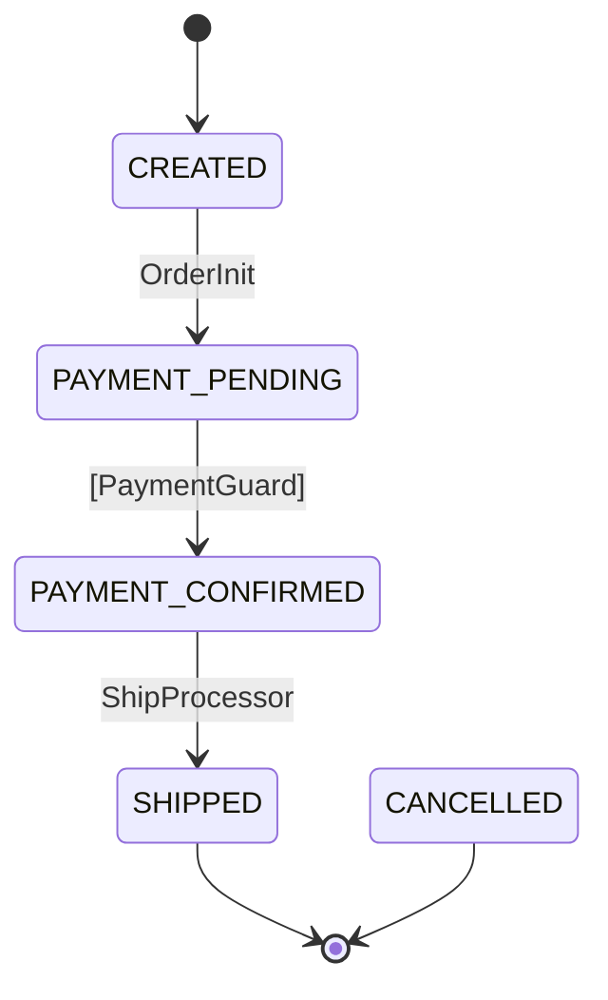
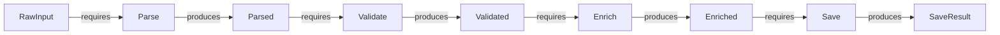

[English version](README.md)

# tramli

制約付きフローエンジン — **Java, TypeScript, Rust。**

**不正な遷移が構造的に存在できない**ステートマシン — コンパイラと [8項目検証](#8項目-build-検証) がビルド時に保証。

> **tramli** = tramline（路面電車の軌道）。コードはレールの上を走る — 敷かれた軌道以外には行けない。

**読む**: [なぜ tramli は効くのか — アテンション・バジェット](docs/why-tramli-works-attention-budget-ja.md) | [English](docs/why-tramli-works.md)

**実践例**: [OIDC 認証フロー（9 ステート、5 プロセッサ）](docs/example-oidc-auth-flow-ja.md) | [English](docs/example-oidc-auth-flow.md)

**クックブック**: [API クックブック — 全メソッドの使用例](docs/api-cookbook-ja.md) | [English](docs/api-cookbook.md)

---

## 目次

- [なぜ tramli が必要か](#なぜ-tramli-が必要か)
- [クイックスタート](#クイックスタート) — 状態定義、Processor、フロー、実行
- [コアコンセプト](#コアコンセプト) — 8つの構成要素
  - [FlowState](#flowstate) — システムが取りうる状態
  - [StateProcessor](#stateprocessor) — 1遷移分のビジネスロジック
  - [TransitionGuard](#transitionguard) — 外部イベントの検証（純粋関数）
  - [BranchProcessor](#branchprocessor) — 条件分岐
  - [FlowContext](#flowcontext) — 型安全なデータアキュムレータ
  - [FlowDefinition](#flowdefinition) — フロー全体の宣言的な地図
  - [FlowEngine](#flowengine) — ロジックゼロのオーケストレータ
  - [FlowStore](#flowstore) — 差し替え可能な永続化
- [3種類の遷移](#3種類の遷移) — Auto, External, Branch
- [Auto-Chain（自動連鎖）](#auto-chain自動連鎖) — 1リクエストで複数遷移が発火する仕組み
- [8項目 build() 検証](#8項目-build-検証) — `build()` が何をチェックするか
- [requires / produces 契約](#requires--produces-契約) — Processor 間のデータフロー
- [Mermaid 図の自動生成](#mermaid-図の自動生成) — コード = 図、常に最新
- [データフローグラフ](#データフローグラフ) — 自動データ依存分析
- [Pipeline](#pipeline) — build 時検証付き直列パイプライン
- [ロギング](#ロギング) — ゼロ依存プラガブルロガー
- [エラーハンドリング](#エラーハンドリング) — Guard 拒否、リトライ上限、例外型ルーティング
- [プラグインシステム](#プラグインシステム) — 6種のSPI、14プラグイン
- [なぜ LLM と相性が良いか](#なぜ-llm-と相性が良いか)
- [パフォーマンス](#パフォーマンス)
- [ユースケース](#ユースケース)
- [用語集](#用語集)

---

## なぜ tramli が必要か

```
1800行の手続き的ハンドラ → 「callback 処理はどこから始まる？」
  → 全部読む → コンテキスト窓が溢れる → ミスが起きる

tramli の FlowDefinition (50行) → 「これを読んで、対象の Processor を1個読む」
  → 合計100行で完了 → コンパイラが残りを守る
```

核心的な洞察: **「何を読まなくていいか」が「何を読むか」より重要。**

手続き的ハンドラでは、全ての行が暗黙のコンテキスト。400行目を変えると1200行目が壊れるかもしれない。全部読まないとわからない。

tramli では [StateProcessor](#stateprocessor) が閉じた単位。[requires()](#requires--produces-契約) が入力を宣言し、[produces()](#requires--produces-契約) が出力を宣言する。1つの Processor を変えても他には影響しない。

これは**人間**（限られたワーキングメモリ）にも **LLM**（限られたコンテキスト窓）にも等しく効く。

### なぜフラットな状態か？（DD-021）

tramli は状態に flat enum を使う——階層状態も直交領域もない。これは**制限ではなく、データフロー検証のための正しい設計**。

[DGE セッション](dge/sessions/dge-session-harel-carta.md)（AI が David Harel（Statecharts の発明者）や Pat Helland（分散システムの先駆者）の役を演じる架空の設計対話）で、両ペルソナが独立に同じ結論に到達:

- **階層状態**はデータフロー検証を劣化させる（super-state を通る暗黙のパス）
- **直交領域**はデータフロー検証を破壊する（指数的なパス組み合わせ）
- **flat enum** は完全な検証を可能にする（全パス列挙可能）

階層が必要なら [SubFlow](docs/example-oidc-auth-flow-ja.md)（ネストではなく合成）を使う。並行する関心事は[別フロー](docs/patterns/long-lived-flows-ja.md)にして `crossFlowMap()` でリンク。

---

## クイックスタート

### 1. [状態](#flowstate)を定義する

<details open><summary><b>Java</b></summary>

```java
enum OrderState implements FlowState {
    CREATED(false, true),           // 初期状態
    PAYMENT_PENDING(false),
    PAYMENT_CONFIRMED(false),
    SHIPPED(true),                  // 終端 — フローはここで終わる
    CANCELLED(true);                // 終端 — エラー終了

    private final boolean terminal, initial;
    OrderState(boolean t) { this(t, false); }
    OrderState(boolean t, boolean i) { terminal = t; initial = i; }
    @Override public boolean isTerminal() { return terminal; }
    @Override public boolean isInitial() { return initial; }
}
```

</details>
<details><summary><b>TypeScript</b></summary>

```typescript
type OrderState = 'CREATED' | 'PAYMENT_PENDING' | 'PAYMENT_CONFIRMED' | 'SHIPPED' | 'CANCELLED';

const stateConfig: Record<OrderState, StateConfig> = {
    CREATED:           { terminal: false, initial: true },
    PAYMENT_PENDING:   { terminal: false },
    PAYMENT_CONFIRMED: { terminal: false },
    SHIPPED:           { terminal: true },                   // 終端 — フローはここで終わる
    CANCELLED:         { terminal: true },                   // 終端 — エラー終了
};
```

</details>
<details><summary><b>Rust</b></summary>

```rust
#[derive(Clone, Copy, Debug, PartialEq, Eq, Hash)]
enum OrderState {
    Created,
    PaymentPending,
    PaymentConfirmed,
    Shipped,    // 終端 — フローはここで終わる
    Cancelled,  // 終端 — エラー終了
}

impl FlowState for OrderState {
    fn is_terminal(&self) -> bool {
        matches!(self, Self::Shipped | Self::Cancelled)
    }
    fn is_initial(&self) -> bool {
        matches!(self, Self::Created)
    }
}
```

</details>

なぜ `enum` か？ コンパイラが網羅性を保証するから。`"COMLETE"` のようなタイポはあり得ない — コンパイルエラーになる。

### 2. [Processor](#stateprocessor) を書く（1遷移 = 1 Processor）

<details open><summary><b>Java</b></summary>

```java
StateProcessor orderInit = new StateProcessor() {
    @Override public String name() { return "OrderInit"; }
    @Override public Set<Class<?>> requires() { return Set.of(OrderRequest.class); }
    @Override public Set<Class<?>> produces() { return Set.of(PaymentIntent.class); }
    @Override public void process(FlowContext ctx) {
        OrderRequest req = ctx.get(OrderRequest.class);  // 型安全、キャスト不要
        ctx.put(PaymentIntent.class, new PaymentIntent("txn-" + req.itemId()));
    }
};
```

</details>
<details><summary><b>TypeScript</b></summary>

```typescript
const OrderRequest = flowKey<OrderRequest>('OrderRequest');
const PaymentIntent = flowKey<PaymentIntent>('PaymentIntent');

const orderInit: StateProcessor<OrderState> = {
    name: 'OrderInit',
    requires: [OrderRequest],
    produces: [PaymentIntent],
    process(ctx) {
        const req = ctx.get(OrderRequest);  // 型安全、キャスト不要
        ctx.put(PaymentIntent, { txnId: 'txn-' + req.itemId });
    },
};
```

</details>
<details><summary><b>Rust</b></summary>

```rust
struct OrderInit;

impl StateProcessor<OrderState> for OrderInit {
    fn name(&self) -> &str { "OrderInit" }
    fn requires(&self) -> Vec<TypeId> { requires![OrderRequest] }
    fn produces(&self) -> Vec<TypeId> { produces![PaymentIntent] }
    fn process(&self, ctx: &mut FlowContext) -> Result<(), FlowError> {
        let req = ctx.get::<OrderRequest>()?;  // 型安全、キャスト不要
        ctx.put(PaymentIntent { txn_id: format!("txn-{}", req.item_id) });
        Ok(())
    }
}
```

</details>

`requires()` と `produces()` は単なるドキュメントではない — フロー内の全パスに対して **[build() 時に検証](#8項目-build-検証)** される。

### 3. [フロー](#flowdefinition)を定義する

<details open><summary><b>Java</b></summary>

```java
var orderFlow = Tramli.define("order", OrderState.class)
    .ttl(Duration.ofHours(24))
    .initiallyAvailable(OrderRequest.class)      // startFlow() で提供
    .from(CREATED).auto(PAYMENT_PENDING, orderInit)
    .from(PAYMENT_PENDING).external(CONFIRMED, paymentGuard)
    .from(CONFIRMED).auto(SHIPPED, shipProcessor)
    .onAnyError(CANCELLED)
    .build();  // ← ここで8項目検証
```

</details>
<details><summary><b>TypeScript</b></summary>

```typescript
const orderFlow = Tramli.define<OrderState>('order', stateConfig)
    .setTtl(24 * 60 * 60 * 1000)
    .initiallyAvailable(OrderRequest)            // startFlow() で提供
    .from('CREATED').auto('PAYMENT_PENDING', orderInit)
    .from('PAYMENT_PENDING').external('PAYMENT_CONFIRMED', paymentGuard)
    .from('PAYMENT_CONFIRMED').auto('SHIPPED', shipProcessor)
    .onAnyError('CANCELLED')
    .build();  // ← ここで8項目検証
```

</details>
<details><summary><b>Rust</b></summary>

```rust
let order_flow = Builder::new("order")
    .ttl(Duration::from_secs(86400))
    .initially_available::<OrderRequest>()       // start_flow() で提供
    .from(OrderState::Created).auto(OrderState::PaymentPending, OrderInit)
    .from(OrderState::PaymentPending).external(OrderState::PaymentConfirmed, PaymentGuard)
    .from(OrderState::PaymentConfirmed).auto(OrderState::Shipped, ShipProcessor)
    .on_any_error(OrderState::Cancelled)
    .build()
    .unwrap();  // ← ここで8項目検証
```

</details>

上から下に読めば — これ**がフロー**。構造を理解するのに他のファイルは不要。

### 4. 実行する

<details open><summary><b>Java</b></summary>

```java
var engine = Tramli.engine(new InMemoryFlowStore());

// 開始: CREATED → 自動連鎖 → PAYMENT_PENDING（停止、外部イベント待ち）
var flow = engine.startFlow(orderFlow, null,
    Map.of(OrderRequest.class, new OrderRequest("item-1", 3)));

// 外部イベント到着（例: 決済 Webhook）
flow = engine.resumeAndExecute(flow.id(), orderFlow);
// → Guard 検証 → CONFIRMED → 自動連鎖 → SHIPPED（終端、完了）
```

</details>
<details><summary><b>TypeScript</b></summary>

```typescript
const engine = Tramli.engine(new InMemoryFlowStore());

// 開始: CREATED → 自動連鎖 → PAYMENT_PENDING（停止、外部イベント待ち）
const flow = await engine.startFlow(orderFlow, undefined,
    new Map([[OrderRequest, { itemId: 'item-1', quantity: 3 }]]));

// 外部イベント到着（例: 決済 Webhook）
const updated = await engine.resumeAndExecute(flow.id, orderFlow);
// → Guard 検証 → CONFIRMED → 自動連鎖 → SHIPPED（終端、完了）
```

</details>
<details><summary><b>Rust</b></summary>

```rust
let engine = FlowEngine::new(InMemoryFlowStore::new());

// 開始: Created → 自動連鎖 → PaymentPending（停止、外部イベント待ち）
let flow = engine.start_flow(
    Arc::new(order_flow), "s1",
    vec![Box::new(OrderRequest { item_id: "item-1".into(), quantity: 3 })],
)?;

// 外部イベント到着（例: 決済 Webhook）
let flow = engine.resume_and_execute(&flow.id, Arc::new(order_flow))?;
// → Guard 検証 → PaymentConfirmed → 自動連鎖 → Shipped（終端、完了）
```

</details>

### 5. [Mermaid 図](#mermaid-図の自動生成)を生成する

<details open><summary><b>Java</b></summary>

```java
String mermaid = MermaidGenerator.generate(orderFlow);
```

</details>
<details><summary><b>TypeScript</b></summary>

```typescript
const mermaid = MermaidGenerator.generate(orderFlow);
```

</details>
<details><summary><b>Rust</b></summary>

```rust
let mermaid = MermaidGenerator::generate(&order_flow);
```

</details>



この図は**コードから生成される** — 古くなることがない。

---

## コアコンセプト

tramli には8つの構成要素がある。それぞれ小さく、焦点が絞られ、単独でテスト可能。

> **初心者向けのたとえ:** ボードゲームで考えてみよう。**FlowState** はボード上のマス目。**StateProcessor** は「そのマスに止まったら何が起きるか」。**TransitionGuard** は「通行証を持っていないと通れない門番」。**FlowContext** はリュックサック — 集めたアイテムが全部入っている。**FlowDefinition** はゲームボードそのもの。**FlowEngine** は審判。**FlowStore** はセーブデータ。

### FlowState

全ての取りうる状態を定義する `enum`。各状態は自分が[終端](#終端状態)（フローがここで終わる）か[初期](#初期状態)（フローがここから始まる）かを知っている。

> ボードゲームの「マス目の一覧」だと思えばいい。`CREATED` がスタートのマス、`SHIPPED` がゴール。

<details open><summary><b>Java</b></summary>

```java
public interface FlowState {
    String name();
    boolean isTerminal();
    boolean isInitial();
}
```

</details>
<details><summary><b>TypeScript</b></summary>

```typescript
interface StateConfig {
    terminal: boolean;
    initial: boolean;
}
// 状態は文字列リテラル union + StateConfig レコードで表現
type OrderState = 'CREATED' | 'SHIPPED' | ...;
const stateConfig: Record<OrderState, StateConfig> = { ... };
```

</details>
<details><summary><b>Rust</b></summary>

```rust
pub trait FlowState: Clone + Copy + Eq + Hash {
    fn is_terminal(&self) -> bool;
    fn is_initial(&self) -> bool;
}
```

</details>

**なぜ enum か？** コンパイラが網羅性を保証する。状態に対する `switch` → コンパイラが欠落ケースを警告する。LLM は存在しない状態を hallucinate できない。

### StateProcessor

1つの遷移の**ビジネスロジック**。最も重要な原則: **1遷移 = 1 Processor。**

> 「CREATED」のマスに止まったら、Processor が動く: 「注文リクエストを受け取って、支払い意思を作って、リュックに入れる」。それだけ — 1ステップ、1仕事。

<details open><summary><b>Java</b></summary>

```java
public interface StateProcessor {
    String name();
    Set<Class<?>> requires();   // FlowContext から必要なもの
    Set<Class<?>> produces();   // FlowContext に追加するもの
    void process(FlowContext ctx) throws FlowException;
}
```

</details>
<details><summary><b>TypeScript</b></summary>

```typescript
interface StateProcessor<S> {
    name: string;
    requires: FlowKey<any>[];    // FlowContext から必要なもの
    produces: FlowKey<any>[];    // FlowContext に追加するもの
    process(ctx: FlowContext): void | Promise<void>;
}
```

</details>
<details><summary><b>Rust</b></summary>

```rust
pub trait StateProcessor<S: FlowState> {
    fn name(&self) -> &str;
    fn requires(&self) -> Vec<TypeId>;   // FlowContext から必要なもの
    fn produces(&self) -> Vec<TypeId>;   // FlowContext に追加するもの
    fn process(&self, ctx: &mut FlowContext) -> Result<(), FlowError>;
}
```

</details>

これが意味すること:
- Processor A を変えても Processor B は壊れない
- テストは簡単: [FlowContext](#flowcontext) をモック、`process()` を呼ぶ、出力を確認
- LLM はこのステップを修正するのに**このファイル1個だけ**読めばいい

### TransitionGuard

[External 遷移](#external-遷移)を検証する。**純粋関数** — [FlowContext](#flowcontext) を変更してはいけない。

> Guard は**門番**。コマは「PAYMENT_PENDING」で待っている。外の世界（決済サービス）から誰かがドアをノックする。門番が確認する: 「支払いは正しいか？」OK なら → 門が開いて前に進める。NG なら → 「拒否、もう一度」。何度も失敗すると → エラーのマスに飛ばされる。

<details open><summary><b>Java</b></summary>

```java
public interface TransitionGuard {
    String name();
    Set<Class<?>> requires();
    Set<Class<?>> produces();
    int maxRetries();
    GuardOutput validate(FlowContext ctx);

    sealed interface GuardOutput {
        record Accepted(Map<Class<?>, Object> data) implements GuardOutput {}
        record Rejected(String reason) implements GuardOutput {}
        record Expired() implements GuardOutput {}
    }
}
```

</details>
<details><summary><b>TypeScript</b></summary>

```typescript
interface TransitionGuard<S> {
    name: string;
    requires: FlowKey<any>[];
    produces: FlowKey<any>[];
    maxRetries: number;
    validate(ctx: FlowContext): GuardOutput;
}

type GuardOutput =
    | { type: 'accepted'; data: Map<FlowKey<any>, any> }
    | { type: 'rejected'; reason: string }
    | { type: 'expired' };
```

</details>
<details><summary><b>Rust</b></summary>

```rust
pub trait TransitionGuard<S: FlowState> {
    fn name(&self) -> &str;
    fn requires(&self) -> Vec<TypeId>;
    fn produces(&self) -> Vec<TypeId>;
    fn max_retries(&self) -> usize;
    fn validate(&self, ctx: &FlowContext) -> GuardOutput;
}

pub enum GuardOutput {
    Accepted(HashMap<TypeId, Box<dyn Any>>),
    Rejected(String),
    Expired,
}
```

</details>

`sealed interface` は [FlowEngine](#flowengine) が正確に3ケースを処理することを意味する — コンパイラが `switch` でこれを強制する。忘れられたエッジケースはない。

**Accepted** → データが context にマージされ、遷移が進む。
**Rejected** → 失敗カウンタが増加。[maxRetries](#エラーハンドリング) 後 → [エラー遷移](#エラーハンドリング)。
**Expired** → フローが `EXPIRED` 終了状態で完了。

### BranchProcessor

分岐点でどのパスを取るか選択する。[FlowDefinition](#flowdefinition) 内のターゲット状態にマッピングされる**ラベル**（文字列）を返す。

> 道の分岐点。「MFA が必要なら左へ、不要なら右へ。」Branch Processor がリュックの中身を見て判断し、審判にどちらの道か伝える。

<details open><summary><b>Java</b></summary>

```java
public interface BranchProcessor {
    String name();
    Set<Class<?>> requires();
    String decide(FlowContext ctx);  // 分岐ラベルを返す
}
```

</details>
<details><summary><b>TypeScript</b></summary>

```typescript
interface BranchProcessor<S> {
    name: string;
    requires: FlowKey<any>[];
    decide(ctx: FlowContext): string;  // 分岐ラベルを返す
}
```

</details>
<details><summary><b>Rust</b></summary>

```rust
pub trait BranchProcessor<S: FlowState> {
    fn name(&self) -> &str;
    fn requires(&self) -> Vec<TypeId>;
    fn decide(&self, ctx: &FlowContext) -> String;  // 分岐ラベルを返す
}
```

</details>

例: ユーザー解決後に MFA が必要か判定する:

<details open><summary><b>Java</b></summary>

```java
// FlowDefinition:
.from(USER_RESOLVED).branch(mfaCheck)
    .to(COMPLETE, "no_mfa", sessionProcessor)
    .to(MFA_PENDING, "mfa_required", sessionProcessor)
    .endBranch()

// BranchProcessor:
@Override public String decide(FlowContext ctx) {
    return ctx.get(ResolvedUser.class).mfaRequired() ? "mfa_required" : "no_mfa";
}
```

</details>
<details><summary><b>TypeScript</b></summary>

```typescript
// FlowDefinition:
.from('USER_RESOLVED').branch(mfaCheck)
    .to('COMPLETE', 'no_mfa', sessionProcessor)
    .to('MFA_PENDING', 'mfa_required', sessionProcessor)
    .endBranch()

// BranchProcessor:
const mfaCheck: BranchProcessor<AuthState> = {
    name: 'MfaCheck',
    requires: [ResolvedUser],
    decide(ctx) {
        return ctx.get(ResolvedUser).mfaRequired ? 'mfa_required' : 'no_mfa';
    },
};
```

</details>
<details><summary><b>Rust</b></summary>

```rust
// FlowDefinition:
.from(AuthState::UserResolved).branch(MfaCheck)
    .to(AuthState::Complete, "no_mfa", SessionProcessor)
    .to(AuthState::MfaPending, "mfa_required", SessionProcessor)
    .end_branch()

// BranchProcessor:
impl BranchProcessor<AuthState> for MfaCheck {
    fn name(&self) -> &str { "MfaCheck" }
    fn requires(&self) -> Vec<TypeId> { requires![ResolvedUser] }
    fn decide(&self, ctx: &FlowContext) -> String {
        if ctx.get::<ResolvedUser>().unwrap().mfa_required {
            "mfa_required".into()
        } else {
            "no_mfa".into()
        }
    }
}
```

</details>

### FlowContext

型安全なデータバケツ。`Class<?>` をキーにする — 各型は最大1回だけ出現する。

> **リュックサック**。Processor が動くたびに、中から何かを取り出し (requires)、新しいものを入れる (produces)。リュックはゲームの最初から最後まで持ち歩く。どの Processor もリュックに手を突っ込んで必要なものを取れる — バケツリレー不要。

<details open><summary><b>Java</b></summary>

```java
ctx.put(PaymentResult.class, new PaymentResult("OK"));  // 書き込み
PaymentResult r = ctx.get(PaymentResult.class);          // 読み取り（型安全）
Optional<PaymentResult> o = ctx.find(PaymentResult.class); // 任意の読み取り
```

</details>
<details><summary><b>TypeScript</b></summary>

```typescript
const PaymentResult = flowKey<PaymentResult>('PaymentResult');

ctx.put(PaymentResult, { status: 'OK' });           // 書き込み
const r = ctx.get(PaymentResult);                    // 読み取り（型安全）
const o = ctx.find(PaymentResult);                   // 任意の読み取り（undefined 可）
```

</details>
<details><summary><b>Rust</b></summary>

```rust
ctx.put(PaymentResult { status: "OK".into() });           // 書き込み
let r = ctx.get::<PaymentResult>()?;                      // 読み取り（型安全）
let o: Option<&PaymentResult> = ctx.find::<PaymentResult>(); // 任意の読み取り
```

</details>

**なぜ Class キーか？** 3つの理由:
1. **タイポ不可能** — `ctx.get(PaymentResult.class)` はスペルミスできない（`map.get("payment_result")` とは違う）
2. **キャスト不要** — 戻り値型が推論される
3. **検証可能** — [requires/produces](#requires--produces-契約) 宣言が同じクラスを使うので [ビルド時検証](#8項目-build-検証) が可能

**パススルー問題なし:** 全 Processor の出力が context に蓄積される。Processor C は B を経由せずに A が生成したデータを読める。

### FlowDefinition

フロー構造の**唯一の情報源**。DSL で構築され `build()` で検証される宣言的な[遷移テーブル](#遷移テーブル)。

> **ゲームボード**そのもの。上から下に読めばゲームの全体像がわかる: 「CREATED からスタート、自動で PAYMENT_PENDING に移動、支払いを待って、発送。」 `build()` を呼ぶと、tramli がボードのミスを全部チェックしてくれる — 行き止まりのマス、足りないアイテム、無限ループ — 誰もプレイを始める前に。

<details open><summary><b>Java</b></summary>

```java
var flow = Tramli.define("order", OrderState.class)
    .ttl(Duration.ofHours(24))
    .maxGuardRetries(3)
    .initiallyAvailable(OrderRequest.class)
    .from(CREATED).auto(PAYMENT_PENDING, orderInit)
    .from(PAYMENT_PENDING).external(CONFIRMED, paymentGuard)
    .from(CONFIRMED).branch(stockCheck)
        .to(SHIPPED, "in_stock", shipProcessor)
        .to(CANCELLED, "out_of_stock", cancelProcessor)
        .endBranch()
    .onAnyError(CANCELLED)
    .build();
```

</details>
<details><summary><b>TypeScript</b></summary>

```typescript
const flow = Tramli.define<OrderState>('order', stateConfig)
    .setTtl(24 * 60 * 60 * 1000)
    .maxGuardRetries(3)
    .initiallyAvailable(OrderRequest)
    .from('CREATED').auto('PAYMENT_PENDING', orderInit)
    .from('PAYMENT_PENDING').external('PAYMENT_CONFIRMED', paymentGuard)
    .from('PAYMENT_CONFIRMED').branch(stockCheck)
        .to('SHIPPED', 'in_stock', shipProcessor)
        .to('CANCELLED', 'out_of_stock', cancelProcessor)
        .endBranch()
    .onAnyError('CANCELLED')
    .build();
```

</details>
<details><summary><b>Rust</b></summary>

```rust
let flow = Builder::new("order")
    .ttl(Duration::from_secs(86400))
    .max_guard_retries(3)
    .initially_available::<OrderRequest>()
    .from(OrderState::Created).auto(OrderState::PaymentPending, OrderInit)
    .from(OrderState::PaymentPending).external(OrderState::PaymentConfirmed, PaymentGuard)
    .from(OrderState::PaymentConfirmed).branch(StockCheck)
        .to(OrderState::Shipped, "in_stock", ShipProcessor)
        .to(OrderState::Cancelled, "out_of_stock", CancelProcessor)
        .end_branch()
    .on_any_error(OrderState::Cancelled)
    .build()
    .unwrap();
```

</details>

これを読むのは地図を読むようなもの — 15行で旅の全体が見える。LLM と人間が tramli で効率的に作業できる理由: **地図がコードそのもの。**

### FlowEngine

約120行。**ビジネスロジックゼロ。** やることは正確に3つ:

> **審判**。自分ではゲームをプレイしない — ボードのルール通りにコマを動かして、各マスで正しい Processor を呼ぶだけ。

1. `startFlow()` — context を初期化、[自動連鎖](#auto-chain自動連鎖)を実行
2. `resumeAndExecute()` — 外部データをマージ、[Guard](#transitionguard) を検証、[自動連鎖](#auto-chain自動連鎖)を実行
3. `executeAutoChain()` — [Auto](#auto-遷移)/[Branch](#branch-遷移) 遷移を [External](#external-遷移) か[終端](#終端状態)まで発火

フローを追加してもエンジンは変わらない。エンジンはレール — [Processor](#stateprocessor) が貨物。

### FlowStore

差し替え可能な永続化インターフェース。実装するのは4メソッド:

> **セーブデータ**。ゲームが一時停止したとき（外部入力を待っている間）、FlowStore が今いる場所を保存する。戻ってきたら、位置をロードする。

<details open><summary><b>Java</b></summary>

```java
public interface FlowStore {
    void create(FlowInstance<?> flow);
    <S extends Enum<S> & FlowState> Optional<FlowInstance<S>> loadForUpdate(String flowId, FlowDefinition<S> def);
    void save(FlowInstance<?> flow);
    void recordTransition(String flowId, FlowState from, FlowState to, String trigger, FlowContext ctx);
}
```

</details>
<details><summary><b>TypeScript</b></summary>

```typescript
interface FlowStore {
    create(flow: FlowInstance<any>): void;
    loadForUpdate<S>(flowId: string, def: FlowDefinition<S>): FlowInstance<S> | undefined;
    save(flow: FlowInstance<any>): void;
    recordTransition(flowId: string, from: string, to: string, trigger: string, ctx: FlowContext): void;
}
```

</details>
<details><summary><b>Rust</b></summary>

```rust
pub trait FlowStore<S: FlowState> {
    fn create(&mut self, flow: &FlowInstance<S>);
    fn load_for_update(&self, flow_id: &str, def: &FlowDefinition<S>) -> Option<FlowInstance<S>>;
    fn save(&mut self, flow: &FlowInstance<S>);
    fn record_transition(&mut self, flow_id: &str, from: S, to: S, trigger: &str, ctx: &FlowContext);
}
```

</details>

| 実装 | 用途 |
|------|------|
| `InMemoryFlowStore` | テスト、シングルプロセスアプリ。tramli に同梱。 |
| JDBC（自前実装） | PostgreSQL/MySQL の JSONB context、`SELECT FOR UPDATE` ロッキング |
| Redis（自前実装） | TTL ベースの有効期限付き分散フロー |

---

## 3種類の遷移

[フロー図](#mermaid-図の自動生成)の全ての矢印は3種類のいずれか:

> **Auto** = 審判がコマを自動で動かす。**External** = ゲームが一時停止して、外の誰かが何かするのを待つ（決済 webhook など）。**Branch** = 分かれ道で審判が条件を確認してパスを選ぶ。

| 種類 | トリガー | エンジンが発火するタイミング | 例 |
|------|---------|--------------------------|-----|
| [**Auto**](#auto-遷移) | 前の遷移が完了 | 即座、待機なし | `CONFIRMED → SHIPPED` |
| [**External**](#external-遷移) | 外部イベント（HTTP, メッセージ） | `resumeAndExecute()` 時のみ | `PENDING → CONFIRMED` |
| [**Branch**](#branch-遷移) | [BranchProcessor](#branchprocessor) がラベルを返す | 即座、Auto と同様 | `RESOLVED → COMPLETE or MFA_PENDING` |

---

## Auto-Chain（自動連鎖）

[External](#external-遷移) 遷移の [Guard](#transitionguard) が通過すると、エンジンは止まらない — 別の External か[終端状態](#終端状態)にぶつかるまで [Auto](#auto-遷移) と [Branch](#branch-遷移) 遷移を発火し続ける。

> ドミノ倒しをイメージしよう。最初の1枚を押す (External)、残りは自動で倒れる (Auto, Auto, Branch...) 隙間があるか (次の External)、最後の1枚が倒れるまで (終端状態)。

```
HTTPリクエスト到着（callback）
  → External: REDIRECTED → CALLBACK_RECEIVED     ← Guard 検証
  → Auto:     CALLBACK_RECEIVED → TOKEN_EXCHANGED ← Processor 実行
  → Auto:     TOKEN_EXCHANGED → USER_RESOLVED     ← Processor 実行
  → Branch:   USER_RESOLVED → COMPLETE            ← Branch 判定
  （終端 — フロー完了）
```

**1つの HTTP リクエストで4つの遷移。** エンジンが連鎖を処理する — 各 [Processor](#stateprocessor) は自分のステップだけを知っている。

安全装置: 自動連鎖の最大深度は10。[build() 時の DAG 検証](#8項目-build-検証)により Auto/Branch 遷移がサイクルを形成しないことが保証される。

---

## 8項目 build() 検証

> **なぜこれが大事か — 実話:** ある開発者が決済フローに新しいステートを追加した。Processor を書いて、テストを書いて、本番にデプロイした。3日後、あるユーザーがそのステートに到達 — そしてフローがクラッシュした。Processor が `CustomerProfile` データを必要としていたが、前のどのステップもそれを作っていなかったから。エラーは本番で初めて出た。深夜2時、本物のお金が絡む状況で。
>
> tramli なら、こんなことは起きない。`build()` が**コードが実行される前に**キャッチしてくれる — IDE で、CI で、デプロイの前に。ステートマシンの「スペルチェッカー」だ。

`build()` は8つの構造チェックを実行する。いずれかが失敗すると明確なエラーメッセージが出る — **フローが実行される前に。**

| # | チェック | 何を防ぐか |
|---|---------|-----------|
| 1 | 全ての非終端状態が[初期](#初期状態)から[到達可能](#到達可能) | 決して入れない死に状態 |
| 2 | 初期から[終端](#終端状態)へのパスが存在 | 完了できないフロー |
| 3 | [Auto](#auto-遷移)/[Branch](#branch-遷移) 遷移が [DAG](#dag) を形成 | 無限自動連鎖ループ |
| 4 | 各状態に [External](#external-遷移) は最大1つ | 「どのイベントを待っているか」が曖昧 |
| 5 | 全ての [Branch](#branch-遷移) ターゲットが定義済み | `decide()` がターゲット状態のないラベルを返す |
| 6 | [requires/produces](#requires--produces-契約) チェーンの整合性 | 実行時の「データがない」エラー |
| 7 | [終端](#終端状態)状態からの遷移がない | 最終であるべき状態がそうなっていない |
| 8 | [初期状態](#初期状態)が存在 | 状態に initial マークを付け忘れ |

**LLM が tramli コードを安全に生成できる理由** — 生成した遷移が間違っていても `build()` が即座に拒否する。フィードバックループ: 生成 → コンパイル → build() → 修正。実行時サプライズなし。

---

## requires / produces 契約

全ての [StateProcessor](#stateprocessor) と [TransitionGuard](#transitionguard) は必要なデータと提供するデータを宣言する:

> **レシピ**だと思えばいい。各 Processor が「卵と小麦粉が必要 (requires)、ケーキを作ります (produces)」と宣言する。tramli はキッチンがオープンする前に全レシピをチェックする — バターが必要なのに誰もバターを買っていなければ、`build()` がすぐに教えてくれる。

<details open><summary><b>Java</b></summary>

```java
@Override public Set<Class<?>> requires() { return Set.of(OrderRequest.class); }
@Override public Set<Class<?>> produces() { return Set.of(PaymentIntent.class); }
```

</details>
<details><summary><b>TypeScript</b></summary>

```typescript
requires: [OrderRequest],
produces: [PaymentIntent],
```

</details>
<details><summary><b>Rust</b></summary>

```rust
fn requires(&self) -> Vec<TypeId> { requires![OrderRequest] }
fn produces(&self) -> Vec<TypeId> { produces![PaymentIntent] }
```

</details>

[build() 時](#8項目-build-検証)に、tramli はフロー内の全パスを走査して、各 Processor の `requires()` が前段の Processor の `produces()`（または [initiallyAvailable](#initially-available-初期データ) データ）で満たされることを検証する。

```
パス: CREATED → PAYMENT_PENDING → CONFIRMED → SHIPPED

CREATED での利用可能データ:    {OrderRequest}         ← initiallyAvailable
OrderInit 後:               {OrderRequest, PaymentIntent}  ← produces
Guard が PaymentIntent を要求: ✓ 利用可能
PaymentGuard 後:            {... + PaymentResult}
ShipProcessor が PaymentResult を要求: ✓ 利用可能
```

`CustomerProfile` を requires するが何も produces しない Processor を追加すると、`build()` が失敗する:

```
Flow 'order' has 1 validation error(s):
  - Processor 'ShipProcessor' at CONFIRMED → SHIPPED requires CustomerProfile
    but it may not be available
```

---

## Mermaid 図の自動生成

<details open><summary><b>Java</b></summary>

```java
String mermaid = MermaidGenerator.generate(definition);
MermaidGenerator.writeToFile(definition, Path.of("docs/diagrams"));
```

</details>
<details><summary><b>TypeScript</b></summary>

```typescript
const mermaid = MermaidGenerator.generate(definition);
MermaidGenerator.writeToFile(definition, 'docs/diagrams');
```

</details>
<details><summary><b>Rust</b></summary>

```rust
let mermaid = MermaidGenerator::generate(&definition);
MermaidGenerator::write_to_file(&definition, Path::new("docs/diagrams"));
```

</details>

図は **[FlowDefinition](#flowdefinition) から生成される** — [エンジン](#flowengine)が使うのと同じオブジェクト。古くなることがない。

CI 連携: 生成 → コミット済み `.mmd` ファイルと比較 → 差分があればテスト失敗。開発者にフロー変更時の図の更新を強制する。

---

## データフローグラフ

`build()` のたびに **DataFlowGraph** が自動構築される — requires/produces 宣言から導出された二部グラフ。`def.dataFlowGraph()` で取得。

### Dual View: 状態遷移 + データフロー

状態遷移図は**制御の流れ**（何が起きるか）、データフロー図は**データの流れ**（何が流れるか）を示す:

<details open><summary><b>Java</b></summary>

```java
// 状態遷移図（既存）
String states = MermaidGenerator.generate(orderFlow);

// データフロー図（新規）
String dataFlow = MermaidGenerator.generateDataFlow(orderFlow);
```

</details>
<details><summary><b>TypeScript</b></summary>

```typescript
// 状態遷移図（既存）
const states = MermaidGenerator.generate(orderFlow);

// データフロー図（新規）
const dataFlow = MermaidGenerator.generateDataFlow(orderFlow);
```

</details>
<details><summary><b>Rust</b></summary>

```rust
// 状態遷移図（既存）
let states = MermaidGenerator::generate(&order_flow);

// データフロー図（新規）
let data_flow = MermaidGenerator::generate_data_flow(&order_flow);
```

</details>

### クエリ API

<details open><summary><b>Java</b></summary>

```java
DataFlowGraph<OrderState> graph = orderFlow.dataFlowGraph();

// PAYMENT_PENDING に到達したとき、どのデータが利用可能？
Set<Class<?>> available = graph.availableAt(PAYMENT_PENDING);

// PaymentIntent を produces するのは誰？
List<NodeInfo> producers = graph.producersOf(PaymentIntent.class);

// OrderRequest を requires するのは誰？
List<NodeInfo> consumers = graph.consumersOf(OrderRequest.class);

// Dead data: produces されたが下流で requires されない型
Set<Class<?>> dead = graph.deadData();
```

</details>
<details><summary><b>TypeScript</b></summary>

```typescript
const graph = orderFlow.dataFlowGraph();

// PAYMENT_PENDING に到達したとき、どのデータが利用可能？
const available = graph.availableAt('PAYMENT_PENDING');

// PaymentIntent を produces するのは誰？
const producers = graph.producersOf(PaymentIntent);

// OrderRequest を requires するのは誰？
const consumers = graph.consumersOf(OrderRequest);

// Dead data: produces されたが下流で requires されない型
const dead = graph.deadData();
```

</details>
<details><summary><b>Rust</b></summary>

```rust
let graph = order_flow.data_flow_graph();

// PaymentPending に到達したとき、どのデータが利用可能？
let available = graph.available_at(OrderState::PaymentPending);

// PaymentIntent を produces するのは誰？
let producers = graph.producers_of::<PaymentIntent>();

// OrderRequest を requires するのは誰？
let consumers = graph.consumers_of::<OrderRequest>();

// Dead data: produces されたが下流で requires されない型
let dead = graph.dead_data();
```

</details>

### 分析 API

<details open><summary><b>Java</b></summary>

```java
// データのライフサイクル
var lt = graph.lifetime(PaymentIntent.class);

// Context 枝刈りヒント
Map<OrderState, Set<Class<?>>> hints = graph.pruningHints();

// 型変更の影響分析
var impact = graph.impactOf(PaymentIntent.class);

// テストに必要な最小データ
Map<String, List<String>> scaffold = graph.testScaffold();

// カスタムレンダリング（Graphviz, PlantUML 等）
graph.renderDataFlow(myDotRenderer);
```

</details>
<details><summary><b>TypeScript</b></summary>

```typescript
// データのライフサイクル
const lt = graph.lifetime(PaymentIntent);

// Context 枝刈りヒント
const hints = graph.pruningHints();

// 型変更の影響分析
const impact = graph.impactOf(PaymentIntent);

// テストに必要な最小データ
const scaffold = graph.testScaffold();

// カスタムレンダリング（Graphviz, PlantUML 等）
graph.renderDataFlow(myDotRenderer);
```

</details>
<details><summary><b>Rust</b></summary>

```rust
// データのライフサイクル
let lt = graph.lifetime::<PaymentIntent>();

// Context 枝刈りヒント
let hints = graph.pruning_hints();

// 型変更の影響分析
let impact = graph.impact_of::<PaymentIntent>();

// テストに必要な最小データ
let scaffold = graph.test_scaffold();

// カスタムレンダリング（Graphviz, PlantUML 等）
graph.render_data_flow(my_dot_renderer);
```

</details>

### なぜ重要か

| DataFlowGraph なし | DataFlowGraph あり |
|-------------------|-------------------|
| 「状態 X でどのデータが使える？」→ 全 processor コードを読む | `graph.availableAt(X)` |
| 「PaymentIntent を変えたら何が壊れる？」→ grep | `graph.consumersOf(PaymentIntent.class)` |
| 「未使用データが溜まってない？」→ 手動レビュー | `graph.deadData()` |
| 「新メンバーにデータパイプラインを説明」→ 会議 | Mermaid 図を見せる |

Airflow/Temporal ユーザーが欲しがる機能: **ビルド時の静的データフロー解析**。あちらは動的 XCom/payload で静的保証がない。tramli の `requires/produces` 宣言があるからこそ、実行前に検証できる。

### 全 API リファレンス

#### DataFlowGraph

| メソッド | 戻り値 | 説明 |
|---------|--------|------|
| `availableAt(state)` | `Set<Class<?>>` | 指定状態で context に利用可能な型 |
| `producersOf(type)` | `List<NodeInfo>` | この型を produces する processor/guard |
| `consumersOf(type)` | `List<NodeInfo>` | この型を requires する processor/guard |
| `deadData()` | `Set<Class<?>>` | produces されたが requires されない型 |
| `lifetime(type)` | `Lifetime(firstProduced, lastConsumed)` | データのライフサイクル |
| `pruningHints()` | `Map<S, Set<Class<?>>>` | 各状態で不要になった型 |
| `impactOf(type)` | `Impact(producers, consumers)` | 型変更の影響を受けるノード |
| `parallelismHints()` | `List<String[]>` | データ依存のない独立 processor ペア |
| `assertDataFlow(ctx, state)` | `List<Class<?>>` | 不変条件の欠落型（空 = OK） |
| `verifyProcessor(proc, ctx)` | `List<String>` | 実行時の requires/produces 違反 |
| `isCompatible(a, b)` | `boolean` | processor B が A を置換可能か |
| `migrationOrder()` | `List<String>` | 依存順ソートの移植推奨順序 |
| `testScaffold()` | `Map<String, List<String>>` | processor ごとのテスト用最小データ |
| `generateInvariantAssertions()` | `List<String>` | 各状態のデータフロー不変条件文字列 |
| `crossFlowMap(graphs...)` | `List<String>` | フロー間のデータ依存 |
| `diff(before, after)` | `DiffResult` | 2 つのグラフの差分 |
| `versionCompatibility(v1, v2)` | `List<String>` | 定義バージョン間の非互換 |
| `toMermaid()` | `String` | Mermaid flowchart LR 図 |
| `toJson()` | `String` | 構造化 JSON |
| `toMarkdown()` | `String` | 移植チェックリスト（Markdown） |
| `toRenderable()` | `RenderableGraph.DataFlow` | カスタムレンダラー用 read-only ビュー |
| `renderDataFlow(fn)` | `String` | カスタム関数でレンダリング（dot, PlantUML 等） |

#### FlowDefinition

| メソッド | 説明 |
|---------|------|
| `build()` | 検証 + 構築（8 項目 + データフロー検証） |
| `dataFlowGraph()` | 導出された DataFlowGraph を取得 |
| `warnings()` | 構造的警告（liveness リスク等） |
| `withPlugin(from, to, pluginFlow)` | 遷移の前にサブフローを挿入（新定義を返す） |

#### FlowInstance

| メソッド | 説明 |
|---------|------|
| `currentState()` | 現在の状態 |
| `isCompleted()` | terminal に到達したか |
| `exitState()` | terminal 状態名（active なら null） |
| `context()` | 全データが入った FlowContext |
| `lastError()` | 最後の processor 失敗のエラーメッセージ |
| `activeSubFlow()` | アクティブなサブフロー（なければ null） |
| `statePath()` | ルートからの状態パス: `["PAYMENT", "CONFIRM"]` |
| `statePathString()` | スラッシュ区切り: `"PAYMENT/CONFIRM"` |
| `waitingFor()` | 現在の External 遷移が必要とする型 |
| `availableData()` | 現在の状態で利用可能な型（DataFlowGraph より） |
| `missingFor()` | 次の遷移に不足している型 |
| `withVersion(n)` | バージョン更新コピー（FlowStore の楽観ロック用） |

#### FlowContext

| メソッド | 説明 |
|---------|------|
| `get(key)` | 型付き値取得（なければ例外） |
| `find(key)` | 型付き値取得（Optional / undefined） |
| `put(key, value)` | 型付き値を保存 |
| `has(key)` | キーの存在確認 |
| `registerAlias(type, alias)` | 言語横断シリアライズ用のエイリアス登録 |
| `toAliasMap()` | エイリアス → 値のマップにエクスポート |
| `fromAliasMap(map)` | エイリアスマップからインポート |

#### FlowEngine

| メソッド | 説明 |
|---------|------|
| `startFlow(def, session, data)` | 新しいフローインスタンスを開始 |
| `resumeAndExecute(flowId, def)` | External 遷移で再開。`flowNotFound` / `flowAlreadyCompleted` / `flowExpired` を投げる |
| `setTransitionLogger(fn)` | 遷移ごとのログ（entry に `flowName` 含む） |
| `setGuardLogger(fn)` | Guard の Accepted/Rejected/Expired をログ |
| `setStateLogger(fn)` | context.put() ごとのログ（オプト・イン） |
| `setErrorLogger(fn)` | エラー遷移のログ |
| `removeAllLoggers()` | 全ロガー解除 |

#### Builder DSL

| メソッド | 説明 |
|---------|------|
| `.from(state).auto(to, processor)` | Auto 遷移 |
| `.from(state).external(to, guard)` | External 遷移（イベント待ち） |
| `.from(state).branch(branch).to(s, label).endBranch()` | 条件分岐 |
| `.from(state).subFlow(def).onExit("X", s).endSubFlow()` | サブフロー埋め込み |
| `.onError(from, to)` | 状態ベースのエラー遷移 |
| `.onStepError(from, ExceptionClass, to)` | 例外型ベースのエラー遷移 |
| `.onAnyError(state)` | 全状態のエラーフォールバック |
| `.initiallyAvailable(types...)` | 初期データ型の宣言 |
| `.ttl(duration)` | フローの有効期限 |
| `.maxGuardRetries(n)` | Guard 拒否の上限回数 |

#### コード生成

| クラス | メソッド | 説明 |
|-------|---------|------|
| `MermaidGenerator` | `generate(def)` | 状態遷移図 |
| `MermaidGenerator` | `generateDataFlow(def)` | データフロー図 |
| `MermaidGenerator` | `generateExternalContract(def)` | External 遷移のデータ契約図 |
| `MermaidGenerator` | `dataFlow(renderable)` | RenderableGraph を Mermaid でレンダリング |
| `MermaidGenerator` | `stateDiagram(renderable)` | RenderableStateDiagram を Mermaid でレンダリング |
| `SkeletonGenerator` | `generate(def, language)` | Java/TS/Rust の Processor スケルトン生成 |

---

## Pipeline

すべてのワークフローにステートが必要なわけではない。外部イベントや分岐のない**直列処理チェーン**には、`Tramli.pipeline()` が同じ build 時データフロー検証をよりシンプルな API で提供する。ステートなし、エンジンなし、永続化なし——ステップとデータだけ。

### 1. データ型を定義

<details open><summary><b>Java</b></summary>

```java
record RawInput(String csv) {}
record Parsed(List<String[]> rows) {}
record Validated(List<String[]> rows, int errorCount) {}
record Enriched(List<Map<String, String>> records) {}
record SaveResult(int savedCount) {}
```

</details>
<details><summary><b>TypeScript</b></summary>

```typescript
const RawInput = flowKey<{ csv: string }>('RawInput');
const Parsed = flowKey<{ rows: string[][] }>('Parsed');
const Validated = flowKey<{ rows: string[][]; errorCount: number }>('Validated');
const Enriched = flowKey<{ records: Record<string, string>[] }>('Enriched');
const SaveResult = flowKey<{ savedCount: number }>('SaveResult');
```

</details>
<details><summary><b>Rust</b></summary>

```rust
struct RawInput { csv: String }
struct Parsed { rows: Vec<Vec<String>> }
struct Validated { rows: Vec<Vec<String>>, error_count: usize }
struct Enriched { records: Vec<HashMap<String, String>> }
struct SaveResult { saved_count: usize }
```

</details>

### 2. ステップを書く（1 ステップ = 1 [PipelineStep](#pipelinestep)）

<details open><summary><b>Java</b></summary>

```java
PipelineStep parse = new PipelineStep() {
    @Override public String name() { return "Parse"; }
    @Override public Set<Class<?>> requires() { return Set.of(RawInput.class); }
    @Override public Set<Class<?>> produces() { return Set.of(Parsed.class); }
    @Override public void process(FlowContext ctx) {
        RawInput raw = ctx.get(RawInput.class);
        List<String[]> rows = CsvParser.parse(raw.csv());
        ctx.put(Parsed.class, new Parsed(rows));
    }
};
// validate, enrich, save も同じパターン
```

</details>
<details><summary><b>TypeScript</b></summary>

```typescript
const parse: PipelineStep = {
    name: 'Parse',
    requires: [RawInput],
    produces: [Parsed],
    process(ctx) {
        const raw = ctx.get(RawInput);
        const rows = CsvParser.parse(raw.csv);
        ctx.put(Parsed, { rows });
    },
};
// validate, enrich, save も同じパターン
```

</details>
<details><summary><b>Rust</b></summary>

```rust
struct Parse;

impl PipelineStep for Parse {
    fn name(&self) -> &str { "Parse" }
    fn requires(&self) -> Vec<TypeId> { requires![RawInput] }
    fn produces(&self) -> Vec<TypeId> { produces![Parsed] }
    fn process(&self, ctx: &mut FlowContext) -> Result<(), FlowError> {
        let raw = ctx.get::<RawInput>()?;
        let rows = CsvParser::parse(&raw.csv);
        ctx.put(Parsed { rows });
        Ok(())
    }
}
// validate, enrich, save も同じパターン
```

</details>

各ステップが「何を必要とし何を提供するか」を宣言。**[StateProcessor](#stateprocessor) と同じ契約**だが、ステートのジェネリクスがない。

### 3. パイプラインを定義

<details open><summary><b>Java</b></summary>

```java
var pipeline = Tramli.pipeline("csv-import")
    .initiallyAvailable(RawInput.class)
    .step(parse)       // requires: RawInput,   produces: Parsed
    .step(validate)    // requires: Parsed,     produces: Validated
    .step(enrich)      // requires: Validated,  produces: Enriched
    .step(save)        // requires: Enriched,   produces: SaveResult
    .build();          // ← requires/produces チェーンを build 時に検証
```

</details>
<details><summary><b>TypeScript</b></summary>

```typescript
const pipeline = Tramli.pipeline('csv-import')
    .initiallyAvailable(RawInput)
    .step(parse)       // requires: RawInput,   produces: Parsed
    .step(validate)    // requires: Parsed,     produces: Validated
    .step(enrich)      // requires: Validated,  produces: Enriched
    .step(save)        // requires: Enriched,   produces: SaveResult
    .build();          // ← requires/produces チェーンを build 時に検証
```

</details>
<details><summary><b>Rust</b></summary>

```rust
let pipeline = PipelineBuilder::new("csv-import")
    .initially_available::<RawInput>()
    .step(Box::new(Parse))       // requires: RawInput,   produces: Parsed
    .step(Box::new(Validate))    // requires: Parsed,     produces: Validated
    .step(Box::new(Enrich))      // requires: Validated,  produces: Enriched
    .step(Box::new(Save))        // requires: Enriched,   produces: SaveResult
    .build()
    .unwrap();                   // ← requires/produces チェーンを build 時に検証
```

</details>

`enrich` が `Validated` を requires しているのに誰も produces していなければ、`build()` が失敗:

```
Pipeline 'csv-import' has 1 error(s):
  - Step 'Enrich' requires Validated but it may not be available
```

### 4. 実行

<details open><summary><b>Java</b></summary>

```java
FlowContext result = pipeline.execute(Map.of(RawInput.class, new RawInput(csvString)));
SaveResult saved = result.get(SaveResult.class);
System.out.println("Saved " + saved.savedCount() + " records");
```

</details>
<details><summary><b>TypeScript</b></summary>

```typescript
const result = pipeline.execute(new Map([[RawInput, { csv: csvString }]]));
const saved = result.get(SaveResult);
console.log(`Saved ${saved.savedCount} records`);
```

</details>
<details><summary><b>Rust</b></summary>

```rust
let result = pipeline.execute(vec![Box::new(RawInput { csv: csv_string })])?;
let saved = result.get::<SaveResult>()?;
println!("Saved {} records", saved.saved_count);
```

</details>

全ステップが順に実行。ステップが例外を投げると `PipelineException` で全体像が分かる:

<details open><summary><b>Java</b></summary>

```java
try {
    pipeline.execute(data);
} catch (PipelineException e) {
    e.completedSteps();  // ["Parse", "Validate"]     ← 成功
    e.failedStep();      // "Enrich"                   ← ここで失敗
    e.context();         // Parsed + Validated が入った FlowContext
    e.cause();           // 元の例外
}
```

</details>
<details><summary><b>TypeScript</b></summary>

```typescript
try {
    pipeline.execute(data);
} catch (e) {
    if (e instanceof PipelineException) {
        e.completedSteps;  // ['Parse', 'Validate']     ← 成功
        e.failedStep;      // 'Enrich'                   ← ここで失敗
        e.context;         // Parsed + Validated が入った FlowContext
        e.cause;           // 元の例外
    }
}
```

</details>
<details><summary><b>Rust</b></summary>

```rust
match pipeline.execute(data) {
    Ok(ctx) => { /* 成功 */ }
    Err(PipelineError { completed_steps, failed_step, context, cause }) => {
        // completed_steps: ["Parse", "Validate"]     ← 成功
        // failed_step:     "Enrich"                   ← ここで失敗
        // context:         Parsed + Validated が入った FlowContext
        // cause:           元のエラー
    }
}
```

</details>

### 5. 図を生成

<details open><summary><b>Java</b></summary>

```java
String mermaid = pipeline.dataFlow().toMermaid();
```

</details>
<details><summary><b>TypeScript</b></summary>

```typescript
const mermaid = pipeline.dataFlow().toMermaid();
```

</details>
<details><summary><b>Rust</b></summary>

```rust
let mermaid = pipeline.data_flow().to_mermaid();
```

</details>



### その他の機能

<details open><summary><b>Java</b></summary>

```java
// Dead data 検出
pipeline.dataFlow().deadData();  // produces されたが requires されない型

// パイプラインのネスト
PipelineStep sub = otherPipeline.asStep();

// strictMode: produces を実行時に検証
pipeline.setStrictMode(true);

// カスタムレンダリング（Graphviz, PlantUML 等）
pipeline.dataFlow().renderDataFlow(myDotRenderer);

// ログフック（FlowEngine と同じ）
pipeline.setTransitionLogger(entry -> log.info("{} → {}", entry.from(), entry.to()));
```

</details>
<details><summary><b>TypeScript</b></summary>

```typescript
// Dead data 検出
pipeline.dataFlow().deadData();  // produces されたが requires されない型

// パイプラインのネスト
const sub = otherPipeline.asStep();

// strictMode: produces を実行時に検証
pipeline.setStrictMode(true);

// カスタムレンダリング（Graphviz, PlantUML 等）
pipeline.dataFlow().renderDataFlow(myDotRenderer);

// ログフック（FlowEngine と同じ）
pipeline.setTransitionLogger(entry => console.log(`${entry.from} → ${entry.to}`));
```

</details>
<details><summary><b>Rust</b></summary>

```rust
// Dead data 検出
pipeline.data_flow().dead_data();  // produces されたが requires されない型

// パイプラインのネスト
let sub = other_pipeline.as_step();

// strictMode: produces を実行時に検証
pipeline.set_strict_mode(true);

// カスタムレンダリング（Graphviz, PlantUML 等）
pipeline.data_flow().render_data_flow(my_dot_renderer);

// ログフック（FlowEngine と同じ）
pipeline.set_transition_logger(|entry| println!("{} → {}", entry.from, entry.to));
```

</details>

### 使い分け

| シナリオ | ツール |
|---------|--------|
| 直列 2-4 ステップ、型 1 つずつ | 関数合成 / pipe |
| 直列 5+ ステップ、データ蓄積 | **`Tramli.pipeline()`** |
| 分岐 / 外部イベント / 永続化 | **`Tramli.define()`**（[FlowDefinition](#flowdefinition)） |
| 分散 / 長時間 / スケジュール | Airflow / Temporal |

Pipeline は tramli の**入口**。`pipeline()` で始めて、分岐や外部イベントが必要になったら `define()` にアップグレード。ステップのインターフェースは同じ——プロセッサを書き直す必要はない。

---

## エラーハンドリング

### Guard 拒否

[Guard](#transitionguard) が `Rejected` を返すと、[エンジン](#flowengine)は失敗カウンタを増加させる。`maxRetries` 回の拒否後、フローはエラー状態に遷移する:

<details open><summary><b>Java</b></summary>

```java
.maxGuardRetries(3)            // 定義レベルのデフォルト
.onAnyError(CANCELLED)         // 全非終端状態 → CANCELLED（エラー時）
.onError(CHECKOUT, RETRY)      // 特定状態の上書き
```

</details>
<details><summary><b>TypeScript</b></summary>

```typescript
.maxGuardRetries(3)                 // 定義レベルのデフォルト
.onAnyError('CANCELLED')            // 全非終端状態 → CANCELLED（エラー時）
.onError('CHECKOUT', 'RETRY')       // 特定状態の上書き
```

</details>
<details><summary><b>Rust</b></summary>

```rust
.max_guard_retries(3)                           // 定義レベルのデフォルト
.on_any_error(OrderState::Cancelled)            // 全非終端状態 → Cancelled（エラー時）
.on_error(OrderState::Checkout, OrderState::Retry)  // 特定状態の上書き
```

</details>

### エラー遷移

`onAnyError(S)` は全ての非[終端](#終端状態)状態をエラーターゲットにマッピングする。`onError(from, to)` で特定状態を上書き。エラーターゲットは[到達可能性チェック](#8項目-build-検証)に含まれる。

### 例外型ベースのエラールーティング

異なる例外を異なるエラー状態にルーティングできる。`onStepError` で細かく制御:

<details open><summary><b>Java</b></summary>

```java
.from(TOKEN_EXCHANGE).auto(USER_RESOLVED, tokenExchange)
.onStepError(TOKEN_EXCHANGE, HttpTimeoutException.class, RETRIABLE_ERROR)  // タイムアウト → リトライ
.onStepError(TOKEN_EXCHANGE, InvalidTokenException.class, TERMINAL_ERROR)  // 不正トークン → 致命的
.onAnyError(GENERAL_ERROR)  // マッチしなかった例外のフォールバック
```

</details>
<details><summary><b>TypeScript</b></summary>

```typescript
.from('TOKEN_EXCHANGE').auto('USER_RESOLVED', tokenExchange)
.onStepError('TOKEN_EXCHANGE', HttpTimeoutError, 'RETRIABLE_ERROR')  // タイムアウト → リトライ
.onStepError('TOKEN_EXCHANGE', InvalidTokenError, 'TERMINAL_ERROR')  // 不正トークン → 致命的
.onAnyError('GENERAL_ERROR')  // マッチしなかった例外のフォールバック
```

</details>
<details><summary><b>Rust</b></summary>

```rust
.from(AuthState::TokenExchange).auto(AuthState::UserResolved, TokenExchange)
.on_step_error::<HttpTimeoutError>(AuthState::TokenExchange, AuthState::RetriableError)  // タイムアウト → リトライ
.on_step_error::<InvalidTokenError>(AuthState::TokenExchange, AuthState::TerminalError)  // 不正トークン → 致命的
.on_any_error(AuthState::GeneralError)  // マッチしなかった例外のフォールバック
```

</details>

マッチング順:
1. `onStepError` — 最初にマッチした `instanceof` が勝つ
2. `onError` — 状態ベースのフォールバック
3. `onAnyError` — キャッチオール
4. マッチなし — `TERMINAL_ERROR` exit

I/O が多い processor で **400 エラー（クライアント起因）と 500 エラー（サーバー起因）で処理を分けたい** ときに有用。

### TTL 期限切れ

全フローに TTL がある（`.ttl()` で設定）。期限後に `resumeAndExecute()` が呼ばれると、フローは終了状態 `"EXPIRED"` で完了する。遷移は発火しない — フローは単に終わる。

---

## ロギング

tramli は**ロギング依存ゼロ**。ラムダ/コールバックで自分のロガーを差し込む:

<details open><summary><b>Java</b></summary>

```java
var engine = Tramli.engine(store);

// 遷移ログ — 全遷移で呼ばれる
engine.setTransitionLogger(entry ->
    log.info("{} → {} ({})", entry.from(), entry.to(), entry.trigger()));

// エラーログ — エラー遷移で呼ばれる
engine.setErrorLogger(entry ->
    log.error("error at {}: {}", entry.from(), entry.cause().getMessage()));

// 状態ログ（オプト・イン）— context.put() ごとに呼ばれる。デバッグ用
engine.setStateLogger(entry ->
    log.debug("put {} = {} (type: {})", entry.typeName(), entry.value(), entry.type()));

// 全ロガー解除
engine.removeAllLoggers();
```

</details>
<details><summary><b>TypeScript</b></summary>

```typescript
const engine = Tramli.engine(store);

// 遷移ログ — 全遷移で呼ばれる
engine.setTransitionLogger(entry =>
    console.log(`${entry.from} → ${entry.to} (${entry.trigger})`));

// エラーログ — エラー遷移で呼ばれる
engine.setErrorLogger(entry =>
    console.error(`error at ${entry.from}: ${entry.cause.message}`));

// 状態ログ（オプト・イン）— context.put() ごとに呼ばれる。デバッグ用
engine.setStateLogger(entry =>
    console.debug(`put ${entry.typeName} = ${entry.value} (type: ${entry.type})`));

// 全ロガー解除
engine.removeAllLoggers();
```

</details>
<details><summary><b>Rust</b></summary>

```rust
let engine = FlowEngine::new(store);

// 遷移ログ — 全遷移で呼ばれる
engine.set_transition_logger(|entry|
    info!("{} → {} ({})", entry.from, entry.to, entry.trigger));

// エラーログ — エラー遷移で呼ばれる
engine.set_error_logger(|entry|
    error!("error at {}: {}", entry.from, entry.cause));

// 状態ログ（オプト・イン）— context.put() ごとに呼ばれる。デバッグ用
engine.set_state_logger(|entry|
    debug!("put {} = {:?} (type: {})", entry.type_name, entry.value, entry.type_name));

// 全ロガー解除
engine.remove_all_loggers();
```

</details>

ログエントリは **record**（Java）/ **interface**（TS）/ **struct**（Rust）。型安全: `StateLogEntry.type()` で `Class<?>` にアクセス、`typeName()` でシンプル名の文字列。

---

## なぜ LLM と相性が良いか

| 手続き的コードの問題 | tramli の解決策 |
|-------------------|----------------|
| 「callback ハンドラを見つけるのに1800行読む」 | [FlowDefinition](#flowdefinition) を読む（50行） |
| 「この時点でどのデータが利用可能？」 | [requires()](#requires--produces-契約) を確認 |
| 「変更が他を壊すか？」 | [1 Processor = 1つの閉じた単位](#stateprocessor) |
| 「間違った状態名を生成した」 | `enum` → コンパイルエラー |
| 「エッジケースの処理を忘れた」 | `sealed interface` [GuardOutput](#transitionguard) → コンパイラが警告 |
| 「フロー図が古い」 | [コードから生成](#mermaid-図の自動生成) |
| 「無限ループする遷移を追加した」 | ビルド時の [DAG チェック](#8項目-build-検証) |

**核心原理: LLM は hallucinate するが、コンパイラと `build()` は嘘をつかない。**

---

## プラグインシステム

tramli のコアは凍結済み — 8つの構成要素、機能膨張ゼロ。それ以外は全て**プラグイン**。

```
java-plugins/   →  org.unlaxer:tramli-plugins  (Maven Central)
ts-plugins/     →  @unlaxer/tramli-plugins     (npm)
rust-plugins/   →  tramli-plugins              (crates.io)
```

### 6種の SPI

| SPI | 用途 | 代表的プラグイン |
|-----|------|----------------|
| **AnalysisPlugin** | FlowDefinition の静的解析 | PolicyLintPlugin |
| **StorePlugin** | FlowStore のデコレーション | AuditStorePlugin, EventLogStorePlugin |
| **EnginePlugin** | FlowEngine へのフック | ObservabilityEnginePlugin |
| **RuntimeAdapterPlugin** | エンジンをリッチAPI化 | RichResumeRuntimePlugin, IdempotencyRuntimePlugin |
| **GenerationPlugin** | 入力からの出力生成 | DiagramGenerationPlugin, HierarchyGenerationPlugin, ScenarioGenerationPlugin |
| **DocumentationPlugin** | ドキュメント生成 | FlowDocumentationPlugin |

### 14 プラグイン

| プラグイン | SPI種別 | 機能 |
|-----------|---------|------|
| **AuditStorePlugin** | Store | 遷移 + 生成データの差分キャプチャ |
| **EventLogStorePlugin** | Store | 追記のみの遷移ログ（Tenure-lite） |
| **ReplayService** | — | 任意バージョンでの状態再構築 |
| **ProjectionReplayService** | — | カスタムReducerによるマテリアライズドビュー |
| **CompensationService** | — | Sagaパターン向け補償イベント記録 |
| **ObservabilityEnginePlugin** | Engine | エンジンロガーフック経由のテレメトリ |
| **RichResumeRuntimePlugin** | RuntimeAdapter | ステータス分類付きResume（TRANSITIONED, ALREADY_COMPLETE, REJECTED, ...） |
| **IdempotencyRuntimePlugin** | RuntimeAdapter | 重複コマンド抑制 |
| **PolicyLintPlugin** | Analysis | 設計時Lintポリシー（dead data, overwide processors等） |
| **DiagramGenerationPlugin** | Generation | Mermaid + データフローJSON + マークダウンサマリ |
| **HierarchyGenerationPlugin** | Generation | 階層仕様からフラットenum + ビルダースケルトン生成 |
| **ScenarioGenerationPlugin** | Generation | フロー定義からBDDスタイルのテスト計画 |
| **FlowDocumentationPlugin** | Documentation | マークダウン形式フローカタログ |
| **GuaranteedSubflowValidator** | — | サブフローのエントリ要件検証 |

### PluginRegistry

<details open><summary><b>Java</b></summary>

```java
var registry = new PluginRegistry<MyState>();
registry
    .register(PolicyLintPlugin.defaults())
    .register(new AuditStorePlugin())
    .register(new EventLogStorePlugin())
    .register(new ObservabilityEnginePlugin(sink));

var report = registry.analyzeAll(definition);       // lint 実行
var store  = registry.applyStorePlugins(rawStore);   // store をラップ
registry.installEnginePlugins(engine);                // フック設置
var adapters = registry.bindRuntimeAdapters(engine);  // リッチAPIの取得
```

</details>
<details><summary><b>TypeScript</b></summary>

```typescript
const registry = new PluginRegistry<MyState>();
registry
  .register(PolicyLintPlugin.defaults())
  .register(new AuditStorePlugin())
  .register(new EventLogStorePlugin())
  .register(new ObservabilityEnginePlugin(sink));

const report = registry.analyzeAll(definition);    // lint 実行
const store  = registry.applyStorePlugins(rawStore); // store をラップ
registry.installEnginePlugins(engine);               // フック設置
const adapters = registry.bindRuntimeAdapters(engine); // リッチAPIの取得
```

</details>
<details><summary><b>Rust</b></summary>

```rust
let mut registry = PluginRegistry::<MyState>::new();
registry
    .register(Box::new(PolicyLintPlugin::defaults()))
    .register(Box::new(AuditStorePlugin::new()))
    .register(Box::new(EventLogStorePlugin::new()))
    .register(Box::new(ObservabilityEnginePlugin::new(sink)));

let report = registry.analyze_all(&definition);       // lint 実行
let store  = registry.apply_store_plugins(raw_store);  // store をラップ
registry.install_engine_plugins(&mut engine);           // フック設置
let adapters = registry.bind_runtime_adapters(&engine); // リッチAPIの取得
```

</details>

**設計原則: コアは変えない、プラグインが上に重なる。** 完全なウォークスルーは [プラグインチュートリアル](docs/tutorial-plugins-ja.md) を参照。

---

## パフォーマンス

tramli のオーバーヘッドは I/O バウンドなアプリケーションでは無視できる:

```
1遷移あたり:   ~300-500ns (enum 比較 + HashMap lookup)
5遷移フロー:   ~2μs 合計

比較:
  DB INSERT:         1-5ms
  HTTP 往復:         50-500ms
  IdP OAuth 交換:    200-500ms

SM オーバーヘッド / 全体 = 0.0004%
```

| アプリケーション種別 | 適用可能？ |
|-------------------|----------|
| Web API、認証フロー (10ms+) | Yes |
| 決済、注文処理 | Yes |
| バッチジョブオーケストレーション | Yes |
| リアルタイムメッセージング (1-5ms) | Yes ([InMemoryFlowStore](#flowstore) で) |
| HFT、ゲームループ (マイクロ秒) | No |

---

## ユースケース

tramli は**状態、遷移、外部イベント**があるシステムなら何でも使える:

- **認証** — OIDC, Passkey, MFA, 招待フロー
- **決済** — 注文 → 決済 → 履行 → 配達
- **承認** — 申請 → レビュー → 承認/却下 → 実行
- **オンボーディング** — 登録 → メール確認 → プロフィール → 完了
- **CI/CD** — ビルド → テスト → デプロイ → 検証
- **サポートチケット** — 起票 → 割当 → 対応中 → 解決 → クローズ

---

## 用語集

本ドキュメント全体でリンクされている。クリックでここにジャンプ。

| 用語 | 定義 |
|------|------|
| <a id="auto-遷移"></a>**Auto 遷移** | 前のステップが完了すると即座に発火する[遷移](#遷移テーブル)。外部イベント不要。エンジンが[自動連鎖](#auto-chain自動連鎖)の一部として実行。 |
| <a id="auto-chain-自動連鎖"></a>**Auto-chain（自動連鎖）** | 連続する [Auto](#auto-遷移) と [Branch](#branch-遷移) 遷移を [External](#external-遷移) 遷移か[終端状態](#終端状態)に達するまで実行するエンジンの動作。 |
| <a id="branch-遷移"></a>**Branch 遷移** | [BranchProcessor](#branchprocessor) がラベルを返してターゲット状態を決定する[遷移](#遷移テーブル)。[Auto](#auto-遷移) と同様に即座に発火。 |
| <a id="dag"></a>**DAG** | 有向非巡回グラフ。[Auto](#auto-遷移)/[Branch](#branch-遷移) 遷移は DAG を形成しなければならない — サイクル不可。[build()](#8項目-build-検証) で検証。 |
| <a id="external-遷移"></a>**External 遷移** | 外部イベント（HTTPリクエスト、Webhook、メッセージ）によってトリガーされる[遷移](#遷移テーブル)。[TransitionGuard](#transitionguard) が必要。エンジンは[自動連鎖](#auto-chain自動連鎖)を停止して待機。 |
| <a id="flowdefinition-定義"></a>**FlowDefinition** | 1つのフローの全状態、遷移、Processor、Guard の不変で検証済みの記述。DSL で構築、[build()](#8項目-build-検証) で検証。フローの「地図」。 |
| <a id="flowinstance-インスタンス"></a>**FlowInstance** | [FlowDefinition](#flowdefinition-定義) の1回の実行。ID、現在の状態、[context](#flowcontext)、TTL、完了状態を持つ。 |
| <a id="guardoutput"></a>**GuardOutput** | [TransitionGuard](#transitionguard) が返す `sealed interface`。正確に3つのバリアント: `Accepted`（進行）、`Rejected`（リトライまたはエラー）、`Expired`（TTL 超過）。 |
| <a id="初期状態"></a>**初期状態 (Initial state)** | フローが開始する状態。enum 内の正確に1つの状態が `isInitial() = true` を返さなければならない。 |
| <a id="initially-available-初期データ"></a>**initiallyAvailable（初期データ）** | フロー開始時に利用可能と宣言されたデータ型。`startFlow(initialData)` で提供。[requires/produces](#requires--produces-契約) 検証で使用。 |
| <a id="到達可能"></a>**到達可能 (Reachable)** | [初期状態](#初期状態)からなんらかの遷移列で到達できる状態。到達不能な非終端状態は [build()](#8項目-build-検証) 失敗の原因。 |
| <a id="終端状態"></a>**終端状態 (Terminal state)** | フローが終わる状態。出力遷移は許可されない。例: `COMPLETE`, `CANCELLED`, `ERROR`。 |
| <a id="遷移テーブル"></a>**遷移テーブル (Transition table)** | [FlowDefinition](#flowdefinition-定義) 内の全ての有効な (from, to, type) 三つ組の集合。このテーブルにないものは構造的に不可能。 |

---

## 言語別実装

tramli は3つの言語実装を持つ **monorepo**:

| 言語 | ディレクトリ | Async | 状態 |
|------|------------|-------|------|
| **Java** | [`java/`](java/) | Sync のみ（I/O は virtual threads） | 安定 |
| **TypeScript** | [`ts/`](ts/) | Sync + optional async（External のみ） | 安定 |
| **Rust** | [`rust/`](rust/) | Sync のみ（async は SM の外） | 安定 |

3つとも同じ **8項目 build 検証**、同じ **FlowDefinition DSL**、同じ **Mermaid 生成**。違いは [`docs/language-guide.md`](docs/language-guide.md) を参照。

共通テストシナリオは [`shared-tests/`](shared-tests/) — 同じフロー定義が3言語でテストされる。

## 要件

| 言語 | バージョン | 依存 |
|------|-----------|------|
| Java | 21+ | ゼロ（Jackson はオプション） |
| TypeScript | Node 18+ / Bun | ゼロ |
| Rust | 1.75+ (edition 2021) | ゼロ |

## ライセンス

MIT
