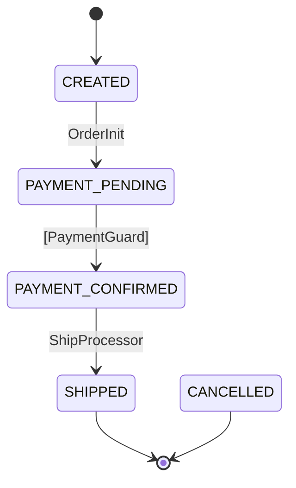
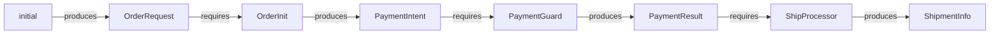
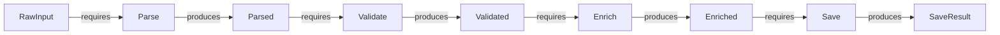
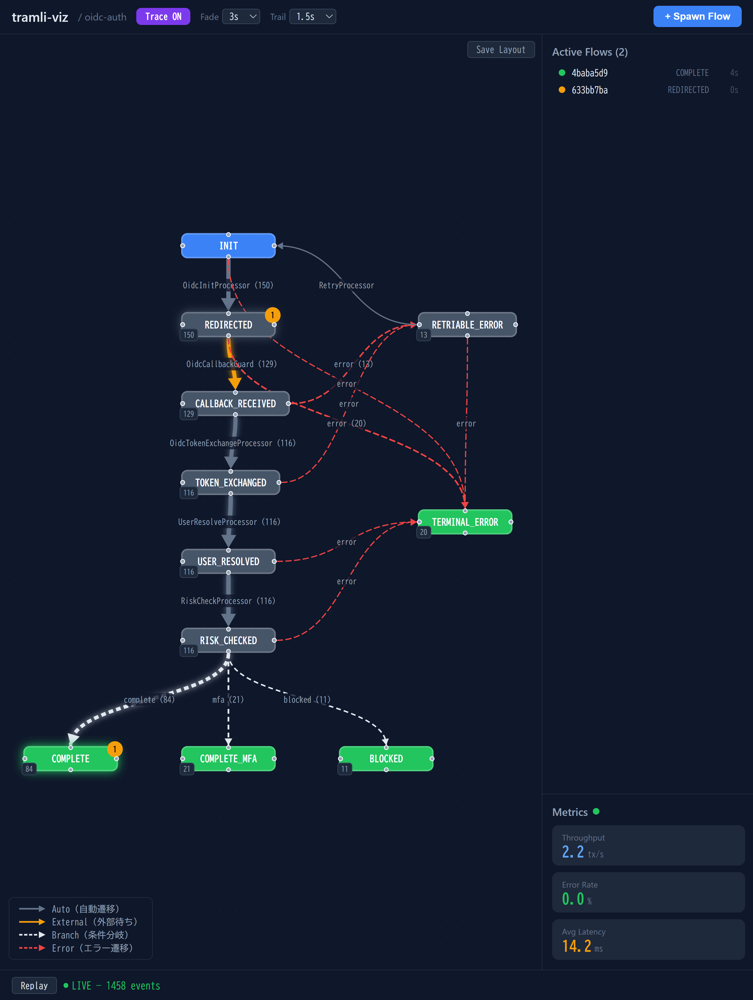

[日本語版はこちら / Japanese](README-ja.md)

# tramli

Constrained flow engine — **Java, TypeScript, Rust.**

State machines where **invalid transitions cannot exist** — enforced at build time by the compiler and [8-item validation](#8-item-build-validation).

> **tramli** = tramline (路面電車の軌道). Your code runs on rails — it can only go where tracks are laid.

**Read**: [Why tramli Works — The Attention Budget](docs/why-tramli-works.md) | [日本語版](docs/why-tramli-works-attention-budget-ja.md)

**Example**: [Real-World OIDC Auth Flow (9 states, 5 processors)](docs/example-oidc-auth-flow.md) | [日本語版](docs/example-oidc-auth-flow-ja.md)

**Cookbook**: [API Cookbook — every method with examples](docs/api-cookbook.md) | [日本語版](docs/api-cookbook-ja.md)

---

## Table of Contents

- [Why tramli exists](#why-tramli-exists)
- [Quick Start](#quick-start) — define states, processors, flow, run
- [Core Concepts](#core-concepts) — the 8 building blocks
  - [FlowState](#flowstate) — what states your system can be in
  - [StateProcessor](#stateprocessor) — business logic for 1 transition
  - [TransitionGuard](#transitionguard) — validates external events (pure function)
  - [BranchProcessor](#branchprocessor) — conditional routing
  - [FlowContext](#flowcontext) — type-safe data accumulator
  - [FlowDefinition](#flowdefinition) — the entire flow as a declarative map
  - [FlowEngine](#flowengine) — zero-logic orchestrator
  - [FlowStore](#flowstore) — pluggable persistence
- [Three Transition Types](#three-transition-types) — Auto, External, Branch
- [Auto-Chain](#auto-chain) — how multiple transitions fire in one request
- [8-Item Build Validation](#8-item-build-validation) — what `build()` checks
- [requires / produces Contract](#requires--produces-contract) — how data flows between processors
- [Mermaid Diagram Generation](#mermaid-diagram-generation) — code = diagram, always
- [Data-Flow Graph](#data-flow-graph) — automatic data dependency analysis
- [Pipeline](#pipeline) — sequential step chain with build-time verification
- [Logging](#logging) — zero-dependency pluggable loggers
- [Error Handling](#error-handling) — guard rejection, max retries, error transitions
- [Plugin System](#plugin-system) — 14 plugins across 6 SPI types
- [tramli-viz](#tramli-viz) — real-time flow monitoring UI
- [Why LLMs Love This](#why-llms-love-this)
- [Performance](#performance)
- [Use Cases](#use-cases)
- [Glossary](#glossary)

---

## Why tramli exists

```
1800-line procedural handler → "where does the callback logic start?"
  → read everything → context window explodes → mistakes happen

tramli FlowDefinition (50 lines) → "read this, then the 1 processor you need"
  → done in 100 lines → compiler catches the rest
```

The core insight: **"what you don't need to read" matters more than "what you do."**

In a procedural handler, every line is implicit context. Changing line 400 might break line 1200. You can't know without reading everything.

In tramli, a [StateProcessor](#stateprocessor) is a closed unit. Its [requires()](#requires--produces-contract) declares inputs; its [produces()](#requires--produces-contract) declares outputs. Change one processor, and nothing else is affected.

This helps **humans** (limited working memory) and **LLMs** (limited context window) equally.

### Why flat states? (DD-021)

tramli uses flat enums for states — no hierarchical states, no orthogonal regions. This is **not a limitation**. It's the correct design for data-flow verification.

In [fictional dialogues generated by DGE](dge/sessions/dge-session-harel-carta.md) — where an AI plays the role of David Harel (Statecharts inventor) and Pat Helland (distributed systems pioneer) — both personas independently arrived at the same conclusion:

- **Hierarchical states** degrade data-flow verification (implicit paths through super-states)
- **Orthogonal regions** break data-flow verification (exponential path combinations)
- **Flat enums** enable complete verification (every path enumerable)

Data-flow verification is **paradigm-agnostic** — it works on mutable context, event logs, or Statecharts. But only flat models preserve **complete** verification. tramli trades expressiveness for this guarantee.

If you need hierarchy, use [SubFlow](docs/example-oidc-auth-flow.md) (composition, not nesting). If you need concurrent concerns, use [separate flows](docs/patterns/long-lived-flows.md) linked by `crossFlowMap()`.

---

## Quick Start

### 1. Define [states](#flowstate)

<details open><summary><b>Java</b></summary>

```java
enum OrderState implements FlowState {
    CREATED(false, true),           // initial state
    PAYMENT_PENDING(false),
    PAYMENT_CONFIRMED(false),
    SHIPPED(true),                  // terminal — flow ends here
    CANCELLED(true);                // terminal — error end

    private final boolean terminal, initial;
    OrderState(boolean t) { this(t, false); }
    OrderState(boolean t, boolean i) { terminal = t; initial = i; }
    @Override public boolean isTerminal() { return terminal; }
    @Override public boolean isInitial() { return initial; }
}
```

</details>
<details><summary><b>TypeScript</b></summary>

```typescript
type OrderState = 'CREATED' | 'PAYMENT_PENDING' | 'PAYMENT_CONFIRMED' | 'SHIPPED' | 'CANCELLED';

const stateConfig: Record<OrderState, StateConfig> = {
    CREATED:           { terminal: false, initial: true },
    PAYMENT_PENDING:   { terminal: false },
    PAYMENT_CONFIRMED: { terminal: false },
    SHIPPED:           { terminal: true },
    CANCELLED:         { terminal: true },
};
```

</details>
<details><summary><b>Rust</b></summary>

```rust
#[derive(Clone, Copy, Debug, PartialEq, Eq, Hash)]
enum OrderState {
    Created,
    PaymentPending,
    PaymentConfirmed,
    Shipped,
    Cancelled,
}

impl FlowState for OrderState {
    fn is_terminal(&self) -> bool {
        matches!(self, Self::Shipped | Self::Cancelled)
    }
    fn is_initial(&self) -> bool {
        matches!(self, Self::Created)
    }
}
```

</details>

Why `enum`? Because the compiler enforces exhaustiveness. A typo like `"COMLETE"` is impossible — it's a compile error.

### 2. Write [processors](#stateprocessor) (1 transition = 1 processor)

<details open><summary><b>Java</b></summary>

```java
StateProcessor orderInit = new StateProcessor() {
    @Override public String name() { return "OrderInit"; }
    @Override public Set<Class<?>> requires() { return Set.of(OrderRequest.class); }
    @Override public Set<Class<?>> produces() { return Set.of(PaymentIntent.class); }
    @Override public void process(FlowContext ctx) {
        OrderRequest req = ctx.get(OrderRequest.class);  // type-safe, no cast
        ctx.put(PaymentIntent.class, new PaymentIntent("txn-" + req.itemId()));
    }
};
```

</details>
<details><summary><b>TypeScript</b></summary>

```typescript
const OrderRequest = flowKey<OrderRequest>('OrderRequest');
const PaymentIntent = flowKey<PaymentIntent>('PaymentIntent');

const orderInit: StateProcessor<OrderState> = {
    name: 'OrderInit',
    requires: [OrderRequest],
    produces: [PaymentIntent],
    process(ctx) {
        const req = ctx.get(OrderRequest);  // type-safe
        ctx.put(PaymentIntent, { txnId: `txn-${req.itemId}` });
    },
};
```

</details>
<details><summary><b>Rust</b></summary>

```rust
struct OrderInit;

impl StateProcessor<OrderState> for OrderInit {
    fn name(&self) -> &str { "OrderInit" }
    fn requires(&self) -> Vec<TypeId> { requires![OrderRequest] }
    fn produces(&self) -> Vec<TypeId> { produces![PaymentIntent] }
    fn process(&self, ctx: &mut FlowContext) -> Result<(), FlowError> {
        let req = ctx.get::<OrderRequest>()?;
        ctx.put(PaymentIntent { txn_id: format!("txn-{}", req.item_id) });
        Ok(())
    }
}
```

</details>

`requires()` and `produces()` aren't just documentation — they're **verified at [build() time](#8-item-build-validation)** across all paths in the flow.

### 3. Define the [flow](#flowdefinition)

<details open><summary><b>Java</b></summary>

```java
var orderFlow = Tramli.define("order", OrderState.class)
    .ttl(Duration.ofHours(24))
    .initiallyAvailable(OrderRequest.class)      // provided at startFlow()
    .from(CREATED).auto(PAYMENT_PENDING, orderInit)
    .from(PAYMENT_PENDING).external(CONFIRMED, paymentGuard)
    .from(CONFIRMED).auto(SHIPPED, shipProcessor)
    .onAnyError(CANCELLED)
    .build();  // ← 8-item validation here
```

</details>
<details><summary><b>TypeScript</b></summary>

```typescript
const orderFlow = Tramli.define<OrderState>('order', stateConfig)
    .setTtl(24 * 60 * 60 * 1000)
    .initiallyAvailable(OrderRequest)
    .from('CREATED').auto('PAYMENT_PENDING', orderInit)
    .from('PAYMENT_PENDING').external('PAYMENT_CONFIRMED', paymentGuard)
    .from('PAYMENT_CONFIRMED').auto('SHIPPED', shipProcessor)
    .onAnyError('CANCELLED')
    .build();
```

</details>
<details><summary><b>Rust</b></summary>

```rust
let order_flow = Builder::new("order")
    .ttl(Duration::from_secs(86400))
    .initially_available::<OrderRequest>()
    .from(OrderState::Created).auto(OrderState::PaymentPending, OrderInit)
    .from(OrderState::PaymentPending).external(OrderState::PaymentConfirmed, PaymentGuard)
    .from(OrderState::PaymentConfirmed).auto(OrderState::Shipped, ShipProcessor)
    .on_any_error(OrderState::Cancelled)
    .build()
    .unwrap();
```

</details>

Read this top-to-bottom — it **is** the flow. No other file needed to understand the structure.

### 4. Run it

<details open><summary><b>Java</b></summary>

```java
var engine = Tramli.engine(new InMemoryFlowStore());

// Start: CREATED → auto-chain → PAYMENT_PENDING (stops, needs external)
var flow = engine.startFlow(orderFlow, null,
    Map.of(OrderRequest.class, new OrderRequest("item-1", 3)));

// External event: payment webhook arrives
flow = engine.resumeAndExecute(flow.id(), orderFlow);
// → guard validates → CONFIRMED → auto-chain → SHIPPED (terminal, done)
```

</details>
<details><summary><b>TypeScript</b></summary>

```typescript
const engine = Tramli.engine(new InMemoryFlowStore());

// Start: CREATED → auto-chain → PAYMENT_PENDING (stops, needs external)
const flow = engine.startFlow(orderFlow, undefined,
    new Map([[OrderRequest, { itemId: 'item-1', quantity: 3 }]]));

// External event: payment webhook arrives
const result = await engine.resumeAndExecute(flow.id, orderFlow);
// → guard validates → CONFIRMED → auto-chain → SHIPPED (terminal, done)
```

</details>
<details><summary><b>Rust</b></summary>

```rust
let engine = FlowEngine::new(InMemoryFlowStore::new());

// Start: Created → auto-chain → PaymentPending (stops, needs external)
let flow = engine.start_flow(
    Arc::new(order_flow), "s1",
    vec![Box::new(OrderRequest { item_id: "item-1".into(), quantity: 3 })],
);

// External event: payment webhook arrives
let result = engine.resume_and_execute(&flow.id, &order_flow);
// → guard validates → PaymentConfirmed → auto-chain → Shipped (terminal, done)
```

</details>

### 5. Generate [Mermaid diagram](#mermaid-diagram-generation)

<details open><summary><b>Java</b></summary>

```java
String mermaid = MermaidGenerator.generate(orderFlow);
```

</details>
<details><summary><b>TypeScript</b></summary>

```typescript
const mermaid = MermaidGenerator.generate(orderFlow);
```

</details>
<details><summary><b>Rust</b></summary>

```rust
let mermaid = MermaidGenerator::generate(&order_flow);
```

</details>



This diagram is generated **from code** — it can never be out of date.

---

## Core Concepts

tramli has 8 building blocks. Each is small, focused, and testable in isolation.

> **Analogy for beginners:** Think of a board game. **FlowState** is the squares on the board. **StateProcessor** is "what happens when you land on a square." **TransitionGuard** is the gate that checks "do you have the right card to pass?" **FlowContext** is your backpack — it holds all the items you've collected. **FlowDefinition** is the game board itself. **FlowEngine** is the referee who moves your piece. **FlowStore** is the save file.

### FlowState

An `enum` that defines all possible states. Each state knows if it's [terminal](#terminal-state) (flow ends here) or [initial](#initial-state) (flow starts here).

> Think of it as the list of "squares" on your board game. `CREATED` is the start square, `SHIPPED` is the goal.

<details open><summary><b>Java</b></summary>

```java
public interface FlowState {
    String name();
    boolean isTerminal();
    boolean isInitial();
}
```

</details>
<details><summary><b>TypeScript</b></summary>

```typescript
interface StateConfig {
    terminal: boolean;
    initial: boolean;
}
// States are string literal union types:
type MyState = 'A' | 'B' | 'C';
const config: Record<MyState, StateConfig> = { /* ... */ };
```

</details>
<details><summary><b>Rust</b></summary>

```rust
pub trait FlowState: Clone + Copy + Eq + Hash + Debug {
    fn is_terminal(&self) -> bool;
    fn is_initial(&self) -> bool;
}
// Implement on an enum with #[derive(Clone, Copy, Debug, PartialEq, Eq, Hash)]
```

</details>

**Why enum?** The compiler guarantees exhaustiveness. `switch` over states → the compiler warns about missing cases. An LLM can't hallucinate a state that doesn't exist.

### StateProcessor

The **business logic** for one transition. The most important rule: **1 transition = 1 processor.**

> When you land on the "CREATED" square, the processor runs: "take the order request, create a payment intent, put it in the backpack." That's it — one step, one job.

<details open><summary><b>Java</b></summary>

```java
public interface StateProcessor {
    String name();
    Set<Class<?>> requires();   // what I need from FlowContext
    Set<Class<?>> produces();   // what I add to FlowContext
    void process(FlowContext ctx) throws FlowException;
}
```

</details>
<details><summary><b>TypeScript</b></summary>

```typescript
interface StateProcessor<S extends string> {
    name: string;
    requires: FlowKey<unknown>[];
    produces: FlowKey<unknown>[];
    process(ctx: FlowContext): void | Promise<void>;
}
```

</details>
<details><summary><b>Rust</b></summary>

```rust
pub trait StateProcessor<S: FlowState> {
    fn name(&self) -> &str;
    fn requires(&self) -> Vec<TypeId>;
    fn produces(&self) -> Vec<TypeId>;
    fn process(&self, ctx: &mut FlowContext) -> Result<(), FlowError>;
}
```

</details>

This means:
- Changing processor A cannot break processor B
- Testing is trivial: mock [FlowContext](#flowcontext), call `process()`, check output
- An LLM only needs to read **this one file** to modify this step

### TransitionGuard

Validates an [External transition](#external-transition). A **pure function** — it must not modify [FlowContext](#flowcontext).

> The guard is a **gatekeeper**. Your game piece is waiting at "PAYMENT_PENDING." Someone from outside (the payment service) knocks on the door. The guard checks: "Is the payment valid?" If yes → the gate opens and you move forward. If no → "Rejected, try again." If you fail too many times → you get sent to the error square.

<details open><summary><b>Java</b></summary>

```java
public interface TransitionGuard {
    String name();
    Set<Class<?>> requires();
    Set<Class<?>> produces();
    int maxRetries();
    GuardOutput validate(FlowContext ctx);

    sealed interface GuardOutput {
        record Accepted(Map<Class<?>, Object> data) implements GuardOutput {}
        record Rejected(String reason) implements GuardOutput {}
        record Expired() implements GuardOutput {}
    }
}
```

</details>
<details><summary><b>TypeScript</b></summary>

```typescript
interface TransitionGuard<S extends string> {
    name: string;
    requires: FlowKey<unknown>[];
    produces: FlowKey<unknown>[];
    maxRetries: number;
    validate(ctx: FlowContext): GuardOutput;
}

type GuardOutput =
    | { type: 'accepted'; data: Map<FlowKey<unknown>, unknown> }
    | { type: 'rejected'; reason: string }
    | { type: 'expired' };
```

</details>
<details><summary><b>Rust</b></summary>

```rust
pub trait TransitionGuard<S: FlowState> {
    fn name(&self) -> &str;
    fn requires(&self) -> Vec<TypeId>;
    fn produces(&self) -> Vec<TypeId>;
    fn max_retries(&self) -> usize;
    fn validate(&self, ctx: &FlowContext) -> GuardOutput;
}

pub enum GuardOutput {
    Accepted { data: Vec<Box<dyn Any>> },
    Rejected { reason: String },
    Expired,
}
```

</details>

The `sealed interface` means the [FlowEngine](#flowengine) handles exactly 3 cases — the compiler enforces this via `switch`. No forgotten edge cases.

**Accepted** → data merged into context, transition proceeds.
**Rejected** → failure count incremented. After [maxRetries](#error-handling) → [error transition](#error-handling).
**Expired** → flow completed with `EXPIRED` exit state.

### BranchProcessor

Chooses which path to take at a decision point. Returns a **label** (string) that maps to a target state in the [FlowDefinition](#flowdefinition).

> The fork in the road. "If the user needs MFA, go left. If not, go right." The branch processor looks in the backpack, makes a decision, and tells the engine which way to go.

<details open><summary><b>Java</b></summary>

```java
public interface BranchProcessor {
    String name();
    Set<Class<?>> requires();
    String decide(FlowContext ctx);  // returns branch label
}
```

Example: after user resolution, decide if MFA is required:

```java
// FlowDefinition:
.from(USER_RESOLVED).branch(mfaCheck)
    .to(COMPLETE, "no_mfa", sessionProcessor)
    .to(MFA_PENDING, "mfa_required", sessionProcessor)
    .endBranch()

// BranchProcessor:
@Override public String decide(FlowContext ctx) {
    return ctx.get(ResolvedUser.class).mfaRequired() ? "mfa_required" : "no_mfa";
}
```

</details>
<details><summary><b>TypeScript</b></summary>

```typescript
interface BranchProcessor<S extends string> {
    name: string;
    requires: FlowKey<unknown>[];
    decide(ctx: FlowContext): string;
}
```

Example:

```typescript
// FlowDefinition:
.from('USER_RESOLVED').branch(mfaCheck)
    .to('COMPLETE', 'no_mfa', sessionProcessor)
    .to('MFA_PENDING', 'mfa_required', sessionProcessor)
    .endBranch()

// BranchProcessor:
const mfaCheck: BranchProcessor<AuthState> = {
    name: 'MfaCheck',
    requires: [ResolvedUser],
    decide(ctx) {
        return ctx.get(ResolvedUser).mfaRequired ? 'mfa_required' : 'no_mfa';
    },
};
```

</details>
<details><summary><b>Rust</b></summary>

```rust
pub trait BranchProcessor<S: FlowState> {
    fn name(&self) -> &str;
    fn requires(&self) -> Vec<TypeId>;
    fn decide(&self, ctx: &FlowContext) -> String;
}
```

Example:

```rust
// FlowDefinition:
.from(AuthState::UserResolved).branch(MfaCheck)
    .to(AuthState::Complete, "no_mfa", SessionProcessor)
    .to(AuthState::MfaPending, "mfa_required", SessionProcessor)
    .end_branch()

// BranchProcessor:
struct MfaCheck;
impl BranchProcessor<AuthState> for MfaCheck {
    fn name(&self) -> &str { "MfaCheck" }
    fn requires(&self) -> Vec<TypeId> { requires![ResolvedUser] }
    fn decide(&self, ctx: &FlowContext) -> String {
        let user = ctx.get::<ResolvedUser>().unwrap();
        if user.mfa_required { "mfa_required" } else { "no_mfa" }.into()
    }
}
```

</details>

### FlowContext

Type-safe data bucket. Keyed by `Class<?>` — each type appears at most once.

> Your **backpack**. Every time a processor runs, it takes something out (requires) and puts something new in (produces). The backpack carries everything from the start to the end of the game. Any processor can reach in and grab what it needs — no relay needed.

<details open><summary><b>Java</b></summary>

```java
ctx.put(PaymentResult.class, new PaymentResult("OK"));  // write
PaymentResult r = ctx.get(PaymentResult.class);          // read (type-safe)
Optional<PaymentResult> o = ctx.find(PaymentResult.class); // optional read
```

</details>
<details><summary><b>TypeScript</b></summary>

```typescript
const PaymentResult = flowKey<PaymentResult>('PaymentResult');

ctx.put(PaymentResult, { status: 'OK' });          // write
const r = ctx.get(PaymentResult);                   // read (type-safe)
const o = ctx.find(PaymentResult);                  // optional read (undefined if missing)
```

</details>
<details><summary><b>Rust</b></summary>

```rust
ctx.put(PaymentResult { status: "OK".into() });              // write
let r = ctx.get::<PaymentResult>()?;                         // read (type-safe)
let o: Option<&PaymentResult> = ctx.find::<PaymentResult>(); // optional read
```

</details>

**Why Class-keyed?** Three reasons:
1. **No typos** — `ctx.get(PaymentResult.class)` can't be misspelled (unlike `map.get("payment_result")`)
2. **No casts** — return type is inferred
3. **Verifiable** — [requires/produces](#requires--produces-contract) declarations use the same classes, enabling [build-time validation](#8-item-build-validation)

**No pass-through problem:** every processor's output stays in the context. Processor C can read what processor A produced, without B having to relay it.

### FlowDefinition

The **single source of truth** for a flow's structure. A declarative [transition table](#transition-table) built with a DSL and validated at `build()`.

> The **game board** itself. You read it top-to-bottom and you see the entire game: "Start at CREATED, automatically move to PAYMENT_PENDING, wait for payment, then ship." When you call `build()`, tramli checks the board for mistakes — dead-end squares, missing items, infinite loops — before anyone starts playing.

<details open><summary><b>Java</b></summary>

```java
var flow = Tramli.define("order", OrderState.class)
    .ttl(Duration.ofHours(24))
    .maxGuardRetries(3)
    .initiallyAvailable(OrderRequest.class)
    .from(CREATED).auto(PAYMENT_PENDING, orderInit)
    .from(PAYMENT_PENDING).external(CONFIRMED, paymentGuard)
    .from(CONFIRMED).branch(stockCheck)
        .to(SHIPPED, "in_stock", shipProcessor)
        .to(CANCELLED, "out_of_stock", cancelProcessor)
        .endBranch()
    .onAnyError(CANCELLED)
    .build();
```

</details>
<details><summary><b>TypeScript</b></summary>

```typescript
const flow = Tramli.define<OrderState>('order', stateConfig)
    .setTtl(24 * 60 * 60 * 1000)
    .maxGuardRetries(3)
    .initiallyAvailable(OrderRequest)
    .from('CREATED').auto('PAYMENT_PENDING', orderInit)
    .from('PAYMENT_PENDING').external('PAYMENT_CONFIRMED', paymentGuard)
    .from('PAYMENT_CONFIRMED').branch(stockCheck)
        .to('SHIPPED', 'in_stock', shipProcessor)
        .to('CANCELLED', 'out_of_stock', cancelProcessor)
        .endBranch()
    .onAnyError('CANCELLED')
    .build();
```

</details>
<details><summary><b>Rust</b></summary>

```rust
let flow = Builder::new("order")
    .ttl(Duration::from_secs(86400))
    .max_guard_retries(3)
    .initially_available::<OrderRequest>()
    .from(OrderState::Created).auto(OrderState::PaymentPending, OrderInit)
    .from(OrderState::PaymentPending).external(OrderState::PaymentConfirmed, PaymentGuard)
    .from(OrderState::PaymentConfirmed).branch(StockCheck)
        .to(OrderState::Shipped, "in_stock", ShipProcessor)
        .to(OrderState::Cancelled, "out_of_stock", CancelProcessor)
        .end_branch()
    .on_any_error(OrderState::Cancelled)
    .build()
    .unwrap();
```

</details>

Reading this is like reading a map — you see the entire journey in 15 lines. This is why LLMs and humans can work with tramli efficiently: **the map IS the code.**

### FlowEngine

~120 lines. **Zero business logic.** Does exactly three things:

> The **referee**. It doesn't play the game — it just moves your piece according to the rules on the board, and calls the right processor at each square.

1. `startFlow()` — seeds context, runs [auto-chain](#auto-chain)
2. `resumeAndExecute()` — merges external data, validates [guard](#transitionguard), runs [auto-chain](#auto-chain)
3. `executeAutoChain()` — fires [Auto](#auto-transition)/[Branch](#branch-transition) transitions until [External](#external-transition) or [terminal](#terminal-state)

The engine never changes when you add flows. It's the rails — your [processors](#stateprocessor) are the cargo.

### FlowStore

Pluggable persistence interface. Implement 4 methods:

> The **save file**. When the game is paused (waiting for external input), FlowStore saves where you are. When you come back, it loads your position.

<details open><summary><b>Java</b></summary>

```java
public interface FlowStore {
    void create(FlowInstance<?> flow);
    <S extends Enum<S> & FlowState> Optional<FlowInstance<S>> loadForUpdate(String flowId, FlowDefinition<S> def);
    void save(FlowInstance<?> flow);
    void recordTransition(String flowId, FlowState from, FlowState to, String trigger, FlowContext ctx);
}
```

</details>
<details><summary><b>TypeScript</b></summary>

```typescript
interface FlowStore {
    create(flow: FlowInstance<string>): void;
    loadForUpdate<S extends string>(flowId: string, def: FlowDefinition<S>): FlowInstance<S> | undefined;
    save(flow: FlowInstance<string>): void;
    recordTransition(flowId: string, from: string, to: string, trigger: string, ctx: FlowContext): void;
}
```

</details>
<details><summary><b>Rust</b></summary>

```rust
pub trait FlowStore<S: FlowState> {
    fn create(&mut self, flow: &FlowInstance<S>);
    fn load_for_update(&self, flow_id: &str, def: &FlowDefinition<S>) -> Option<FlowInstance<S>>;
    fn save(&mut self, flow: &FlowInstance<S>);
    fn record_transition(&mut self, flow_id: &str, from: S, to: S, trigger: &str, ctx: &FlowContext);
}
```

</details>

| Implementation | Use case |
|-------|----------|
| `InMemoryFlowStore` | Tests, single-process apps. Ships with tramli. |
| JDBC (bring your own) | PostgreSQL/MySQL with JSONB context, `SELECT FOR UPDATE` locking |
| Redis (bring your own) | Distributed flows with TTL-based expiry |

---

## Three Transition Types

Every arrow in the [flow diagram](#mermaid-diagram-generation) is one of three types:

> **Auto** = the referee moves your piece automatically. **External** = the game pauses and waits for someone outside to do something (like a payment webhook). **Branch** = a fork in the road where the referee checks a condition and picks a path.

| Type | Trigger | When engine fires it | Example |
|------|---------|---------------------|---------|
| [**Auto**](#auto-transition) | Previous transition completes | Immediately, no waiting | `CONFIRMED → SHIPPED` |
| [**External**](#external-transition) | Outside event (HTTP, message) | Only on `resumeAndExecute()` | `PENDING → CONFIRMED` |
| [**Branch**](#branch-transition) | [BranchProcessor](#branchprocessor) returns label | Immediately, like Auto | `RESOLVED → COMPLETE or MFA_PENDING` |

---

## Auto-Chain

When an [External](#external-transition) transition's [guard](#transitionguard) passes, the engine doesn't stop — it keeps firing [Auto](#auto-transition) and [Branch](#branch-transition) transitions until it hits another External or a [terminal state](#terminal-state).

> Imagine dominoes. You push the first one (External), and the rest fall automatically (Auto, Auto, Branch...) until there's a gap (another External) or the last domino falls (terminal state).

```
HTTP request arrives (callback)
  → External: REDIRECTED → CALLBACK_RECEIVED     ← guard validates
  → Auto:     CALLBACK_RECEIVED → TOKEN_EXCHANGED ← processor runs
  → Auto:     TOKEN_EXCHANGED → USER_RESOLVED     ← processor runs
  → Branch:   USER_RESOLVED → COMPLETE            ← branch decides
  (terminal — flow done)
```

**One HTTP request, four transitions.** The engine handles the chaining — each [processor](#stateprocessor) only knows about its own step.

Safety: auto-chain has a max depth of 10 to prevent infinite loops. [DAG validation](#8-item-build-validation) at build time ensures Auto/Branch transitions cannot form cycles.

---

## 8-Item Build Validation

> **Why this matters — a real story:** A developer adds a new state to a payment flow. They wire up the processor, write tests, deploy to production. Three days later, a customer hits that state — and the flow crashes because the processor needs `CustomerProfile` data, but no previous step produces it. The error only surfaces in production, at 2am, with real money involved.
>
> With tramli, this can't happen. `build()` catches it **before the code even runs** — in your IDE, in CI, before any deployment. It's like a spell-checker for your state machine.

`build()` runs 8 structural checks. If any fail, you get a clear error message — **before any flow runs.**

| # | Check | What it catches |
|---|-------|----------------|
| 1 | All non-terminal states [reachable](#reachable) from [initial](#initial-state) | Dead states that can never be entered |
| 2 | Path from initial to [terminal](#terminal-state) exists | Flows that can never complete |
| 3 | [Auto](#auto-transition)/[Branch](#branch-transition) transitions form a [DAG](#dag) | Infinite auto-chain loops |
| 4 | Multi-[External](#external-transition) guards have distinct `requires` | Ambiguous "which guard handles this data?" (DD-020) |
| 5 | All [branch](#branch-transition) targets defined | `decide()` returning a label with no target state |
| 6 | [requires/produces](#requires--produces-contract) chain integrity | "Data not available" errors at runtime |
| 7 | No transitions from [terminal](#terminal-state) states | States that should be final but aren't |
| 8 | [Initial state](#initial-state) exists | Forgot to mark a state as initial |

**This is why LLMs can safely generate tramli code** — even if the generated transition is wrong, `build()` rejects it immediately. The feedback loop is: generate → compile → build() → fix. No runtime surprises.

---

## requires / produces Contract

Every [StateProcessor](#stateprocessor) and [TransitionGuard](#transitionguard) declares what data it needs and what it provides:

> Think of it as a **recipe**. Each processor says: "I need eggs and flour (requires), and I'll make a cake (produces)." tramli checks every recipe before the kitchen opens — if someone needs butter but nobody buys butter, `build()` tells you immediately.

```java
@Override public Set<Class<?>> requires() { return Set.of(OrderRequest.class); }
@Override public Set<Class<?>> produces() { return Set.of(PaymentIntent.class); }
```

At [build() time](#8-item-build-validation), tramli walks every possible path through the flow and verifies that each processor's `requires()` is satisfied by previous processors' `produces()` (or by [initiallyAvailable](#initially-available) data).

```
Path: CREATED → PAYMENT_PENDING → CONFIRMED → SHIPPED

Available at CREATED:         {OrderRequest}         ← initiallyAvailable
After OrderInit:              {OrderRequest, PaymentIntent}  ← produces
Guard requires PaymentIntent: ✓ available
After PaymentGuard:           {... + PaymentResult}
ShipProcessor requires PaymentResult: ✓ available
```

If you add a processor that requires `CustomerProfile` but nothing produces it, `build()` fails:

```
Flow 'order' has 1 validation error(s):
  - Processor 'ShipProcessor' at CONFIRMED → SHIPPED requires CustomerProfile
    but it may not be available
```

---

## Mermaid Diagram Generation

```java
String mermaid = MermaidGenerator.generate(definition);
MermaidGenerator.writeToFile(definition, Path.of("docs/diagrams"));
```

The diagram is generated **from the [FlowDefinition](#flowdefinition)** — the same object that the [engine](#flowengine) uses. It cannot be out of date.

CI integration: generate → compare with committed `.mmd` files → fail if different. Forces developers to update diagrams when changing flows.

---

## Data-Flow Graph

Every `build()` also constructs a **DataFlowGraph** — a bipartite graph of data types and processors derived from [requires/produces](#requires--produces-contract) declarations. Access it via `def.dataFlowGraph()`.

### Dual View: State Transitions + Data Flow

The state diagram shows **control flow** (what states exist and how they connect). The data-flow diagram shows **data flow** (what data each processor needs and produces):

```java
// State transition diagram (existing)
String states = MermaidGenerator.generate(orderFlow);

// Data-flow diagram (new)
String dataFlow = MermaidGenerator.generateDataFlow(orderFlow);
```



### Query API

<details open><summary><b>Java</b></summary>

```java
DataFlowGraph<OrderState> graph = orderFlow.dataFlowGraph();

// What data is available when the flow reaches PAYMENT_PENDING?
Set<Class<?>> available = graph.availableAt(PAYMENT_PENDING);
// → {OrderRequest, PaymentIntent}

// Who produces PaymentIntent?
List<NodeInfo> producers = graph.producersOf(PaymentIntent.class);
// → [{name: "OrderInit", from: CREATED, to: PAYMENT_PENDING}]

// Who consumes OrderRequest?
List<NodeInfo> consumers = graph.consumersOf(OrderRequest.class);
// → [{name: "OrderInit", from: CREATED, to: PAYMENT_PENDING}]

// Dead data: produced but never required downstream
Set<Class<?>> dead = graph.deadData();
// → {ShipmentInfo}  (terminal data — no downstream consumer)
```

</details>
<details><summary><b>TypeScript</b></summary>

```typescript
const graph = orderFlow.dataFlowGraph();

// What data is available when the flow reaches PAYMENT_PENDING?
const available = graph.availableAt('PAYMENT_PENDING');
// → Set { OrderRequest, PaymentIntent }

// Who produces PaymentIntent?
const producers = graph.producersOf(PaymentIntent);
// → [{name: "OrderInit", from: "CREATED", to: "PAYMENT_PENDING"}]

// Who consumes OrderRequest?
const consumers = graph.consumersOf(OrderRequest);
// → [{name: "OrderInit", from: "CREATED", to: "PAYMENT_PENDING"}]

// Dead data: produced but never required downstream
const dead = graph.deadData();
// → Set { ShipmentInfo }
```

</details>
<details><summary><b>Rust</b></summary>

```rust
let graph = order_flow.data_flow_graph();

// What data is available when the flow reaches PaymentPending?
let available = graph.available_at(OrderState::PaymentPending);
// → {TypeId of OrderRequest, TypeId of PaymentIntent}

// Who produces PaymentIntent?
let producers = graph.producers_of::<PaymentIntent>();
// → [{name: "OrderInit", from: Created, to: PaymentPending}]

// Who consumes OrderRequest?
let consumers = graph.consumers_of::<OrderRequest>();
// → [{name: "OrderInit", from: Created, to: PaymentPending}]

// Dead data: produced but never required downstream
let dead = graph.dead_data();
// → {TypeId of ShipmentInfo}
```

</details>

### Analysis API

<details open><summary><b>Java</b></summary>

```java
// Data lifetime — when a type is first produced and last consumed
var lt = graph.lifetime(PaymentIntent.class);
// → Lifetime(firstProduced=PAYMENT_PENDING, lastConsumed=PAYMENT_CONFIRMED)

// Context pruning hints — types no longer needed at each state
Map<OrderState, Set<Class<?>>> hints = graph.pruningHints();
// → {SHIPPED: [OrderRequest, PaymentIntent, PaymentResult, ShipmentInfo]}

// Assert data-flow invariant on a running flow instance
List<Class<?>> missing = graph.assertDataFlow(flow.context(), flow.currentState());
// → [] (empty = all expected types present)

// Verify processor's actual behavior matches its declarations
List<String> violations = DataFlowGraph.verifyProcessor(orderInit, ctx);
// → [] (empty = requires/produces match actual get/put)

// Check if processor B can replace processor A
boolean ok = DataFlowGraph.isCompatible(processorA, processorB);
// → true if B requires ⊆ A requires AND A produces ⊆ B produces
```

</details>
<details><summary><b>TypeScript</b></summary>

```typescript
// Data lifetime — when a type is first produced and last consumed
const lt = graph.lifetime(PaymentIntent);
// → { firstProduced: 'PAYMENT_PENDING', lastConsumed: 'PAYMENT_CONFIRMED' }

// Context pruning hints — types no longer needed at each state
const hints = graph.pruningHints();
// → Map { 'SHIPPED' => Set { OrderRequest, PaymentIntent, PaymentResult, ShipmentInfo } }

// Assert data-flow invariant on a running flow instance
const missing = graph.assertDataFlow(flow.context, flow.currentState);
// → [] (empty = all expected types present)

// Verify processor's actual behavior matches its declarations
const violations = DataFlowGraph.verifyProcessor(orderInit, ctx);
// → [] (empty = requires/produces match actual get/put)

// Check if processor B can replace processor A
const ok = DataFlowGraph.isCompatible(processorA, processorB);
// → true if B requires ⊆ A requires AND A produces ⊆ B produces
```

</details>
<details><summary><b>Rust</b></summary>

```rust
// Data lifetime — when a type is first produced and last consumed
let lt = graph.lifetime::<PaymentIntent>();
// → Lifetime { first_produced: PaymentPending, last_consumed: PaymentConfirmed }

// Context pruning hints — types no longer needed at each state
let hints = graph.pruning_hints();
// → {Shipped: {OrderRequest, PaymentIntent, PaymentResult, ShipmentInfo}}

// Assert data-flow invariant on a running flow instance
let missing = graph.assert_data_flow(&flow.context(), flow.current_state());
// → vec![] (empty = all expected types present)

// Verify processor's actual behavior matches its declarations
let violations = DataFlowGraph::verify_processor(&order_init, &ctx);
// → vec![] (empty = requires/produces match actual get/put)

// Check if processor B can replace processor A
let ok = DataFlowGraph::is_compatible(&processor_a, &processor_b);
// → true if B requires ⊆ A requires AND A produces ⊆ B produces
```

</details>

### Why This Matters

| Without data-flow graph | With data-flow graph |
|------------------------|---------------------|
| "What data is available at state X?" → read all processor code | `graph.availableAt(X)` |
| "If I change PaymentIntent, what breaks?" → grep | `graph.consumersOf(PaymentIntent.class)` |
| "Any unused data accumulating?" → manual review | `graph.deadData()` |
| "Explain the data pipeline to a new team member" → meeting | Show the Mermaid diagram |

This is the same advantage that Airflow/Temporal users wish they had: **build-time, static data-flow analysis.** Those tools use dynamic XCom/payloads with no static guarantees. tramli's `requires/produces` declarations enable verification before any code runs.

### Full API Reference

#### DataFlowGraph

| Method | Returns | Description |
|--------|---------|-------------|
| `availableAt(state)` | `Set<Class<?>>` | Types available in context at a given state |
| `producersOf(type)` | `List<NodeInfo>` | Processors/guards that produce this type |
| `consumersOf(type)` | `List<NodeInfo>` | Processors/guards that require this type |
| `deadData()` | `Set<Class<?>>` | Types produced but never consumed |
| `lifetime(type)` | `Lifetime(firstProduced, lastConsumed)` | Data lifecycle across states |
| `pruningHints()` | `Map<S, Set<Class<?>>>` | Types no longer needed at each state |
| `impactOf(type)` | `Impact(producers, consumers)` | All nodes affected by a type change |
| `parallelismHints()` | `List<String[]>` | Independent processor pairs (no data dependency) |
| `assertDataFlow(ctx, state)` | `List<Class<?>>` | Missing types at current state (empty = OK) |
| `verifyProcessor(proc, ctx)` | `List<String>` | Runtime requires/produces violations |
| `isCompatible(a, b)` | `boolean` | Can processor B replace A without breaking data-flow? |
| `migrationOrder()` | `List<String>` | Processors sorted by dependency (fewest first) |
| `testScaffold()` | `Map<String, List<String>>` | Required types per processor for test setup |
| `generateInvariantAssertions()` | `List<String>` | Data-flow invariant strings per state |
| `crossFlowMap(graphs...)` | `List<String>` | Inter-flow data dependencies |
| `diff(before, after)` | `DiffResult` | Added/removed types and edges between two graphs |
| `versionCompatibility(v1, v2)` | `List<String>` | Incompatibilities between two definition versions |
| `toMermaid()` | `String` | Mermaid flowchart LR diagram |
| `toJson()` | `String` | Structured JSON (types, producers, consumers, deadData) |
| `toMarkdown()` | `String` | Migration checklist in Markdown |
| `toRenderable()` | `RenderableGraph.DataFlow` | Read-only view for custom renderers |
| `renderDataFlow(fn)` | `String` | Render with custom function (dot, PlantUML, etc.) |

#### FlowDefinition

| Method | Description |
|--------|-------------|
| `build()` | Validate + construct (8-item + data-flow check) |
| `dataFlowGraph()` | Access the derived DataFlowGraph |
| `warnings()` | Structural warnings (e.g., liveness risk) |
| `withPlugin(from, to, pluginFlow)` | Insert sub-flow before a transition (returns new definition) |

#### FlowInstance

| Method | Description |
|--------|-------------|
| `currentState()` | Current state enum value |
| `isCompleted()` | Whether the flow has reached a terminal state |
| `exitState()` | Terminal state name (null if active) |
| `context()` | The FlowContext with all produced data |
| `lastError()` | Error message from the last failed processor |
| `activeSubFlow()` | Active sub-flow instance (null if not in sub-flow) |
| `statePath()` | State path from root: `["PAYMENT", "CONFIRM"]` |
| `statePathString()` | Slash-separated: `"PAYMENT/CONFIRM"` |
| `waitingFor()` | Types required by current external transition |
| `availableData()` | Types available at current state (from DataFlowGraph) |
| `missingFor()` | Types missing for the next transition |
| `withVersion(n)` | Copy with updated version (for FlowStore optimistic locking) |

#### FlowContext

| Method | Description |
|--------|-------------|
| `get(key)` | Get typed value (throws if missing) |
| `find(key)` | Get typed value (Optional/undefined if missing) |
| `put(key, value)` | Store typed value |
| `has(key)` | Check if key exists |
| `registerAlias(type, alias)` | Register string alias for cross-language serialization |
| `toAliasMap()` | Export as alias → value map (for JSON serialization) |
| `fromAliasMap(map)` | Import from alias → value map |

#### FlowEngine

| Method | Description |
|--------|-------------|
| `startFlow(def, session, data)` | Start a new flow instance |
| `resumeAndExecute(flowId, def)` | Resume at external transition. Throws `flowNotFound`, `flowAlreadyCompleted`, or `flowExpired` |
| `setTransitionLogger(fn)` | Log every state transition (entry includes `flowName`) |
| `setGuardLogger(fn)` | Log guard Accepted/Rejected/Expired |
| `setStateLogger(fn)` | Log every context.put() (opt-in) |
| `setErrorLogger(fn)` | Log every error transition |
| `removeAllLoggers()` | Remove all loggers |

#### Builder DSL

| Method | Description |
|--------|-------------|
| `.from(state).auto(to, processor)` | Auto transition |
| `.from(state).external(to, guard)` | External transition (waits for event) |
| `.from(state).branch(branch).to(s, label).endBranch()` | Conditional routing |
| `.from(state).subFlow(def).onExit("X", s).endSubFlow()` | Embed sub-flow |
| `.onError(from, to)` | State-based error routing |
| `.onStepError(from, ExceptionClass, to)` | Exception-typed error routing |
| `.onAnyError(state)` | Catch-all error routing |
| `.initiallyAvailable(types...)` | Declare initial data types |
| `.ttl(duration)` | Flow time-to-live |
| `.maxGuardRetries(n)` | Guard rejection limit |
| `.allow_perpetual()` | Allow terminal-less flows (Rust) |

#### Code Generation

| Class | Method | Description |
|-------|--------|-------------|
| `MermaidGenerator` | `generate(def)` | State transition diagram |
| `MermaidGenerator` | `generateDataFlow(def)` | Data-flow diagram |
| `MermaidGenerator` | `generateExternalContract(def)` | External transition data contracts |
| `MermaidGenerator` | `dataFlow(renderable)` | Render RenderableGraph as Mermaid |
| `MermaidGenerator` | `stateDiagram(renderable)` | Render RenderableStateDiagram as Mermaid |
| `SkeletonGenerator` | `generate(def, language)` | Processor skeletons in Java/TS/Rust |

---

## Pipeline

Not every workflow needs states. For **sequential processing chains** without external events or branching, `Tramli.pipeline()` gives you the same build-time data-flow verification with a simpler API. No states, no engine, no persistence — just steps and data.

### 1. Define data types

```java
record RawInput(String csv) {}
record Parsed(List<String[]> rows) {}
record Validated(List<String[]> rows, int errorCount) {}
record Enriched(List<Map<String, String>> records) {}
record SaveResult(int savedCount) {}
```

### 2. Write steps (1 step = 1 [PipelineStep](#pipelinestep))

<details open><summary><b>Java</b></summary>

```java
PipelineStep parse = new PipelineStep() {
    @Override public String name() { return "Parse"; }
    @Override public Set<Class<?>> requires() { return Set.of(RawInput.class); }
    @Override public Set<Class<?>> produces() { return Set.of(Parsed.class); }
    @Override public void process(FlowContext ctx) {
        RawInput raw = ctx.get(RawInput.class);
        List<String[]> rows = CsvParser.parse(raw.csv());
        ctx.put(Parsed.class, new Parsed(rows));
    }
};
// validate, enrich, save follow the same pattern
```

</details>
<details><summary><b>TypeScript</b></summary>

```typescript
const RawInput = flowKey<RawInput>('RawInput');
const Parsed = flowKey<Parsed>('Parsed');

const parse: PipelineStep = {
    name: 'Parse',
    requires: [RawInput],
    produces: [Parsed],
    process(ctx) {
        const raw = ctx.get(RawInput);
        const rows = CsvParser.parse(raw.csv);
        ctx.put(Parsed, { rows });
    },
};
// validate, enrich, save follow the same pattern
```

</details>
<details><summary><b>Rust</b></summary>

```rust
struct Parse;

impl PipelineStep for Parse {
    fn name(&self) -> &str { "Parse" }
    fn requires(&self) -> Vec<TypeId> { requires![RawInput] }
    fn produces(&self) -> Vec<TypeId> { produces![Parsed] }
    fn process(&self, ctx: &mut FlowContext) -> Result<(), FlowError> {
        let raw = ctx.get::<RawInput>()?;
        let rows = CsvParser::parse(&raw.csv);
        ctx.put(Parsed { rows });
        Ok(())
    }
}
// validate, enrich, save follow the same pattern
```

</details>

Each step declares what it needs (`requires`) and what it provides (`produces`). **Same contract as [StateProcessor](#stateprocessor)**, but without the state generic.

### 3. Define the pipeline

<details open><summary><b>Java</b></summary>

```java
var pipeline = Tramli.pipeline("csv-import")
    .initiallyAvailable(RawInput.class)
    .step(parse)       // requires: RawInput,   produces: Parsed
    .step(validate)    // requires: Parsed,     produces: Validated
    .step(enrich)      // requires: Validated,  produces: Enriched
    .step(save)        // requires: Enriched,   produces: SaveResult
    .build();          // ← requires/produces chain verified at build time
```

</details>
<details><summary><b>TypeScript</b></summary>

```typescript
const pipeline = Tramli.pipeline('csv-import')
    .initiallyAvailable(RawInput)
    .step(parse)       // requires: RawInput,   produces: Parsed
    .step(validate)    // requires: Parsed,     produces: Validated
    .step(enrich)      // requires: Validated,  produces: Enriched
    .step(save)        // requires: Enriched,   produces: SaveResult
    .build();
```

</details>
<details><summary><b>Rust</b></summary>

```rust
let pipeline = PipelineBuilder::new("csv-import")
    .initially_available::<RawInput>()
    .step(Box::new(Parse))       // requires: RawInput,   produces: Parsed
    .step(Box::new(Validate))    // requires: Parsed,     produces: Validated
    .step(Box::new(Enrich))      // requires: Validated,  produces: Enriched
    .step(Box::new(Save))        // requires: Enriched,   produces: SaveResult
    .build()
    .unwrap();
```

</details>

If `enrich` requires `Validated` but nothing produces it, `build()` fails:

```
Pipeline 'csv-import' has 1 error(s):
  - Step 'Enrich' requires Validated but it may not be available
```

### 4. Run it

<details open><summary><b>Java</b></summary>

```java
FlowContext result = pipeline.execute(Map.of(RawInput.class, new RawInput(csvString)));
SaveResult saved = result.get(SaveResult.class);
System.out.println("Saved " + saved.savedCount() + " records");
```

All steps execute sequentially. If a step throws, a `PipelineException` gives you the full picture:

```java
try {
    pipeline.execute(data);
} catch (PipelineException e) {
    e.completedSteps();  // ["Parse", "Validate"]     ← succeeded
    e.failedStep();      // "Enrich"                   ← failed here
    e.context();         // FlowContext with Parsed + Validated
    e.cause();           // original exception
}
```

</details>
<details><summary><b>TypeScript</b></summary>

```typescript
const result = pipeline.execute(new Map([[RawInput, { csv: csvString }]]));
const saved = result.get(SaveResult);
console.log(`Saved ${saved.savedCount} records`);
```

Error handling:

```typescript
try {
    pipeline.execute(data);
} catch (e) {
    if (e instanceof PipelineError) {
        e.completedSteps;  // ['Parse', 'Validate']
        e.failedStep;      // 'Enrich'
        e.context;         // FlowContext with Parsed + Validated
        e.cause;           // original error
    }
}
```

</details>
<details><summary><b>Rust</b></summary>

```rust
let result = pipeline.execute(vec![Box::new(RawInput { csv: csv_string })])?;
let saved = result.get::<SaveResult>()?;
println!("Saved {} records", saved.saved_count);
```

Error handling:

```rust
match pipeline.execute(data) {
    Ok(ctx) => { /* success */ }
    Err(PipelineError { completed_steps, failed_step, context, cause }) => {
        // completed_steps: ["Parse", "Validate"]
        // failed_step:     "Enrich"
        // context:         FlowContext with Parsed + Validated
        // cause:           original error
    }
}
```

</details>

### 5. Generate diagram

<details open><summary><b>Java</b></summary>

```java
String mermaid = pipeline.dataFlow().toMermaid();
```

</details>
<details><summary><b>TypeScript</b></summary>

```typescript
const mermaid = pipeline.dataFlow().toMermaid();
```

</details>
<details><summary><b>Rust</b></summary>

```rust
let mermaid = pipeline.data_flow().to_mermaid();
```

</details>



### More features

```java
// Dead data detection
pipeline.dataFlow().deadData();  // types produced but never consumed

// Nest pipelines
PipelineStep sub = otherPipeline.asStep();

// strictMode: verify produces at runtime
pipeline.setStrictMode(true);

// Pluggable rendering (Graphviz, PlantUML, custom)
pipeline.dataFlow().renderDataFlow(myDotRenderer);

// Logger hooks (same as FlowEngine)
pipeline.setTransitionLogger(entry -> log.info("{} → {}", entry.from(), entry.to()));
```

### When to use what

| Scenario | Tool |
|----------|------|
| Sequential 2-4 steps, 1 type each | Function composition / pipe |
| Sequential 5+ steps, data accumulates | **`Tramli.pipeline()`** |
| Branching / external events / persistence | **`Tramli.define()`** ([FlowDefinition](#flowdefinition)) |
| Distributed / long-running / scheduled | Airflow / Temporal |

Pipeline is tramli's **on-ramp**: start with `pipeline()`, upgrade to `define()` when you need branching or external events. The step interface is the same — your processors don't need to change.

---

## Logging

tramli has **zero logging dependencies**. You plug in your own logger via lambda/callback:

<details open><summary><b>Java</b></summary>

```java
var engine = Tramli.engine(store);

// Transition log — called on every state transition
engine.setTransitionLogger(entry ->
    log.info("{} → {} ({})", entry.from(), entry.to(), entry.trigger()));

// Error log — called when a processor throws or error transition fires
engine.setErrorLogger(entry ->
    log.error("error at {}: {}", entry.from(), entry.cause().getMessage()));

// State log (opt-in) — called on every context.put(), useful for debugging
engine.setStateLogger(entry ->
    log.debug("put {} = {} (type: {})", entry.typeName(), entry.value(), entry.type()));

// Remove all loggers
engine.removeAllLoggers();
```

</details>
<details><summary><b>TypeScript</b></summary>

```typescript
const engine = Tramli.engine(store);

engine.setTransitionLogger(entry => console.log(`${entry.from} → ${entry.to} (${entry.trigger})`));
engine.setErrorLogger(entry => console.error(`error at ${entry.from}: ${entry.cause.message}`));
engine.setStateLogger(entry => console.debug(`put ${entry.typeName} = ${entry.value}`));
engine.removeAllLoggers();
```

</details>
<details><summary><b>Rust</b></summary>

```rust
let engine = FlowEngine::new(store);

engine.set_transition_logger(|entry| println!("{} → {} ({})", entry.from, entry.to, entry.trigger));
engine.set_error_logger(|entry| eprintln!("error at {}: {}", entry.from, entry.cause));
engine.set_state_logger(|entry| println!("put {} = {:?}", entry.type_name, entry.value));
engine.remove_all_loggers();
```

</details>

Log entries are **records** (Java) / **interfaces** (TS) / **structs** (Rust). Type-safe: `StateLogEntry.type()` gives you `Class<?>`, `typeName()` gives you the simple name string.

---

## Error Handling

### Guard Rejection

When a [guard](#transitionguard) returns `Rejected`, the [engine](#flowengine) increments a failure counter. After `maxRetries` rejections, the flow transitions to the error state:

<details open><summary><b>Java</b></summary>

```java
.maxGuardRetries(3)            // definition-level default
.onAnyError(CANCELLED)         // all non-terminal states → CANCELLED on error
.onError(CHECKOUT, RETRY)      // override for specific states
```

</details>
<details><summary><b>TypeScript</b></summary>

```typescript
.maxGuardRetries(3)
.onAnyError('CANCELLED')
.onError('CHECKOUT', 'RETRY')
```

</details>
<details><summary><b>Rust</b></summary>

```rust
.max_guard_retries(3)
.on_any_error(OrderState::Cancelled)
.on_error(OrderState::Checkout, OrderState::Retry)
```

</details>

### Error Transitions

`onAnyError(S)` maps every non-[terminal](#terminal-state) state to an error target. `onError(from, to)` overrides specific states. Error targets are included in [reachability checks](#8-item-build-validation).

### Exception-Typed Error Routing

Different exceptions can route to different error states. Use `onStepError` for fine-grained control:

<details open><summary><b>Java</b></summary>

```java
.from(TOKEN_EXCHANGE).auto(USER_RESOLVED, tokenExchange)
.onStepError(TOKEN_EXCHANGE, HttpTimeoutException.class, RETRIABLE_ERROR)  // timeout → retry
.onStepError(TOKEN_EXCHANGE, InvalidTokenException.class, TERMINAL_ERROR)  // bad token → fatal
.onAnyError(GENERAL_ERROR)  // fallback for unmatched exceptions
```

</details>
<details><summary><b>TypeScript</b></summary>

```typescript
.from('TOKEN_EXCHANGE').auto('USER_RESOLVED', tokenExchange)
.onStepError('TOKEN_EXCHANGE', HttpTimeoutError, 'RETRIABLE_ERROR')  // timeout → retry
.onStepError('TOKEN_EXCHANGE', InvalidTokenError, 'TERMINAL_ERROR')  // bad token → fatal
.onAnyError('GENERAL_ERROR')
```

</details>
<details><summary><b>Rust</b></summary>

```rust
.from(AuthState::TokenExchange).auto(AuthState::UserResolved, TokenExchange)
.on_step_error::<HttpTimeoutError>(AuthState::TokenExchange, AuthState::RetriableError)
.on_step_error::<InvalidTokenError>(AuthState::TokenExchange, AuthState::TerminalError)
.on_any_error(AuthState::GeneralError)
```

</details>

Matching order:
1. `onStepError` — first matching `instanceof` check wins
2. `onError` — state-based fallback
3. `onAnyError` — catch-all
4. No match — `TERMINAL_ERROR` exit

This is useful for I/O-heavy processors where **400 errors (client fault) and 500 errors (server fault) need different handling**.

### TTL Expiry

Every flow has a TTL (set via `.ttl()`). If `resumeAndExecute()` is called after expiry, the flow completes with exit state `"EXPIRED"`. No transition fires — the flow is simply done.

---

## tramli-viz

Real-time flow monitoring UI. Watch flow instances traverse your state machine as animated fireballs on a React Flow canvas.



### Features

- **Fireball trace** — flow instances animate along bezier edges with glowing particle trails
- **Heat trail** — frequently traveled paths glow brighter and thicker (configurable decay 0.5s–1day)
- **Proportional edge width** — line thickness reflects transition share from each source state
- **Node throughput** — total arrival count displayed on each node
- **Replay** — scrub through event history with play/pause and speed control
- **Draggable layout** — reposition nodes, save to localStorage
- **Edge handle toggle** — double-click/right-click edges to change connection points
- **Legend** — edge type reference (i18n: English / Japanese)

### Quick Start

```bash
cd viz && npm install && npm run dev
# Server: ws://localhost:3001  |  Web: http://localhost:5173
```

### Connect to Your Own Flow

```typescript
import { ObservabilityEnginePlugin } from '@unlaxer/tramli-plugins';
import { VizSink } from './viz/server/viz-sink';
import { startVizServer } from './viz/server';

const vizSink = new VizSink();
new ObservabilityEnginePlugin(vizSink).install(engine);

startVizServer(vizSink, {
  engine,
  definition: yourFlowDefinition,
  states: [/* StateInfo[] with x, y positions */],
  edges: [/* EdgeInfo[] */],
});
```

---

## Why LLMs Love This

| Problem with procedural code | How tramli solves it |
|------------------------------|---------------------|
| "Read 1800 lines to find the callback handler" | Read the [FlowDefinition](#flowdefinition) (50 lines) |
| "What data is available at this point?" | Check [requires()](#requires--produces-contract) |
| "Will my change break something else?" | [1 processor = 1 closed unit](#stateprocessor) |
| "I generated a wrong state name" | `enum` → compile error |
| "I forgot to handle an edge case" | `sealed interface` [GuardOutput](#transitionguard) → compiler warns |
| "The flow diagram is outdated" | [Generated from code](#mermaid-diagram-generation) |
| "I added a transition that creates an infinite loop" | [DAG check](#8-item-build-validation) at build time |

**The key principle: LLMs hallucinate, but compilers and `build()` don't.**

---

## Plugin System

tramli's core is frozen — 8 building blocks, zero feature creep. Everything else is a **plugin**.

```
java-plugins/   →  org.unlaxer:tramli-plugins  (Maven Central)
ts-plugins/     →  @unlaxer/tramli-plugins     (npm)
rust-plugins/   →  tramli-plugins              (crates.io)
```

### 6 SPI Types

| SPI | Purpose | Example Plugin |
|-----|---------|----------------|
| **AnalysisPlugin** | Static analysis of FlowDefinition | PolicyLintPlugin |
| **StorePlugin** | Decorates FlowStore | AuditStorePlugin, EventLogStorePlugin |
| **EnginePlugin** | Installs hooks on FlowEngine | ObservabilityEnginePlugin |
| **RuntimeAdapterPlugin** | Binds engine to richer API | RichResumeRuntimePlugin, IdempotencyRuntimePlugin |
| **GenerationPlugin** | Generates output from input | DiagramGenerationPlugin, HierarchyGenerationPlugin, ScenarioGenerationPlugin |
| **DocumentationPlugin** | Generates string docs | FlowDocumentationPlugin |

### 14 Plugins

| Plugin | SPI Type | What it does |
|--------|----------|-------------|
| **AuditStorePlugin** | Store | Captures transition + produced-data diffs |
| **EventLogStorePlugin** | Store | Append-only transition log (Tenure-lite) |
| **ReplayService** | — | Reconstruct state at any version |
| **ProjectionReplayService** | — | Custom reducers for materialized views |
| **CompensationService** | — | Records compensation events for saga patterns |
| **ObservabilityEnginePlugin** | Engine | Telemetry via engine logger hooks |
| **RichResumeRuntimePlugin** | RuntimeAdapter | Resume with status classification (TRANSITIONED, ALREADY_COMPLETE, REJECTED, ...) |
| **IdempotencyRuntimePlugin** | RuntimeAdapter | Duplicate command suppression |
| **PolicyLintPlugin** | Analysis | Design-time lint policies (dead data, overwide processors, etc.) |
| **DiagramGenerationPlugin** | Generation | Mermaid + data-flow JSON + markdown summary |
| **HierarchyGenerationPlugin** | Generation | Flat enum + builder skeleton from hierarchical specs |
| **ScenarioGenerationPlugin** | Generation | BDD-style test plans from flow definitions |
| **FlowDocumentationPlugin** | Documentation | Markdown flow catalog |
| **GuaranteedSubflowValidator** | — | Validates subflow entry requirements |

### PluginRegistry

<details open><summary><b>Java</b></summary>

```java
var registry = new PluginRegistry<MyState>();
registry
    .register(PolicyLintPlugin.defaults())
    .register(new AuditStorePlugin())
    .register(new EventLogStorePlugin())
    .register(new ObservabilityEnginePlugin(sink));

var report = registry.analyzeAll(definition);        // run lint
var store  = registry.applyStorePlugins(rawStore);   // wrap store
registry.installEnginePlugins(engine);                // install hooks
var adapters = registry.bindRuntimeAdapters(engine);  // get rich APIs
```

</details>
<details><summary><b>TypeScript</b></summary>

```typescript
const registry = new PluginRegistry<MyState>();
registry
  .register(PolicyLintPlugin.defaults())
  .register(new AuditStorePlugin())
  .register(new EventLogStorePlugin())
  .register(new ObservabilityEnginePlugin(sink));

const report = registry.analyzeAll(definition);    // run lint
const store  = registry.applyStorePlugins(rawStore); // wrap store
registry.installEnginePlugins(engine);               // install hooks
const adapters = registry.bindRuntimeAdapters(engine); // get rich APIs
```

</details>
<details><summary><b>Rust</b></summary>

```rust
let mut registry = PluginRegistry::<MyState>::new();
registry
    .register(Box::new(PolicyLintPlugin::defaults()))
    .register(Box::new(AuditStorePlugin::new()))
    .register(Box::new(EventLogStorePlugin::new()))
    .register(Box::new(ObservabilityEnginePlugin::new(sink)));

let report = registry.analyze_all(&definition);         // run lint
let store  = registry.apply_store_plugins(raw_store);    // wrap store
registry.install_engine_plugins(&mut engine);             // install hooks
let adapters = registry.bind_runtime_adapters(&engine);   // get rich APIs
```

</details>

**Design principle: core never changes, plugins layer on top.** See the [Plugin Tutorial](docs/tutorial-plugins.md) for a complete walkthrough.

---

## Performance

tramli's overhead is negligible for any I/O-bound application:

```
Per transition:  ~300-500ns (enum comparison + HashMap lookup)
5-transition flow: ~2μs total

For comparison:
  DB INSERT:         1-5ms
  HTTP round-trip:   50-500ms
  IdP OAuth exchange: 200-500ms

SM overhead / total = 0.0004%
```

| Application type | Applicable? |
|-----------------|-------------|
| Web APIs, auth flows (10ms+) | Yes |
| Payment, order processing | Yes |
| Batch job orchestration | Yes |
| Real-time messaging (1-5ms) | Yes, with [InMemoryFlowStore](#flowstore) |
| HFT, game loops (microseconds) | No |

---

## Use Cases

tramli works for any system with **states, transitions, and external events**:

- **Authentication** — OIDC, Passkey, MFA, invitation flows
- **Payments** — order → payment → fulfillment → delivery
- **Approvals** — request → review → approve/reject → execute
- **Onboarding** — signup → email verify → profile → complete
- **CI/CD** — build → test → deploy → verify
- **Support tickets** — open → assign → in progress → resolved → closed

---

## Glossary

Terms are linked throughout this document. Click any to jump here.

| Term | Definition |
|------|-----------|
| <a id="auto-transition"></a>**Auto transition** | A [transition](#transition-table) that fires immediately when the previous step completes. No external event needed. Engine executes it as part of [auto-chain](#auto-chain). |
| <a id="auto-chain"></a>**Auto-chain** | The engine's behavior of executing consecutive [Auto](#auto-transition) and [Branch](#branch-transition) transitions until an [External](#external-transition) transition or [terminal state](#terminal-state) is reached. |
| <a id="branch-transition"></a>**Branch transition** | A [transition](#transition-table) where a [BranchProcessor](#branchprocessor) decides the target state by returning a label. Fires immediately like [Auto](#auto-transition). |
| <a id="dag"></a>**DAG** | Directed Acyclic Graph. [Auto](#auto-transition)/[Branch](#branch-transition) transitions must form a DAG — no cycles allowed. Verified by [build()](#8-item-build-validation). |
| <a id="external-transition"></a>**External transition** | A [transition](#transition-table) triggered by an outside event (HTTP request, webhook, message). Requires a [TransitionGuard](#transitionguard). Engine stops [auto-chain](#auto-chain) and waits. |
| <a id="flow-definition"></a>**FlowDefinition** | The immutable, validated description of all states, transitions, processors, and guards for one flow. Built via DSL, verified at [build()](#8-item-build-validation). The "map" of the flow. |
| <a id="flow-instance"></a>**FlowInstance** | A single execution of a [FlowDefinition](#flowdefinition). Has an ID, current state, [context](#flowcontext), TTL, and completion status. |
| <a id="guard-output"></a>**GuardOutput** | The `sealed interface` returned by a [TransitionGuard](#transitionguard). Exactly 3 variants: `Accepted` (proceed), `Rejected` (retry or error), `Expired` (TTL exceeded). |
| <a id="initial-state"></a>**Initial state** | The state where a flow begins. Exactly one state per enum must return `isInitial() = true`. |
| <a id="initially-available"></a>**initiallyAvailable** | Data types declared as available at flow start. Provided via `startFlow(initialData)`. Used in [requires/produces](#requires--produces-contract) validation. |
| <a id="reachable"></a>**Reachable** | A state that can be entered from the [initial state](#initial-state) via some sequence of transitions. Unreachable non-terminal states cause [build()](#8-item-build-validation) failure. |
| <a id="terminal-state"></a>**Terminal state** | A state where the flow ends. No outgoing transitions allowed. Examples: `COMPLETE`, `CANCELLED`, `ERROR`. |
| <a id="transition-table"></a>**Transition table** | The set of all valid (from, to, type) triples in a [FlowDefinition](#flowdefinition). Everything not in this table is structurally impossible. |

---

## Language Implementations

tramli is a **monorepo** with three language implementations sharing the same design:

| Language | Directory | Async | Status |
|----------|-----------|-------|--------|
| **Java** | [`java/`](java/) | Sync only (virtual threads for I/O) | Stable |
| **TypeScript** | [`ts/`](ts/) | Sync + optional async (External only) | Stable |
| **Rust** | [`rust/`](rust/) | Sync only (async outside SM) | Stable |

All three share the same **8-item build validation**, the same **FlowDefinition DSL**, and the same **Mermaid generation**. See [`docs/language-guide.md`](docs/language-guide.md) for differences.

Shared test scenarios live in [`shared-tests/`](shared-tests/) — the same flow definitions are tested across all three languages.

## Requirements

| Language | Version | Dependencies |
|----------|---------|-------------|
| Java | 21+ | Zero (Jackson optional for JSONB) |
| TypeScript | Node 18+ / Bun | Zero |
| Rust | 1.75+ (edition 2021) | Zero |

## License

MIT
