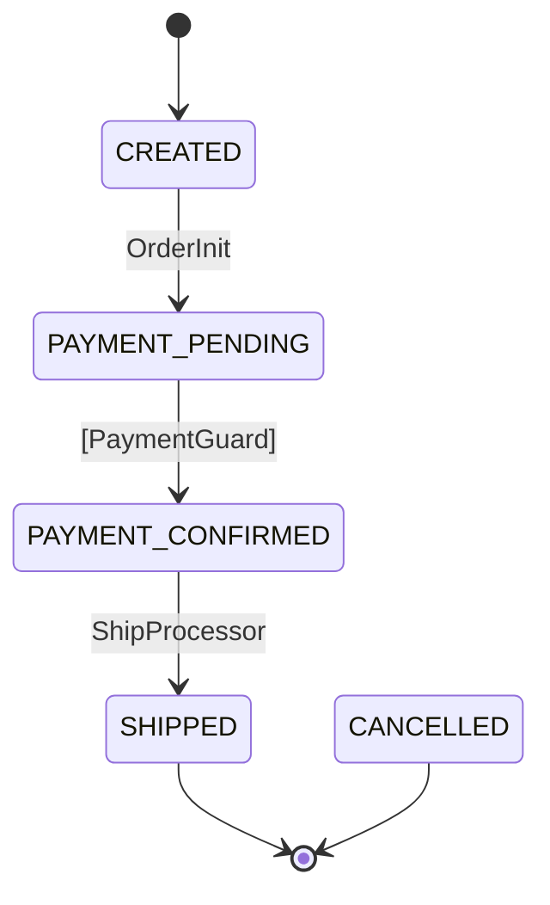

[日本語版はこちら / Japanese](README-ja.md)

# tramli

Constrained flow engine — **Java, TypeScript, Rust.**

State machines where **invalid transitions cannot exist** — enforced at build time by the compiler and [8-item validation](#8-item-build-validation).

> **tramli** = tramline (路面電車の軌道). Your code runs on rails — it can only go where tracks are laid.

---

## Table of Contents

- [Why tramli exists](#why-tramli-exists)
- [Quick Start](#quick-start) — define states, processors, flow, run
- [Core Concepts](#core-concepts) — the 8 building blocks
  - [FlowState](#flowstate) — what states your system can be in
  - [StateProcessor](#stateprocessor) — business logic for 1 transition
  - [TransitionGuard](#transitionguard) — validates external events (pure function)
  - [BranchProcessor](#branchprocessor) — conditional routing
  - [FlowContext](#flowcontext) — type-safe data accumulator
  - [FlowDefinition](#flowdefinition) — the entire flow as a declarative map
  - [FlowEngine](#flowengine) — zero-logic orchestrator
  - [FlowStore](#flowstore) — pluggable persistence
- [Three Transition Types](#three-transition-types) — Auto, External, Branch
- [Auto-Chain](#auto-chain) — how multiple transitions fire in one request
- [8-Item Build Validation](#8-item-build-validation) — what `build()` checks
- [requires / produces Contract](#requires--produces-contract) — how data flows between processors
- [Mermaid Diagram Generation](#mermaid-diagram-generation) — code = diagram, always
- [Error Handling](#error-handling) — guard rejection, max retries, error transitions
- [Why LLMs Love This](#why-llms-love-this)
- [Performance](#performance)
- [Use Cases](#use-cases)
- [Glossary](#glossary)

---

## Why tramli exists

```
1800-line procedural handler → "where does the callback logic start?"
  → read everything → context window explodes → mistakes happen

tramli FlowDefinition (50 lines) → "read this, then the 1 processor you need"
  → done in 100 lines → compiler catches the rest
```

The core insight: **"what you don't need to read" matters more than "what you do."**

In a procedural handler, every line is implicit context. Changing line 400 might break line 1200. You can't know without reading everything.

In tramli, a [StateProcessor](#stateprocessor) is a closed unit. Its [requires()](#requires--produces-contract) declares inputs; its [produces()](#requires--produces-contract) declares outputs. Change one processor, and nothing else is affected.

This helps **humans** (limited working memory) and **LLMs** (limited context window) equally.

---

## Quick Start

### 1. Define [states](#flowstate)

```java
enum OrderState implements FlowState {
    CREATED(false, true),           // initial state
    PAYMENT_PENDING(false, false),
    PAYMENT_CONFIRMED(false, false),
    SHIPPED(true, false),           // terminal — flow ends here
    CANCELLED(true, false);         // terminal — error end

    private final boolean terminal, initial;
    OrderState(boolean t, boolean i) { terminal = t; initial = i; }
    @Override public boolean isTerminal() { return terminal; }
    @Override public boolean isInitial() { return initial; }
}
```

Why `enum`? Because the compiler enforces exhaustiveness. A typo like `"COMLETE"` is impossible — it's a compile error.

### 2. Write [processors](#stateprocessor) (1 transition = 1 processor)

```java
StateProcessor orderInit = new StateProcessor() {
    @Override public String name() { return "OrderInit"; }
    @Override public Set<Class<?>> requires() { return Set.of(OrderRequest.class); }
    @Override public Set<Class<?>> produces() { return Set.of(PaymentIntent.class); }
    @Override public void process(FlowContext ctx) {
        OrderRequest req = ctx.get(OrderRequest.class);  // type-safe, no cast
        ctx.put(PaymentIntent.class, new PaymentIntent("txn-" + req.itemId()));
    }
};
```

`requires()` and `produces()` aren't just documentation — they're **verified at [build() time](#8-item-build-validation)** across all paths in the flow.

### 3. Define the [flow](#flowdefinition)

```java
var orderFlow = Tramli.define("order", OrderState.class)
    .ttl(Duration.ofHours(24))
    .initiallyAvailable(OrderRequest.class)      // provided at startFlow()
    .from(CREATED).auto(PAYMENT_PENDING, orderInit)
    .from(PAYMENT_PENDING).external(CONFIRMED, paymentGuard)
    .from(CONFIRMED).auto(SHIPPED, shipProcessor)
    .onAnyError(CANCELLED)
    .build();  // ← 8-item validation here
```

Read this top-to-bottom — it **is** the flow. No other file needed to understand the structure.

### 4. Run it

```java
var engine = Tramli.engine(new InMemoryFlowStore());

// Start: CREATED → auto-chain → PAYMENT_PENDING (stops, needs external)
var flow = engine.startFlow(orderFlow, null,
    Map.of(OrderRequest.class, new OrderRequest("item-1", 3)));

// External event: payment webhook arrives
flow = engine.resumeAndExecute(flow.id(), orderFlow);
// → guard validates → CONFIRMED → auto-chain → SHIPPED (terminal, done)
```

### 5. Generate [Mermaid diagram](#mermaid-diagram-generation)

```java
String mermaid = MermaidGenerator.generate(orderFlow);
```



This diagram is generated **from code** — it can never be out of date.

---

## Core Concepts

tramli has 8 building blocks. Each is small, focused, and testable in isolation.

### FlowState

An `enum` that defines all possible states. Each state knows if it's [terminal](#terminal-state) (flow ends here) or [initial](#initial-state) (flow starts here).

```java
public interface FlowState {
    String name();
    boolean isTerminal();
    boolean isInitial();
}
```

**Why enum?** The compiler guarantees exhaustiveness. `switch` over states → the compiler warns about missing cases. An LLM can't hallucinate a state that doesn't exist.

### StateProcessor

The **business logic** for one transition. The most important rule: **1 transition = 1 processor.**

```java
public interface StateProcessor {
    String name();
    Set<Class<?>> requires();   // what I need from FlowContext
    Set<Class<?>> produces();   // what I add to FlowContext
    void process(FlowContext ctx) throws FlowException;
}
```

This means:
- Changing processor A cannot break processor B
- Testing is trivial: mock [FlowContext](#flowcontext), call `process()`, check output
- An LLM only needs to read **this one file** to modify this step

### TransitionGuard

Validates an [External transition](#external-transition). A **pure function** — it must not modify [FlowContext](#flowcontext).

```java
public interface TransitionGuard {
    String name();
    Set<Class<?>> requires();
    Set<Class<?>> produces();
    int maxRetries();
    GuardOutput validate(FlowContext ctx);

    sealed interface GuardOutput {
        record Accepted(Map<Class<?>, Object> data) implements GuardOutput {}
        record Rejected(String reason) implements GuardOutput {}
        record Expired() implements GuardOutput {}
    }
}
```

The `sealed interface` means the [FlowEngine](#flowengine) handles exactly 3 cases — the compiler enforces this via `switch`. No forgotten edge cases.

**Accepted** → data merged into context, transition proceeds.
**Rejected** → failure count incremented. After [maxRetries](#error-handling) → [error transition](#error-handling).
**Expired** → flow completed with `EXPIRED` exit state.

### BranchProcessor

Chooses which path to take at a decision point. Returns a **label** (string) that maps to a target state in the [FlowDefinition](#flowdefinition).

```java
public interface BranchProcessor {
    String name();
    Set<Class<?>> requires();
    String decide(FlowContext ctx);  // returns branch label
}
```

Example: after user resolution, decide if MFA is required:

```java
// FlowDefinition:
.from(USER_RESOLVED).branch(mfaCheck)
    .to(COMPLETE, "no_mfa", sessionProcessor)
    .to(MFA_PENDING, "mfa_required", sessionProcessor)
    .endBranch()

// BranchProcessor:
@Override public String decide(FlowContext ctx) {
    return ctx.get(ResolvedUser.class).mfaRequired() ? "mfa_required" : "no_mfa";
}
```

### FlowContext

Type-safe data bucket. Keyed by `Class<?>` — each type appears at most once.

```java
ctx.put(PaymentResult.class, new PaymentResult("OK"));  // write
PaymentResult r = ctx.get(PaymentResult.class);          // read (type-safe)
Optional<PaymentResult> o = ctx.find(PaymentResult.class); // optional read
```

**Why Class-keyed?** Three reasons:
1. **No typos** — `ctx.get(PaymentResult.class)` can't be misspelled (unlike `map.get("payment_result")`)
2. **No casts** — return type is inferred
3. **Verifiable** — [requires/produces](#requires--produces-contract) declarations use the same classes, enabling [build-time validation](#8-item-build-validation)

**No pass-through problem:** every processor's output stays in the context. Processor C can read what processor A produced, without B having to relay it.

### FlowDefinition

The **single source of truth** for a flow's structure. A declarative [transition table](#transition-table) built with a DSL and validated at `build()`.

```java
var flow = Tramli.define("order", OrderState.class)
    .ttl(Duration.ofHours(24))
    .maxGuardRetries(3)
    .initiallyAvailable(OrderRequest.class)
    .from(CREATED).auto(PAYMENT_PENDING, orderInit)
    .from(PAYMENT_PENDING).external(CONFIRMED, paymentGuard)
    .from(CONFIRMED).branch(stockCheck)
        .to(SHIPPED, "in_stock", shipProcessor)
        .to(CANCELLED, "out_of_stock", cancelProcessor)
        .endBranch()
    .onAnyError(CANCELLED)
    .build();
```

Reading this is like reading a map — you see the entire journey in 15 lines. This is why LLMs and humans can work with tramli efficiently: **the map IS the code.**

### FlowEngine

~120 lines. **Zero business logic.** Does exactly three things:

1. `startFlow()` — seeds context, runs [auto-chain](#auto-chain)
2. `resumeAndExecute()` — merges external data, validates [guard](#transitionguard), runs [auto-chain](#auto-chain)
3. `executeAutoChain()` — fires [Auto](#auto-transition)/[Branch](#branch-transition) transitions until [External](#external-transition) or [terminal](#terminal-state)

The engine never changes when you add flows. It's the rails — your [processors](#stateprocessor) are the cargo.

### FlowStore

Pluggable persistence interface. Implement 4 methods:

```java
public interface FlowStore {
    void create(FlowInstance<?> flow);
    <S extends Enum<S> & FlowState> Optional<FlowInstance<S>> loadForUpdate(String flowId, FlowDefinition<S> def);
    void save(FlowInstance<?> flow);
    void recordTransition(String flowId, FlowState from, FlowState to, String trigger, FlowContext ctx);
}
```

| Implementation | Use case |
|-------|----------|
| `InMemoryFlowStore` | Tests, single-process apps. Ships with tramli. |
| JDBC (bring your own) | PostgreSQL/MySQL with JSONB context, `SELECT FOR UPDATE` locking |
| Redis (bring your own) | Distributed flows with TTL-based expiry |

---

## Three Transition Types

Every arrow in the [flow diagram](#mermaid-diagram-generation) is one of three types:

| Type | Trigger | When engine fires it | Example |
|------|---------|---------------------|---------|
| [**Auto**](#auto-transition) | Previous transition completes | Immediately, no waiting | `CONFIRMED → SHIPPED` |
| [**External**](#external-transition) | Outside event (HTTP, message) | Only on `resumeAndExecute()` | `PENDING → CONFIRMED` |
| [**Branch**](#branch-transition) | [BranchProcessor](#branchprocessor) returns label | Immediately, like Auto | `RESOLVED → COMPLETE or MFA_PENDING` |

---

## Auto-Chain

When an [External](#external-transition) transition's [guard](#transitionguard) passes, the engine doesn't stop — it keeps firing [Auto](#auto-transition) and [Branch](#branch-transition) transitions until it hits another External or a [terminal state](#terminal-state).

```
HTTP request arrives (callback)
  → External: REDIRECTED → CALLBACK_RECEIVED     ← guard validates
  → Auto:     CALLBACK_RECEIVED → TOKEN_EXCHANGED ← processor runs
  → Auto:     TOKEN_EXCHANGED → USER_RESOLVED     ← processor runs
  → Branch:   USER_RESOLVED → COMPLETE            ← branch decides
  (terminal — flow done)
```

**One HTTP request, four transitions.** The engine handles the chaining — each [processor](#stateprocessor) only knows about its own step.

Safety: auto-chain has a max depth of 10 to prevent infinite loops. [DAG validation](#8-item-build-validation) at build time ensures Auto/Branch transitions cannot form cycles.

---

## 8-Item Build Validation

`build()` runs 8 structural checks. If any fail, you get a clear error message — **before any flow runs.**

| # | Check | What it catches |
|---|-------|----------------|
| 1 | All non-terminal states [reachable](#reachable) from [initial](#initial-state) | Dead states that can never be entered |
| 2 | Path from initial to [terminal](#terminal-state) exists | Flows that can never complete |
| 3 | [Auto](#auto-transition)/[Branch](#branch-transition) transitions form a [DAG](#dag) | Infinite auto-chain loops |
| 4 | At most 1 [External](#external-transition) per state | Ambiguous "which event am I waiting for?" |
| 5 | All [branch](#branch-transition) targets defined | `decide()` returning a label with no target state |
| 6 | [requires/produces](#requires--produces-contract) chain integrity | "Data not available" errors at runtime |
| 7 | No transitions from [terminal](#terminal-state) states | States that should be final but aren't |
| 8 | [Initial state](#initial-state) exists | Forgot to mark a state as initial |

**This is why LLMs can safely generate tramli code** — even if the generated transition is wrong, `build()` rejects it immediately. The feedback loop is: generate → compile → build() → fix. No runtime surprises.

---

## requires / produces Contract

Every [StateProcessor](#stateprocessor) and [TransitionGuard](#transitionguard) declares what data it needs and what it provides:

```java
@Override public Set<Class<?>> requires() { return Set.of(OrderRequest.class); }
@Override public Set<Class<?>> produces() { return Set.of(PaymentIntent.class); }
```

At [build() time](#8-item-build-validation), tramli walks every possible path through the flow and verifies that each processor's `requires()` is satisfied by previous processors' `produces()` (or by [initiallyAvailable](#initially-available) data).

```
Path: CREATED → PAYMENT_PENDING → CONFIRMED → SHIPPED

Available at CREATED:         {OrderRequest}         ← initiallyAvailable
After OrderInit:              {OrderRequest, PaymentIntent}  ← produces
Guard requires PaymentIntent: ✓ available
After PaymentGuard:           {... + PaymentResult}
ShipProcessor requires PaymentResult: ✓ available
```

If you add a processor that requires `CustomerProfile` but nothing produces it, `build()` fails:

```
Flow 'order' has 1 validation error(s):
  - Processor 'ShipProcessor' at CONFIRMED → SHIPPED requires CustomerProfile
    but it may not be available
```

---

## Mermaid Diagram Generation

```java
String mermaid = MermaidGenerator.generate(definition);
MermaidGenerator.writeToFile(definition, Path.of("docs/diagrams"));
```

The diagram is generated **from the [FlowDefinition](#flowdefinition)** — the same object that the [engine](#flowengine) uses. It cannot be out of date.

CI integration: generate → compare with committed `.mmd` files → fail if different. Forces developers to update diagrams when changing flows.

---

## Error Handling

### Guard Rejection

When a [guard](#transitionguard) returns `Rejected`, the [engine](#flowengine) increments a failure counter. After `maxRetries` rejections, the flow transitions to the error state:

```java
.maxGuardRetries(3)            // definition-level default
.onAnyError(CANCELLED)         // all non-terminal states → CANCELLED on error
.onError(CHECKOUT, RETRY)      // override for specific states
```

### Error Transitions

`onAnyError(S)` maps every non-[terminal](#terminal-state) state to an error target. `onError(from, to)` overrides specific states. Error targets are included in [reachability checks](#8-item-build-validation).

### TTL Expiry

Every flow has a TTL (set via `.ttl()`). If `resumeAndExecute()` is called after expiry, the flow completes with exit state `"EXPIRED"`. No transition fires — the flow is simply done.

---

## Why LLMs Love This

| Problem with procedural code | How tramli solves it |
|------------------------------|---------------------|
| "Read 1800 lines to find the callback handler" | Read the [FlowDefinition](#flowdefinition) (50 lines) |
| "What data is available at this point?" | Check [requires()](#requires--produces-contract) |
| "Will my change break something else?" | [1 processor = 1 closed unit](#stateprocessor) |
| "I generated a wrong state name" | `enum` → compile error |
| "I forgot to handle an edge case" | `sealed interface` [GuardOutput](#transitionguard) → compiler warns |
| "The flow diagram is outdated" | [Generated from code](#mermaid-diagram-generation) |
| "I added a transition that creates an infinite loop" | [DAG check](#8-item-build-validation) at build time |

**The key principle: LLMs hallucinate, but compilers and `build()` don't.**

---

## Performance

tramli's overhead is negligible for any I/O-bound application:

```
Per transition:  ~300-500ns (enum comparison + HashMap lookup)
5-transition flow: ~2μs total

For comparison:
  DB INSERT:         1-5ms
  HTTP round-trip:   50-500ms
  IdP OAuth exchange: 200-500ms

SM overhead / total = 0.0004%
```

| Application type | Applicable? |
|-----------------|-------------|
| Web APIs, auth flows (10ms+) | Yes |
| Payment, order processing | Yes |
| Batch job orchestration | Yes |
| Real-time messaging (1-5ms) | Yes, with [InMemoryFlowStore](#flowstore) |
| HFT, game loops (microseconds) | No |

---

## Use Cases

tramli works for any system with **states, transitions, and external events**:

- **Authentication** — OIDC, Passkey, MFA, invitation flows
- **Payments** — order → payment → fulfillment → delivery
- **Approvals** — request → review → approve/reject → execute
- **Onboarding** — signup → email verify → profile → complete
- **CI/CD** — build → test → deploy → verify
- **Support tickets** — open → assign → in progress → resolved → closed

---

## Glossary

Terms are linked throughout this document. Click any to jump here.

| Term | Definition |
|------|-----------|
| <a id="auto-transition"></a>**Auto transition** | A [transition](#transition-table) that fires immediately when the previous step completes. No external event needed. Engine executes it as part of [auto-chain](#auto-chain). |
| <a id="auto-chain"></a>**Auto-chain** | The engine's behavior of executing consecutive [Auto](#auto-transition) and [Branch](#branch-transition) transitions until an [External](#external-transition) transition or [terminal state](#terminal-state) is reached. |
| <a id="branch-transition"></a>**Branch transition** | A [transition](#transition-table) where a [BranchProcessor](#branchprocessor) decides the target state by returning a label. Fires immediately like [Auto](#auto-transition). |
| <a id="dag"></a>**DAG** | Directed Acyclic Graph. [Auto](#auto-transition)/[Branch](#branch-transition) transitions must form a DAG — no cycles allowed. Verified by [build()](#8-item-build-validation). |
| <a id="external-transition"></a>**External transition** | A [transition](#transition-table) triggered by an outside event (HTTP request, webhook, message). Requires a [TransitionGuard](#transitionguard). Engine stops [auto-chain](#auto-chain) and waits. |
| <a id="flow-definition"></a>**FlowDefinition** | The immutable, validated description of all states, transitions, processors, and guards for one flow. Built via DSL, verified at [build()](#8-item-build-validation). The "map" of the flow. |
| <a id="flow-instance"></a>**FlowInstance** | A single execution of a [FlowDefinition](#flowdefinition). Has an ID, current state, [context](#flowcontext), TTL, and completion status. |
| <a id="guard-output"></a>**GuardOutput** | The `sealed interface` returned by a [TransitionGuard](#transitionguard). Exactly 3 variants: `Accepted` (proceed), `Rejected` (retry or error), `Expired` (TTL exceeded). |
| <a id="initial-state"></a>**Initial state** | The state where a flow begins. Exactly one state per enum must return `isInitial() = true`. |
| <a id="initially-available"></a>**initiallyAvailable** | Data types declared as available at flow start. Provided via `startFlow(initialData)`. Used in [requires/produces](#requires--produces-contract) validation. |
| <a id="reachable"></a>**Reachable** | A state that can be entered from the [initial state](#initial-state) via some sequence of transitions. Unreachable non-terminal states cause [build()](#8-item-build-validation) failure. |
| <a id="terminal-state"></a>**Terminal state** | A state where the flow ends. No outgoing transitions allowed. Examples: `COMPLETE`, `CANCELLED`, `ERROR`. |
| <a id="transition-table"></a>**Transition table** | The set of all valid (from, to, type) triples in a [FlowDefinition](#flowdefinition). Everything not in this table is structurally impossible. |

---

## Requirements

- Java 21+
- Zero runtime dependencies (Jackson optional for JSONB serialization)

## License

MIT
