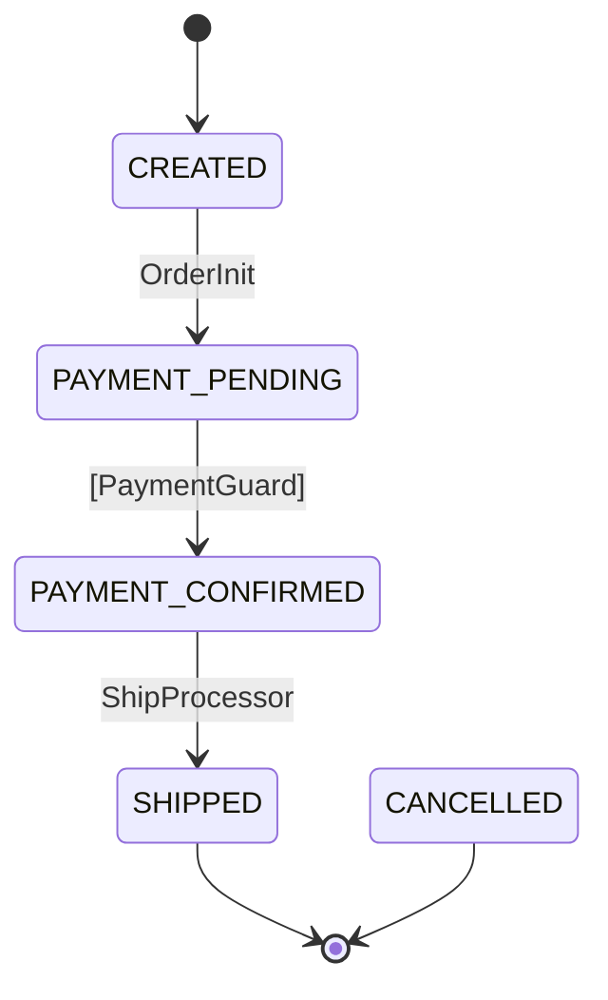

# tramli

Constrained flow engine for Java 21+.

State machines where **invalid transitions cannot exist** — enforced at build time by the compiler and 8-item validation.

## Why

```
1800-line procedural handler → "where does the callback logic start?"
  → read everything → context window explodes → mistakes happen

tramli FlowDefinition (50 lines) → "read this, then the 1 processor you need"
  → done in 100 lines → compiler catches the rest
```

Designed for **humans and LLMs** working on the same codebase. The less you need to read, the fewer mistakes you make.

## Quick Start

### 1. Define states

```java
enum OrderState implements FlowState {
    CREATED(false, true),
    PAYMENT_PENDING(false, false),
    PAYMENT_CONFIRMED(false, false),
    SHIPPED(true, false),
    CANCELLED(true, false);

    private final boolean terminal, initial;
    OrderState(boolean t, boolean i) { terminal = t; initial = i; }
    @Override public boolean isTerminal() { return terminal; }
    @Override public boolean isInitial() { return initial; }
}
```

### 2. Write processors (1 transition = 1 processor)

```java
StateProcessor orderInit = new StateProcessor() {
    @Override public String name() { return "OrderInit"; }
    @Override public Set<Class<?>> requires() { return Set.of(OrderRequest.class); }
    @Override public Set<Class<?>> produces() { return Set.of(PaymentIntent.class); }
    @Override public void process(FlowContext ctx) {
        OrderRequest req = ctx.get(OrderRequest.class);
        ctx.put(PaymentIntent.class, new PaymentIntent("txn-" + req.itemId()));
    }
};
```

### 3. Define the flow

```java
var orderFlow = Tramli.define("order", OrderState.class)
    .ttl(Duration.ofHours(24))
    .initiallyAvailable(OrderRequest.class)
    .from(CREATED).auto(PAYMENT_PENDING, orderInit)
    .from(PAYMENT_PENDING).external(CONFIRMED, paymentGuard)
    .from(CONFIRMED).auto(SHIPPED, shipProcessor)
    .onAnyError(CANCELLED)
    .build();  // ← 8-item validation here
```

`build()` validates:
1. All states reachable from initial
2. Path to terminal exists
3. Auto/Branch transitions form a DAG (no cycles)
4. At most 1 external transition per state
5. All branch targets defined
6. requires/produces chain integrity
7. No transitions from terminal states
8. Initial state exists

### 4. Run it

```java
var engine = Tramli.engine(new InMemoryFlowStore());

// Start flow
var flow = engine.startFlow(orderFlow, null,
    Map.of(OrderRequest.class, new OrderRequest("item-1", 3)));
// → auto-chains to PAYMENT_PENDING, stops (waiting for external)

// External event arrives (e.g., payment webhook)
flow = engine.resumeAndExecute(flow.id(), orderFlow);
// → guard validates → auto-chains to SHIPPED (terminal)
```

### 5. Generate Mermaid diagram

```java
String mermaid = MermaidGenerator.generate(orderFlow);
```

Output:


## Core Concepts

| Concept | What it does |
|---------|-------------|
| `FlowState` | Enum implementing `isTerminal()` / `isInitial()` |
| `StateProcessor` | Business logic for 1 transition. Declares `requires()` / `produces()` |
| `TransitionGuard` | Validates external events. Pure function, sealed output (Accepted/Rejected/Expired) |
| `BranchProcessor` | Returns a label that selects the next state |
| `FlowContext` | Type-safe accumulator (Class-keyed map). No pass-through problem |
| `FlowDefinition` | Declarative transition table + build-time validation |
| `FlowEngine` | ~120 lines. Zero business logic. Drives auto-chains, guards, branches |
| `FlowStore` | Pluggable persistence (InMemory, JDBC, Redis, ...) |

## Three transition types

| Type | Trigger | Example |
|------|---------|---------|
| **Auto** | Previous transition completes | `CONFIRMED → SHIPPED` |
| **External** | Outside event (HTTP, webhook) | `PENDING → CONFIRMED` |
| **Branch** | Business decision | `RESOLVED → COMPLETE or MFA_PENDING` |

Engine auto-chains Auto/Branch transitions until it hits External or terminal. One HTTP request can trigger multiple transitions.

## FlowStore implementations

| Store | Use case |
|-------|----------|
| `InMemoryFlowStore` | Tests, single-process apps |
| JDBC (bring your own) | PostgreSQL/MySQL with JSONB context |
| Redis (bring your own) | Distributed with TTL |

## Why LLMs love this

- **Read 50 lines** (FlowDefinition) to understand the entire flow
- **Read 1 file** (the Processor) to understand 1 step
- **Compiler catches mistakes** — hallucinations hit build() errors, not production
- **No pass-through** — FlowContext accumulates, no need to thread data through

## Requirements

- Java 21+
- Zero runtime dependencies (Jackson optional for JSONB serialization)

## License

MIT
