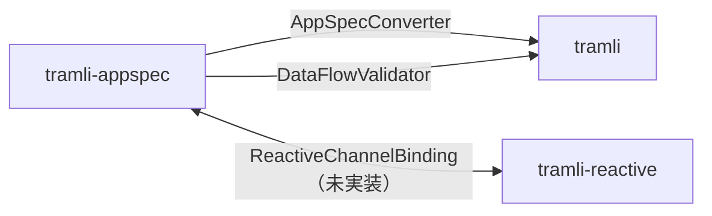

# DGE Session: tramli ファミリーマニフェスト骨子 — 何をどう書くか

- **Date**: 2026-04-24
- **Flow**: 💡 brainstorm
- **Structure**: 🗣 座談会（roundtable）
- **Characters**: ☕ ヤン, 👤 今泉, 🎩 千石, 🎨 深澤, 🔬 ハレル教授
- **Facilitator**: Opa
- **Previous sessions**:
  - [DataFlow Mode](./2026-04-24-tramli-dataflow-mode.md) → DD-042
  - [Reactive & App Structure](./2026-04-24-tramli-reactive-and-app-structure.md) → DD-042, DD-043

---

## テーマ

**DD-043 で決まった「tramli ファミリーマニフェスト」の骨子を詰める。**

- どんな読者に、どんな結論を伝える文書か
- 章立てと必須セクション
- 責務境界の記法（争いにならない書き方）
- 非ゴールの扱い
- 合成接続ポイントの具体例

## 前提

- メンバー: tramli（実装済）, tramli-appspec（実装済）, tramli-reactive（未実装）
- 吸収対象: tramli-sdd（L1 → tramli, L2/L3 → tramli-appspec）
- **本 session はマニフェストを書くのではなく、骨子を決めるだけ**

---

## Scene 1: 読者は誰か — 「誰のためのマニフェストか」

**先輩（ナレーション）**: マニフェストを書く前に「誰が読むか」を決める。千石がここを掘る。

---

**🎩 千石**: *ペンを置く。* マニフェストの読者を仮定せずに書き始めるのは、**お客様への侮辱**です。想定読者を3パターンに絞ります。

```
R1. tramli ファミリーを初めて使うエンジニア
    → 「これは何の集合で、どこから触るか」を知りたい
R2. 既に tramli / tramli-appspec を使っている人
    → 「なぜ tramli-reactive が別にあるのか、何を自分の実装に影響するか」
R3. コントリビューター / 派生ツール作者
    → 「新しい家族を提案するときの基準、合成境界の契約」
```

**☕ ヤン**: *紅茶を啜る。* 3パターン全部相手にすると、マニフェストは肥大化します。**R3 だけでいい**んじゃないですか？ R1/R2 は各プロジェクトの README が担当すべきです。

**🎨 深澤**: *静かに。* 僕は逆の意見です。**R1 が一番大事**です。初めての人が「ファミリーってそういう集合なのね」と掴めないと、tramli 圏に入ってこない。マニフェストは入口の看板です。

**👤 今泉**: えっと、**そもそもマニフェストって誰が読むんですか？** これまでの tramli の歴史を見ると、SPEC.md と各 README があって、新規の人は README、深く知りたい人は SPEC でした。マニフェストの**独自の役割**がないと、また重複文書が増えるだけです。

**🔬 ハレル教授**: 今泉君の問いが本質です。マニフェストの役割を **「ファミリーという集合の存在理由と境界を宣言する文書」** に限定しましょう。個別メンバーの使い方は README。個別メンバーの理論的背景は SPEC。**マニフェストは集合そのものについてのみ語る**。

→ アイデア: **マニフェストの射程を「集合自体のみ」に限定する** — メンバー個別の使い方は README、理論的背景は SPEC。マニフェストは境界・合成ルール・非ゴールだけを書く。読者は R3（コントリビューター）を第一とし、R1 は導入段落で吸収する。

---

## Scene 2: 章立て — 「何章構成で、何を必ず書くか」

**先輩（ナレーション）**: 射程が決まったので、章立てを詰める。

---

**🎩 千石**: *必要セクションを列挙します。*

```
1. このファミリーとは何か（1 段落）
2. メンバー一覧と状態（実装済 / 未実装 / 吸収済の表）
3. 責務境界 — 「tramli は X を担い、tramli-appspec は Y を担う」
4. 合成接続ポイント — メンバー間の具体的なインターフェース
5. 非ゴール — ファミリーが「やらないこと」
6. 新メンバー提案の基準 — コントリビューターへ
7. 命名規則 — tramli-{role} の命名ルール
8. バージョン管理ポリシー — 各メンバー独立 or 同期
```

**☕ ヤン**: 8章は多い。**1,2,3,5 の4章でコアが完成します**。4,6,7,8 は付録でいい。**マニフェストは 2 ページ以内で読み切れる量にすべき**です。

**🎨 深澤**: ヤンさんに同意です。**短い文書ほど強い**。長いと読まれない。4章（合成接続）は重要ですが、**図1枚で代用**できます。Mermaid の可視化（DD-042 の Option C）をここで使えます。

**🔬 ハレル教授**: 理論的立場を述べれば、**5章（非ゴール）が最も重要**です。何を「やるか」は実装物を見ればわかる。何を「やらないか」はマニフェストにしか書けない。**ここを外すと肥大化を止められない**。

**👤 今泉**: えっと、**読んだ人が最後に何を感じるべき** ですか？ 「だから tramli を使うのか」と納得する？ それとも「これを使えば全部書ける」と期待する？

**🎩 千石**: 今泉さん、鋭い。**「tramli ファミリーは全部を書くためのものではない」と読後に正しく理解してもらう**のが目標です。期待値の調整。

→ アイデア: **マニフェストは最小 4 章構成**（1. これは何か / 2. メンバー / 3. 責務境界 / 5. 非ゴール）。4,6,7,8 は付録または README へ委譲。**2 ページ以内**を目標。

→ アイデア: **4章（合成接続）は Mermaid 図 1 枚で表現** — tramli ↔ tramli-appspec ↔ tramli-reactive の函手的接続を可視化。文章で書くと肥大化するため。

→ Gap 発見: **「tramli ファミリーは全部を書くためのものではない」という期待値を、どの章で、どう明示するか** が未決。書き間違えると「全部書ける」と誤解される。

---

## Scene 3: 責務境界の記法 — 「争いにならない書き方」

**先輩（ナレーション）**: 3章の「責務境界」はマニフェストの心臓。書き方を詰める。

---

**🎩 千石**: 責務境界の書き方には3つの流派があります。

```
A. 自然言語型: 「tramli は〜を担う」
B. 契約型:     「tramli が提供するもの: DataFlowGraph, FlowDefinition」
               「tramli が提供しないもの: ApplicationSpec, 人間レビュー」
C. 型境界型:   「tramli-appspec.convert(spec) → tramli.FlowDefinition<S>」
```

私は **B + C の併用** を推します。A は曖昧すぎる。

**🔬 ハレル教授**: 賛成です。さらに **「提供しない」の列** が重要です。tramli が提供しないもの、を明示することが、tramli-appspec の存在理由になります。各メンバーを表にして:

```
| 領域          | tramli | tramli-appspec | tramli-reactive |
|--------------|--------|----------------|-----------------|
| 状態検証      | ✓      | 利用側          | 利用側           |
| データフロー  | ✓      | 利用側          | 利用側           |
| 人間レビュー  | —      | ✓              | —               |
| 段階生成      | —      | ✓              | —               |
| チャネル/通信 | —      | —              | ✓               |
| セッション型  | —      | —              | ✓               |
```

**この一覧表があれば、争いの余地が減ります**。

**☕ ヤン**: *頷く。* この表は強い。**責務境界は表で書く**、それだけでマニフェストの 60% は完成。

**👤 今泉**: えっと、**「利用側」って何ですか？** tramli-appspec が tramli の DataFlowGraph を使う、ということですよね。でもそれは **tramli 側から見ると公開 API の約束**なのでは？ 両方の視点を書かないと、約束が片方からしか見えない。

**🎩 千石**: *良い指摘。* 今泉さんが正しい。**「提供する」「提供しない」だけでなく、「他メンバーから利用される契約」も書く**べきです。

```
tramli の対外契約:
  - 提供: FlowDefinition<S>, FlowContext, DataFlowGraph, FlowEngine
  - 安定版: 上記は semver-major で破壊的変更不可
  - 他メンバーは上記のみに依存すること
  - 内部実装（engine.java / store.java 等）には依存禁止
```

→ アイデア: **責務境界は「提供する / 提供しない / 他者から利用される契約」の3列表で書く** — 公開 API の約束を明示することで、tramli-appspec が tramli に依存する際の安全性が担保される。

→ アイデア: **メンバー × 領域のマトリクス表をマニフェスト 3章の核にする** — ✓/—/利用側 の3値で埋める。言葉の曖昧さを排除。

---

## Scene 4: 非ゴール — 「何を明示的にやらないか」

**先輩（ナレーション）**: 5章の非ゴール。ハレル教授が「ここが最も重要」と言った。具体的に何を書くか。

---

**🔬 ハレル教授**: 非ゴールは **ファミリー全体のもの** と **各メンバーのもの** を分けます。

```
ファミリー全体の非ゴール:
  - 単一 DSL で UI/通信/永続化/認可まで全部書くこと
  - Turing 完全な declarative DSL を目指すこと
  - 既存の MDA / BPMN / UML の代替になること
  - Runtime performance のチューニング（SPEC 検証が主目的）

tramli の非ゴール:
  - ApplicationSpec を持つ
  - 人間レビュー機構を持つ
  - 通信層（channel/session）を持つ
  - 階層状態・直交領域（DD-021）

tramli-appspec の非ゴール:
  - 通信層を扱う
  - state machine の検証ロジックを自前実装する（tramli に委譲）

tramli-reactive の非ゴール:
  - state machine を再発明する
  - app spec を持つ
```

**🎨 深澤**: *静かに同意。* 美しい構造ですね。**「非ゴール」が書かれていると、ファミリーの形が手に取れる**。書いてないと、形が無限に膨らむ気がして掴めない。

**☕ ヤン**: *紅茶を飲む。* ヤン的に言えば、**非ゴールは「削ったもののリスト」**です。前回 DGE で「tramli-form」「tramli-view」「tramli-store」「tramli-guard」「tramli-topo」を削りました。**これらを非ゴールに残すべきです**。「検討したが、tramli-appspec の Spec 型で代替可能なため採用しない」と。

**👤 今泉**: *メモを取る。* えっと、**削った理由も書く** のが大事ですよね。「検討されなかった」と「検討して却下した」では意味が全然違う。後者だと「もう議論は済んでいる」と読める。

**🎩 千石**: その通りです。非ゴール各項目に **「代替 / 理由」の1行を付ける** べきです。

```
非ゴール: tramli-form を家族に含める
  代替: tramli-appspec の FieldSpec / EntitySpec で表現可能
  理由: 独立パッケージ化すると重複。2026-04-24 DGE で却下
```

→ アイデア: **非ゴールは「ファミリー全体 / 各メンバー」の2階層で列挙** — 各項目に「代替 / 理由 / 却下 DGE セッションリンク」を付ける。

→ アイデア: **「削ったもののリスト」を非ゴールの第3カテゴリとして設ける** — 検討した家族候補（form/view/store/guard/topo）と却下理由。未来の提案者が同じ議論を繰り返さないように。

→ Gap 発見: **非ゴールの表現が公的な DD と整合しない場合の扱い** が未定義 — DD-042 / DD-043 はマニフェストの根拠。マニフェスト本文と DD の整合をどう維持するか、同期メカニズムが要る。

---

## Scene 5: 合成接続ポイント — 「具体的にどう繋がるか」

**先輩（ナレーション）**: 最後に 4章（合成接続）の中身を詰める。Mermaid 図 1 枚で済ませる方針だったが、接続の実体は何か。

---

**🎩 千石**: 合成接続ポイントは現時点で2つだけです。

```
1. tramli-appspec → tramli
   - AppSpecConverter: ApplicationSpec → FlowDefinition<S>
   - DataFlowValidator: FlowDefinition を tramli の DataFlowGraph で検証

2. tramli-appspec ↔ tramli-reactive（未実装、API スケッチ）
   - ReactiveChannelBinding: TaskSpec の外部 I/O を Channel に bind
   - SessionTypeAnnotation: HumanTask の response を session type 付きで型付け
```

**🎨 深澤**: *考え込む。* 合成接続が 2 本しかないなら、**Mermaid 図は非常にシンプル**にできます。



3 本の矢印で済む。マニフェスト読者は「家族はこれだけか」と安心できます。

**☕ ヤン**: *紅茶を飲み干す。* ヤン的には、**接続ポイントは増やさない方向に圧力をかけるべき**です。新メンバーが加わるたびに接続が O(n²) で増えると肥大化する。**「新メンバーは既存メンバー 1 個とだけ接続してよい」**という制約をマニフェストに入れてはどうでしょう。

**🔬 ハレル教授**: *頷く。* それは圏論的には **「ファミリーはツリー構造を保つ」** という制約です。サイクルを許さない。理論的にも健全です。

**👤 今泉**: えっと、**じゃあ将来 tramli-view を作るとしたら、tramli-appspec の下に来る** ってことですか？ それとも tramli 直下？ **ツリーのルートは tramli なのか、tramli-appspec なのか** が決まってないと、新メンバーの所属が曖昧になります。

**🎩 千石**: 今泉さんがまた核心を突きました。**tramli がルート**です。tramli なしに tramli-appspec は存在できないが、逆はある（tramli 単体で使える）。ルート = tramli、枝 = app spec / reactive、という単純な木。

→ アイデア: **合成接続はツリー構造を保つという制約をマニフェストに入れる** — サイクル禁止、ルートは tramli。新メンバーは親メンバーを 1 つだけ指定する。複雑性を O(n²) から O(n) に。

→ アイデア: **Mermaid 図 1 枚にすべての接続点を集約** — 家族拡大に応じて図を更新。マニフェスト本文は変更最小限。

→ Gap 発見: **ツリー制約と tramli-appspec ↔ tramli-reactive の双方向接続が矛盾** — ReactiveChannelBinding は双方向。ツリーなら一方向でないといけない。appspec → reactive の向きに限定するか、制約を緩めるかの設計判断が残る。

---

## 抽出されたアイデア一覧

| # | アイデア | カテゴリ | 実現可能性 |
|---|---------|---------|-----------|
| 1 | マニフェストの射程を「集合自体」に限定（個別使い方は README、理論は SPEC） | improvement | 極高（方針のみ） |
| 2 | 最小 4 章構成（これは何か / メンバー / 責務境界 / 非ゴール）、2 ページ以内 | improvement | 極高 |
| 3 | 合成接続は Mermaid 図 1 枚で表現 | improvement | 高 |
| 4 | 責務境界は「提供する / 提供しない / 他者から利用される契約」の3列表 | improvement | 高 |
| 5 | メンバー × 領域マトリクス（✓/—/利用側 の3値） | new_feature | 高 |
| 6 | 非ゴールは「ファミリー全体 / 各メンバー / 検討して却下」の3階層 | improvement | 高 |
| 7 | 非ゴール各項目に「代替 / 理由 / DGE セッションリンク」を付記 | improvement | 高 |
| 8 | 合成接続はツリー構造を保つ制約（ルート = tramli、サイクル禁止） | new_feature | 高 |
| 9 | マニフェストと DD の整合を維持する同期メカニズム（DD 変更時に警告） | wild | 中 |

## 抽出された Gap 一覧

| # | Gap | Category |
|---|-----|----------|
| G7 | 「tramli ファミリーは全部書くためではない」期待値調整の書き方未決 | documentation |
| G8 | マニフェストと DD の整合を維持する仕組みが未定義 | process |
| G9 | ツリー制約と appspec ↔ reactive の双方向接続が矛盾（設計判断残る） | design |

---

## 決定事項（この session の合意）

- マニフェストの射程は **「ファミリー集合自体」** に限定。メンバー個別の話は書かない
- **最小 4 章 + 2 ページ以内** を目標
- 責務境界は **3 列表 + マトリクス**で書く（自然言語排除）
- 非ゴールに「**検討して却下した家族候補**」を専用カテゴリで残す
- **合成接続はツリー構造**を保つ制約をマニフェストに明記（ルート = tramli）
- 合成接続の具体は Mermaid 図 1 枚に集約

## マニフェスト骨子（テンプレート）

```
# tramli Family Manifesto

## 1. これは何か（1 段落）
tramli ファミリーは、アプリケーションを宣言的・構造的に定義するための
独立した単機能宣言系の集合である。単一 DSL ではなく、合成によって
アプリ全体の記述を可能にする。

## 2. メンバー一覧
[実装済 / 未実装 / 吸収済の表]

## 3. 責務境界
[提供する / 提供しない / 他者から利用される契約 の3列表]
[メンバー × 領域マトリクス]

## 4. 合成接続
[Mermaid 図 1 枚]
[ツリー制約の明記]

## 5. 非ゴール
### 5.1 ファミリー全体
### 5.2 各メンバー
### 5.3 検討して却下した家族候補

## 付録（optional）
- 新メンバー提案の基準
- 命名規則
- バージョン管理ポリシー
```

## 選択肢

1. **もう一回ブレスト** — Gap G7/G8/G9 のいずれかを深掘り
2. **設計レビューに持ち込む** — マニフェスト本文ドラフトを design-review flow で詰める
3. **設計判断を記録する** — 本 session の合意事項を DD-044 として記録（マニフェスト構造の DD）
4. **実装する** — マニフェスト本文を書き始める
5. **後で / 終わる**
