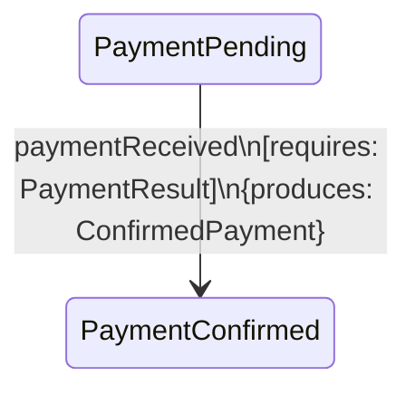

# DGE Session: Carta にdata-flow検証を統合する — 美しい方の設計を探る

**Date:** 2026-04-08
**Participants:** David Harel, ヤン・ウェンリー, Pat Helland, リヴァイ
**Facilitator:** Opa
**Topic:** Carta（Harel設計のStatechartライブラリ）にtramliのrequires/produces data-flow検証を統合したらどうなるか

---

## Act 1: 出発点の確認

**Opa:** 前回、CartaとtramliのGap分析をした。Cartaは制御構造が美しく、tramliはdata-flow検証が強い。逆を弱点だと見なしてきた。でも思ったんだ——**Cartaにdata-flowを足したら、両方の美しさを手に入れられないか？**

**Harel:** 興味深い問いだ。Statechart理論にdata-flow検証を組み込むことは、理論的には40年間誰もやっていない。しかし**不可能だと証明されたわけでもない**。やってみよう。

**ヤン:** 前提を確認させてください。Cartaの設計原則H1-H5に、tramliのT1-T2を加える。

```
Carta + data-flow の設計原則:
  H1: 状態は階層的である
  H2: イベントは一級市民である
  H3: 直交する関心事は直交させる
  H4: 状態には entry/exit がある
  H5: 図が仕様である
  T1: data-flowが全てを駆動する（requires/produces）
  T2: ビルド時に検証できることは全てビルド時に検証する
```

**リヴァイ:** T3-T5（sync、3言語、ゼロ依存）は？

**Opa:** 今回は設計空間の探索だから制約を外す。純粋に「最良の設計」を追求する。

---

## Act 2: 基本構造 — 遷移へのrequires/produces

**Harel:** まず最も自然な統合から始めよう。Cartaの遷移にrequires/producesを追加する。

```java
// Carta + data-flow: 遷移にrequires/producesを宣言
carta.transition()
    .from("PaymentPending")
    .on(paymentReceived)
    .guard(ctx -> ctx.get(PaymentResult.class).isValid())
    .requires(PaymentResult.class)
    .action(ctx -> ctx.put(new ConfirmedPayment(...)))
    .produces(ConfirmedPayment.class)
    .to("PaymentConfirmed");
```

**ヤン:** tramliとの違いを見ます。tramliではrequires/producesはguardやprocessorのtrait実装に埋め込まれている。Cartaでは遷移レベルで宣言。

```
tramli:  requires/produces は processor/guard の trait メソッド
Carta+:  requires/produces は遷移の属性
```

**Helland:** どちらが良い？

**Harel:** 遷移の属性にする方が**図に表現できる**。H5（図が仕様）に合っている。Mermaidやstatechart図に直接requires/producesを描ける。



**リヴァイ:** tramliでは processor.requires() をビルド時にintrospectしてる。Cartaでは宣言だから**processor実装と宣言の不一致**が起きうる。

**ヤン:** 重要な指摘です。tramliのアプローチでは、processorの実装が`ctx.get::<PaymentResult>()`を呼ぶなら、`requires()`に`PaymentResult`を返す**べき**だが、**保証はない**。Cartaの遷移レベル宣言でも同じ問題がある。

**Harel:** しかしCartaではguardとactionが**ラムダ式**だ。ラムダの中身を静的解析してrequires/producesを自動導出することは——

**ヤン:** Javaのラムダでは無理ですね。Rustのクロージャでも無理。型情報だけでは`ctx.get::<T>()`の呼び出しは追跡できない。

**Harel:** ならばtramliと同じ宣言型にするしかない。構造的な差はないか。

**Opa:** ただし、Cartaの遷移は`guard + action`が1つの遷移に同居する。tramliは`guard`（External遷移）と`processor`（Auto遷移）が別の遷移。Cartaの方が1遷移あたりの情報密度が高い。

---

## Act 3: entry/exit のrequires/produces

**Harel:** ここからがCartaの強み。entry/exit actionsにrequires/producesを付ける。

```java
carta.state("Suspended")
    .onEntry()
        .requires(SuspendOrder.class)
        .action(ctx -> ctx.put(new SuspensionRecord(Instant.now())))
        .produces(SuspensionRecord.class)
    .onExit()
        .requires(SuspensionRecord.class)
        .action(ctx -> ctx.put(new SuspensionLifted(Instant.now())))
        .produces(SuspensionLifted.class);
```

**ヤン:** data-flow検証の観点で整理します。

```
Suspended に入る全てのパス:
  ACTIVE → suspendGuard → Suspended.entry
    entry.requires = [SuspendOrder]
    → SuspendOrder は suspendGuard.produces に含まれているか？
    → または available_at(Suspended の入口) に含まれているか？

  TRIAL → suspendGuard → Suspended.entry
    → 同様のチェック

Suspended から出る全てのパス:
  Suspended.exit → unsuspendGuard → ACTIVE
    exit.requires = [SuspensionRecord]
    → SuspensionRecord は entry.produces にある → ✅ 常に available
    exit.produces = [SuspensionLifted]
    → unsuspendGuard.requires に SuspensionLifted があれば ✅
```

**Helland:** entry.producesは**そのstateにいる間は常にavailableと保証される**。これは強力だ。tramliにはない保証。

**Harel:** なぜ強力か。「SUSPENDEDにいるなら、SuspensionRecordが必ずcontextにある」とビルド時に保証できる。tramliではSuspensionRecordがcontextにあるかは、遷移パスに依存する。

**リヴァイ:** つまり、entry.producesはavailable_at(state)に**無条件で**加算される。パスの積集合ではなく、全パスで保証される。

**ヤン:** これはtramliにない概念ですね。tramliのavailable_at()は「全パスの積集合」で、保守的。Cartaのentryは「全パス共通で追加」で、厳密。

```
tramli:   available_at(S) = ∩ { available via path P | P → S }
Carta+:   available_at(S) = (∩ { available via path P | P → S }) ∪ entry(S).produces
```

**Harel:** entry.producesが∩の外にあるのは、entryが**全パスで走る**から。どのパスからSUSPENDEDに入っても、entry actionが走る。だからSuspensionRecordは全パスで利用可能。

---

## Act 4: 階層的状態のdata-flow

**Harel:** 階層が入ると面白くなる。

```java
State order = carta.root("Order")
    .onEntry()
        .requires(OrderRequest.class)
        .produces(OrderContext.class)

    .state("Processing")
        .onEntry()
            .requires(OrderContext.class)
            .produces(ProcessingStarted.class)

        .state("PaymentPending")
            // PaymentPendingでは OrderContext, ProcessingStarted が
            // 両方 available（親と祖父母の entry.produces）

        .state("PaymentConfirmed")
            ...
```

**ヤン:** 親状態のentry.producesが子状態に**継承**される。

```
available_at(PaymentPending) =
    root.entry.produces ∪ Processing.entry.produces ∪ ... ∪ (パスの積集合)
  = {OrderContext} ∪ {ProcessingStarted} ∪ ...
```

**Helland:** これは**スコープ**と同じ構造だ。プログラミング言語の変数スコープ。外側のスコープで定義された変数は内側で参照できる。

**Harel:** その通り。階層的状態 + entry.produces = **階層的データスコープ**。

```
Order (scope: OrderContext)
  └── Processing (scope: OrderContext + ProcessingStarted)
       ├── PaymentPending (scope: OrderContext + ProcessingStarted + ...)
       └── PaymentConfirmed (scope: OrderContext + ProcessingStarted + ...)
```

**リヴァイ:** これは綺麗だ。tramliのフラットenumではスコープが存在しない。全てがグローバル。

**Opa:** ……待て。これは確かに美しい。しかし**exit.producesのスコープ**はどうなる？

**Harel:** exit.producesはその状態を出た**後の**遷移で利用可能。子状態のスコープには影響しない。

```
Suspended.exit.produces = [SuspensionLifted]
→ SuspensionLifted は Suspended を出た後の遷移（unsuspendGuardなど）で available
→ Suspended の子状態（もしあれば）では available ではない
```

**ヤン:** entry = スコープに入る。exit = スコープから出る。自然ですね。

---

## Act 5: 直交状態のdata-flow — 最難関

**Harel:** ここからが本当の挑戦だ。orthogonal regionsでのdata-flow。

```java
carta.state("Active")
    .orthogonal()
        .region("Account")
            .state("Normal")
            .state("UnderReview")
        .region("Subscription")
            .state("Trial")
            .state("Paid")
            .state("Expired");
```

AccountリージョンとSubscriptionリージョンは並行して動く。data-flowは？

**Helland:** regionAのactionがproduceした型を、regionBのguardがrequireする場合。

```java
// Account region
.transition()
    .from("Normal").on(review).to("UnderReview")
    .produces(ReviewRecord.class)

// Subscription region
.transition()
    .from("Trial").on(paymentReceived).to("Paid")
    .requires(ReviewRecord.class)   // ← Account region が produce した型
```

**ヤン:** **これは検証できない**。regionAのNormal→UnderReview遷移が起きるかどうかは、regionBの遷移タイミングに依存する。paymentReceived が先に来たら、ReviewRecordはまだない。

**Harel:** その通り。ここがorthogonal regionsでdata-flow検証が困難になる地点だ。

**リヴァイ:** 制御フローが非決定的（どのregionの遷移が先に起きるかわからない）だから、data-flowも非決定的になる。

**Harel:** 3つの選択肢がある。

```
A) region間のdata依存を禁止（各regionは独立したdata scope）
B) region間のdata依存をwarningとして許可（実行時に足りなければerror）
C) region間のdata依存を同期的に解決（barrier的な仕組み）
```

**Helland:** 案Cは分散システムのbarrier同期と同じ問題を持つ。デッドロックの可能性がある。

**ヤン:** 案Aが安全ですが、制約が強すぎるかもしれない。

**Harel:** 案Aで始めて、本当に困ったら案Bに緩和する。

```
Carta + data-flow の直交状態ルール:
  ✅ 各regionは独立したdata scope
  ✅ 親状態のentry.producesは全regionで available
  ❌ region間の直接的なdata依存は禁止
  ✅ 親状態のexit時に全regionのproducesが合流
```

**Opa:** 最後の「exit時に合流」について。親状態を出るとき、全regionの最終的なproducesが統合される？

**Harel:** 正確には、親状態のexit actionのrequiresが、全regionのproducesの和集合から充足される必要がある。

```
Active.exit.requires = [AccountSummary, SubscriptionSummary]

Account region.produces の集合にAccountSummary が含まれること
Subscription region.produces の集合にSubscriptionSummary が含まれること
→ ビルド時に検証可能
```

**ヤン:** ただし、どの子状態でexitが走るかは実行時に決まるので、「全ての子状態の可能な終了パス」からの積集合を取る必要がある。

```
Account region:
  Normal → produces: {}
  UnderReview → produces: {ReviewRecord}
  
  Account region全体のproduces保証 = {} ∩ {ReviewRecord} = {}
  → AccountSummary は保証されない！
```

**リヴァイ:** 各リージョンの全状態のproducesの積集合が、親のexit.requiresを満たす必要がある。条件が厳しすぎて、ほぼ何も保証できないのでは。

**Harel:** ……その通りだ。子状態のどこで親のexitが走るか不明なので、**最悪ケース**で検証するとほぼ空集合になる。

**Helland:** これがorthogonal regionsにdata-flow検証が難しい根本理由だ。**直交性と検証可能性はトレードオフ**。

---

## Act 6: 発見 — tramliの「フラットさ」の真の意味

**Opa:** ……ここで見えてきたものがある。tramliがフラットenumを選んだのは、最初は「シンプルさのため」だと思ってた。でも今わかった。**フラットだからdata-flow検証が完全にできる**。

**Harel:** 説明してくれ。

**Opa:** フラットenumでは、状態遷移のパスが完全に列挙可能。available_at()は全パスの積集合として正確に計算できる。しかし——

```
階層状態: 子状態のどこにいるか → パスの分岐が増える → 積集合が小さくなる
直交状態: 複数regionのどこにいるか → パスの直積 → 組み合わせ爆発 → 積集合がほぼ空
```

**ヤン:** つまり、**構造の表現力を上げるほど、data-flow検証の精度が下がる**。

```
表現力:     flat enum < 階層状態 < 直交状態
検証精度:   flat enum > 階層状態 > 直交状態
```

**Harel:** ……これは重要な発見だ。私のStatechartは表現力を最大化する方向に40年間進化してきた。tramliは検証精度を最大化する方向に設計されている。**両者は根本的にトレードオフの関係にある**。

**Helland:** CAP定理のようなものだ。Consistency（検証精度）とAvailability（表現力）は両立しない。

**リヴァイ:** じゃあ、Carta + data-flow は**どこに着地する**？

---

## Act 7: 着地点 — 階層まで、直交はやらない

**ヤン:** トレードオフを踏まえて、Carta + data-flowの着地点を探りましょう。

```
                表現力    data-flow精度    実装複雑性
flat enum       ★☆☆       ★★★             ★☆☆
+ 階層状態      ★★☆       ★★☆             ★★☆
+ 直交状態      ★★★       ★☆☆             ★★★
```

**Harel:** 中間の「階層状態 + data-flow」が最良のバランスではないか。

**Helland:** 具体的に、階層状態でdata-flow精度が「★★☆」に下がるのはなぜだ？

**ヤン:** 親状態のentry.producesは全子状態で保証される（✅ 精度向上）。しかし、子状態間の遷移パスが分岐するため、available_at()の積集合はフラット版より小さくなりうる（△ 精度低下の可能性）。

**Opa:** ただし実際には、階層内の子状態は通常**直線的**に遷移する。OrderFlowの`Processing`の中は`PaymentPending → PaymentConfirmed → Shipped`。分岐はBranchで明示される。積集合の低下は軽微。

**Harel:** 階層の深さを制限すれば（max depth = 3など）、複雑性は管理可能だ。tramliのSubFlowも max depth = 3 にしている。

**リヴァイ:** 階層まで入れて、直交は入れない。これがCarta + data-flowの着地点か。

**Harel:** ……私がorthogonal regionsを推さないとは思わなかっただろう。しかし**data-flow検証との両立が不可能**なことが今回のセッションで証明された。検証を犠牲にするならorthogonal regionsは入れない。

---

## Act 8: Carta+DF vs tramli — 最終比較

**Opa:** Carta + data-flow（直交なし）と現在のtramliを比較する。

```
                        Carta+DF                    tramli
────────────────────────────────────────────────────────────
状態構造                階層的（ネスト）             フラット enum + SubFlow
イベント                明示的 Event 型             暗黙（requires型で代替, DD-019 R4）
entry/exit              あり（requires/produces付き） なし
guard/action分離        分離                         兼用（GuardOutput.data）
data-flow検証           あり（entry/exitを含む）      あり
available_at精度        ★★☆（階層の分岐で微減）       ★★★（フラットで完全）
階層的データスコープ    あり                         なし
直交状態                なし（検証との両立不可）       なし
API表面積               大                           小
実装複雑性              高                           低
3言語統一               困難（階層表現が言語依存）    容易（enumは全言語共通）
```

**ヤン:** 差が縮まりましたね。しかし3つの本質的な違いが残っています。

```
違い1: entry/exit → データスコープの有無
  Carta+DF: 「この状態にいる間、このデータは保証される」
  tramli:    「このパスを通ったなら、このデータはある」

違い2: イベント × 型 の二元ルーティング vs 型のみのルーティング
  Carta+DF: on(event).requires(Type) — 二重フィルタ
  tramli:    requires(Type) のみ — 単一フィルタ

違い3: 階層的状態 vs SubFlow
  Carta+DF: ネストが言語構造（builder DSL内で階層表現）
  tramli:    SubFlowが別定義（型消去で接続）
```

**Helland:** 違い1が最も重要だと思う。「状態にいる間の保証」はtramliにない。

**Harel:** そしてこの保証は、entry/exitなしでは実現できない。entry actionが「全パスで走る」からこそ、パス非依存の保証ができる。

---

## Act 9: tramliへの還元 — 何を持ち帰るか

**Opa:** Carta+DFの設計実験から、tramliに持ち帰れるものはあるか。

**Harel:** 3つ。

### 持ち帰り1: entry/exitは将来入れる価値がある（ただし今ではない）

前回のセッションでは「YAGNI」で却下した。しかし今回の実験で**data-flow検証と統合可能**なことが証明された。ユーザーが増えて「DRY違反が辛い」という声が出たら入れるべき。設計は済んでいる。

### 持ち帰り2: 「表現力と検証精度のトレードオフ」の言語化

```
tramli が flat enum に留まる理由:
  × シンプルさのため（表面的な理由）
  ✅ data-flow 検証の精度を最大化するため（本質的な理由）
```

これはREADME、論文、技術ブログの全てに書くべき。tramliの設計判断の**根拠**だ。

### 持ち帰り3: 「階層的データスコープ」の概念

entry.producesが子状態で保証されるという概念は、tramliのSubFlowに**部分的に適用できる**。

```java
// SubFlowに入るとき、親が保証するデータ
.from(PAYMENT).subFlow(paymentSub)
    .withGuaranteed(OrderContext.class)  // ← 新API候補
    .onExit("DONE", PAYMENT_DONE)
```

`withGuaranteed`は「SubFlowの全状態でこの型が available であることを保証する」宣言。ビルド時にavailable_at(PAYMENT)にOrderContextが含まれることを検証し、SubFlow内のprocessorがOrderContextをrequireしても必ず充足される。

**ヤン:** これはSubFlowのdata-flow結合検証を強化する。現状は親のavailableとSubFlowのrequiresの突合ができない（型消去のため）。`withGuaranteed`でブリッジする。

**リヴァイ:** ただし今すぐ入れるかは別だ。

**ヤン:** 今すぐは入れない。DD-019 R4（Multi-External）の方が先。しかし**設計上の選択肢として記録しておく価値はある**。

---

## Act 10: 最終総括 — Cartaは美しい。しかしtramliは正しい。

**Harel:** 正直に言おう。Carta + data-flowの設計実験は**私自身の理論の限界**を明らかにした。

- **階層状態**はdata-flow検証と両立する。entry/producesで「スコープ保証」という新しい検証が可能になる。
- **直交状態**はdata-flow検証と両立しない。非決定的タイミングが検証精度を破壊する。
- **entry/exit actions**はdata-flow検証に統合可能だが、I/Oを含まない前提が必要。

**ヤン:** Cartaは「制御構造の美しさ」を追求する設計。tramliは「検証精度の最大化」を追求する設計。どちらも正しいが、**同じライブラリに共存させると中途半端になる**。

**Helland:** 興味深いのは、**Carta+DFの最良の設計が、tramliに非常に近くなった**ことだ。直交を外し、階層はSubFlow的なcompositionで代替し、イベントをrequires型で暗黙化すると——

**リヴァイ:** tramliになるな。

**Helland:** そうだ。Cartaから出発してdata-flow検証を足し、実用性を追求すると、**tramliに収束する**。逆方向からの収束は、tramliの設計が局所最適ではなく**大域的に正しい**ことを示唆している。

**Harel:** 付け加えるなら、tramliに**今はない**がCarta+DFにある2つの能力——entry/exitと階層的データスコープ——は、**互換性を壊さずに後から追加できる**。tramliは正しい出発点を選んだ。

**ヤン:** 結論を一文で。

**Harel:** **tramliのフラット設計は「美しくない」のではない。「検証可能な範囲で最大の表現力」という最適解にいる。**

---

## このセッションの成果

### 発見

| # | 発見 | 影響 |
|---|------|------|
| 1 | 表現力と検証精度はトレードオフ | tramliの設計哲学の言語化 |
| 2 | 直交状態はdata-flow検証と両立不可 | orthogonal regions永久不採用の根拠 |
| 3 | 階層 + entry.produces = 階層的データスコープ | 将来のentry/exit設計の基盤 |
| 4 | Carta+DFを実用的にするとtramliに収束 | tramliの設計が大域最適であることの傍証 |
| 5 | entry/exitは検証統合可能（I/O除外前提） | 将来の拡張パスとして記録 |

### tramliのREADME/論文に書くべき一文

> tramli uses flat state enums—not hierarchical Statecharts—because
> data-flow verification precision degrades with structural expressiveness.
> Flat enums enable complete build-time verification of data integrity
> across all transition paths, a guarantee that hierarchical or
> orthogonal state models cannot provide.

### 将来のDD候補

```
DD-020 (future): entry/exit actions with requires/produces
  → data-flow検証に統合可能
  → I/Oは含まない（マーカー + スコープ保証のみ）
  → ユーザーからの需要が出たら検討

DD-021 (future): SubFlow withGuaranteed — 階層的データスコープ
  → 親→SubFlowのデータ保証を宣言
  → SubFlow内のdata-flow検証を強化
```
