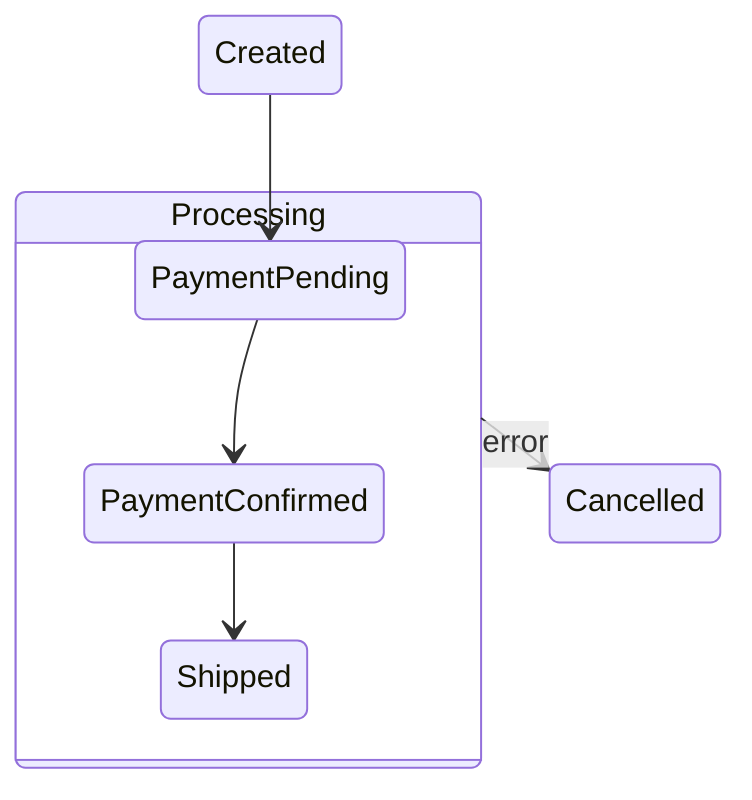

# DGE Session: 外部レビュアーの批判に応える — tramliはどこから崩れるか

**Date:** 2026-04-09
**Participants:** David Harel, ヤン・ウェンリー, Pat Helland, リヴァイ
**Facilitator:** Opa
**Topic:** 外部レビュアーの分析を受けて、tramliの設計限界を再検証する

---

## Act 0: レビュアーの主張の要約

**Opa:** 外部レビュアーがこれまでのDGEセッションを全部読んで分析を書いてきた。結論は「tramli推し」だが、崩壊シナリオが6つ挙がっている。それと3層構成の提案。まず崩壊シナリオを俎上に載せる。

```
レビュアーが挙げた tramli の崩壊シナリオ:

❶ flat enum の記述負債 — entry的初期化を何度も書く、概念のまとまりが表現できない
❷ 型だけルーティングの限界 — 同じ型で意味が違うケース（初回決済/再試行決済/管理者承認決済）
❸ 検証できることだけに寄りすぎ — 冪等性/補償/監査/時間制約は検証の外
❹ SubFlowが「名前を変えた階層」に再発明される危険
❺ flat は機械には良いが人間の認知モデルとずれる
❻ 正しすぎて普及しない — purityを守りすぎてユースケースを切り続ける
```

**ヤン:** ❶と❺は同じ問題の表裏ですね。❸はHellandセッションで既に議論した。❷と❹が新しい論点です。

**リヴァイ:** ❻は設計の問題じゃない。マーケティングの問題だ。

**Opa:** 順に潰していこう。

---

## Act 1: ❷ 型だけルーティングの限界 — 本当に壊れるか

**Opa:** レビュアーの指摘の核心。DD-019 R4で「型がイベント」としたが、同じ型で意味が違うケースが出たらどうなるか。

```java
// レビュアーの例:
//   初回決済の PaymentResult
//   再試行の PaymentResult
//   管理者承認付きの PaymentResult
// 全部 PaymentResult 型 → どのguardが反応すべきかわからない
```

**Helland:** これは実際に起きるシナリオだ。特に決済系では、同じ「支払い結果」でも文脈が全く違う。

**ヤン:** しかし、tramliのベストプラクティスでは「1 guard = 1 トリガー型」です。この例なら:

```java
record InitialPaymentResult(String txnId, int amount) { }
record RetryPaymentResult(String txnId, int amount, int retryCount) { }
record AdminApprovedPayment(String txnId, String adminId) { }
```

**リヴァイ:** 型を分ければ解決する。レビュアーの「型名を増やして逃げると細分化しすぎる」は本当か？

**Harel:** 問題の本質はここだ。**型を分けること自体は正しい**が、分ける判断を開発者に委ねている。「PaymentResultで済むのにわざわざ3つに分けるのか」と思う開発者は必ず出る。

**ヤン:** でもそれは tramli の問題ではなく**ドメインモデリング**の問題です。初回決済と再試行が本当に同じ概念なら、同じ型でいい。guardの中で`retryCount`を見て分岐する。違う概念なら別の型にする。

**Helland:** ヤンが正しい。型の分割は tramli が強制しているわけではない。開発者のドメイン設計の結果だ。tramli は「型が同じなら同じイベントとして扱う」というルールを提供しているだけ。

**Opa:** じゃあ、❷は「tramliの設計限界」ではなく「ドメインモデリングの品質の問題」か。

**Harel:** ……半分そうだ。半分は設計の問題でもある。なぜなら、**Cartaのようにイベントを明示型にしていれば、型とイベントの混同は起きない**。

```java
// Carta: イベントと型は別レイヤー
Event retryPayment = Event.of("RetryPayment");
.on(retryPayment).requires(PaymentResult.class)

// tramli: 型がイベントを兼ねる
.external(ACTIVE, retryPaymentGuard)  // requires: [RetryPaymentResult]
```

Cartaなら`PaymentResult`型を共有しつつ、イベント名で区別できる。tramliでは型自体を分けるしかない。

**リヴァイ:** でもDD-019 R4で「イベント型を入れない」と決めた理由はなんだったか。

**ヤン:** API互換性です。resume のシグネチャを変えない。新型を入れない。最小の変更で multi-external を実現する。

**Harel:** つまり、型だけルーティングは**最小変更の代償として受け入れた制約**。設計の本質ではなく、互換性のための妥協。

**Opa:** ……これは正直だな。

**Helland:** ただし、妥協であっても**実用上は十分**だ。型を分ければ解決するし、分けるコストは低い。レビュアーの指摘は理論的には正しいが、実務で致命的になるケースは想像しにくい。

**リヴァイ:** 結論。❷は「理論的な弱点として認識するが、実務で崩れる前に介入できる」。将来イベント軸が必要になったら、そのとき`.on()`を入れればいい。今は不要。

---

## Act 2: ❹ SubFlowが「名前を変えた階層」に再発明される危険

**Opa:** レビュアーの最も鋭い指摘がこれだ。

```
SubFlow に guaranteed data, 入口保証, 出口保証, 文脈継承, ネスト深度制限
を足していくと、それはだんだん「名前を変えた階層状態」になる。
再発明が始まると最悪で、最初の単純さを失うのに、
理論は Carta ほど洗練されていない、という中途半端な設計になる。
```

**Harel:** これは私が最も共感する指摘だ。

**ヤン:** 具体的に確認しましょう。今のSubFlowと、DD-020/DD-021の将来候補を並べます。

```
今の SubFlow (v1.2.0):
  ✅ 別定義のFlowDefinitionを埋め込む
  ✅ onExit で親状態にマッピング
  ✅ Context共有
  ✅ max nesting depth = 3

DD-020 (future): entry/exit
  → 状態に対するentry/exit action

DD-021 (future): withGuaranteed
  → 親→SubFlowへのデータ保証

もし全部入れると:
  SubFlow + entry/exit + withGuaranteed + onExit + context共有 + depth制限
  = 事実上の階層状態
```

**Harel:** そうだ。SubFlowが階層状態の機能を一つずつ吸収していく。しかしSubFlowの設計は「型消去されたtrait object」であり、Statechartの階層状態ほど構造的に整理されていない。

**リヴァイ:** 具体的に何がまずい？

**Harel:** Statechartの階層状態は**入れ子の構造**を言語レベルで表現する。builder DSLの中で`state("Processing").initial("PaymentPending").state("Confirmed")`とネストする。構造が静的に見える。

SubFlowは**別定義の接続**だ。`subFlow(runner).onExit("DONE", state)`で繋ぐ。構造は実行時に組み立てられる。つまりビルド時に全体の形が見えにくい。

**ヤン:** data-flow検証の観点では？

**Harel:** 階層状態なら、親のavailable_atが子に伝播する検証を**一つのDataFlowGraph内**でやれる。SubFlowは型消去されてるので、親と子のdata-flow graphが分断される。withGuaranteedはそのブリッジだが、**ブリッジが必要な時点で構造の分断を認めている**。

**Helland:** つまり、SubFlowに機能を足せば足すほど、「分断されたまま階層を模倣する」という不自然な構造になる。

**Opa:** ……これは重要だ。レビュアーの言う「中途半端」はまさにここか。

**ヤン:** 対策は2つ。

```
案A: SubFlowに機能を足さない（flatを徹底）
  → withGuaranteed, entry/exitを永久に入れない
  → tramliの表現力は今のまま
  → レビュアーの❶❺（記述負債、認知モデルのずれ）は解決しない

案B: SubFlowを捨てて、階層状態を正式に導入する
  → Carta的なStateNodeベースの階層をtramli-coreに入れる
  → data-flow検証を階層に対応させる（前回セッションで設計済み）
  → ただし直交状態は入れない（検証精度を守る）
  → API変更は大きい
```

**リヴァイ:** 案Bは事実上のtramli v2.0だ。

**Helland:** レビュアーの3層構成に話を移そう。案Aと案Bの中間として、3層が機能するかもしれない。

---

## Act 3: レビュアーの3層構成を検証する

**Opa:** レビュアーの提案。

```
Layer 1: tramli-core  — 最小の遷移 + data-flow検証
Layer 2: tramli-plus  — entry/exit, withGuaranteed, produced_data監査, rich resume
Layer 3: tramli-tenure — entity runtime, event sourcing, idempotency, compensation
```

**ヤン:** この切り方は「何の問いに答えるか」で分かれています。

```
L1: 「data-flowはビルド時に保証できるか？」
L2: 「開発体験は良いか？」
L3: 「長寿命エンティティを運用できるか？」
```

**Helland:** 層の分離としてはきれいだ。しかし1つ問題がある。**L2はL1に対してadditive changeか、breaking changeか？**

**リヴァイ:** どういうことだ？

**Helland:** entry/exitやwithGuaranteedをL2として「L1の上に載せる」なら、L1のFlowDefinitionにentry/exit情報がない。L2がそれを管理する。しかしdata-flow検証はL1のDataFlowGraphで行われる。entry.producesをDataFlowGraphに反映するにはL1の内部に手を入れる必要がある。

**ヤン:** ……つまり、entry/exitのdata-flow統合は**L1の変更を必要とする**。L2はL1の上ではなく、L1の拡張。

**Harel:** これは層の分離が機能しないパターンだ。検証の中核ロジックに手を入れないとentry/exitの保証が効かない。

**Opa:** レビュアーの3層は「概念の分離」としては正しいが、「実装の分離」としては甘い。entry/exitのdata-flow検証はcore内部に入らないと意味がない。

**リヴァイ:** じゃあどう切るのが正しい？

**ヤン:** こうではないですか。

```
実際の分離線:

tramli-core (v2.0):
  ✅ flat enum + data-flow検証（現状）
  ✅ multi-external (DD-019 R4)
  ✅ entry/exit with requires/produces（DD-020を core に取り込む）
  ✅ produced_data記録（DD-022を core に取り込む）
  ✅ rich resume result（DD-023を core に取り込む）

tramli-analysis（既に議論済み）:
  parallelismHints, migrationOrder, toJson, testScaffold, etc.

tramli-tenure（別プロジェクト）:
  event sourcing, idempotency, compensation, audit projector
  tramli-core を内部で利用
```

**Helland:** L2が消えて、その中身がL1に吸収されている。

**ヤン:** はい。レビュアーのL2にあったもののうち、entry/exitとproduced_dataは**検証精度に関わる**のでcoreに入るべき。rich resume resultは**API ergonomics**だがcoreのresume_and_executeを変えないと実現できない。withGuaranteedも**data-flow検証の一部**なのでcoreに入る。

結局、L2の全項目がcoreに入る。L2は消える。

**リヴァイ:** つまりレビュアーの3層は2層になる。

```
tramli-core (v2.0): 検証 + 遷移 + entry/exit + 監査差分 + rich resume
tramli-tenure:      entity runtime（別プロジェクト）
tramli-analysis:    分析ツール群（別クレート）
```

**Harel:** これは……前回のレビューで指摘された「コア/分析分離」と整合する。

---

## Act 4: ❶❺ flat の記述負債と認知モデルのずれ

**Opa:** entry/exitをcoreに入れるとして、❶と❺はどこまで解消されるか。

**ヤン:** entry/exitが入ると:

```
Before (v1.7):
  // SUSPENDEDに入る全遷移のprocessorに同じ初期化を書く
  ACTIVE → SUSPENDED の processor: ctx.put(SuspensionRecord)
  TRIAL → SUSPENDED の processor: ctx.put(SuspensionRecord)
  PAYMENT_FAILED → SUSPENDED の processor: ctx.put(SuspensionRecord)

After (v2.0 with entry/exit):
  .state(SUSPENDED).onEntry(suspensionEntry)  // 1回だけ書く
  // SUSPENDEDに入る全てのパスで自動的にsuspensionEntryが走る
```

**リヴァイ:** DRY違反は解消される。❶の一部は解決。

**Harel:** しかし❺（認知モデルのずれ）はentry/exitだけでは解決しない。人間は「Processing」という概念的なまとまりを見たいが、flat enumではPaymentPendingとPaymentConfirmedが同列に並ぶ。

**ヤン:** ここは**ドキュメンテーションとMermaid図で対応**すべき領域です。コードの構造で解決するのではなく、生成される図で認知を補助する。



MermaidGeneratorに**グループ注釈**を出力する機能を足せば、flat enumのまま図上では階層的に見せられる。

**Harel:** これは妥協だが、実用的だ。コードは flat、図は hierarchical。

**Helland:** レビュアーの「ユーザーが頭の中で勝手に階層を復元し始める」に対する回答としては弱いが、**ゼロよりは大幅に良い**。

**リヴァイ:** ❺は完全解決しないが、entry/exit + Mermaidグループで「使えるレベル」にはなる。完全解決は階層状態を入れないと無理だが、それはdata-flow検証精度を下げる。トレードオフとして受け入れる。

---

## Act 5: レビュアーの最も重要な指摘

**Opa:** レビュアーの全体を通して最も重要な一文がこれだ。

> **flatを守る理由が"本質的な制約"ではなく"表現力不足の言い訳"に見え始めたとき、tramliの美学は強みから弱みに変わる。**

**ヤン:** これに対する回答を用意しておくべきです。

**Harel:** 回答は2つの文書から既に出ている。

```
回答1（Cartaセッション）:
  「表現力と検証精度はトレードオフ。flatは検証可能な範囲で最大の表現力」

回答2（Tenureセッション）:
  「Cartaからも Tenureからも、data-flow検証を維持しながら複雑性を下げると
   tramliに収束する。flatは最小構成最適解」
```

**Helland:** しかしレビュアーの指摘は「回答を持っているか」ではなく、「ユーザーにその回答が伝わるか」だ。

**リヴァイ:** 具体的にどうする？

**ヤン:** README冒頭に**Why flat?**セクションを入れる。

```markdown
## Why flat enums?

tramli uses flat state enums — not hierarchical Statecharts.
This is not a limitation. It is the core design choice.

Data-flow verification precision degrades with structural expressiveness:

| Structure        | Expressiveness | Verification |
|-----------------|----------------|-------------|
| Flat enum        | ★☆☆           | ★★★         |
| Hierarchical     | ★★☆           | ★★☆         |
| Orthogonal       | ★★★           | ★☆☆         |

tramli sits at the sweet spot: maximum verification within
a practical level of expressiveness.

When you write `requires(OrderRequest.class)`, tramli guarantees
at build time that OrderRequest is available — across ALL paths.
Hierarchical states weaken this to "available on most paths."
Orthogonal states break it entirely.
```

**Harel:** これは良い。ユーザーが「なぜ階層がないのか」と疑問に思ったとき、「検証のため」と即座に答えている。

**Helland:** そしてこの説明自体が、tramliの差別化ポイントの表明になっている。「flatだから検証できる、他のライブラリにはこの保証がない」と。

---

## Act 6: 3層→2層の最終整理

**Opa:** レビュアーの提案を検証した結果、3層は2層になった。最終形を確定する。

```
tramli v2.0 (core):
  既存:
    ✅ flat enum + FlowState trait
    ✅ requires/produces + DataFlowGraph
    ✅ 8-item build validation
    ✅ FlowEngine (sync)
    ✅ SubFlow composition
    ✅ MermaidGenerator (state + data-flow)

  DD-019 R4 追加:
    ✅ multi-external (requires-based routing)
    ✅ check_external_unique_guard_name
    ✅ guard_failure_counts per guard name
    ✅ external_data rollback on Rejected

  DD-020 追加:
    ✅ entry/exit actions with requires/produces
    ✅ available_at += entry.produces（スコープ保証）
    ✅ I/O非含有の制約

  DD-022 追加:
    ✅ TransitionRecord.produced_data（差分監査）

  DD-023 追加:
    ✅ resume戻り値 enum化

  Mermaid拡張:
    ✅ state group annotation（図上の概念グループ）

tramli-analysis (別クレート):
  既存v1.4.0+のメソッド群を分離:
    parallelismHints, migrationOrder, toJson,
    testScaffold, generateInvariantAssertions, diff, etc.

tenure (別プロジェクト):
  Helland設計のentity runtime:
    event sourcing, idempotency, compensation, audit
    内部でtramli-coreを利用
```

**ヤン:** 実装の優先順位。

```
Phase 1: DD-019 R4 (Multi-External)
  → ユーザーライフサイクルの基本が書けるようになる

Phase 2: DD-022 + DD-023 (監査差分 + rich resume)
  → 実務品質の向上

Phase 3: DD-020 (entry/exit)
  → DRY解消 + スコープ保証

Phase 4: tramli-analysis 分離
  → API安定性の保守コスト軽減

Phase 5: tenure
  → 別プロジェクト、tramli-core安定後
```

**リヴァイ:** Phase 1の前にvolta-gatewayへの組み込みが先だったはずだ。

**ヤン:** はい。

```
Phase 0: volta-gateway に tramli-rust を組み込む
  → 実戦フィードバック
  → DD-019の必要性を実体験で確認
```

---

## Act 7: レビュアーへの回答

**Opa:** レビュアーの6つの崩壊シナリオに対する回答をまとめる。

```
❶ flat enum の記述負債
  → DD-020 entry/exit で DRY 解消。完全解決ではないが実用的。

❷ 型だけルーティングの限界
  → ドメインモデリングの問題。型を分ければ解決。
    将来イベント軸が必要になったら .on() を追加する拡張パスは残す。

❸ 検証できることだけに寄りすぎ
  → tramli-core は検証に徹する。冪等性/補償は tenure 層の責務。
    DD-022 の produced_data で監査は部分対応。

❹ SubFlow が階層の再発明になる危険
  → 最も鋭い指摘。DD-020 entry/exit を入れた時点で
    SubFlowへの機能追加は意図的に止める。
    withGuaranteed は入れるが、それ以上は入れない。
    「SubFlowは接続、階層化ではない」という線を守る。

❺ flat は人間の認知とずれる
  → MermaidGenerator の state group annotation で図上は階層表示。
    コードは flat、図は hierarchical の二面戦略。

❻ 正しすぎて普及しない
  → README の "Why flat?" セクション。
    制約の理由を美学ではなく検証の実利として説明する。
    volta-gateway での実戦投入が最大の説得材料。
```

**Helland:** レビュアーの最終結論「tramli は kernel、tramli-plus は shell、Tenure は operating environment」に対しては？

**ヤン:** plusがcoreに吸収されたので、修正版は:

```
tramli-core は kernel
tramli-analysis は diagnostic tools
tenure は operating environment
```

**Harel:** 加えて、レビュアーの「tramli を Carta で磨く」という方針は正しい。DD-020 entry/exit がまさにそれだ。Cartaの全体を取り込むのではなく、**data-flow検証と両立する部分だけを選択的に持ち帰る**。

**リヴァイ:** レビュアーは「Cartaは美しい。tramliは正しい。ライブラリの芯として選ぶなら、僕はtramliを選ぶ」と書いた。俺も同意する。ただし条件がある。**正しいだけでは勝てないから、Phase 0で実戦投入しろ。**

---

## 最終: このセッションの成果

| 論点 | レビュアーの指摘 | DGEの結論 |
|------|-----------------|-----------|
| 3層構成 | core / plus / tenure | plus は core に吸収。2層 + analysis |
| ❹ SubFlow再発明 | 最大のリスク | entry/exit は core に入れるが SubFlow の機能追加は止める |
| ❷ 型ルーティング限界 | 理論的弱点 | 実務で崩れる前に介入可能。将来の拡張パスは残す |
| ❶❺ flat の記述/認知負債 | entry/exit + Mermaidグループで緩和 | 完全解決はしない。トレードオフとして受け入れ |
| ❻ 普及 | Why flat? を説明する義務 | README + 実戦投入が回答 |

### レビュアーの最重要指摘への最終回答

> 「flatを守る理由が"本質的な制約"ではなく"表現力不足の言い訳"に見え始めたとき」

**回答: flatは言い訳ではない。2方向収束（Carta→tramli, Tenure→tramli）で証明済み。ただし、その証明をユーザーに伝え続ける義務がある。README、論文、図、そして実戦での成果で。**
