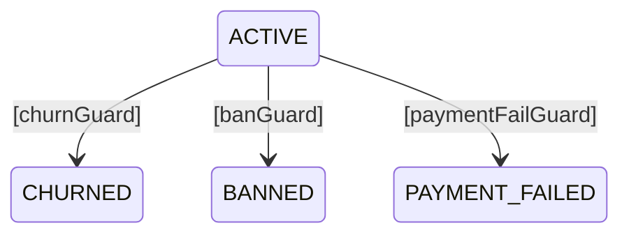

# DGE Session R2: Multi-External の API 互換性リスク精査

**Date:** 2026-04-08
**Participants:** David Harel, ヤン・ウェンリー, Pat Helland, リヴァイ
**Facilitator:** Opa
**Topic:** DD-019 Multi-External の API 設計を互換性の観点から再検討

---

## Act 1: 何が壊れるか

**Opa:** 前回のセッションでMulti-Externalをほぼ決めかけたけど、立ち止まる。APIの互換性が壊れる匂いがする。具体的に何が壊れるか洗い出したい。

**ヤン:** 前回の案を再掲します。

```java
// Builder側
.from(ACTIVE)
    .on("churn", CHURNED, churnGuard)
    .on("ban", BANNED, banGuard)

// Engine側
engine.resumeAndExecute(flowId, "ban", externalData);
```

**リヴァイ:** `resumeAndExecute`の引数が変わる。既存のコード全部壊れるぞ。

```java
// v1.7の現行API
engine.resumeAndExecute(flowId, externalData);

// DD-019案
engine.resumeAndExecute(flowId, "ban", externalData);
```

**Helland:** これはシグネチャの破壊的変更だ。DD-016で「コアAPIは壊さない」と約束したのはいつだ？

**Opa:** 今日。v1.0.0のリリースも今日。

**Helland:** ……ならば幸運だ。ユーザーがゼロなら壊せる。しかし**ユーザーがゼロだからといって設計が雑でいい理由にはならない**。v2.0.0で壊すとして、v3.0.0でまた壊す羽目にならないか？ そこを検証すべきだ。

**Harel:** 同意する。API設計は一度決めたら10年持たせるつもりで考えるべきだ。

---

## Act 2: イベント名の問題

**ヤン:** まず「イベント名」の設計を疑います。前回の案ではイベント名はただのString。

```java
.on("ban", BANNED, banGuard)
//   ^^^^^ これ
```

**リヴァイ:** typoで死ぬやつだ。

```java
// Builder側
.on("ban", BANNED, banGuard)

// 呼び出し側
engine.resumeAndExecute(flowId, "bann", data);  // typo → 実行時エラー
```

**Harel:** UMLステートマシンではイベントは**型**だ。文字列ではない。

**ヤン:** しかしtramliは3言語で動く。Java/TS/Rustで共通のイベント型を定義する方法は？

**Helland:** ないだろう。これが3言語ライブラリの宿命だ。FlowStateをenumで定義しているように、**イベントもenumで定義する**のが筋ではないか？

```java
// Java
enum UserEvent { VERIFY_EMAIL, SELECT_PLAN, CHURN, BAN, ... }

.from(ACTIVE)
    .on(UserEvent.CHURN, CHURNED, churnGuard)
    .on(UserEvent.BAN, BANNED, banGuard)

engine.resumeAndExecute(flowId, UserEvent.BAN, data);
```

**リヴァイ:** これならtypoはコンパイル時に死ぬ。

**ヤン:** ただし……FlowState と FlowEvent、2つのenumをユーザーに書かせることになる。

**Harel:** 当然だ。状態機械にはstateとeventがある。tramliが今までeventを明示しなかったのは、OrderFlowのような単純なケースでは不要だったからだ。

**Helland:** 問題は、**既存のOrderFlowにevent enumが要るか**だ。1つのstateに1つのExternalしかないなら、イベント名は不要。

**ヤン:** つまり、イベントenumは**オプショナル**であるべきですね。

---

## Act 3: 3つの案の比較

**Opa:** 整理しよう。前回の案Aに加えて、別の案を出す。

### 案A: String イベント名（前回の案）

```java
.from(ACTIVE).on("churn", CHURNED, churnGuard)
engine.resumeAndExecute(flowId, "churn", data);
```

- ✅ シンプル
- ❌ typoが実行時エラー
- ❌ 3言語でイベント名の一貫性を保証できない
- ❌ resumeのシグネチャが壊れる

### 案B: Event enum（型安全）

```java
enum UserEvent implements FlowEvent { CHURN, BAN, ... }
.from(ACTIVE).on(UserEvent.CHURN, CHURNED, churnGuard)
engine.resumeAndExecute(flowId, UserEvent.CHURN, data);
```

- ✅ typoがコンパイル時エラー
- ✅ FlowStateと対称的な設計
- ❌ 既存のsingle-externalユーザーにもenum定義を強制
- ❌ resumeのシグネチャが壊れる
- ❌ FlowEngine<S> が FlowEngine<S, E> になる（型パラメータ増加）

### 案C: Guard が自己選択する（API変更なし）

```java
// Builder側: 1つのstateに複数のexternalを許可（guardで区別）
.from(ACTIVE).external(CHURNED, churnGuard)
.from(ACTIVE).external(BANNED, banGuard)
.from(ACTIVE).external(PAYMENT_FAILED, paymentFailGuard)

// Engine側: 変更なし
engine.resumeAndExecute(flowId, externalData);
// → engineが全guardを順に評価、最初にAcceptedを返したものを採用
```

- ✅ **resumeのシグネチャが変わらない**
- ✅ 既存コードが壊れない
- ✅ Builder側の変更は `check_external_uniqueness` の撤廃だけ
- ❌ 複数guardがAcceptedを返したときの曖昧性
- ❌ guardの評価順序が意味を持つ（宣言順）
- ❌ 全guardを評価するコスト（微小だが原則として不要な計算）

**リヴァイ:** ……案Cだと、API変更がゼロだと？

**ヤン:** ゼロではありません。`check_external_uniqueness`を外す（または`check_external_event_coverage`に変える）だけ。resume側は完全に変更なし。

---

## Act 4: 案Cの深掘り

**Harel:** 案Cの「複数guardがAcceptedを返す曖昧性」は致命的ではないか？

**Helland:** 考えてみよう。実際にそれが起きるケースは？

```java
// ACTIVE状態のユーザーに対して resume が呼ばれた
// externalData に BanOrder と ChurnRequest の両方がある場合

banGuard.validate(ctx)     // → Accepted（BanOrderがあるから）
churnGuard.validate(ctx)   // → Accepted（ChurnRequestがあるから）
```

**リヴァイ:** 同時にBanとChurnが来ること自体がアプリのバグだろ。

**Helland:** その通り。これは**アプリ側の責務**だ。resumeを呼ぶ時点で、何のイベントに対する処理かはアプリが知っている。問題は、tramliにそれを伝える手段がないことだ。

**ヤン:** しかし、伝える手段がなくても**実害があるか**を考えるべきです。

guardが複数Acceptedを返す条件は:
1. 複数のexternalDataを同時に渡す
2. 複数のguardのrequiresが同時に満たされる

条件1はアプリのバグ。条件2は**guardの設計で防げる**。

```java
// 正しい設計: guardのrequiresが排他的
banGuard.requires()   → [BanOrder]
churnGuard.requires() → [ChurnRequest]
// BanOrderとChurnRequestは異なる型 → 両方contextにあることは通常ない

// 危険な設計: guardのrequiresが重複
banGuard.requires()   → [AdminAction]
churnGuard.requires() → [AdminAction]
// 同じ型を使っている → 両方Acceptedになりうる
```

**Harel:** guardのrequiresが排他的であることをビルド時に検証できるか？

**Opa:** ……できる。各guardのrequiresの和集合がavailable_at(state)に含まれているかは既に検証してる。requires同士の排他性チェックを追加すればいい。

**ヤン:** 待ってください。排他性チェックは**厳しすぎる**かもしれない。

```java
// この例は排他的ではないが、正しい
.from(ACTIVE).external(CHURNED, churnGuard)    // requires: [UserProfile]
.from(ACTIVE).external(SUSPENDED, suspendGuard) // requires: [UserProfile, SuspendOrder]
// UserProfileは両方にあるが、SuspendOrderの有無で区別される
```

**Helland:** これは集合の包含関係の問題だ。guardAのrequiresがguardBのrequiresの部分集合なら、Bが通ればAも通りうる。

**リヴァイ:** 頭が痛くなってきた。そこまでビルド時に検証する必要があるのか？

**Helland:** ……ないかもしれない。

**ヤン:** 実用的な方針を出しましょう。

```
1. 複数guardがAcceptedを返した場合: 最初のAcceptedを採用（宣言順）
2. ビルド時検証は「requires充足」のみ（現状と同じ）
3. 「複数guardがAcceptedを返しうる」ことはwarningとして出す（errorではない）
4. strict_modeの場合のみ、複数Accepted = error
```

**リヴァイ:** それでいい。デフォルトは寛容に、厳密にしたければstrict_mode。

---

## Act 5: 案Cの「におい」チェック

**Opa:** 案Cで本当にAPI互換が保てるか、エッジケースを洗う。

**ヤン:** シナリオを列挙します。

### シナリオ1: 既存のsingle-externalフロー（OrderFlow）

```java
// v1.7の既存コード
.from(PAYMENT_PENDING).external(PAYMENT_CONFIRMED, paymentGuard)

// 案Cでは: 何も変わらない。externalが1つだけなので従来通り動く
engine.resumeAndExecute(flowId, data);  // ← 変更なし
```

✅ 完全互換。

### シナリオ2: multi-externalへの移行

```java
// v2.0で追加
.from(ACTIVE).external(CHURNED, churnGuard)
.from(ACTIVE).external(BANNED, banGuard)

// 呼び出し側
engine.resumeAndExecute(flowId, vec![(TypeId::of::<BanOrder>(), ...)]);
// → banGuardのrequires(BanOrder)が満たされる → Accepted → BANNED
```

✅ resume側のコード変更なし。externalDataの中身でguardが自動選択される。

### シナリオ3: どのguardも通らない

```java
engine.resumeAndExecute(flowId, vec![]);  // 何もデータを渡さない
// → 全guardがRejected → guard_failure_countが増える？ どのguardの？
```

**リヴァイ:** ここだ。guard_failure_countはどのguardに帰属する？

**Helland:** 現状は1つのexternalに1つのguardだから問題にならなかった。multi-externalだと**どのguardが「担当」かわからない**。

**ヤン:** 2つの選択肢。

```
A) guard_failure_countをguardごとに持つ → FlowInstanceの構造変更（破壊的）
B) guard_failure_countを全体で持つ（現状通り）→ banGuardの失敗3回でchurnGuardも巻き添え
```

**リヴァイ:** Bはまずい。BANの試行回数が上限に達したら退会もできなくなる。

**Helland:** しかしAはFlowInstanceの構造変更だ。永続化スキーマにも影響する。

**ヤン:** ……ここが「におい」の正体ですね。**guard_failure_countの帰属先が決まらない**。

**Harel:** 根本的な問題は、案Cでは**どのイベントに対する処理かをtramliが知らない**ことだ。guardが自己選択するということは、「全部試してどれかが通ればいい」という設計。しかしguard failureの管理には「どれを試みたか」が必要だ。

**リヴァイ:** じゃあ案Cは駄目か？

**Opa:** ……いや、待て。

---

## Act 6: 案D — guardの自己選択 + イベントヒント（ハイブリッド）

**Opa:** 案Cの利点（resume APIを壊さない）を維持しつつ、guard_failure_countの問題を解決する案がある。

```java
// Builder側: 案Cと同じ
.from(ACTIVE).external(CHURNED, churnGuard)
.from(ACTIVE).external(BANNED, banGuard)

// Engine側: externalDataにイベントヒントを「入れてもいい」
engine.resumeAndExecute(flowId, data);              // ヒントなし → 全guard評価
engine.resumeAndExecute(flowId, withHint("ban"), data);  // ヒントあり → banGuardのみ
```

**ヤン:** `withHint`は……どう実装します？

**Opa:** externalDataの中に特殊なヒント型を入れる。

```rust
// tramli が提供する組み込み型
#[derive(Clone)]
pub struct TransitionHint(pub String);

// 呼び出し側
let mut data = vec![...];
data.push((TypeId::of::<TransitionHint>(), Box::new(TransitionHint("ban".into()))));
engine.resume_and_execute(flow_id, data)?;
```

**リヴァイ:** ……resume APIのシグネチャは変わらないな。

**ヤン:** TransitionHintがcontextにあれば、engineはヒント名に一致するguardだけを評価する。なければ全guardを評価する。guard_failure_countはヒントに対応するguardに帰属する。

**Harel:** ヒントがないケースで複数Acceptedが出る問題は？

**ヤン:** 残ります。しかし「ヒントなしで複数guardが通る」のはアプリのバグとして扱えます。strict_modeならエラー。

**Helland:** 後方互換性を確認しよう。

```
v1.7 single-external: ヒントなし → 1つのguardだけあるので従来通り ✅
v2.0 multi-external + ヒントなし: 全guard評価、最初のAccepted採用 ✅
v2.0 multi-external + ヒントあり: 指定guardのみ評価 ✅
```

**リヴァイ:** resume APIが変わらない。Builder側は`check_external_uniqueness`を緩めるだけ。FlowInstanceの構造も……guard_failure_countはヒント（＝イベント名）ごとに持てばいいのか？

**ヤン:** `HashMap<String, usize>`にする。ヒントなしの場合のキーは`"_default"`。

```rust
// FlowInstance
guard_failure_count: usize,           // v1.7（single-external）
guard_failure_counts: HashMap<String, usize>,  // v2.0（multi-external）
```

**Helland:** 構造変更ではあるが、**永続化スキーマに対しては追加フィールド**だ。既存のフィールドの意味は変わらない。後方互換。

---

## Act 7: 案Dで全シナリオを再検証

**Opa:** 案Dで前のシナリオを全部回す。

### シナリオ1: 既存OrderFlow（single-external）

```java
.from(PAYMENT_PENDING).external(PAYMENT_CONFIRMED, paymentGuard)
engine.resumeAndExecute(flowId, data);
```

変更点: なし。`check_external_uniqueness`は通る（1つだけ）。guard_failure_countも従来の単一値が使われる。✅

### シナリオ2: multi-external + ヒントあり（推奨パターン）

```java
.from(ACTIVE).external(CHURNED, churnGuard)
.from(ACTIVE).external(BANNED, banGuard)

// ヒントで明示
data.push(TransitionHint("ban"));
engine.resumeAndExecute(flowId, data);
// → banGuardのみ評価 → Accepted → BANNED
// → guard_failure_counts["ban"] に帰属
```

✅

### シナリオ3: multi-external + ヒントなし（後方互換モード）

```java
engine.resumeAndExecute(flowId, data);
// → churnGuard, banGuard を宣言順に評価
// → 最初のAcceptedを採用
// → guard_failure_counts["_default"] に帰属
```

⚠️ 動くが推奨しない。ドキュメントで「multi-externalではヒント推奨」と記載。

### シナリオ4: ヒントあり + 該当guardなし

```java
data.push(TransitionHint("nonexistent"));
engine.resumeAndExecute(flowId, data);
// → 該当guardなし → FlowError("UNKNOWN_EVENT", "...")
```

✅ 明確なエラー。

### シナリオ5: ヒントあり + guardがRejected

```java
data.push(TransitionHint("ban"));
engine.resumeAndExecute(flowId, data);
// → banGuard → Rejected
// → guard_failure_counts["ban"] += 1
// → max_guard_retries超過 → error transition
```

✅ 正しくbanGuardに帰属。churnGuardのカウンタは影響なし。

### シナリオ6: TS/Rust互換

```typescript
// TypeScript
engine.resumeAndExecute(flowId, new Map([
    ["TransitionHint", "ban"],
    [PaymentData, paymentData]
]));

// Rust
engine.resume_and_execute(flow_id, vec![
    (TypeId::of::<TransitionHint>(), Box::new(TransitionHint("ban".into()))),
    ...
])?;
```

**ヤン:** TS版はFlowKeyが文字列なので自然にマッピングできる。Rust版はTypeIdベースで組み込み型として提供。Java版はClass-keyed。3言語とも**resumeのシグネチャ変更なし**。✅

---

## Act 8: ビルド時検証の強化

**Harel:** 案Dで失われるのは何だ？

**ヤン:** `check_external_uniqueness`が消える代わりに、何を検証すべきかですね。

```
既存の検証（維持）:
  ✅ 全guardのrequiresがavailable_at(state)で充足される
  ✅ auto/branchとexternalの競合禁止
  ✅ terminal stateからの遷移禁止

追加検証:
  🆕 同一stateの複数external: 全guardのproducesがそれぞれの遷移先で整合
  🆕 warning: 同一stateの複数guardのrequiresが同一の型セット（曖昧性リスク）
```

**Helland:** DataFlowGraphへの影響は？

**Opa:** multi-externalがある場合、同一stateから複数の遷移先があるので、available_at()の計算が分岐する。これは現状のbranchと同じ処理。実装上は既存のコードで対応可能。

**Harel:** MermaidGenerator は？



**ヤン:** 現状のMermaidGeneratorが既にfrom→toを描画しているので、複数externalがあれば自然に複数の矢印が出る。変更不要。✅

---

## Act 9: 最終判断

**Opa:** 4つの案を比較する。

| 観点 | 案A (String) | 案B (Enum) | 案C (自己選択) | 案D (ヒント) |
|------|-------------|-----------|--------------|-------------|
| resume API互換 | ❌ 破壊 | ❌ 破壊 | ✅ 維持 | ✅ 維持 |
| typo安全性 | ❌ | ✅ | ✅（型で区別） | ⚠️（ヒントはString） |
| guard_failure帰属 | ✅ 明確 | ✅ 明確 | ❌ 曖昧 | ✅ 明確 |
| Builder変更 | 大 | 大 | 小 | 小 |
| 型パラメータ増加 | なし | あり(E) | なし | なし |
| 既存コード影響 | 全書き換え | 全書き換え | uniqueチェック撤廃のみ | uniqueチェック撤廃のみ |
| 3言語統一 | 容易 | 面倒 | 容易 | 容易 |

**Helland:** 案Dが最も保守的で、最も後方互換性が高い。

**Harel:** 案Bの型安全性が失われるのは残念だが、3言語ライブラリの制約下では案Dが現実的だ。

**ヤン:** TransitionHintのStringが気になるなら、ユーザーがイベントenumを定義して`.name()`をヒントに使うことを推奨パターンとして文書化すればいい。強制はしない。

```java
// 推奨パターン（文書化のみ、API強制なし）
enum UserEvent { CHURN, BAN, PAYMENT_FAIL }

data.put(TransitionHint.class, new TransitionHint(UserEvent.BAN.name()));
```

**リヴァイ:** 案Dでいい。まとめろ。

---

## 設計決定: DD-019 v2 — Multi-External via Guard Self-Selection + TransitionHint

### Builder変更

```java
// 既存API: 変更なし、ただし同一stateに複数 .external() を許可
.from(ACTIVE).external(CHURNED, churnGuard)
.from(ACTIVE).external(BANNED, banGuard)
.from(ACTIVE).external(PAYMENT_FAILED, paymentFailGuard)
```

`check_external_uniqueness` を `check_external_guard_requires`（全guardのrequires充足検証）に置換。

### Resume変更

```java
// シグネチャ: 変更なし
engine.resumeAndExecute(flowId, externalData);

// ヒント付き（オプショナル）
externalData.put(TransitionHint.class, new TransitionHint("ban"));
engine.resumeAndExecute(flowId, externalData);
```

### Guard評価ロジック

```
1. TransitionHintがcontextにある場合:
   → ヒント名に対応するguardのみ評価
   → 対応するguardなし → FlowError("UNKNOWN_EVENT")
   → guard_failure_counts[hint_name] に帰属

2. TransitionHintがない場合（single-external互換）:
   → 全guardを宣言順に評価
   → 最初のAcceptedを採用
   → 全Rejected → guard_failure_counts["_default"] に帰属
   → strict_mode + 複数Accepted → FlowError("AMBIGUOUS_TRANSITION")
```

### guardとtargetの紐付け

```
engineは「どのguardがどのtarget stateに対応するか」を知る必要がある。
これは Builder が .external(TARGET, guard) で登録した情報から取得。

内部的に:
  state → Vec<(target, guard)>   // 宣言順を保持
```

### FlowInstance変更

```rust
// 追加フィールド
guard_failure_counts: HashMap<String, usize>,

// 既存フィールド guard_failure_count は deprecated（互換のため残す）
// guard_failure_count = guard_failure_counts.values().sum()
```

### 互換性の検証結果

```
✅ 既存single-externalフロー: 変更不要、ヒントなしで従来通り動作
✅ resume APIシグネチャ: 変更なし
✅ FlowInstance永続化: 追加フィールドのみ（既存スキーマと互換）
✅ DataFlowGraph: branchと同じ分岐処理で対応可
✅ MermaidGenerator: 変更不要（複数矢印が自然に出る）
✅ 3言語: TransitionHintを組み込み型として各言語で提供
```

### NOT-DOING

- FlowEvent trait/interface（案B）— 型パラメータ増加を避ける
- guardのrequires排他性チェック — 過度な制約。warningに留める
- イベント優先度 — tramliの責務外。アプリ層で制御

---

## 発見（R1からの差分）

| # | R1の判断 | R2で変わったこと |
|---|---------|-----------------|
| 1 | `.on("event", target, guard)` | → `.external(target, guard)` の複数許可 + TransitionHint |
| 2 | resume API変更が必要 | → **変更不要**（ヒントはexternalDataの一部） |
| 3 | イベント名はString | → TransitionHintはString だが、enum使用を推奨文書化 |
| 4 | guard_failure_countの帰属が未定 | → ヒントキーごとにHashMap管理 |
| 5 | `check_external_uniqueness` 撤廃 | → `check_external_guard_requires` に置換 |

## 残存リスク

| リスク | 対策 |
|--------|------|
| ヒントなしmulti-externalで曖昧性 | strict_modeで検出 + ドキュメントでヒント推奨 |
| TransitionHint文字列typo | 推奨パターン（enum.name()）で軽減。将来typedヒントも検討可 |
| guard_failure_countsの永続化 | 追加フィールドなのでスキーマ互換だが、restore時のデフォルト値が必要 |
