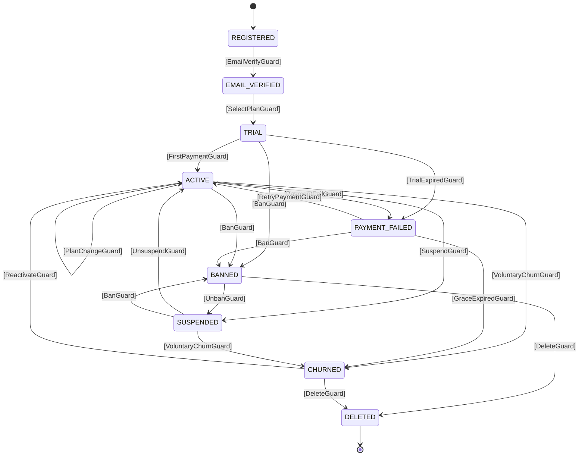

# DGE Session R4: 自己遷移の穴 — guard_failure_countsのキー再設計

**Date:** 2026-04-08
**Participants:** David Harel, ヤン・ウェンリー, Pat Helland, リヴァイ
**Facilitator:** Opa
**Topic:** R3の check_external_unique_target が自己遷移を殺す問題

---

## Act 1: 穴の発見

**Opa:** R3で「同一(from, to)ペアに複数external禁止」とした。理由はguard_failure_countsのキーをtarget stateにしたから。しかし自己遷移が複数必要なケースがある。

```java
.from(ACTIVE).external(ACTIVE, profileUpdateGuard)   // requires: [ProfileUpdate]
.from(ACTIVE).external(ACTIVE, planChangeGuard)       // requires: [PlanChange]
.from(ACTIVE).external(ACTIVE, addressChangeGuard)    // requires: [AddressChange]
.from(ACTIVE).external(BANNED, banGuard)              // requires: [BanOrder]
.from(ACTIVE).external(CHURNED, churnGuard)           // requires: [ChurnRequest]
```

上3つは全部 ACTIVE → ACTIVE。R3の `check_external_unique_target` で拒否される。

**リヴァイ:** これ、頻出パターンだろ。

**Harel:** 当然だ。Statechartではinternal transitionと呼ぶ。状態を変えずにイベントを処理する。最も基本的な操作の一つだ。

**ヤン:** R3でtarget stateをguard_failure_countsのキーにしたのは、「一意に識別できるから」でした。自己遷移があると一意性が崩れる。キーを変える必要がある。

---

## Act 2: キーの候補

**Helland:** guard_failure_countsのキーに使える識別子を列挙しよう。

```
候補1: target state (S)         — R3の案。自己遷移で衝突。❌
候補2: guard名 (String)         — guards already have name()
候補3: transition index (usize) — 定義内の順序。バージョン間で不安定
候補4: (target, guard名) tuple  — 冗長だが一意性が高い
候補5: requires型セット         — 型がイベントなら一意のはず
```

**リヴァイ:** 候補3は論外だ。FlowDefinitionのバージョンが変わったらインデックスがズレる。永続化したcountsが壊れる。

**ヤン:** 候補5は面白いですが、HashSet<TypeId>をキーにするのは実装もシリアライズも面倒ですね。

**Harel:** 候補2でいいのではないか。guard名はguard実装者が`name()`で返す文字列。これは安定している——プロセッサ名を変えない限り。

**Helland:** しかしguard名の一意性はtramliが保証しているか？

**Opa:** していない。同じ名前のguardを2つ作れる。

**ヤン:** ならば**ビルド時に検証**すればいい。同一stateの複数externalで、guard名の重複を禁止する。

```
check_external_unique_guard_name:
  同一stateに複数externalがある場合、全guardのname()がユニークであること
```

**リヴァイ:** guard名はユーザーが付ける名前だよな。`"PaymentGuard"`とか。それがそのままcountsのキーになる。

**Helland:** 永続化スキーマではどうなる？

```json
{
  "guard_failure_counts": {
    "banGuard": 2,
    "churnGuard": 0,
    "profileUpdateGuard": 1
  }
}
```

文字列キーだからJSON互換。FlowDefinitionのバージョンが変わってもguard名が同じなら引き継げる。guard名を変えたらカウンタはリセットされる——これは正しい振る舞い。

**Harel:** 候補2（guard名）で決まりか。

---

## Act 3: 検証 — 全シナリオ再走査

**ヤン:** R3のシナリオを再走査します。

### シナリオ1: 既存single-external（OrderFlow）

```java
.from(PAYMENT_PENDING).external(PAYMENT_CONFIRMED, paymentGuard)
// guard名: "PaymentGuard"
// guard_failure_counts = {"PaymentGuard": 0}
```

Rejected 3回 → `{"PaymentGuard": 3}` → error transition。✅ 従来と同一。

### シナリオ2: multi-external、異なるtarget

```java
.from(ACTIVE).external(CHURNED, churnGuard)       // "ChurnGuard"
.from(ACTIVE).external(BANNED, banGuard)           // "BanGuard"
```

BanOrder渡す → banGuardのみ充足 → evaluate → Rejected → `{"BanGuard": 1}`。ChurnGuardのカウンタは影響なし。✅

### シナリオ3: 自己遷移（R3で壊れてたケース）

```java
.from(ACTIVE).external(ACTIVE, profileUpdateGuard)  // "ProfileUpdateGuard"
.from(ACTIVE).external(ACTIVE, planChangeGuard)      // "PlanChangeGuard"
.from(ACTIVE).external(ACTIVE, addressChangeGuard)   // "AddressChangeGuard"
```

PlanChange渡す → planChangeGuardのみ充足 → evaluate → Accepted → ACTIVE（自己遷移）。✅

guard_failure_countsキーはguard名なので衝突しない。✅

### シナリオ4: 自己遷移のRejected

```java
planChangeGuard Rejected 3回 → {"PlanChangeGuard": 3} → error transition
```

profileUpdateGuardとaddressChangeGuardのカウンタは影響なし。✅

### シナリオ5: transition_to()でのカウンタクリア

R3で「transition_to()でguard_failure_counts.clear()」としたが、自己遷移でクリアすると**毎回リセット**されてしまう。

```
ACTIVE → profileUpdateGuard Accepted → ACTIVE（自己遷移）
→ guard_failure_counts.clear()
→ banGuardの失敗カウントもリセットされる！
```

**リヴァイ:** まずい。自己遷移のたびに全カウンタがリセットされたら、BANのretry制限が効かなくなる。

**ヤン:** R3のtransition_to()での一律クリアは**自己遷移を考慮していなかった**。

**Helland:** 修正案。**状態が実際に変わったときだけクリア。**

```rust
pub(crate) fn transition_to(&mut self, state: S) {
    if self.current_state != state {
        self.guard_failure_counts.clear();
    }
    self.current_state = state;
}
```

**リヴァイ:** 自己遷移ではクリアしない。別の状態に遷移したらクリア。当然だ。

**Harel:** これは正しい。状態が変わったということは新しいコンテキストに入ったということ。以前の失敗カウントは無関係。自己遷移は同じコンテキスト内なのでカウントは保持。

✅

---

## Act 4: check_external_unique_target の代替

**Opa:** `check_external_unique_target`を廃止して何に置き換えるか。

**ヤン:** 2つの検証に分割します。

```
① check_external_unique_guard_name（error）:
   同一stateの複数externalで、guard.name()が重複していたらビルドエラー。
   → guard_failure_countsのキー一意性を保証。

② check_external_requires_overlap（warning）:
   同一stateの複数externalで、guardのrequires型セットに包含関係があればwarning。
   → requiresルーティングの曖昧性を警告。
```

**Harel:** ①はerrorでいい。guard名の重複は設計ミスだ。②はwarningが適切。包含関係があっても、型の有無で正しくルーティングされるケースは多い。

**Helland:** 確認だが、①のguard名一意性はstate単位か、フロー全体か。

**ヤン:** state単位で十分です。異なるstateで同じguard名を使うのは正当——同じguardインスタンスを複数stateに設定するケースがある。

```java
// OK: 異なるstateで同じbanGuardを使う
.from(ACTIVE).external(BANNED, banGuard)       // "BanGuard" at ACTIVE
.from(TRIAL).external(BANNED, banGuard)         // "BanGuard" at TRIAL
.from(SUSPENDED).external(BANNED, banGuard)     // "BanGuard" at SUSPENDED
```

**リヴァイ:** 同じguardを3箇所で使い回せるのは良い。BANのロジックは共通にしたい。

---

## Act 5: R3→R4 差分の確定

**ヤン:** R3からの変更点を明確にします。

```
R3の設計:
  guard_failure_countsキー: target state (S)
  制約: check_external_unique_target
  transition_to(): 常にclear()

R4の修正:
  guard_failure_countsキー: guard名 (String)     ← 変更
  制約: check_external_unique_guard_name          ← 変更
  制約: check_external_requires_overlap (warning) ← 追加
  transition_to(): 状態変化時のみclear()          ← 変更
```

**Helland:** R3のそれ以外の設計は全て維持か？

**ヤン:**

```
維持:
  ✅ .external()の複数許可（新APIなし）
  ✅ requiresベースルーティング（型がイベント）
  ✅ resume APIシグネチャ変更なし
  ✅ Rejected時のexternal_dataロールバック
  ✅ FlowContext.remove_raw() [pub(crate)]
  ✅ 新public型なし、新publicメソッドなし
```

**リヴァイ:** R3からの変更は小さい。キーの型と遷移時のクリア条件だけ。

---

## Act 6: 最終ストレステスト — ユーザーライフサイクル全体

**Opa:** R4の設計でユーザーライフサイクルを全部書いて、穴がないか最終確認する。

```java
enum UserState {
    REGISTERED,       // initial
    EMAIL_VERIFIED,
    TRIAL,
    ACTIVE,
    PAYMENT_FAILED,
    SUSPENDED,
    BANNED,
    CHURNED,          // terminal
    DELETED           // terminal
}

var userFlow = Tramli.define("user-lifecycle", UserState.class)
    .allowPerpetual()   // CHURNED→reactivateがあるのでterminalへの到達が必須ではない
                        // ……あれ、CHURNEDはterminalだが reactivate で ACTIVE に戻る。

```

**リヴァイ:** 待て。CHURNEDをterminalにしたら、CHURNEDから先の遷移が定義できない。`check_terminal_no_outgoing`に引っかかる。

**ヤン:** これは……CHURNEDはterminalではないですね。

```
terminal: DELETED のみ（完全削除、復帰不可）
non-terminal: CHURNED（退会済みだが復帰可能）
```

**Harel:** 正しい。「退会」は最終状態ではない。「削除」が最終状態だ。GDPRのRight to Erasureを考えれば明確。

**Opa:** 修正。

```java
enum UserState {
    REGISTERED,       // initial
    EMAIL_VERIFIED,
    TRIAL,
    ACTIVE,
    PAYMENT_FAILED,
    SUSPENDED,
    BANNED,
    CHURNED,          // non-terminal! 復帰可能
    DELETED           // terminal（唯一）
}
```

**ヤン:** 全遷移を書きます。

```java
var userFlow = Tramli.define("user-lifecycle", UserState.class)
    .ttl(Duration.ofDays(365 * 10))

    // ── 登録 ──
    .from(REGISTERED)
        .external(EMAIL_VERIFIED, emailVerifyGuard)       // [VerificationToken]

    // ── メール認証済み ──
    .from(EMAIL_VERIFIED)
        .external(TRIAL, selectPlanGuard)                 // [PlanSelection]

    // ── トライアル中 ──
    .from(TRIAL)
        .external(ACTIVE, firstPaymentGuard)              // [PaymentResult]
        .external(PAYMENT_FAILED, trialExpiredGuard)      // [TrialExpiry]
        .external(BANNED, banGuard)                       // [BanOrder]

    // ── 有料会員 ──
    .from(ACTIVE)
        .external(ACTIVE, profileUpdateGuard)             // [ProfileUpdate]（自己遷移）
        .external(ACTIVE, planChangeGuard)                // [PlanChange]（自己遷移）
        .external(CHURNED, voluntaryChurnGuard)           // [ChurnRequest]
        .external(PAYMENT_FAILED, paymentFailGuard)       // [PaymentFailure]
        .external(SUSPENDED, suspendGuard)                // [SuspendOrder]
        .external(BANNED, banGuard)                       // [BanOrder]

    // ── 支払い失敗（猶予期間） ──
    .from(PAYMENT_FAILED)
        .external(ACTIVE, retryPaymentGuard)              // [RetryPaymentResult]
        .external(CHURNED, graceExpiredGuard)             // [GracePeriodExpiry]
        .external(BANNED, banGuard)                       // [BanOrder]

    // ── 一時停止 ──
    .from(SUSPENDED)
        .external(ACTIVE, unsuspendGuard)                 // [UnsuspendOrder]
        .external(CHURNED, voluntaryChurnGuard)           // [ChurnRequest]
        .external(BANNED, banGuard)                       // [BanOrder]

    // ── BAN ──
    .from(BANNED)
        .external(SUSPENDED, unbanGuard)                  // [UnbanOrder]
        .external(DELETED, deleteGuard)                   // [DeleteOrder]

    // ── 退会（soft delete） ──
    .from(CHURNED)
        .external(ACTIVE, reactivateGuard)                // [ReactivationRequest]
        .external(DELETED, deleteGuard)                   // [DeleteOrder]

    .on_any_error(SUSPENDED)   // エラー時はSUSPENDED（調査のため）
    .build();
```

**リヴァイ:** 読める。状態遷移が全部明示されてる。

**Harel:** guard名を確認。同一stateで重複がないか。

```
ACTIVE:
  profileUpdateGuard, planChangeGuard, voluntaryChurnGuard,
  paymentFailGuard, suspendGuard, banGuard
  → 全てユニーク ✅

TRIAL:
  firstPaymentGuard, trialExpiredGuard, banGuard
  → 全てユニーク ✅

SUSPENDED:
  unsuspendGuard, voluntaryChurnGuard, banGuard
  → 全てユニーク ✅
```

**ヤン:** banGuardが4つのstateで共有されています。guard名は全て "BanGuard"。しかしstate単位の一意性チェックなので問題なし。✅

**Helland:** requiresの重複は？

```
ACTIVE:
  profileUpdateGuard  → [ProfileUpdate]
  planChangeGuard     → [PlanChange]
  voluntaryChurnGuard → [ChurnRequest]
  paymentFailGuard    → [PaymentFailure]
  suspendGuard        → [SuspendOrder]
  banGuard            → [BanOrder]
  → 全て異なるトリガー型 ✅ 包含関係なし
```

**リヴァイ:** 綺麗だな。「1 guard = 1 トリガー型」のベストプラクティスが自然に守られてる。

---

## Act 7: DataFlowGraph は正しく動くか

**Opa:** multi-externalがあるとき、DataFlowGraphの available_at() はどう計算される？

```
ACTIVE → profileUpdateGuard Accepted → ACTIVE
  guard.produces() = [UpdatedProfile]

ACTIVE → banGuard Accepted → BANNED
  guard.produces() = [BanRecord]
```

**ヤン:** available_at(ACTIVE) は「ACTIVEに到達した時点で保証されるデータ」。自己遷移で追加されるUpdatedProfileは**保証されない**（profileUpdateが呼ばれないかもしれない）。

**Harel:** 正しい。available_at()は最小保証セットだ。自己遷移のproducesは含めない。

**Opa:** 実装上は、check_rp_fromの再帰走査でACTIVE→ACTIVEの自己遷移は「既にvisitedなのでskip」される。producesは加算されない。正しく動く。

**Helland:** available_at(BANNED) は？

```
BANNED に到達するパス:
  TRIAL → banGuard → BANNED    (available: VerificationToken, PlanSelection, BanRecord + α)
  ACTIVE → banGuard → BANNED   (available: 上記 + PaymentResult, BanRecord + α)
  PAYMENT_FAILED → banGuard → BANNED  (available: ...)
  SUSPENDED → banGuard → BANNED (available: ...)

available_at(BANNED) = これら全パスの積集合（intersection）
```

**ヤン:** 現状のcheck_rp_fromは積集合を取る実装になっています。複数パスからの合流時にintersection。multi-externalでも同じロジックが動く。✅

---

## Act 8: MermaidGenerator の出力確認

**Harel:** Mermaid図はどうなる。



**リヴァイ:** ACTIVE→ACTIVEが2本出てる。ラベルで区別されてるから読める。

**Opa:** 現状のMermaidGeneratorには問題がある。`seen`で`"{:?}->{:?}"`をキーに重複排除してる。ACTIVE→ACTIVEが2本あると、2本目がskipされる。

```rust
// 現状のコード（mermaid.rs）
let key = format!("{:?}->{:?}", t.from, t.to);
if !seen.insert(key) { continue; }  // ← 2本目のACTIVE→ACTIVEがskip！
```

**ヤン:** 修正が必要です。キーにguard名を含める。

```rust
let key = match t.transition_type {
    TransitionType::External => {
        let guard_name = t.guard.as_ref().map(|g| g.name()).unwrap_or("?");
        format!("{:?}->{:?}:{}", t.from, t.to, guard_name)
    }
    _ => format!("{:?}->{:?}", t.from, t.to),
};
```

**リヴァイ:** 小さい修正だが、見落としたら図が壊れる。良い発見だ。

---

## Act 9: 全体の変更一覧（R3 → R4 差分 + R3からの累積）

**ヤン:** 最終版を確定します。

### DD-019 最終設計: Multi-External via requires-based routing

```
■ Builder
  削除: check_external_uniqueness
  追加: check_external_unique_guard_name (error)
        → 同一stateの複数externalでguard.name()重複禁止
  追加: check_external_requires_overlap (warning)
        → 同一stateの複数guardのrequires型セットに包含関係

■ FlowContext
  追加: remove_raw(TypeId) [pub(crate)]

■ FlowEngine.resume_and_execute()
  追加: requires充足フィルタリング（evaluate前にrequires充足で絞り込み）
  追加: Rejected時のexternal_dataロールバック
        （newly_insertedキーのみremove_raw）

■ FlowInstance
  追加: guard_failure_counts: HashMap<String, usize>  // guard名キー
  変更: guard_failure_count → deprecated (sum())
  変更: transition_to() → 状態変化時のみcounts.clear()

■ MermaidGenerator
  変更: seen キーにguard名を含める（自己遷移の複数矢印対応）

■ 新public型: なし
■ 新publicメソッド: なし
■ 既存APIシグネチャ変更: なし
■ 既存テスト影響: なし（single-externalの動作は同一）
```

### R1→R2→R3→R4 の推移

```
         R1           R2             R3             R4
キー     event名      hint名         target(S)      guard名
自己遷移  ✅           ✅             ❌ 壊れる       ✅
新型     なし         TransitionHint  なし           なし
API変更  resume破壊   なし           なし            なし
制約     -            -              unique_target   unique_guard_name
clear    -            -              常時             状態変化時のみ
Mermaid  -            -              未検討           修正済み
```

---

## R4の残存リスク

**Helland:** 残存リスクを明示して終わろう。

```
① requiresの包含関係による曖昧性
   → warning + ベストプラクティス文書化で対処。許容する。

② guard名の変更でcountsがリセットされる
   → 正しい振る舞い。guard名変更 = 別のguard。

③ external_dataロールバックの内部複雑性
   → pub(crate)スコープ。外部APIに影響なし。許容する。

④ 同一guardインスタンスを複数stateで共有した場合のname()一意性
   → state単位の検証なので問題なし。フロー全体では重複OK。

⑤ perpetualフローでguard_failure_countsが無限蓄積
   → 状態変化時にclear。自己遷移ではclearしない。
     同一状態に長期滞在すると蓄積するが、
     guard数 × max_retries が上限なのでメモリは有限。
```

**ヤン:** ⑤を補足。最悪ケースでACTIVEに6つのguardがあり、各max_retries=3なら、最大18エントリ。問題にならない。

**リヴァイ:** 穴は塞がったか。

**Harel:** 私が見る限り、塞がった。R4の設計は一貫していて、既存APIを壊さない。

**Helland:** 4回転して辿り着いた結論が「既存APIの制約を1つ緩和するだけ」というのは、良い設計プロセスの証だ。

**ヤン:** 最初から案Dや案Bに飛びついていたら、1年後に後悔していたでしょうね。
