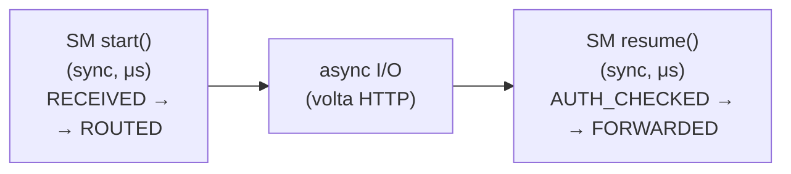

# Async Integration Guide — tramli + async I/O

tramli is intentionally **synchronous**. It makes judgments (state transitions) in microseconds.
Async I/O (HTTP calls, DB queries) happens **outside** the SM engine.

## The Pattern: sync judgment + async execution



### Why TypeScript has optional async — and Java/Rust don't

All three languages share the same principle: **SM is sync, I/O is outside.**
But TypeScript has an extra option: `AsyncStateProcessor` for External transitions.

Why only TypeScript?

```
Java:
  ❌ async not needed. Virtual threads (Java 21) handle blocking I/O
     without async/await. Thread.startVirtualThread(() -> blockingCall())
     is simpler and fully debuggable with stack traces.

Rust:
  ❌ async is dangerous inside the SM. Rust's compiler turns async fn into
     a Future state machine. If the SM engine is async, the Future includes
     &mut FlowEngine + FlowContext + all processor state across .await points.
     With 3+ states → stack overflow. (See rust/ASYNC_STACK_ISSUE.md)

TypeScript:
  ✅ async is safe and cheap. Promise is heap-allocated (~1μs overhead).
     No stack size issues. No ownership issues. And TS developers expect
     async/await — fighting the ecosystem creates friction.
```

**The rule for TypeScript:** async processors are only allowed on **External transitions** (guard/processor that runs at an async boundary). Auto transitions must remain sync — auto-chain fires multiple transitions in sequence, and making each one async adds unnecessary microtask overhead.

```typescript
// ✅ Auto transition: sync (fast judgment, no I/O)
.from(CREATED).auto(PAYMENT_PENDING, syncProcessor)

// ✅ External transition: async OK (waits for external event anyway)
.from(PAYMENT_PENDING).external(CONFIRMED, asyncGuard, asyncProcessor)
```

### Why not async SM? (for Java and Rust)

1. **Complexity**: async traits, pinning, lifetime issues — for ~2μs of work
2. **Testability**: sync processors are trivially testable without async runtime
3. **Portability**: sync code works everywhere (WASM, embedded, etc.)

### How to use with async runtimes

```rust
// tokio example
async fn handle_request(engine: &FlowEngine, req: Request) -> Response {
    // 1. Start flow (sync — microseconds)
    let flow = engine.start_flow(&definition, None, initial_data);
    // SM auto-chains: RECEIVED → VALIDATED → ROUTED (stops at External)

    // 2. Async I/O outside SM
    let auth_result = volta_client.check_auth(&req).await;

    // 3. Resume flow with result (sync — microseconds)  
    let flow = engine.resume_and_execute(flow.id(), &definition, auth_data);
    // SM auto-chains: AUTH_CHECKED → (stops at next External)

    // 4. More async I/O
    let backend_response = backend_client.forward(&req).await;

    // 5. Resume again (sync — microseconds)
    let flow = engine.resume_and_execute(flow.id(), &definition, response_data);
    // SM auto-chains: FORWARDED → RESPONSE_RECEIVED → COMPLETED

    // 6. Extract result
    flow.context().get::<ProxyResponse>()
}
```

### Key rules

- **SM never blocks**: all processors must be sync and fast (no I/O)
- **External transitions are async boundaries**: each External = one async I/O call
- **FlowContext carries data across boundaries**: auth result goes in, response comes out
- **Multiple External transitions are fine**: design your flow with one per async operation

### volta-gateway example

```
Flow: RECEIVED → VALIDATED → ROUTED → [External] → AUTH_CHECKED → [External] → FORWARDED → COMPLETED
                                       ↑ volta call                ↑ backend call

Two External transitions = two async boundaries = two resume() calls.
SM stays sync. Async lives in the tower::Service implementation.
```
