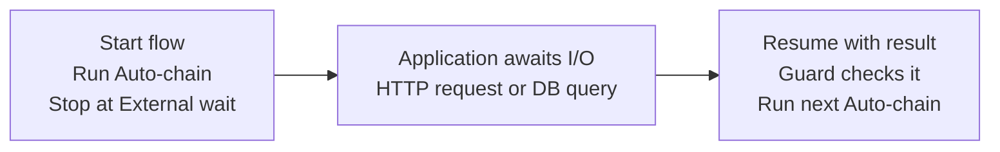

# Async Integration Guide — tramli + async I/O

This guide is for engineers connecting a tramli flow to HTTP services, databases, or other I/O.
It explains why waiting inside a processor complicates execution, then shows how to pass I/O results through External transitions.
Java and Rust use synchronous engines; TypeScript also supports async callbacks, with the usage guidance below.

## Why I/O inside a processor needs care

Suppose an order processor calls a payment service before preparing a shipment. If the service is slow, the processor cannot finish and the next automatic transition cannot run. A synchronous call blocks its calling thread; an async call lets the runtime do other work, but that flow still waits for the response.

Combining the HTTP call with the data transformation also makes tests depend on a client or a mock. And `requires` / `produces` only describes the data a processor reads and writes: `build()` cannot check whether the payment service is reachable or whether a request will succeed.

The recommended pattern is to make the wait explicit in the flow. Keep local data transformations in processors, do I/O in the calling application, and pass the result back when resuming an External transition.

## The Pattern: sync judgment + async execution

An **External transition** waits for the application to resume the flow. An **Auto-chain** is the sequence of automatic transitions the engine runs until it reaches a wait or completes the flow.

1. Start the flow. Let the Auto-chain prepare the data needed for the request and stop at an External wait.
2. Perform the HTTP call or database query in the application.
3. Resume the flow with the result as external data. The guard checks whether to accept it; the processor and following Auto-chain then run.
4. If another I/O operation is needed, repeat at the next External wait.


```mermaid
flowchart LR
    Start["Start flow<br/>Run Auto-chain<br/>Stop at External wait"]
    Async["Application awaits I/O<br/>HTTP request or DB query"]
    Resume["Resume with result<br/>Guard checks it<br/>Run next Auto-chain"]

    Start --> Async --> Resume
```

The application owns the I/O call and its error handling. Resuming a flow does not itself send a request. `FlowContext` holds the data passed between the application, guards, and processors.

### How to use with async runtimes

The following fragments come from the existing [I/O separation patterns](patterns/io-separation.md#pattern-1-external--auto-chain-recommended). They exchange a login callback for authentication tokens using OpenID Connect, a sign-in protocol. The clients, callback, and `OidcTokens` type or key belong to the application; they are not tramli APIs.

The flow has already started and is waiting at an External transition. Its definition must declare the data supplied from outside with `externallyProvided` (Rust: `externally_provided`) and the data each guard or processor requires. See the [builder API](../lang/ts/src/flow-definition.ts) for the TypeScript declarations.

**Java:** call I/O in the application, then resume with a map keyed by data type. A virtual thread can run the blocking call.

```java
var tokens = oidcService.exchangeCode(callback);
engine.resumeAndExecute(flowId, def, Map.of(OidcTokens.class, tokens));
```

**TypeScript:** await both the I/O and the engine call. The map carries the result into the flow's context.

```typescript
const tokens = await oidcService.exchangeCode(callback);
await engine.resumeAndExecute(flowId, def, new Map([['OidcTokens', tokens]]));
```

**Rust:** await I/O in the caller, then make a synchronous engine call. `TypeId` identifies the data type; `?` passes an error back to the caller.

```rust
let tokens = oidc_service.exchange_code(&callback).await?;
engine.resume_and_execute(&flow_id, vec![(TypeId::of::<OidcTokens>(), Box::new(tokens))])?;
```

In Rust, `start_flow` returns a flow ID, and `resume_and_execute` returns `Result<(), FlowError>`. The flow already holds its definition; there is no definition argument on resume. The [Rust quick start](../lang/rust/README.md#quick-start) shows the complete setup and how to read the resulting state from the store.

### Why TypeScript has optional async — and Java/Rust don't

Java and Rust expose synchronous processor and guard methods. TypeScript's `StateProcessor.process` returns `void | Promise<void>`, and `TransitionGuard.validate` returns `GuardOutput | Promise<GuardOutput>`. The TypeScript engine awaits those callbacks and returns a `Promise<FlowInstance>` from both `startFlow` and `resumeAndExecute`.

If an External processor needs to make an I/O call, it can use `async process` on the ordinary `StateProcessor` interface. This existing [processor example](patterns/io-separation.md#pattern-2-portadapter--constructor-injection-good) takes a `port`: an application-defined object whose `exchange` method performs the token request. Tests can supply a substitute object with the same method.

```typescript
const tokenExchangeProcessor = (port: TokenExchangePort): StateProcessor<S> => ({
  name: 'TokenExchange',
  requires: [OidcCallback], produces: [OidcTokens],
  async process(ctx) {
    const cb = ctx.get(OidcCallback);
    ctx.put(OidcTokens, await port.exchange(cb.code, cb.redirectUri));
  },
});
```

Here, `S` is the application's state type and the `OidcCallback` / `OidcTokens` keys are defined by the application. There is no separate async processor interface.

**Keep Auto processors and Branch decisions synchronous; reserve async callbacks for External transitions.** This is the recommended design rule: it keeps automatic chains focused on local work. It is not enforced by TypeScript's types. The current [callback interfaces](../lang/ts/src/types.ts) also allow promises for Auto processors and Branch decisions, and the [engine](../lang/ts/src/flow-engine.ts) awaits them.

An async External processor still keeps that resume call pending until the I/O finishes. For waits lasting minutes or hours, use a separate External waiting state and an appropriate flow lifetime (TTL), as described in [long-lived flows](patterns/long-lived-flows.md).

### Why not async SM? (for Java and Rust)

Here, SM means state machine: the engine that advances the flow. Its synchronous API separates the decision about the next state from the application's I/O runtime.

- **Java:** the caller can use Java 21 virtual threads or `CompletableFuture` for I/O without changing the engine API.
- **Rust:** the caller can await I/O in an async task while processors remain ordinary synchronous trait implementations. The engine API does not introduce async-trait, pinning, or lifetime requirements for those processors.
- **Tests:** local data transformations can be tested without an async runtime or network client.

This is an API design choice, not a claim that Rust async inherently causes stack overflow. The linked [Rust diagnostic](../lang/rust/ASYNC_STACK_ISSUE.md) identifies a context-cloning problem and explicitly says async was unrelated.

### Key rules

- Keep Auto processors fast and free of I/O. A synchronous signature alone does not prevent blocking.
- Use an External wait for each point where the flow needs a result from outside. External events can also be user actions or callbacks; they do not have to correspond to exactly one HTTP call.
- Pass the result as external data and declare its role in the flow's data dependencies.
- Handle I/O failures in the application. `build()` validates the flow structure, not the external service.
- Use multiple External waits when later requests depend on earlier results.

<a id="volta-gateway-example"></a>

### Example: authenticate a request, then forward it

A request-handling service first checks authentication with one service, then forwards the request to a backend. These are two separate I/O operations, so the flow has two waiting points:

```text
RECEIVED → VALIDATED → ROUTED → [External] → AUTH_CHECKED → [External] → FORWARDED → COMPLETED
                                   ↑ authentication result     ↑ backend response
```

The application makes the authentication request and resumes with its result. Once the flow is ready for the backend request, the application makes that call and resumes again with the response. The two resume calls make it clear which result each part of the flow is waiting for.
