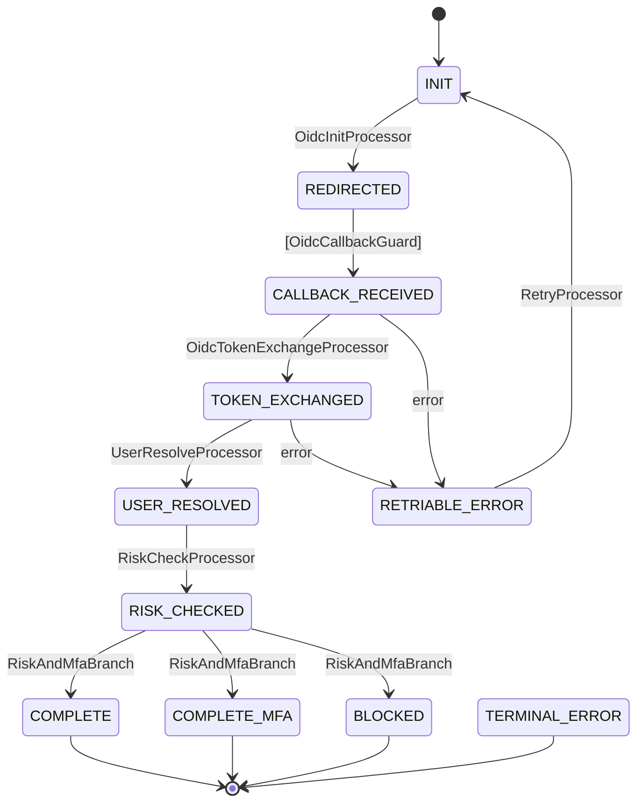

# 実践例: OIDC 認証フロー

> [volta-auth-proxy](https://github.com/opaopa6969/volta-auth-proxy) より — tramli で 4 つの認証フローを管理するマルチテナント ID ゲートウェイ。

9 ステート、5 プロセッサ、1 ガード、1 ブランチの本番フロー。tramli が実世界の複雑さをどう扱うかを示す。

---

## 1. ステートを定義

```java
enum OidcState implements FlowState {
    INIT(false, true),              // 初期 — ユーザーが「Google でログイン」をクリック
    REDIRECTED(false, false),       // リダイレクト URL 生成済み、コールバック待ち
    CALLBACK_RECEIVED(false, false),// OAuth コールバック到着
    TOKEN_EXCHANGED(false, false),  // IdP からトークン取得済み
    USER_RESOLVED(false, false),    // DB でユーザー検索/作成済み
    RISK_CHECKED(false, false),     // リスク評価完了
    COMPLETE(true, false),          // セッション発行、完了
    COMPLETE_MFA(true, false),      // セッション発行、MFA 待ち
    BLOCKED(true, false),           // リスク高、ブロック
    RETRIABLE_ERROR(false, false),  // 一時エラー、リトライ可能
    TERMINAL_ERROR(true, false);    // 回復不能エラー
    // ...
}
```

11 ステート。各ステートの名前が「ユーザーがログインプロセスのどこにいるか」を示す。

## 2. コンテキストデータを定義

```java
record OidcRequest(String provider, String returnTo) {}
record OidcRedirect(String authUrl, String state, String nonce) {}
record OidcCallback(String code, String state) {}
record OidcTokens(String idToken, String accessToken) {}
record ResolvedUser(String userId, String email, boolean mfaRequired) {}
record RiskCheckResult(String level, boolean blocked) {}
record IssuedSession(String sessionId, String redirectTo) {}
```

7 つのデータ型。プロセッサ間をデータが流れる — tramli が `build()` 時にこのチェーンを検証する。

## 3. プロセッサを書く（1 遷移 = 1 プロセッサ）

```java
// ステップ 1: OAuth リダイレクト URL を生成
StateProcessor oidcInit = new StateProcessor() {
    @Override public String name() { return "OidcInitProcessor"; }
    @Override public Set<Class<?>> requires() { return Set.of(OidcRequest.class); }
    @Override public Set<Class<?>> produces() { return Set.of(OidcRedirect.class); }
    @Override public void process(FlowContext ctx) {
        OidcRequest req = ctx.get(OidcRequest.class);
        String state = generateRandomState();
        String authUrl = buildAuthUrl(req.provider(), state);
        ctx.put(OidcRedirect.class, new OidcRedirect(authUrl, state, generateNonce()));
    }
};

// ステップ 2: 認可コードをトークンに交換
StateProcessor tokenExchange = new StateProcessor() {
    @Override public String name() { return "OidcTokenExchangeProcessor"; }
    @Override public Set<Class<?>> requires() { return Set.of(OidcCallback.class, OidcRedirect.class); }
    @Override public Set<Class<?>> produces() { return Set.of(OidcTokens.class); }
    @Override public void process(FlowContext ctx) {
        OidcCallback cb = ctx.get(OidcCallback.class);
        OidcRedirect redirect = ctx.get(OidcRedirect.class);
        if (!cb.state().equals(redirect.state())) throw new FlowException("STATE_MISMATCH", "...");
        ctx.put(OidcTokens.class, oidcService.exchangeCode(cb.code()));
    }
};

// ステップ 3: トークンからユーザーを検索/作成
// ステップ 4: リスク評価
// ステップ 5: セッション発行
// （各プロセッサは同じパターン: requires → process → produces）
```

各プロセッサは**自己完結**。他を読まずにテスト・修正できる。

## 4. ガードとブランチ

```java
// ガード: OAuth コールバックを検証（External 遷移）
TransitionGuard callbackGuard = new TransitionGuard() {
    @Override public String name() { return "OidcCallbackGuard"; }
    @Override public Set<Class<?>> requires() { return Set.of(OidcRedirect.class); }
    @Override public Set<Class<?>> produces() { return Set.of(OidcCallback.class); }
    // ...
};

// ブランチ: リスク評価 + MFA 要否で分岐
BranchProcessor riskBranch = new BranchProcessor() {
    @Override public String name() { return "RiskAndMfaBranch"; }
    @Override public Set<Class<?>> requires() { return Set.of(ResolvedUser.class, RiskCheckResult.class); }
    @Override public String decide(FlowContext ctx) {
        RiskCheckResult risk = ctx.get(RiskCheckResult.class);
        if (risk.blocked()) return "blocked";
        return ctx.get(ResolvedUser.class).mfaRequired() ? "mfa" : "complete";
    }
};
```

## 5. フローを定義

```java
var oidcFlow = Tramli.define("oidc", OidcState.class)
    .ttl(Duration.ofMinutes(10))
    .initiallyAvailable(OidcRequest.class)
    // ハッピーパス
    .from(INIT).auto(REDIRECTED, oidcInit)
    .from(REDIRECTED).external(CALLBACK_RECEIVED, callbackGuard)
    .from(CALLBACK_RECEIVED).auto(TOKEN_EXCHANGED, tokenExchange)
    .from(TOKEN_EXCHANGED).auto(USER_RESOLVED, userResolve)
    .from(USER_RESOLVED).auto(RISK_CHECKED, riskCheck)
    // ブランチ: リスク評価結果
    .from(RISK_CHECKED).branch(riskBranch)
        .to(COMPLETE, "complete", sessionIssue)
        .to(COMPLETE_MFA, "mfa", sessionIssue)
        .to(BLOCKED, "blocked")
        .endBranch()
    // エラーハンドリング
    .onError(CALLBACK_RECEIVED, RETRIABLE_ERROR)
    .onError(TOKEN_EXCHANGED, RETRIABLE_ERROR)
    .onAnyError(TERMINAL_ERROR)
    .from(RETRIABLE_ERROR).auto(INIT, retryProcessor)
    .build();  // ← 8 項目検証 + データフロー検証
```

上から読むだけで**フロー全体が分かる**。他のファイルを読む必要がない。

## 6. 実行

```java
var engine = Tramli.engine(store);

// ユーザーが「Google でログイン」をクリック
var flow = engine.startFlow(oidcFlow, sessionId,
    Map.of(OidcRequest.class, new OidcRequest("GOOGLE", "/dashboard")));
// Auto-chain: INIT → REDIRECTED（停止 — External 遷移）

// OAuth コールバック到着
flow = engine.resumeAndExecute(flow.id(), oidcFlow);
// Auto-chain: CALLBACK_RECEIVED → TOKEN_EXCHANGED → USER_RESOLVED
//           → RISK_CHECKED → branch → COMPLETE（terminal、完了）

IssuedSession session = flow.context().get(IssuedSession.class);
// → セッション Cookie を設定、session.redirectTo() にリダイレクト
```

**1 回の HTTP コールバック → 5 つの遷移が自動実行。** 各プロセッサはマイクロ秒。チェーンはエンジンが処理。

## 7. 自動生成ダイアグラム

### ステート遷移図



### データフロー図

```mermaid
flowchart LR
    initial -->|produces| OidcRequest
    OidcRequest -->|requires| OidcInitProcessor
    OidcInitProcessor -->|produces| OidcRedirect
    OidcRedirect -->|requires| OidcCallbackGuard
    OidcCallbackGuard -->|produces| OidcCallback
    OidcCallback -->|requires| OidcTokenExchangeProcessor
    OidcRedirect -->|requires| OidcTokenExchangeProcessor
    OidcTokenExchangeProcessor -->|produces| OidcTokens
    OidcTokens -->|requires| UserResolveProcessor
    UserResolveProcessor -->|produces| ResolvedUser
    ResolvedUser -->|requires| RiskCheckProcessor
    OidcRequest -->|requires| RiskCheckProcessor
    RiskCheckProcessor -->|produces| RiskCheckResult
    ResolvedUser -->|requires| RiskAndMfaBranch
    RiskCheckResult -->|requires| RiskAndMfaBranch
    ResolvedUser -->|requires| SessionIssueProcessor
    OidcRequest -->|requires| SessionIssueProcessor
    SessionIssueProcessor -->|produces| IssuedSession
```



どちらも**コードと同じ FlowDefinition から生成**。古くなることがない。

## build() が捕まえるもの

新しいプロセッサが `FraudScore` を必要とするのに誰も produces していない場合:

```
Flow 'oidc' has 1 validation error(s):
  - Processor 'FraudCheckProcessor' at RISK_CHECKED → COMPLETE
    requires FraudScore but it may not be available
```

**コードが実行される前にエラーが出る。** デプロイも 3 時の障害もない。

---

## 8. プラグインで拡張する

上のフロー定義は**一切変更しない**。プラグインは外側から重ねるだけ — Processor もフローグラフも触らない。

> 以下のコード例は 3 言語すべてで示す。使う言語を選んでください。

### 8.1 プラグイン登録

<details open><summary><b>Java</b></summary>

```java
var sink = new InMemoryTelemetrySink();
var registry = new PluginRegistry<OidcState>();
registry
    .register(PolicyLintPlugin.defaults())
    .register(new AuditStorePlugin())
    .register(new EventLogStorePlugin())
    .register(new ObservabilityEnginePlugin(sink))
    .register(new RichResumeRuntimePlugin())
    .register(new IdempotencyRuntimePlugin(new InMemoryIdempotencyRegistry()));

var report = registry.analyzeAll(oidcFlow);
var wrappedStore = registry.applyStorePlugins(new InMemoryFlowStore());
var engine = Tramli.engine(wrappedStore);
registry.installEnginePlugins(engine);
var adapters = registry.bindRuntimeAdapters(engine);
```
</details>

<details><summary><b>TypeScript</b></summary>

```typescript
const sink = new InMemoryTelemetrySink();
const registry = new PluginRegistry<OidcState>();
registry
  .register(PolicyLintPlugin.defaults())
  .register(new AuditStorePlugin())
  .register(new EventLogStorePlugin())
  .register(new ObservabilityEnginePlugin(sink))
  .register(new RichResumeRuntimePlugin())
  .register(new IdempotencyRuntimePlugin(new InMemoryIdempotencyRegistry()));

const report = registry.analyzeAll(oidcFlow);
const wrappedStore = registry.applyStorePlugins(new InMemoryFlowStore());
const engine = Tramli.engine(wrappedStore);
registry.installEnginePlugins(engine);
const adapters = registry.bindRuntimeAdapters(engine);
```
</details>

<details><summary><b>Rust</b></summary>

```rust
let sink = Arc::new(InMemoryTelemetrySink::new());
let observability = ObservabilityPlugin::new(sink.clone());

let linter = PolicyLintPlugin::<OidcState>::defaults();
let mut report = PluginReport::new();
linter.analyze(&oidc_flow, &mut report);

let mut engine = FlowEngine::new(InMemoryFlowStore::new());
observability.install(&mut engine);

let idempotency = InMemoryIdempotencyRegistry::new();
```
</details>

### 8.2 Lint — 設計時ポリシーチェック

CI で回して設計の臭いを出荷前に検出する。

<details open><summary><b>Java</b></summary>

```java
var report = registry.analyzeAll(oidcFlow);
for (var finding : report.findings()) {
    System.out.println("[" + finding.severity() + "] " + finding.pluginId() + ": " + finding.message());
}
// → [WARN] policy/dead-data: produced but never consumed: IssuedSession
```
</details>

<details><summary><b>TypeScript</b></summary>

```typescript
const report = registry.analyzeAll(oidcFlow);
for (const finding of report.findings()) {
  console.warn(`[${finding.severity}] ${finding.pluginId}: ${finding.message}`);
}
```
</details>

<details><summary><b>Rust</b></summary>

```rust
let linter = PolicyLintPlugin::<OidcState>::defaults();
let mut report = PluginReport::new();
linter.analyze(&oidc_flow, &mut report);
println!("{}", report.as_text());
```
</details>

デフォルト4ポリシー: **terminal-outgoing**、**external-count** (>3)、**dead-data**、**overwide-processor** (>3 produces)。カスタムポリシーは関数1つで追加可能。

### 8.3 Audit — 「このログインで何が起きた？」

全遷移が生成データのスナップショット付きで記録される。

<details open><summary><b>Java</b></summary>

```java
var auditStore = (AuditingFlowStore) wrappedStore;
for (var record : auditStore.auditedTransitions()) {
    log.info("{} → {} at {}", record.from(), record.to(), record.timestamp());
    log.info("  produced: {}", record.producedDataSnapshot());
}
// → INIT → REDIRECTED at 2026-04-09T10:00:01 produced: {OidcRedirect=...}
// → REDIRECTED → CALLBACK_RECEIVED at ... produced: {OidcCallback=...}
// → CALLBACK_RECEIVED → TOKEN_EXCHANGED at ... produced: {OidcTokens=...}
```
</details>

<details><summary><b>TypeScript</b></summary>

```typescript
const auditStore = wrappedStore as AuditingFlowStore;
for (const record of auditStore.auditedTransitions) {
  console.log(`${record.from} → ${record.to} at ${record.timestamp}`);
  console.log('  produced:', record.producedDataSnapshot);
}
```
</details>

<details><summary><b>Rust</b></summary>

```rust
for record in audit_store.audited_transitions() {
    println!("{} → {} at {:?}", record.from, record.to, record.timestamp);
}
```
</details>

### 8.4 Event Store — リプレイと補償

バージョン付きイベントログで状態再構築と Saga 補償ができる。

<details open><summary><b>Java</b></summary>

```java
// リプレイ: 「バージョン3時点でユーザーはどの状態だった？」
var replay = new ReplayService();
var stateAtV3 = replay.stateAtVersion(eventStore.events(), flowId, 3);
// → "TOKEN_EXCHANGED"

// プロジェクション: フローごとの遷移回数をカウント
var projection = new ProjectionReplayService();
int count = projection.stateAtVersion(eventStore.events(), flowId, 999,
    new ProjectionReducer<Integer>() {
        public Integer initialState() { return 0; }
        public Integer apply(Integer state, VersionedTransitionEvent e) { return state + 1; }
    });

// 補償: トークン交換失敗時のロールバック
var compensation = new CompensationService(
    (event, cause) -> event.trigger().equals("OidcTokenExchangeProcessor")
        ? new CompensationPlan("REVOKE_PARTIAL_SESSION", Map.of("reason", cause.getMessage()))
        : null,
    eventStore);
```
</details>

<details><summary><b>TypeScript</b></summary>

```typescript
// リプレイ
const replay = new ReplayService();
const stateAtV3 = replay.stateAtVersion(eventStore.events(), flowId, 3);

// プロジェクション
const projection = new ProjectionReplayService();
const count = projection.stateAtVersion(eventStore.events(), flowId, 999,
  { initialState: () => 0, apply: (n, _event) => n + 1 });

// 補償
const compensation = new CompensationService(
  (event, cause) => event.trigger === 'OidcTokenExchangeProcessor'
    ? { action: 'REVOKE_PARTIAL_SESSION', metadata: { reason: cause.message } }
    : null,
  eventStore);
```
</details>

<details><summary><b>Rust</b></summary>

```rust
// リプレイ
let state_at_v3 = ReplayService::state_at_version(event_store.events(), &flow_id, 3);

// プロジェクション
struct CountReducer;
impl ProjectionReducer<usize> for CountReducer {
    fn initial_state(&self) -> usize { 0 }
    fn apply(&self, state: usize, _event: &VersionedTransitionEvent) -> usize { state + 1 }
}
let count = ProjectionReplayService::state_at_version(
    event_store.events(), &flow_id, 999, &CountReducer);

// 補償
let compensation = CompensationService::new(Box::new(|event, cause| {
    if event.trigger == "OidcTokenExchangeProcessor" {
        Some(CompensationPlan { action: "REVOKE_PARTIAL_SESSION".into(), metadata: cause.into() })
    } else { None }
}));
```
</details>

### 8.5 Rich Resume — ステータス分類

コールバック到着時に何が起きたかを正確に知る。

<details open><summary><b>Java</b></summary>

```java
var resume = (RichResumeExecutor) adapters.get("rich-resume");
var result = resume.resume(flowId, oidcFlow, externalData, OidcState.REDIRECTED);

switch (result.status()) {
    case TRANSITIONED          -> handleSuccess(result.flow());
    case ALREADY_COMPLETED     -> respond(200, "already logged in");
    case REJECTED              -> respond(400, "callback invalid");
    case NO_APPLICABLE_TRANSITION -> respond(404, "no pending login");
    case EXCEPTION_ROUTED      -> handleError(result.error());
}
```
</details>

<details><summary><b>TypeScript</b></summary>

```typescript
const executor = new RichResumeExecutor(engine);
const result = await executor.resume(flowId, oidcFlow, externalData, 'REDIRECTED');

switch (result.status) {
  case 'TRANSITIONED':          return handleSuccess(result.flow!);
  case 'ALREADY_COMPLETE':      return res.json({ msg: 'already logged in' });
  case 'REJECTED':              return res.status(400).json({ msg: 'callback invalid' });
  case 'NO_APPLICABLE_TRANSITION': return res.status(404).json({ msg: 'no pending login' });
  case 'EXCEPTION_ROUTED':      return handleError(result.error!);
}
```
</details>

<details><summary><b>Rust</b></summary>

```rust
let result = RichResumeExecutor::resume(&mut engine, &flow_id, external_data, OidcState::Redirected);

match result.status {
    RichResumeStatus::Transitioned      => handle_success(&flow_id),
    RichResumeStatus::AlreadyComplete   => respond(200, "already logged in"),
    RichResumeStatus::Rejected          => respond(400, "callback invalid"),
    RichResumeStatus::NoApplicableTransition => respond(404, "no pending login"),
    RichResumeStatus::ExceptionRouted   => handle_error(result.error),
}
```
</details>

### 8.6 Idempotency — 二重コールバック防止

OAuth コールバックは二重送信されうる（ユーザーのリフレッシュ、ネットワークリトライ）。`state` パラメータを `commandId` に使う。

<details open><summary><b>Java</b></summary>

```java
var idempotent = (IdempotentRichResumeExecutor) adapters.get("idempotency");
var result = idempotent.resume(flowId, oidcFlow,
    new CommandEnvelope("callback-" + oauthState, externalData),
    OidcState.REDIRECTED);

if (result.status() == ALREADY_COMPLETED) {
    return "login already processed";  // 2回目のコールバック → 安全な no-op
}
```
</details>

<details><summary><b>TypeScript</b></summary>

```typescript
const idempotent = new IdempotentRichResumeExecutor(engine, new InMemoryIdempotencyRegistry());
const result = await idempotent.resume(flowId, oidcFlow,
  { commandId: `callback-${oauthState}`, externalData },
  'REDIRECTED');

if (result.status === 'ALREADY_COMPLETE') {
  return 'login already processed';
}
```
</details>

<details><summary><b>Rust</b></summary>

```rust
let registry = InMemoryIdempotencyRegistry::new();
let result = IdempotentRichResumeExecutor::resume(
    &mut engine, &registry, &flow_id,
    CommandEnvelope { command_id: format!("callback-{}", oauth_state), external_data },
    OidcState::Redirected);

if result.status == RichResumeStatus::AlreadyComplete {
    return "login already processed";
}
```
</details>

### 8.7 ダイアグラムとドキュメント生成

<details open><summary><b>Java</b></summary>

```java
// ダイアグラム一括生成
var bundle = new DiagramPlugin().generate(oidcFlow);
writeFile("oidc-state.mmd", bundle.mermaid());
writeFile("oidc-dataflow.json", bundle.dataFlowJson());

// マークダウンカタログ
var docs = new DocumentationPlugin().toMarkdown(oidcFlow);

// BDD テストシナリオ（遷移ごとに1つ）
var plan = new ScenarioTestPlugin().generate(oidcFlow);
// → 11 シナリオが自動生成
```
</details>

<details><summary><b>TypeScript</b></summary>

```typescript
const bundle = new DiagramPlugin().generate(oidcFlow);
const docs = new DocumentationPlugin().toMarkdown(oidcFlow);
const plan = new ScenarioTestPlugin().generate(oidcFlow);
```
</details>

<details><summary><b>Rust</b></summary>

```rust
let bundle = DiagramPlugin::generate(&oidc_flow);
let docs = DocumentationPlugin::to_markdown(&oidc_flow);
let plan = ScenarioTestPlugin::generate(&oidc_flow);
```
</details>

### プラグインがこのフローに追加する価値

| 課題 | プラグインなし | プラグインあり |
|------|--------------|--------------|
| OAuth コールバック二重送信 | 2回実行される | `IdempotencyRuntimePlugin` が `state` パラメータで弾く |
| 「ログインXで何が起きた？」 | `transitionLog` だけ | `AuditStorePlugin` が各遷移のデータスナップショットも残す |
| 障害後のステート再構築 | 最新状態のみ | `ReplayService` で任意バージョンを復元 |
| 「コールバックで遷移した？拒否された？」 | 手動で状態比較 | `RichResumeStatus` が5分類で返す |
| CI で設計ミスを検出 | `build()` の8項目 | `PolicyLintPlugin` がさらに dead data / overwide processor を検出 |
| 非エンジニアへの説明 | Mermaid だけ | `DiagramBundle` + マークダウンカタログ + BDD シナリオ |

**コアのフロー定義: 変更なし。Processor: 変更なし。プラグイン: 外から重ねるだけ。**

---

*これは volta-auth-proxy で本番稼働中の実際のフローです。OIDC、Passkey、MFA、招待フローを tramli で管理しています。*
