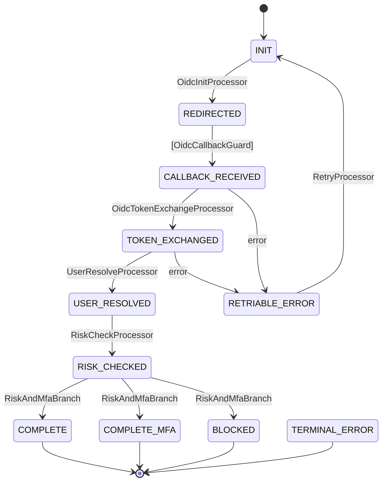

# 実践例: OIDC 認証フロー

> [volta-auth-proxy](https://github.com/opaopa6969/volta-auth-proxy) より — tramli で 4 つの認証フローを管理するマルチテナント ID ゲートウェイ。

9 ステート、5 プロセッサ、1 ガード、1 ブランチの本番フロー。tramli が実世界の複雑さをどう扱うかを示す。

---

## 1. ステートを定義

```java
enum OidcState implements FlowState {
    INIT(false, true),              // 初期 — ユーザーが「Google でログイン」をクリック
    REDIRECTED(false, false),       // リダイレクト URL 生成済み、コールバック待ち
    CALLBACK_RECEIVED(false, false),// OAuth コールバック到着
    TOKEN_EXCHANGED(false, false),  // IdP からトークン取得済み
    USER_RESOLVED(false, false),    // DB でユーザー検索/作成済み
    RISK_CHECKED(false, false),     // リスク評価完了
    COMPLETE(true, false),          // セッション発行、完了
    COMPLETE_MFA(true, false),      // セッション発行、MFA 待ち
    BLOCKED(true, false),           // リスク高、ブロック
    RETRIABLE_ERROR(false, false),  // 一時エラー、リトライ可能
    TERMINAL_ERROR(true, false);    // 回復不能エラー
    // ...
}
```

11 ステート。各ステートの名前が「ユーザーがログインプロセスのどこにいるか」を示す。

## 2. コンテキストデータを定義

```java
record OidcRequest(String provider, String returnTo) {}
record OidcRedirect(String authUrl, String state, String nonce) {}
record OidcCallback(String code, String state) {}
record OidcTokens(String idToken, String accessToken) {}
record ResolvedUser(String userId, String email, boolean mfaRequired) {}
record RiskCheckResult(String level, boolean blocked) {}
record IssuedSession(String sessionId, String redirectTo) {}
```

7 つのデータ型。プロセッサ間をデータが流れる — tramli が `build()` 時にこのチェーンを検証する。

## 3. プロセッサを書く（1 遷移 = 1 プロセッサ）

```java
// ステップ 1: OAuth リダイレクト URL を生成
StateProcessor oidcInit = new StateProcessor() {
    @Override public String name() { return "OidcInitProcessor"; }
    @Override public Set<Class<?>> requires() { return Set.of(OidcRequest.class); }
    @Override public Set<Class<?>> produces() { return Set.of(OidcRedirect.class); }
    @Override public void process(FlowContext ctx) {
        OidcRequest req = ctx.get(OidcRequest.class);
        String state = generateRandomState();
        String authUrl = buildAuthUrl(req.provider(), state);
        ctx.put(OidcRedirect.class, new OidcRedirect(authUrl, state, generateNonce()));
    }
};

// ステップ 2: 認可コードをトークンに交換
StateProcessor tokenExchange = new StateProcessor() {
    @Override public String name() { return "OidcTokenExchangeProcessor"; }
    @Override public Set<Class<?>> requires() { return Set.of(OidcCallback.class, OidcRedirect.class); }
    @Override public Set<Class<?>> produces() { return Set.of(OidcTokens.class); }
    @Override public void process(FlowContext ctx) {
        OidcCallback cb = ctx.get(OidcCallback.class);
        OidcRedirect redirect = ctx.get(OidcRedirect.class);
        if (!cb.state().equals(redirect.state())) throw new FlowException("STATE_MISMATCH", "...");
        ctx.put(OidcTokens.class, oidcService.exchangeCode(cb.code()));
    }
};

// ステップ 3: トークンからユーザーを検索/作成
// ステップ 4: リスク評価
// ステップ 5: セッション発行
// （各プロセッサは同じパターン: requires → process → produces）
```

各プロセッサは**自己完結**。他を読まずにテスト・修正できる。

## 4. ガードとブランチ

```java
// ガード: OAuth コールバックを検証（External 遷移）
TransitionGuard callbackGuard = new TransitionGuard() {
    @Override public String name() { return "OidcCallbackGuard"; }
    @Override public Set<Class<?>> requires() { return Set.of(OidcRedirect.class); }
    @Override public Set<Class<?>> produces() { return Set.of(OidcCallback.class); }
    // ...
};

// ブランチ: リスク評価 + MFA 要否で分岐
BranchProcessor riskBranch = new BranchProcessor() {
    @Override public String name() { return "RiskAndMfaBranch"; }
    @Override public Set<Class<?>> requires() { return Set.of(ResolvedUser.class, RiskCheckResult.class); }
    @Override public String decide(FlowContext ctx) {
        RiskCheckResult risk = ctx.get(RiskCheckResult.class);
        if (risk.blocked()) return "blocked";
        return ctx.get(ResolvedUser.class).mfaRequired() ? "mfa" : "complete";
    }
};
```

## 5. フローを定義

```java
var oidcFlow = Tramli.define("oidc", OidcState.class)
    .ttl(Duration.ofMinutes(10))
    .initiallyAvailable(OidcRequest.class)
    // ハッピーパス
    .from(INIT).auto(REDIRECTED, oidcInit)
    .from(REDIRECTED).external(CALLBACK_RECEIVED, callbackGuard)
    .from(CALLBACK_RECEIVED).auto(TOKEN_EXCHANGED, tokenExchange)
    .from(TOKEN_EXCHANGED).auto(USER_RESOLVED, userResolve)
    .from(USER_RESOLVED).auto(RISK_CHECKED, riskCheck)
    // ブランチ: リスク評価結果
    .from(RISK_CHECKED).branch(riskBranch)
        .to(COMPLETE, "complete", sessionIssue)
        .to(COMPLETE_MFA, "mfa", sessionIssue)
        .to(BLOCKED, "blocked")
        .endBranch()
    // エラーハンドリング
    .onError(CALLBACK_RECEIVED, RETRIABLE_ERROR)
    .onError(TOKEN_EXCHANGED, RETRIABLE_ERROR)
    .onAnyError(TERMINAL_ERROR)
    .from(RETRIABLE_ERROR).auto(INIT, retryProcessor)
    .build();  // ← 8 項目検証 + データフロー検証
```

上から読むだけで**フロー全体が分かる**。他のファイルを読む必要がない。

## 6. 実行

```java
var engine = Tramli.engine(store);

// ユーザーが「Google でログイン」をクリック
var flow = engine.startFlow(oidcFlow, sessionId,
    Map.of(OidcRequest.class, new OidcRequest("GOOGLE", "/dashboard")));
// Auto-chain: INIT → REDIRECTED（停止 — External 遷移）

// OAuth コールバック到着
flow = engine.resumeAndExecute(flow.id(), oidcFlow);
// Auto-chain: CALLBACK_RECEIVED → TOKEN_EXCHANGED → USER_RESOLVED
//           → RISK_CHECKED → branch → COMPLETE（terminal、完了）

IssuedSession session = flow.context().get(IssuedSession.class);
// → セッション Cookie を設定、session.redirectTo() にリダイレクト
```

**1 回の HTTP コールバック → 5 つの遷移が自動実行。** 各プロセッサはマイクロ秒。チェーンはエンジンが処理。

## 7. 自動生成ダイアグラム

### ステート遷移図



### データフロー図

```mermaid
flowchart LR
    initial -->|produces| OidcRequest
    OidcRequest -->|requires| OidcInitProcessor
    OidcInitProcessor -->|produces| OidcRedirect
    OidcRedirect -->|requires| OidcCallbackGuard
    OidcCallbackGuard -->|produces| OidcCallback
    OidcCallback -->|requires| OidcTokenExchangeProcessor
    OidcRedirect -->|requires| OidcTokenExchangeProcessor
    OidcTokenExchangeProcessor -->|produces| OidcTokens
    OidcTokens -->|requires| UserResolveProcessor
    UserResolveProcessor -->|produces| ResolvedUser
    ResolvedUser -->|requires| RiskCheckProcessor
    OidcRequest -->|requires| RiskCheckProcessor
    RiskCheckProcessor -->|produces| RiskCheckResult
    ResolvedUser -->|requires| RiskAndMfaBranch
    RiskCheckResult -->|requires| RiskAndMfaBranch
    ResolvedUser -->|requires| SessionIssueProcessor
    OidcRequest -->|requires| SessionIssueProcessor
    SessionIssueProcessor -->|produces| IssuedSession
```



どちらも**コードと同じ FlowDefinition から生成**。古くなることがない。

## build() が捕まえるもの

新しいプロセッサが `FraudScore` を必要とするのに誰も produces していない場合:

```
Flow 'oidc' has 1 validation error(s):
  - Processor 'FraudCheckProcessor' at RISK_CHECKED → COMPLETE
    requires FraudScore but it may not be available
```

**コードが実行される前にエラーが出る。** デプロイも 3 時の障害もない。

---

*これは volta-auth-proxy で本番稼働中の実際のフローです。OIDC、Passkey、MFA、招待フローを tramli で管理しています。*
