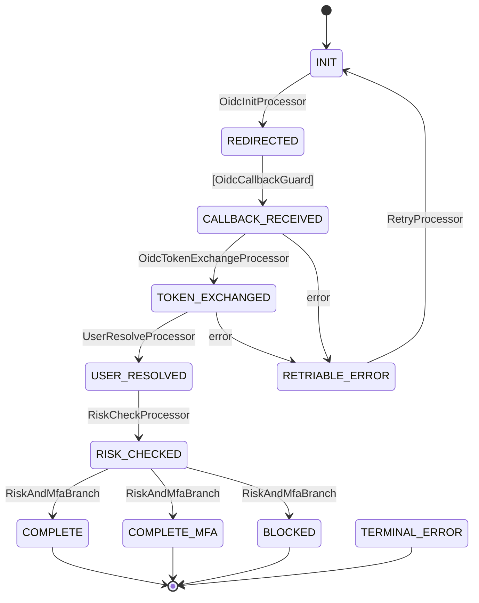

# 実践例: OIDC 認証フロー

この文書は、tramli を初めて使い、複数の HTTP リクエストにまたがるログイン処理を整理したいエンジニア向けです。
OIDC ログインの開始からセッション発行までを例に、状態・遷移・データの依存関係をどう定義し、確認するかを説明します。
コードはフローの構造を示すもので、アプリケーションのサービス実装や OIDC のプロトコル処理の一部は省略しています。

[English version](example-oidc-auth-flow.md)

## OIDC ログインでは何をするのか

OpenID Connect（OIDC）は、Google などの認証プロバイダ（IdP）で行った認証をもとに、アプリケーションがユーザーを識別するための仕組みです。認可コードフローでは、アプリケーションがブラウザを IdP にリダイレクトし、IdP がユーザーを認証したあと、ブラウザが `code` を伴ってアプリケーションのコールバック URL に戻ります。アプリケーションはそのコードをトークンに交換し、ID トークンを検証してからユーザー情報を利用します。その後、アプリケーション内のユーザーを検索・作成し、セッションを発行します。この例には、リスク評価と多要素認証（MFA）が必要かどうかの判断も含めます。プロトコルの手順は [OIDC の認可コードフロー](https://openid.net/specs/openid-connect-core-1_0.html#CodeFlowAuth)を参照してください。

## ハンドラに分けて書くと何が追いにくくなるか

リダイレクトとコールバックは別の HTTP リクエストで処理されます。ログイン開始のハンドラで準備し、コールバックのハンドラでコードを交換し、サービスのメソッドでユーザーの検索やセッション発行を行う、という分け方はできます。ただし、次の点を確認するには、呼び出し先と共有データを追う必要が残ります。

| 困りごと | このログイン処理で確認したいこと |
|----------|--------------------------------|
| 処理の順序が複数のハンドラに散らばる | ユーザーの解決やリスク評価が済む前に、セッション発行へ進む経路はないか。 |
| データを作るリクエストと使うリクエストが違う | 最初の `state` はどこに保存され、どのコールバックと照合されるのか。`returnTo` はセッション発行まで保持されるか。 |
| 失敗時の扱いが各所の catch に散らばる | トークン交換に失敗したらログインをやり直すのか、エラーを返すのか、コールバック待ちのままになるのか。期限切れ後に届いた場合はどうするか。 |
| 同じコールバックが繰り返し届く | ブラウザの再読み込みを、新しいログイン・不正なコールバック・処理済みのログインのどれとして扱うか。 |

enum と補助関数で手書きの実装を整理することはできます。それでも「どの経路を通っても、この関数が必要とするデータは揃っているか」は開発者が確かめる必要があります。tramli では処理の順序を `FlowDefinition` にまとめ、各処理が読むデータと書くデータを宣言します。ハンドラがフローを開始・再開すると、エンジンがその定義に従って遷移を進めます。

以下では、エラー用 2 状態を含む 11 状態と、主要な 5 つの処理を使います。別途参照する `retryProcessor` はアプリケーション側で用意するもので、実装は省略しています。コールバック用のガードと分岐の判断はそれぞれ 1 つです。本文のコードは Java で示し、プラグインの組み込み方は[プラグインチュートリアル](tutorial-plugins-ja.md)で TypeScript の例を使って説明しています。

## 1. ステートを定義

状態は「このログイン試行がどこまで進んだか」を表します。`INIT` は初期状態、`REDIRECTED` はリダイレクトの準備を終えてコールバックを待つ状態です。終端状態に到達すると、このフローは終了します。特に `COMPLETE_MFA` は、MFA を残して OIDC フローが終わった状態であり、追加の認証まで完了したという意味ではありません。

```java
enum OidcState implements FlowState {
    INIT(false, true),              // 初期 — ユーザーが「Google でログイン」をクリック
    REDIRECTED(false),              // リダイレクト URL 生成済み、コールバック待ち
    CALLBACK_RECEIVED(false),       // OAuth コールバック到着
    TOKEN_EXCHANGED(false),         // IdP からトークン取得済み
    USER_RESOLVED(false),           // DB でユーザー検索・作成済み
    RISK_CHECKED(false),            // リスク評価完了
    COMPLETE(true),                 // セッション発行、完了
    COMPLETE_MFA(true),             // セッション発行、MFA 待ち
    BLOCKED(true),                  // リスクが高いためブロック
    RETRIABLE_ERROR(false),         // 一時エラー、再試行用の状態
    TERMINAL_ERROR(true);           // 回復不能エラー

    private final boolean terminal, initial;
    OidcState(boolean t) { this(t, false); }
    OidcState(boolean t, boolean i) { terminal = t; initial = i; }
    @Override public boolean isTerminal() { return terminal; }
    @Override public boolean isInitial() { return initial; }
}
```

状態はフラットな enum です。次に進む先は、入れ子の状態やハンドラ内のフラグではなく、後で示す遷移定義で決めます。

## 2. コンテキストデータを定義

`FlowContext` は、1 回のフローで使うデータを保持します。Java では型をキーにして読み書きします。ログイン要求、コールバック、トークン、セッションを別々の型にすると、各処理が何を読み、何を書くかを宣言できます。

```java
record OidcRequest(String provider, String returnTo) {}
record OidcRedirect(String authUrl, String state, String nonce) {}
record OidcCallback(String code, String state) {}
record OidcTokens(String idToken, String accessToken) {}
record ResolvedUser(String userId, String email, boolean mfaRequired) {}
record RiskCheckResult(String level, boolean blocked) {}
record IssuedSession(String sessionId, String redirectTo) {}
```

この 7 つの型でデータの受け渡しを表します。開始時に呼び出し元が `OidcRequest` を渡し、`OidcInitProcessor` が `OidcRedirect` を作ります。トークン交換では、そこに保存した `state` と `OidcCallback` を読みます。セッション発行では、最初の `OidcRequest.returnTo` を読み、`IssuedSession.redirectTo` に引き継ぎます。

`state` はコールバックとログイン要求を、`nonce` は ID トークンと認証要求を対応付けるための値です。上の型には `nonce` を含めていますが、以下の省略例ではその送信と検証を示していません。ID トークンの検証や PKCE も省略しているため、これだけで OIDC クライアントの実装が完成するわけではありません。プロトコルの検証はアプリケーションの OIDC 連携処理が担当します。`build()` が調べるのは宣言されたデータの依存関係です。

## 3. プロセッサを書く（1 遷移 = 1 プロセッサ）

`StateProcessor` は 1 つの遷移で行う処理を受け持ちます。`requires()` には実行前に必要なデータ、`produces()` には処理が追加するデータを宣言します。エンジンはその遷移を進めるときに `process()` を呼びます。

| Processor | `requires` | `produces` | 行う処理 |
|-----------|------------|------------|----------|
| `OidcInitProcessor` | `OidcRequest` | `OidcRedirect` | 認可 URL とリクエスト用のデータを準備する |
| `OidcTokenExchangeProcessor` | `OidcCallback`, `OidcRedirect` | `OidcTokens` | `state` を照合し、コードをトークンに交換する |
| `UserResolveProcessor` | `OidcTokens` | `ResolvedUser` | アプリケーション内のユーザーを検索・作成する |
| `RiskCheckProcessor` | `ResolvedUser`, `OidcRequest` | `RiskCheckResult` | ログインのリスクを評価する |
| `SessionIssueProcessor` | `ResolvedUser`, `OidcRequest` | `IssuedSession` | セッションを作り、ログイン後の移動先を引き継ぐ |

たとえばセッション発行を変更するときは、必要な 2 つの入力と、その処理を呼ぶ遷移を確認できます。トークン交換の詳細は別の Processor にまとまっています。コード中の補助関数やサービスオブジェクトは tramli の API ではなく、アプリケーション側で用意するものです。

```java
// ステップ 1: OAuth リダイレクト URL を生成
StateProcessor oidcInit = new StateProcessor() {
    @Override public String name() { return "OidcInitProcessor"; }
    @Override public Set<Class<?>> requires() { return Set.of(OidcRequest.class); }
    @Override public Set<Class<?>> produces() { return Set.of(OidcRedirect.class); }
    @Override public void process(FlowContext ctx) {
        OidcRequest req = ctx.get(OidcRequest.class);
        String state = generateRandomState();
        String authUrl = buildAuthUrl(req.provider(), state);
        ctx.put(OidcRedirect.class, new OidcRedirect(authUrl, state, generateNonce()));
    }
};

// ステップ 2: 認可コードをトークンに交換
StateProcessor tokenExchange = new StateProcessor() {
    @Override public String name() { return "OidcTokenExchangeProcessor"; }
    @Override public Set<Class<?>> requires() { return Set.of(OidcCallback.class, OidcRedirect.class); }
    @Override public Set<Class<?>> produces() { return Set.of(OidcTokens.class); }
    @Override public void process(FlowContext ctx) {
        OidcCallback cb = ctx.get(OidcCallback.class);
        OidcRedirect redirect = ctx.get(OidcRedirect.class);
        // state パラメータの一致を確認
        if (!cb.state().equals(redirect.state())) throw new FlowException("STATE_MISMATCH", "...");
        OidcTokens tokens = oidcService.exchangeCode(cb.code());
        ctx.put(OidcTokens.class, tokens);
    }
};

// ステップ 3: トークンの情報からユーザーを検索・作成
StateProcessor userResolve = new StateProcessor() {
    @Override public String name() { return "UserResolveProcessor"; }
    @Override public Set<Class<?>> requires() { return Set.of(OidcTokens.class); }
    @Override public Set<Class<?>> produces() { return Set.of(ResolvedUser.class); }
    @Override public void process(FlowContext ctx) {
        OidcTokens tokens = ctx.get(OidcTokens.class);
        ResolvedUser user = userService.findOrCreate(tokens.idToken());
        ctx.put(ResolvedUser.class, user);
    }
};

// ステップ 4: リスク評価
StateProcessor riskCheck = new StateProcessor() {
    @Override public String name() { return "RiskCheckProcessor"; }
    @Override public Set<Class<?>> requires() { return Set.of(ResolvedUser.class, OidcRequest.class); }
    @Override public Set<Class<?>> produces() { return Set.of(RiskCheckResult.class); }
    @Override public void process(FlowContext ctx) {
        ResolvedUser user = ctx.get(ResolvedUser.class);
        RiskCheckResult result = riskService.assess(user);
        ctx.put(RiskCheckResult.class, result);
    }
};

// ステップ 5: セッション発行
StateProcessor sessionIssue = new StateProcessor() {
    @Override public String name() { return "SessionIssueProcessor"; }
    @Override public Set<Class<?>> requires() { return Set.of(ResolvedUser.class, OidcRequest.class); }
    @Override public Set<Class<?>> produces() { return Set.of(IssuedSession.class); }
    @Override public void process(FlowContext ctx) {
        ResolvedUser user = ctx.get(ResolvedUser.class);
        OidcRequest req = ctx.get(OidcRequest.class);
        String sessionId = sessionService.create(user.userId());
        ctx.put(IssuedSession.class, new IssuedSession(sessionId, req.returnTo()));
    }
};
```

5 つとも、宣言した入力を読み、1 段階の処理を行い、宣言した出力を保存する形です。ID トークンの情報を信頼する前の検証など、サービス実装の振る舞いは別途テストします。

## 4. ガードとブランチ

3 種類の遷移で「次の処理がいつ動くか」を表します。

| 種類 | 意味 | この例での使い方 |
|------|------|------------------|
| **Auto** | 次の外部イベントを待たずに進む | リダイレクト準備、トークン交換、ユーザー解決、リスク評価 |
| **External** | 外部イベントを受けてアプリケーションが再開するまで待つ | `REDIRECTED` でコールバックを待つ |
| **Branch** | 判断処理が返したラベルに対応する遷移先へ進む | リスク評価後に `complete`、`mfa`、`blocked` を選ぶ |

`TransitionGuard` は External 遷移で受けたイベントを検証します。必要な入力と受理時の出力を宣言し、コンテキストを直接変更せずに結果を返します。`GuardOutput.Accepted` のデータをコンテキストへ追加するのはエンジンです。このガードは `OidcRedirect` を必要とし、`OidcCallback` を出力します。

`BranchProcessor` はデータを読み、経路のラベルを返します。`RiskAndMfaBranch` が必要とするのは `ResolvedUser` と `RiskCheckResult` です。ラベルに対応する遷移先と、その経路で実行する Processor はフロー定義に書きます。

```java
// ガード: OAuth コールバックを検証（External 遷移）
TransitionGuard callbackGuard = new TransitionGuard() {
    @Override public String name() { return "OidcCallbackGuard"; }
    @Override public Set<Class<?>> requires() { return Set.of(OidcRedirect.class); }
    @Override public Set<Class<?>> produces() { return Set.of(OidcCallback.class); }
    @Override public int maxRetries() { return 1; }
    @Override public GuardOutput validate(FlowContext ctx) {
        // 実際には resumeAndExecute(externalData) でコールバックのデータを渡す
        return new GuardOutput.Accepted(
            Map.of(OidcCallback.class, new OidcCallback("auth-code", "state")));
    }
};

// ブランチ: リスク評価と MFA の要否に応じて分岐
BranchProcessor riskBranch = new BranchProcessor() {
    @Override public String name() { return "RiskAndMfaBranch"; }
    @Override public Set<Class<?>> requires() { return Set.of(ResolvedUser.class, RiskCheckResult.class); }
    @Override public String decide(FlowContext ctx) {
        RiskCheckResult risk = ctx.get(RiskCheckResult.class);
        if (risk.blocked()) return "blocked";
        ResolvedUser user = ctx.get(ResolvedUser.class);
        return user.mfaRequired() ? "mfa" : "complete";
    }
};
```

上のガードは、固定値のコールバックを常に受理する仮の実装です。実際には、受信したコールバックを検証する処理が必要です。特に、固定値の `state` は `oidcInit` が生成するランダムな値と一致しないため、このまま組み合わせてもログインの成功例にはなりません。後述の実行例は、実際のコールバックが受理されたあとの経路を示します。

## 5. フローを定義

状態と処理の入出力を、ここで 1 つの定義につなぎます。`initiallyAvailable(OidcRequest.class)` は、開始時に呼び出し元が渡すデータの宣言です。コールバックの External 遷移を通過すれば、トークン交換、ユーザー解決、リスク評価、分岐まで、新たな HTTP リクエストを待たずに進められます。

```java
var oidcFlow = Tramli.define("oidc", OidcState.class)
    .ttl(Duration.ofMinutes(10))
    .maxGuardRetries(1)
    .initiallyAvailable(OidcRequest.class)
    // 成功経路
    .from(INIT).auto(REDIRECTED, oidcInit)
    .from(REDIRECTED).external(CALLBACK_RECEIVED, callbackGuard)
    .from(CALLBACK_RECEIVED).auto(TOKEN_EXCHANGED, tokenExchange)
    .from(TOKEN_EXCHANGED).auto(USER_RESOLVED, userResolve)
    .from(USER_RESOLVED).auto(RISK_CHECKED, riskCheck)
    // ブランチ: リスク評価結果
    .from(RISK_CHECKED).branch(riskBranch)
        .to(COMPLETE, "complete", sessionIssue)
        .to(COMPLETE_MFA, "mfa", sessionIssue)
        .to(BLOCKED, "blocked")
        .endBranch()
    // エラー処理
    .onAnyError(TERMINAL_ERROR)
    .onError(CALLBACK_RECEIVED, RETRIABLE_ERROR)
    .onError(TOKEN_EXCHANGED, RETRIABLE_ERROR)
    // 再試行の経路
    .from(RETRIABLE_ERROR).auto(INIT, retryProcessor)
    .build();  // ← 8 項目検証（データフロー検証を含む）
```

`complete` と `mfa` の経路では `sessionIssue` を実行します。`blocked` の経路はセッションを発行せずに終了します。この定義から「各状態の次に何が起こりうるか」がわかり、処理の詳細は各 Processor で確認できます。

エラーと期限に関する設定は、役割がそれぞれ異なります。

- `onAnyError(TERMINAL_ERROR)` で既定のエラー遷移先を設定し、**その後で** 2 つの `onError(...)` によりトークン交換とユーザー解決の遷移先を上書きします。`onAnyError()` を最後に呼ぶと個別の設定が上書きされ、`RETRIABLE_ERROR` に到達できなくなります。
- `RETRIABLE_ERROR → INIT` は、アプリケーション側の `retryProcessor` を使って開始状態へ戻る経路の宣言です。再試行のスケジューラや待ち時間の制御を用意するものではありません。現在の Java エンジンは Processor の例外をエラー状態へ振り分けた時点で自動連鎖を止めるため、この遷移を書くだけでは即座に再試行されません。
- `maxGuardRetries(1)` は、ガードが 1 回拒否した時点で設定済みのエラー遷移先へ進める設定です。Java エンジンはガードの `maxRetries()` メソッドではなく、このフロー単位の値を使います。
- `ttl(Duration.ofMinutes(10))` はフローの有効期間を 10 分にします。エンジンは再開時に期限を確認し、期限切れなら `EXPIRED` として終了します。Processor の例外を `TERMINAL_ERROR` へ振り分ける処理とは別です。

## build() が捕まえるもの

`build()` はログイン処理を動かす前に、フロー定義を検証します。基本の 8 項目は、非終端状態への到達可能性、初期状態から終端状態への経路、Auto/Branch の循環がないこと、External の振り分けが曖昧でないこと、宣言された Branch 遷移先の妥当性、データの依存関係、終端状態からの遷移がないこと、初期状態があることです。詳しくは [8 項目 build() 検証](../README-ja.md#8項目-build-検証)を参照してください。

この例のデータ依存検証は、3 節の入出力宣言をつないで確認します。トークン交換にはリダイレクトのデータとコールバックの両方が必要で、セッション発行には解決済みユーザーと最初の要求の両方が必要です。必要な型が定義のどこかにあるだけでは足りず、検証対象となる各経路の前段で用意されていなければなりません。

新しい Processor が `FraudScore` を要求するのに、誰も出力していない場合は、不足している依存関係が示されます。

```
Flow 'oidc' has 1 validation error(s):
  - Processor 'FraudCheckProcessor' at RISK_CHECKED → COMPLETE
    requires FraudScore but it may not be available
```

Auto/Branch 遷移の循環も拒否されます。

```
Flow 'oidc' has 1 validation error(s):
  - Auto/Branch transitions contain a cycle involving TOKEN_EXCHANGED
```

検証するのは、宣言されたグラフと入出力の関係です。サービス実装を解析して宣言どおりにデータを書き込むと証明したり、ID トークンを検証したり、IdP が応答すると保証したりはしません。同様に、Branch の検証対象は宣言された遷移先であり、`decide()` の実装が未定義のラベルを返した場合は実行時エラーになります。こうした振る舞いはアプリケーション側でテストします。

## 6. 実行

HTTP 側の入口は 2 つです。ログイン開始のハンドラは初期データを渡して `startFlow()` を呼び、`OidcRedirect.authUrl` にブラウザをリダイレクトします。コールバックのハンドラは保存済みのフローを特定し、受信データを渡して `resumeAndExecute()` を呼びます。リクエスト間のフローは、エンジンに渡した store が保持します。

```java
var engine = Tramli.engine(store);

// ユーザーが「Google でログイン」をクリック
var flow = engine.startFlow(oidcFlow, sessionId,
    Map.of(OidcRequest.class, new OidcRequest("GOOGLE", "/dashboard")));
// 自動連鎖: INIT → REDIRECTED（External 遷移で停止）

assertEquals(OidcState.REDIRECTED, flow.currentState());
String authUrl = flow.context().get(OidcRedirect.class).authUrl();
// → authUrl にブラウザをリダイレクト

// OAuth コールバック到着
flow = engine.resumeAndExecute(flow.id(), oidcFlow,
    Map.of(OidcCallback.class, new OidcCallback("auth-code-123", "state-xyz")));
// 自動連鎖: CALLBACK_RECEIVED → TOKEN_EXCHANGED → USER_RESOLVED
//           → RISK_CHECKED → branch → COMPLETE (terminal)

assertTrue(flow.isCompleted());
IssuedSession session = flow.context().get(IssuedSession.class);
// → セッション Cookie を設定し、session.redirectTo() にリダイレクト
```

`complete` に到達する成功経路では、1 回のコールバックで External が 1 回、Auto が 3 回、最後の Branch が 1 回の計 5 遷移が進みます。所要時間には、アプリケーションの各サービスで行う処理の時間も含まれます。

このコードは仮のガードを実装し直したあとの成功経路を示しています。ハンドラでは `IssuedSession` を読む前に結果を確認します。`BLOCKED`、エラー、期限切れの場合にはこの値は作られず、`COMPLETE_MFA` の場合はアプリケーション側で MFA の処理が残ります。8 節では、結果の判別やコールバックの重複を扱うプラグインを紹介します。

## 7. 自動生成ダイアグラム

同じ `FlowDefinition` から、状態遷移図とデータフロー図を生成できます。状態遷移図では順序と待機する箇所を、データフロー図ではデータを作る処理と使う処理を確認します。定義を変更したら図を再生成し、保存した文書をコードに合わせます。

### ステート遷移図

```java
String mermaid = MermaidGenerator.generate(oidcFlow);
```

以下は主要な経路と 2 つの個別エラー経路を示した図です。読みやすくするため、`onAnyError` による既定のエラー遷移は省略しています。


```mermaid
stateDiagram-v2
    [*] --> INIT
    INIT --> REDIRECTED : OidcInitProcessor
    REDIRECTED --> CALLBACK_RECEIVED : [OidcCallbackGuard]
    CALLBACK_RECEIVED --> TOKEN_EXCHANGED : OidcTokenExchangeProcessor
    TOKEN_EXCHANGED --> USER_RESOLVED : UserResolveProcessor
    USER_RESOLVED --> RISK_CHECKED : RiskCheckProcessor
    RISK_CHECKED --> COMPLETE : RiskAndMfaBranch
    RISK_CHECKED --> COMPLETE_MFA : RiskAndMfaBranch
    RISK_CHECKED --> BLOCKED : RiskAndMfaBranch
    CALLBACK_RECEIVED --> RETRIABLE_ERROR : error
    TOKEN_EXCHANGED --> RETRIABLE_ERROR : error
    RETRIABLE_ERROR --> INIT : RetryProcessor
    COMPLETE --> [*]
    COMPLETE_MFA --> [*]
    BLOCKED --> [*]
    TERMINAL_ERROR --> [*]
```

### データフロー図

```java
String dataFlow = MermaidGenerator.generateDataFlow(oidcFlow);
```

トークン交換にコールバックとリダイレクトの両方が必要なこと、最初の要求をセッション発行まで保持する必要があることを読み取れます。


```mermaid
flowchart LR
    initial -->|produces| OidcRequest
    OidcRequest -->|requires| OidcInitProcessor
    OidcInitProcessor -->|produces| OidcRedirect
    OidcRedirect -->|requires| OidcCallbackGuard
    OidcCallbackGuard -->|produces| OidcCallback
    OidcCallback -->|requires| OidcTokenExchangeProcessor
    OidcRedirect -->|requires| OidcTokenExchangeProcessor
    OidcTokenExchangeProcessor -->|produces| OidcTokens
    OidcTokens -->|requires| UserResolveProcessor
    UserResolveProcessor -->|produces| ResolvedUser
    ResolvedUser -->|requires| RiskCheckProcessor
    OidcRequest -->|requires| RiskCheckProcessor
    RiskCheckProcessor -->|produces| RiskCheckResult
    ResolvedUser -->|requires| RiskAndMfaBranch
    RiskCheckResult -->|requires| RiskAndMfaBranch
    ResolvedUser -->|requires| SessionIssueProcessor
    OidcRequest -->|requires| SessionIssueProcessor
    SessionIssueProcessor -->|produces| IssuedSession
```

## 8. プラグインで拡張する

基本のフローができたら、プラグインで診断や実行時の支援を加えられます。解決したい問題に合わせて選んでください。TypeScript の組み込み例は[プラグインチュートリアル](tutorial-plugins-ja.md)にまとめています。ここではログインフローでの用途を説明します。

### 8.1 プラグイン登録

登録によって、定義の解析、store のラップ、エンジンのフック、実行時のアダプタをアプリケーションに組み込みます。たとえば `PolicyLintPlugin` は定義を解析し、`AuditStorePlugin` は保存処理を包み、`RichResumeRuntimePlugin` は再開用のアダプタを提供します。各 Processor にログ記録やコールバック結果の分類処理を埋め込まずに、これらを追加できます。登録用 API は言語によって異なります。

### 8.2 Lint — 設計時ポリシーチェック

`PolicyLintPlugin` は CI で設計上の指摘を追加します。既定の 4 ポリシーは **terminal-outgoing**、**external-count**（>3）、**dead-data**、**overwide-processor**（>3 produces）です。たとえば `IssuedSession` は、出力されても後続の処理が読まないデータとして指摘されることがあります。このフローでは HTTP ハンドラが読むので、指摘をもとに出力を消すのではなく、用途を確認します。アプリケーション独自の規則はカスタムポリシーで表せます。

### 8.3 Audit — 「このログインで何が起きた？」

`AuditStorePlugin` は遷移とともに、コンテキストへ新しく追加されたデータのスナップショットを記録します。個々のハンドラのログから推測する代わりに、あるログインがトークン交換やユーザー解決まで進んだかを確認できます。記録を読むときは、アプリケーションで構成した監査用 store を参照します。

### 8.4 Event Store — リプレイと補償

バージョン付きイベントログから、`ReplayService` で過去の状態を調べたり、`ProjectionReplayService` で遷移回数などの値を計算したりできます。`CompensationService` は、アプリケーションが定義した計画に従って補償操作を記録します。補償とは、先に行った操作の影響を戻すための処理です。計画を記録するだけでセッションが失効したり、IdP への要求が取り消されたりするわけではありません。

### 8.5 Rich Resume — ステータス分類

コールバックのハンドラでは、「遷移した」「すでに完了していた」「拒否された」「適用できる遷移がなかった」「例外がエラー経路へ振り分けられた」の 5 つを区別したい場合があります。`RichResumeExecutor` はこれらを `RichResumeStatus` の値として返すので、ハンドラは状態を比較して推測する代わりに、結果に応じた応答を選べます。ステータス名の表記は言語実装によって異なります。

### 8.6 Idempotency — 二重コールバック防止

ブラウザの再読み込みやネットワークの再試行で、同じコールバックが再び届くことがあります。`IdempotentRichResumeExecutor` は `commandId` とレジストリを使って処理済みのコマンドを識別します。この例ではコールバックの `state` をもとにコマンド ID を作ります。コアの完了済みフローの扱いに、明示的なコマンドの重複排除を追加する仕組みであり、コールバックの検証は別途必要です。

### 8.7 ダイアグラムとドキュメント生成

`DiagramPlugin` は生成した図をまとめ、`DocumentationPlugin` は Markdown のカタログを、`ScenarioTestPlugin` は定義に基づくテストシナリオの記述を作ります。各 Processor の実装を読まなくても、レビューでフローを確認しやすくなります。生成したシナリオはテストを用意する際の出発点であり、OIDC 連携サービスの実装をテストするものではありません。

### プラグインがこのフローに追加する価値

| 確認したいこと | 対応する機能 |
|----------------|--------------|
| このコールバックは処理済みか | コマンドのレジストリを使う重複排除 |
| どの処理が動き、どんなデータを追加したか | 監査記録 |
| 過去のあるバージョンではどの状態だったか | イベントログのリプレイ |
| 再開時に遷移・拒否・エラーのどれが起きたか | Rich Resume の結果分類 |
| フロー内で使われない出力を宣言していないか | ポリシーチェック |
| 定義をレビューでどう確認するか | 図、文書カタログ、シナリオの記述 |

フロー定義には順序、待機する箇所、分岐、データの入出力をまとめ、プラグインで運用に必要な記録や確認手段を追加します。

---

例の出典: [volta-auth-proxy](https://github.com/opaopa6969/volta-auth-proxy)。OIDC・Passkey・MFA・招待フローに tramli を使う ID ゲートウェイです。この文書を読むために、そのプロジェクトを知っている必要はありません。
