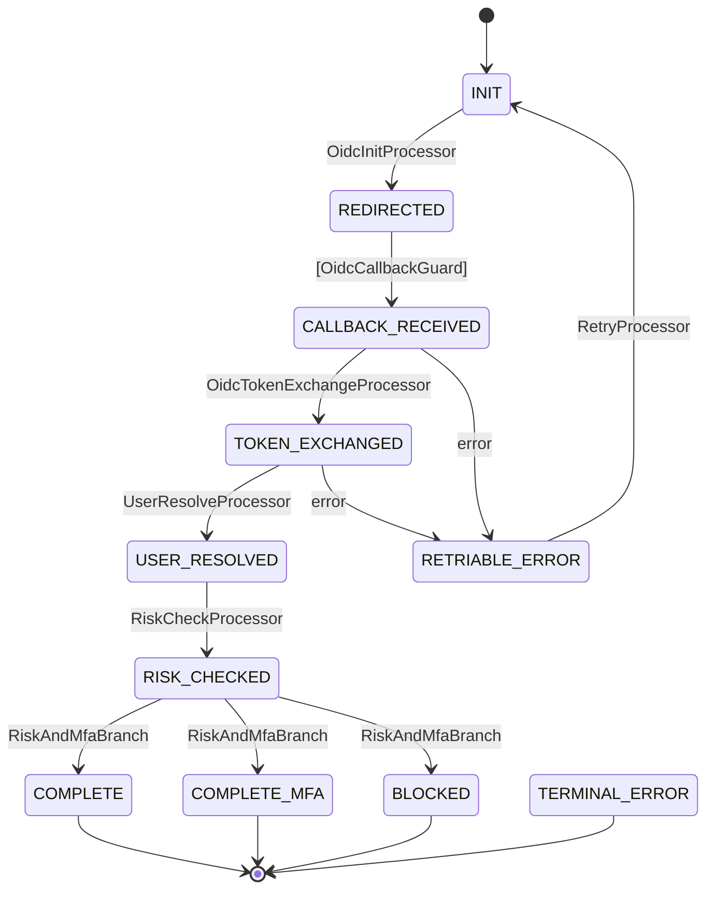

# Real-World Example: OIDC Authentication Flow

> From [volta-auth-proxy](https://github.com/opaopa6969/volta-auth-proxy) — a multi-tenant identity gateway managing 4 authentication flows with tramli.

This example shows a production OIDC login flow with 9 states, 5 processors, 1 guard, and 1 branch. It demonstrates how tramli handles real-world complexity while keeping each piece readable.

---

## 1. Define States

```java
enum OidcState implements FlowState {
    INIT(false, true),              // initial — user clicks "Login with Google"
    REDIRECTED(false, false),       // redirect URL generated, waiting for callback
    CALLBACK_RECEIVED(false, false),// OAuth callback arrived
    TOKEN_EXCHANGED(false, false),  // tokens obtained from IdP
    USER_RESOLVED(false, false),    // user found/created in DB
    RISK_CHECKED(false, false),     // fraud/risk assessment done
    COMPLETE(true, false),          // session issued, done
    COMPLETE_MFA(true, false),      // session issued but MFA pending
    BLOCKED(true, false),           // risk too high, blocked
    RETRIABLE_ERROR(false, false),  // transient error, can retry
    TERMINAL_ERROR(true, false);    // unrecoverable error

    private final boolean terminal, initial;
    OidcState(boolean t, boolean i) { terminal = t; initial = i; }
    @Override public boolean isTerminal() { return terminal; }
    @Override public boolean isInitial() { return initial; }
}
```

11 states. Each is a single word that tells you where the user is in the login process.

## 2. Define Context Data

```java
record OidcRequest(String provider, String returnTo) {}
record OidcRedirect(String authUrl, String state, String nonce) {}
record OidcCallback(String code, String state) {}
record OidcTokens(String idToken, String accessToken) {}
record ResolvedUser(String userId, String email, boolean mfaRequired) {}
record RiskCheckResult(String level, boolean blocked) {}
record IssuedSession(String sessionId, String redirectTo) {}
```

7 data types. Each flows from one processor to the next — tramli verifies this chain at `build()`.

## 3. Write Processors (1 transition = 1 processor)

```java
// Step 1: Generate OAuth redirect URL
StateProcessor oidcInit = new StateProcessor() {
    @Override public String name() { return "OidcInitProcessor"; }
    @Override public Set<Class<?>> requires() { return Set.of(OidcRequest.class); }
    @Override public Set<Class<?>> produces() { return Set.of(OidcRedirect.class); }
    @Override public void process(FlowContext ctx) {
        OidcRequest req = ctx.get(OidcRequest.class);
        String state = generateRandomState();
        String authUrl = buildAuthUrl(req.provider(), state);
        ctx.put(OidcRedirect.class, new OidcRedirect(authUrl, state, generateNonce()));
    }
};

// Step 2: Exchange authorization code for tokens
StateProcessor tokenExchange = new StateProcessor() {
    @Override public String name() { return "OidcTokenExchangeProcessor"; }
    @Override public Set<Class<?>> requires() { return Set.of(OidcCallback.class, OidcRedirect.class); }
    @Override public Set<Class<?>> produces() { return Set.of(OidcTokens.class); }
    @Override public void process(FlowContext ctx) {
        OidcCallback cb = ctx.get(OidcCallback.class);
        OidcRedirect redirect = ctx.get(OidcRedirect.class);
        // Verify state parameter matches
        if (!cb.state().equals(redirect.state())) throw new FlowException("STATE_MISMATCH", "...");
        OidcTokens tokens = oidcService.exchangeCode(cb.code());
        ctx.put(OidcTokens.class, tokens);
    }
};

// Step 3: Find or create user from token claims
StateProcessor userResolve = new StateProcessor() {
    @Override public String name() { return "UserResolveProcessor"; }
    @Override public Set<Class<?>> requires() { return Set.of(OidcTokens.class); }
    @Override public Set<Class<?>> produces() { return Set.of(ResolvedUser.class); }
    @Override public void process(FlowContext ctx) {
        OidcTokens tokens = ctx.get(OidcTokens.class);
        ResolvedUser user = userService.findOrCreate(tokens.idToken());
        ctx.put(ResolvedUser.class, user);
    }
};

// Step 4: Risk assessment
StateProcessor riskCheck = new StateProcessor() {
    @Override public String name() { return "RiskCheckProcessor"; }
    @Override public Set<Class<?>> requires() { return Set.of(ResolvedUser.class, OidcRequest.class); }
    @Override public Set<Class<?>> produces() { return Set.of(RiskCheckResult.class); }
    @Override public void process(FlowContext ctx) {
        ResolvedUser user = ctx.get(ResolvedUser.class);
        RiskCheckResult result = riskService.assess(user);
        ctx.put(RiskCheckResult.class, result);
    }
};

// Step 5: Issue session
StateProcessor sessionIssue = new StateProcessor() {
    @Override public String name() { return "SessionIssueProcessor"; }
    @Override public Set<Class<?>> requires() { return Set.of(ResolvedUser.class, OidcRequest.class); }
    @Override public Set<Class<?>> produces() { return Set.of(IssuedSession.class); }
    @Override public void process(FlowContext ctx) {
        ResolvedUser user = ctx.get(ResolvedUser.class);
        OidcRequest req = ctx.get(OidcRequest.class);
        String sessionId = sessionService.create(user.userId());
        ctx.put(IssuedSession.class, new IssuedSession(sessionId, req.returnTo()));
    }
};
```

Each processor is **self-contained**: you can read, test, and modify it without touching the others.

## 4. Write the Guard and Branch

```java
// Guard: validates the OAuth callback (External transition)
TransitionGuard callbackGuard = new TransitionGuard() {
    @Override public String name() { return "OidcCallbackGuard"; }
    @Override public Set<Class<?>> requires() { return Set.of(OidcRedirect.class); }
    @Override public Set<Class<?>> produces() { return Set.of(OidcCallback.class); }
    @Override public int maxRetries() { return 1; }
    @Override public GuardOutput validate(FlowContext ctx) {
        // In practice, callback data comes from resumeAndExecute(externalData)
        return new GuardOutput.Accepted(
            Map.of(OidcCallback.class, new OidcCallback("auth-code", "state")));
    }
};

// Branch: route based on risk assessment + MFA requirement
BranchProcessor riskBranch = new BranchProcessor() {
    @Override public String name() { return "RiskAndMfaBranch"; }
    @Override public Set<Class<?>> requires() { return Set.of(ResolvedUser.class, RiskCheckResult.class); }
    @Override public String decide(FlowContext ctx) {
        RiskCheckResult risk = ctx.get(RiskCheckResult.class);
        if (risk.blocked()) return "blocked";
        ResolvedUser user = ctx.get(ResolvedUser.class);
        return user.mfaRequired() ? "mfa" : "complete";
    }
};
```

## 5. Define the Flow

```java
var oidcFlow = Tramli.define("oidc", OidcState.class)
    .ttl(Duration.ofMinutes(10))
    .maxGuardRetries(1)
    .initiallyAvailable(OidcRequest.class)
    // Happy path
    .from(INIT).auto(REDIRECTED, oidcInit)
    .from(REDIRECTED).external(CALLBACK_RECEIVED, callbackGuard)
    .from(CALLBACK_RECEIVED).auto(TOKEN_EXCHANGED, tokenExchange)
    .from(TOKEN_EXCHANGED).auto(USER_RESOLVED, userResolve)
    .from(USER_RESOLVED).auto(RISK_CHECKED, riskCheck)
    // Branch: risk assessment result
    .from(RISK_CHECKED).branch(riskBranch)
        .to(COMPLETE, "complete", sessionIssue)
        .to(COMPLETE_MFA, "mfa", sessionIssue)
        .to(BLOCKED, "blocked")
        .endBranch()
    // Error handling
    .onError(CALLBACK_RECEIVED, RETRIABLE_ERROR)
    .onError(TOKEN_EXCHANGED, RETRIABLE_ERROR)
    .onAnyError(TERMINAL_ERROR)
    // Retry
    .from(RETRIABLE_ERROR).auto(INIT, retryProcessor)
    .build();  // ← 8-item validation + data-flow verification
```

Read this top-to-bottom — **this IS the flow**. No other file needed.

## 6. Run It

```java
var engine = Tramli.engine(store);

// User clicks "Login with Google"
var flow = engine.startFlow(oidcFlow, sessionId,
    Map.of(OidcRequest.class, new OidcRequest("GOOGLE", "/dashboard")));
// Auto-chain: INIT → REDIRECTED (stops — External transition)

assertEquals(OidcState.REDIRECTED, flow.currentState());
String authUrl = flow.context().get(OidcRedirect.class).authUrl();
// → redirect user to authUrl

// OAuth callback arrives
flow = engine.resumeAndExecute(flow.id(), oidcFlow,
    Map.of(OidcCallback.class, new OidcCallback("auth-code-123", "state-xyz")));
// Auto-chain: CALLBACK_RECEIVED → TOKEN_EXCHANGED → USER_RESOLVED
//           → RISK_CHECKED → branch → COMPLETE (terminal)

assertTrue(flow.isCompleted());
IssuedSession session = flow.context().get(IssuedSession.class);
// → set session cookie, redirect to session.redirectTo()
```

**One HTTP callback → 5 transitions fire automatically.** Each processor runs in microseconds. The engine handles the chaining.

## 7. Generated Diagrams

### State Transition Diagram

```java
String mermaid = MermaidGenerator.generate(oidcFlow);
```



### Data-Flow Diagram

```java
String dataFlow = MermaidGenerator.generateDataFlow(oidcFlow);
```



Both diagrams are **generated from the same FlowDefinition** that the engine executes. They can never be out of date.

## What build() Catches

If you add a new processor that requires `FraudScore` but nothing produces it:

```
Flow 'oidc' has 1 validation error(s):
  - Processor 'FraudCheckProcessor' at RISK_CHECKED → COMPLETE
    requires FraudScore but it may not be available
```

If you create a cycle in auto transitions:

```
Flow 'oidc' has 1 validation error(s):
  - Auto/Branch transitions contain a cycle involving TOKEN_EXCHANGED
```

**These errors appear before any code runs.** No deployment. No 3am page.

---

```mermaid
flowchart LR
    initial -->|produces| OidcRequest
    OidcRequest -->|requires| OidcInitProcessor
    OidcInitProcessor -->|produces| OidcRedirect
    OidcRedirect -->|requires| OidcCallbackGuard
    OidcCallbackGuard -->|produces| OidcCallback
    OidcCallback -->|requires| OidcTokenExchangeProcessor
    OidcRedirect -->|requires| OidcTokenExchangeProcessor
    OidcTokenExchangeProcessor -->|produces| OidcTokens
    OidcTokens -->|requires| UserResolveProcessor
    UserResolveProcessor -->|produces| ResolvedUser
    ResolvedUser -->|requires| RiskCheckProcessor
    OidcRequest -->|requires| RiskCheckProcessor
    RiskCheckProcessor -->|produces| RiskCheckResult
    ResolvedUser -->|requires| RiskAndMfaBranch
    RiskCheckResult -->|requires| RiskAndMfaBranch
    ResolvedUser -->|requires| SessionIssueProcessor
    OidcRequest -->|requires| SessionIssueProcessor
    SessionIssueProcessor -->|produces| IssuedSession
```

## 8. Extending with Plugins

The flow definition above stays **exactly the same**. Plugins layer on top — zero changes to processors or the flow graph.

> Code examples below are shown in all 3 languages. Pick your language.

### 8.1 Plugin Registration

<details open><summary><b>Java</b></summary>

```java
var sink = new InMemoryTelemetrySink();
var registry = new PluginRegistry<OidcState>();
registry
    .register(PolicyLintPlugin.defaults())
    .register(new AuditStorePlugin())
    .register(new EventLogStorePlugin())
    .register(new ObservabilityEnginePlugin(sink))
    .register(new RichResumeRuntimePlugin())
    .register(new IdempotencyRuntimePlugin(new InMemoryIdempotencyRegistry()));

var report = registry.analyzeAll(oidcFlow);
var wrappedStore = registry.applyStorePlugins(new InMemoryFlowStore());
var engine = Tramli.engine(wrappedStore);
registry.installEnginePlugins(engine);
var adapters = registry.bindRuntimeAdapters(engine);
```
</details>

<details><summary><b>TypeScript</b></summary>

```typescript
const sink = new InMemoryTelemetrySink();
const registry = new PluginRegistry<OidcState>();
registry
  .register(PolicyLintPlugin.defaults())
  .register(new AuditStorePlugin())
  .register(new EventLogStorePlugin())
  .register(new ObservabilityEnginePlugin(sink))
  .register(new RichResumeRuntimePlugin())
  .register(new IdempotencyRuntimePlugin(new InMemoryIdempotencyRegistry()));

const report = registry.analyzeAll(oidcFlow);
const wrappedStore = registry.applyStorePlugins(new InMemoryFlowStore());
const engine = Tramli.engine(wrappedStore);
registry.installEnginePlugins(engine);
const adapters = registry.bindRuntimeAdapters(engine);
```
</details>

<details><summary><b>Rust</b></summary>

```rust
let sink = Arc::new(InMemoryTelemetrySink::new());
let observability = ObservabilityPlugin::new(sink.clone());

let linter = PolicyLintPlugin::<OidcState>::defaults();
let mut report = PluginReport::new();
linter.analyze(&oidc_flow, &mut report);

let mut engine = FlowEngine::new(InMemoryFlowStore::new());
observability.install(&mut engine);

let idempotency = InMemoryIdempotencyRegistry::new();
```
</details>

### 8.2 Lint — Design-Time Policy Check

Run lint in CI to catch design smells before they ship.

<details open><summary><b>Java</b></summary>

```java
var report = registry.analyzeAll(oidcFlow);
for (var finding : report.findings()) {
    System.out.println("[" + finding.severity() + "] " + finding.pluginId() + ": " + finding.message());
}
// → [WARN] policy/dead-data: produced but never consumed: IssuedSession
```
</details>

<details><summary><b>TypeScript</b></summary>

```typescript
const report = registry.analyzeAll(oidcFlow);
for (const finding of report.findings()) {
  console.warn(`[${finding.severity}] ${finding.pluginId}: ${finding.message}`);
}
```
</details>

<details><summary><b>Rust</b></summary>

```rust
let linter = PolicyLintPlugin::<OidcState>::defaults();
let mut report = PluginReport::new();
linter.analyze(&oidc_flow, &mut report);
println!("{}", report.as_text());
```
</details>

4 default policies: **terminal-outgoing**, **external-count** (>3), **dead-data**, **overwide-processor** (>3 produces). Custom policies are just functions.

### 8.3 Audit — "What happened during this login?"

Every transition is recorded with a snapshot of produced data.

<details open><summary><b>Java</b></summary>

```java
var auditStore = (AuditingFlowStore) wrappedStore;
for (var record : auditStore.auditedTransitions()) {
    log.info("{} → {} at {}", record.from(), record.to(), record.timestamp());
    log.info("  produced: {}", record.producedDataSnapshot());
}
// → INIT → REDIRECTED at 2026-04-09T10:00:01 produced: {OidcRedirect=...}
// → REDIRECTED → CALLBACK_RECEIVED at ... produced: {OidcCallback=...}
// → CALLBACK_RECEIVED → TOKEN_EXCHANGED at ... produced: {OidcTokens=...}
```
</details>

<details><summary><b>TypeScript</b></summary>

```typescript
const auditStore = wrappedStore as AuditingFlowStore;
for (const record of auditStore.auditedTransitions) {
  console.log(`${record.from} → ${record.to} at ${record.timestamp}`);
  console.log('  produced:', record.producedDataSnapshot);
}
```
</details>

<details><summary><b>Rust</b></summary>

```rust
for record in audit_store.audited_transitions() {
    println!("{} → {} at {:?}", record.from, record.to, record.timestamp);
}
```
</details>

### 8.4 Event Store — Replay and Compensation

Versioned event log enables state reconstruction and saga compensation.

<details open><summary><b>Java</b></summary>

```java
// Replay: "What state was the user in at version 3?"
var replay = new ReplayService();
var stateAtV3 = replay.stateAtVersion(eventStore.events(), flowId, 3);
// → "TOKEN_EXCHANGED"

// Projection: count transitions per flow
var projection = new ProjectionReplayService();
int count = projection.stateAtVersion(eventStore.events(), flowId, 999,
    new ProjectionReducer<Integer>() {
        public Integer initialState() { return 0; }
        public Integer apply(Integer state, VersionedTransitionEvent e) { return state + 1; }
    });

// Compensation: rollback on token exchange failure
var compensation = new CompensationService(
    (event, cause) -> event.trigger().equals("OidcTokenExchangeProcessor")
        ? new CompensationPlan("REVOKE_PARTIAL_SESSION", Map.of("reason", cause.getMessage()))
        : null,
    eventStore);
```
</details>

<details><summary><b>TypeScript</b></summary>

```typescript
// Replay
const replay = new ReplayService();
const stateAtV3 = replay.stateAtVersion(eventStore.events(), flowId, 3);

// Projection
const projection = new ProjectionReplayService();
const count = projection.stateAtVersion(eventStore.events(), flowId, 999,
  { initialState: () => 0, apply: (n, _event) => n + 1 });

// Compensation
const compensation = new CompensationService(
  (event, cause) => event.trigger === 'OidcTokenExchangeProcessor'
    ? { action: 'REVOKE_PARTIAL_SESSION', metadata: { reason: cause.message } }
    : null,
  eventStore);
```
</details>

<details><summary><b>Rust</b></summary>

```rust
// Replay
let state_at_v3 = ReplayService::state_at_version(event_store.events(), &flow_id, 3);

// Projection
struct CountReducer;
impl ProjectionReducer<usize> for CountReducer {
    fn initial_state(&self) -> usize { 0 }
    fn apply(&self, state: usize, _event: &VersionedTransitionEvent) -> usize { state + 1 }
}
let count = ProjectionReplayService::state_at_version(
    event_store.events(), &flow_id, 999, &CountReducer);

// Compensation
let compensation = CompensationService::new(Box::new(|event, cause| {
    if event.trigger == "OidcTokenExchangeProcessor" {
        Some(CompensationPlan { action: "REVOKE_PARTIAL_SESSION".into(), metadata: cause.into() })
    } else { None }
}));
```
</details>

### 8.5 Rich Resume — Status Classification

Know exactly what happened when a callback arrives.

<details open><summary><b>Java</b></summary>

```java
var resume = (RichResumeExecutor) adapters.get("rich-resume");
var result = resume.resume(flowId, oidcFlow, externalData, OidcState.REDIRECTED);

switch (result.status()) {
    case TRANSITIONED          -> handleSuccess(result.flow());
    case ALREADY_COMPLETED     -> respond(200, "already logged in");
    case REJECTED              -> respond(400, "callback invalid");
    case NO_APPLICABLE_TRANSITION -> respond(404, "no pending login");
    case EXCEPTION_ROUTED      -> handleError(result.error());
}
```
</details>

<details><summary><b>TypeScript</b></summary>

```typescript
const executor = new RichResumeExecutor(engine);
const result = await executor.resume(flowId, oidcFlow, externalData, 'REDIRECTED');

switch (result.status) {
  case 'TRANSITIONED':          return handleSuccess(result.flow!);
  case 'ALREADY_COMPLETE':      return res.json({ msg: 'already logged in' });
  case 'REJECTED':              return res.status(400).json({ msg: 'callback invalid' });
  case 'NO_APPLICABLE_TRANSITION': return res.status(404).json({ msg: 'no pending login' });
  case 'EXCEPTION_ROUTED':      return handleError(result.error!);
}
```
</details>

<details><summary><b>Rust</b></summary>

```rust
let result = RichResumeExecutor::resume(&mut engine, &flow_id, external_data, OidcState::Redirected);

match result.status {
    RichResumeStatus::Transitioned      => handle_success(&flow_id),
    RichResumeStatus::AlreadyComplete   => respond(200, "already logged in"),
    RichResumeStatus::Rejected          => respond(400, "callback invalid"),
    RichResumeStatus::NoApplicableTransition => respond(404, "no pending login"),
    RichResumeStatus::ExceptionRouted   => handle_error(result.error),
}
```
</details>

### 8.6 Idempotency — Double Callback Protection

OAuth callbacks can arrive twice (user refreshes, network retry). Use the `state` parameter as `commandId`.

<details open><summary><b>Java</b></summary>

```java
var idempotent = (IdempotentRichResumeExecutor) adapters.get("idempotency");
var result = idempotent.resume(flowId, oidcFlow,
    new CommandEnvelope("callback-" + oauthState, externalData),
    OidcState.REDIRECTED);

if (result.status() == ALREADY_COMPLETED) {
    // Second callback — safe no-op
    return "login already processed";
}
```
</details>

<details><summary><b>TypeScript</b></summary>

```typescript
const idempotent = new IdempotentRichResumeExecutor(engine, new InMemoryIdempotencyRegistry());
const result = await idempotent.resume(flowId, oidcFlow,
  { commandId: `callback-${oauthState}`, externalData },
  'REDIRECTED');

if (result.status === 'ALREADY_COMPLETE') {
  return 'login already processed';
}
```
</details>

<details><summary><b>Rust</b></summary>

```rust
let registry = InMemoryIdempotencyRegistry::new();
let result = IdempotentRichResumeExecutor::resume(
    &mut engine, &registry, &flow_id,
    CommandEnvelope { command_id: format!("callback-{}", oauth_state), external_data },
    OidcState::Redirected);

if result.status == RichResumeStatus::AlreadyComplete {
    return "login already processed";
}
```
</details>

### 8.7 Diagram and Documentation Generation

<details open><summary><b>Java</b></summary>

```java
// All-in-one diagram bundle
var bundle = new DiagramPlugin().generate(oidcFlow);
writeFile("oidc-state.mmd", bundle.mermaid());
writeFile("oidc-dataflow.json", bundle.dataFlowJson());

// Markdown catalog
var docs = new DocumentationPlugin().toMarkdown(oidcFlow);

// BDD test scenarios (1 per transition)
var plan = new ScenarioTestPlugin().generate(oidcFlow);
// → 11 scenarios generated automatically
```
</details>

<details><summary><b>TypeScript</b></summary>

```typescript
const bundle = new DiagramPlugin().generate(oidcFlow);
const docs = new DocumentationPlugin().toMarkdown(oidcFlow);
const plan = new ScenarioTestPlugin().generate(oidcFlow);
```
</details>

<details><summary><b>Rust</b></summary>

```rust
let bundle = DiagramPlugin::generate(&oidc_flow);
let docs = DocumentationPlugin::to_markdown(&oidc_flow);
let plan = ScenarioTestPlugin::generate(&oidc_flow);
```
</details>

### What Plugins Add to this Flow

| Concern | Without plugins | With plugins |
|---------|----------------|--------------|
| Double OAuth callback | Runs twice, double session | `IdempotencyRuntimePlugin` deduplicates by `state` param |
| "What happened during login X?" | `transitionLog` only | `AuditStorePlugin` records data snapshots per transition |
| State reconstruction after crash | Latest state only | `ReplayService` rebuilds any version |
| "Did the callback transition or was it rejected?" | Compare states manually | `RichResumeStatus` in 5 classifications |
| Design mistakes in CI | `build()` 8-item check | `PolicyLintPlugin` adds dead-data / overwide-processor detection |
| Docs for non-engineers | Mermaid only | `DiagramBundle` + markdown catalog + BDD scenarios |

**Core flow definition: unchanged. Processors: unchanged. Plugins: layered on top.**

---

*This is the same flow that powers volta-auth-proxy in production, handling OIDC, Passkey, MFA, and invitation flows.*
