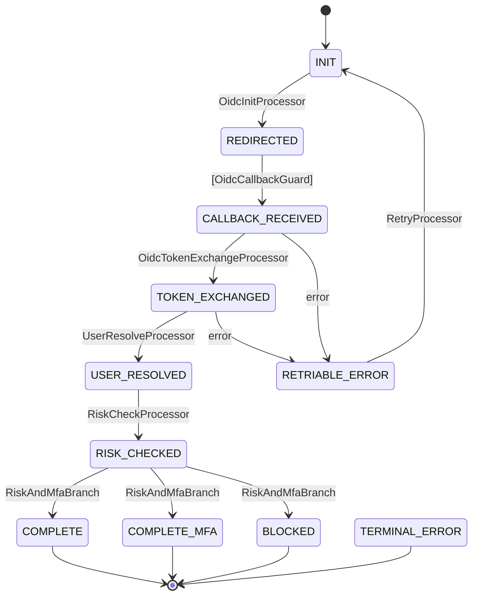

```mermaid
flowchart LR
    initial -->|produces| OidcRequest
    OidcRequest -->|requires| OidcInitProcessor
    OidcInitProcessor -->|produces| OidcRedirect
    OidcRedirect -->|requires| OidcCallbackGuard
    OidcCallbackGuard -->|produces| OidcCallback
    OidcCallback -->|requires| OidcTokenExchangeProcessor
    OidcRedirect -->|requires| OidcTokenExchangeProcessor
    OidcTokenExchangeProcessor -->|produces| OidcTokens
    OidcTokens -->|requires| UserResolveProcessor
    UserResolveProcessor -->|produces| ResolvedUser
    ResolvedUser -->|requires| RiskCheckProcessor
    OidcRequest -->|requires| RiskCheckProcessor
    RiskCheckProcessor -->|produces| RiskCheckResult
    ResolvedUser -->|requires| RiskAndMfaBranch
    RiskCheckResult -->|requires| RiskAndMfaBranch
    ResolvedUser -->|requires| SessionIssueProcessor
    OidcRequest -->|requires| SessionIssueProcessor
    SessionIssueProcessor -->|produces| IssuedSession
```

# Real-World Example: OIDC Authentication Flow

> From [volta-auth-proxy](https://github.com/opaopa6969/volta-auth-proxy) — a multi-tenant identity gateway managing 4 authentication flows with tramli.

This example shows a production OIDC login flow with 9 states, 5 processors, 1 guard, and 1 branch. It demonstrates how tramli handles real-world complexity while keeping each piece readable.

---

## 1. Define States

```java
enum OidcState implements FlowState {
    INIT(false, true),              // initial — user clicks "Login with Google"
    REDIRECTED(false, false),       // redirect URL generated, waiting for callback
    CALLBACK_RECEIVED(false, false),// OAuth callback arrived
    TOKEN_EXCHANGED(false, false),  // tokens obtained from IdP
    USER_RESOLVED(false, false),    // user found/created in DB
    RISK_CHECKED(false, false),     // fraud/risk assessment done
    COMPLETE(true, false),          // session issued, done
    COMPLETE_MFA(true, false),      // session issued but MFA pending
    BLOCKED(true, false),           // risk too high, blocked
    RETRIABLE_ERROR(false, false),  // transient error, can retry
    TERMINAL_ERROR(true, false);    // unrecoverable error

    private final boolean terminal, initial;
    OidcState(boolean t, boolean i) { terminal = t; initial = i; }
    @Override public boolean isTerminal() { return terminal; }
    @Override public boolean isInitial() { return initial; }
}
```

11 states. Each is a single word that tells you where the user is in the login process.

## 2. Define Context Data

```java
record OidcRequest(String provider, String returnTo) {}
record OidcRedirect(String authUrl, String state, String nonce) {}
record OidcCallback(String code, String state) {}
record OidcTokens(String idToken, String accessToken) {}
record ResolvedUser(String userId, String email, boolean mfaRequired) {}
record RiskCheckResult(String level, boolean blocked) {}
record IssuedSession(String sessionId, String redirectTo) {}
```

7 data types. Each flows from one processor to the next — tramli verifies this chain at `build()`.

## 3. Write Processors (1 transition = 1 processor)

```java
// Step 1: Generate OAuth redirect URL
StateProcessor oidcInit = new StateProcessor() {
    @Override public String name() { return "OidcInitProcessor"; }
    @Override public Set<Class<?>> requires() { return Set.of(OidcRequest.class); }
    @Override public Set<Class<?>> produces() { return Set.of(OidcRedirect.class); }
    @Override public void process(FlowContext ctx) {
        OidcRequest req = ctx.get(OidcRequest.class);
        String state = generateRandomState();
        String authUrl = buildAuthUrl(req.provider(), state);
        ctx.put(OidcRedirect.class, new OidcRedirect(authUrl, state, generateNonce()));
    }
};

// Step 2: Exchange authorization code for tokens
StateProcessor tokenExchange = new StateProcessor() {
    @Override public String name() { return "OidcTokenExchangeProcessor"; }
    @Override public Set<Class<?>> requires() { return Set.of(OidcCallback.class, OidcRedirect.class); }
    @Override public Set<Class<?>> produces() { return Set.of(OidcTokens.class); }
    @Override public void process(FlowContext ctx) {
        OidcCallback cb = ctx.get(OidcCallback.class);
        OidcRedirect redirect = ctx.get(OidcRedirect.class);
        // Verify state parameter matches
        if (!cb.state().equals(redirect.state())) throw new FlowException("STATE_MISMATCH", "...");
        OidcTokens tokens = oidcService.exchangeCode(cb.code());
        ctx.put(OidcTokens.class, tokens);
    }
};

// Step 3: Find or create user from token claims
StateProcessor userResolve = new StateProcessor() {
    @Override public String name() { return "UserResolveProcessor"; }
    @Override public Set<Class<?>> requires() { return Set.of(OidcTokens.class); }
    @Override public Set<Class<?>> produces() { return Set.of(ResolvedUser.class); }
    @Override public void process(FlowContext ctx) {
        OidcTokens tokens = ctx.get(OidcTokens.class);
        ResolvedUser user = userService.findOrCreate(tokens.idToken());
        ctx.put(ResolvedUser.class, user);
    }
};

// Step 4: Risk assessment
StateProcessor riskCheck = new StateProcessor() {
    @Override public String name() { return "RiskCheckProcessor"; }
    @Override public Set<Class<?>> requires() { return Set.of(ResolvedUser.class, OidcRequest.class); }
    @Override public Set<Class<?>> produces() { return Set.of(RiskCheckResult.class); }
    @Override public void process(FlowContext ctx) {
        ResolvedUser user = ctx.get(ResolvedUser.class);
        RiskCheckResult result = riskService.assess(user);
        ctx.put(RiskCheckResult.class, result);
    }
};

// Step 5: Issue session
StateProcessor sessionIssue = new StateProcessor() {
    @Override public String name() { return "SessionIssueProcessor"; }
    @Override public Set<Class<?>> requires() { return Set.of(ResolvedUser.class, OidcRequest.class); }
    @Override public Set<Class<?>> produces() { return Set.of(IssuedSession.class); }
    @Override public void process(FlowContext ctx) {
        ResolvedUser user = ctx.get(ResolvedUser.class);
        OidcRequest req = ctx.get(OidcRequest.class);
        String sessionId = sessionService.create(user.userId());
        ctx.put(IssuedSession.class, new IssuedSession(sessionId, req.returnTo()));
    }
};
```

Each processor is **self-contained**: you can read, test, and modify it without touching the others.

## 4. Write the Guard and Branch

```java
// Guard: validates the OAuth callback (External transition)
TransitionGuard callbackGuard = new TransitionGuard() {
    @Override public String name() { return "OidcCallbackGuard"; }
    @Override public Set<Class<?>> requires() { return Set.of(OidcRedirect.class); }
    @Override public Set<Class<?>> produces() { return Set.of(OidcCallback.class); }
    @Override public int maxRetries() { return 1; }
    @Override public GuardOutput validate(FlowContext ctx) {
        // In practice, callback data comes from resumeAndExecute(externalData)
        return new GuardOutput.Accepted(
            Map.of(OidcCallback.class, new OidcCallback("auth-code", "state")));
    }
};

// Branch: route based on risk assessment + MFA requirement
BranchProcessor riskBranch = new BranchProcessor() {
    @Override public String name() { return "RiskAndMfaBranch"; }
    @Override public Set<Class<?>> requires() { return Set.of(ResolvedUser.class, RiskCheckResult.class); }
    @Override public String decide(FlowContext ctx) {
        RiskCheckResult risk = ctx.get(RiskCheckResult.class);
        if (risk.blocked()) return "blocked";
        ResolvedUser user = ctx.get(ResolvedUser.class);
        return user.mfaRequired() ? "mfa" : "complete";
    }
};
```

## 5. Define the Flow

```java
var oidcFlow = Tramli.define("oidc", OidcState.class)
    .ttl(Duration.ofMinutes(10))
    .maxGuardRetries(1)
    .initiallyAvailable(OidcRequest.class)
    // Happy path
    .from(INIT).auto(REDIRECTED, oidcInit)
    .from(REDIRECTED).external(CALLBACK_RECEIVED, callbackGuard)
    .from(CALLBACK_RECEIVED).auto(TOKEN_EXCHANGED, tokenExchange)
    .from(TOKEN_EXCHANGED).auto(USER_RESOLVED, userResolve)
    .from(USER_RESOLVED).auto(RISK_CHECKED, riskCheck)
    // Branch: risk assessment result
    .from(RISK_CHECKED).branch(riskBranch)
        .to(COMPLETE, "complete", sessionIssue)
        .to(COMPLETE_MFA, "mfa", sessionIssue)
        .to(BLOCKED, "blocked")
        .endBranch()
    // Error handling
    .onError(CALLBACK_RECEIVED, RETRIABLE_ERROR)
    .onError(TOKEN_EXCHANGED, RETRIABLE_ERROR)
    .onAnyError(TERMINAL_ERROR)
    // Retry
    .from(RETRIABLE_ERROR).auto(INIT, retryProcessor)
    .build();  // ← 8-item validation + data-flow verification
```

Read this top-to-bottom — **this IS the flow**. No other file needed.

## 6. Run It

```java
var engine = Tramli.engine(store);

// User clicks "Login with Google"
var flow = engine.startFlow(oidcFlow, sessionId,
    Map.of(OidcRequest.class, new OidcRequest("GOOGLE", "/dashboard")));
// Auto-chain: INIT → REDIRECTED (stops — External transition)

assertEquals(OidcState.REDIRECTED, flow.currentState());
String authUrl = flow.context().get(OidcRedirect.class).authUrl();
// → redirect user to authUrl

// OAuth callback arrives
flow = engine.resumeAndExecute(flow.id(), oidcFlow,
    Map.of(OidcCallback.class, new OidcCallback("auth-code-123", "state-xyz")));
// Auto-chain: CALLBACK_RECEIVED → TOKEN_EXCHANGED → USER_RESOLVED
//           → RISK_CHECKED → branch → COMPLETE (terminal)

assertTrue(flow.isCompleted());
IssuedSession session = flow.context().get(IssuedSession.class);
// → set session cookie, redirect to session.redirectTo()
```

**One HTTP callback → 5 transitions fire automatically.** Each processor runs in microseconds. The engine handles the chaining.

## 7. Generated Diagrams

### State Transition Diagram

```java
String mermaid = MermaidGenerator.generate(oidcFlow);
```



### Data-Flow Diagram

```java
String dataFlow = MermaidGenerator.generateDataFlow(oidcFlow);
```



Both diagrams are **generated from the same FlowDefinition** that the engine executes. They can never be out of date.

## What build() Catches

If you add a new processor that requires `FraudScore` but nothing produces it:

```
Flow 'oidc' has 1 validation error(s):
  - Processor 'FraudCheckProcessor' at RISK_CHECKED → COMPLETE
    requires FraudScore but it may not be available
```

If you create a cycle in auto transitions:

```
Flow 'oidc' has 1 validation error(s):
  - Auto/Branch transitions contain a cycle involving TOKEN_EXCHANGED
```

**These errors appear before any code runs.** No deployment. No 3am page.

---

*This is the same flow that powers volta-auth-proxy in production, handling OIDC, Passkey, MFA, and invitation flows.*
