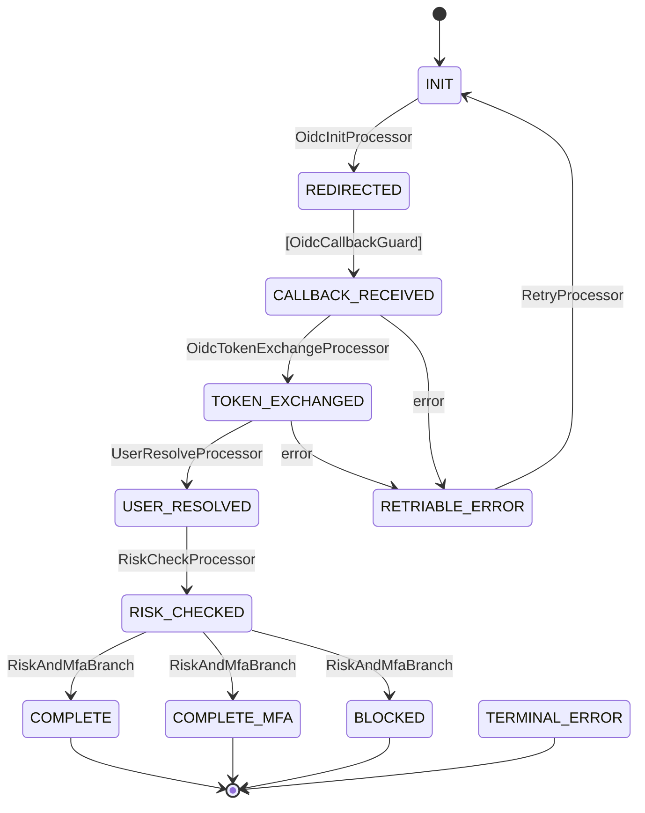

# Real-World Example: OIDC Authentication Flow

This guide is for engineers who are new to tramli and want to organize a login flow that spans several HTTP requests.
It follows an OIDC login from redirect to session issuance, showing how states, transitions, and declared data dependencies make the flow easier to inspect.
The examples explain the flow structure; application services and parts of the OIDC protocol handling are omitted.

[日本語版](example-oidc-auth-flow-ja.md)

## What an OIDC login does

OpenID Connect (OIDC) lets an application identify a user through an identity provider (IdP), such as Google. In the authorization code flow, the application redirects the browser to the IdP, the IdP authenticates the user, and the browser returns to the application's callback URL with a `code`. The application exchanges that code for tokens and validates the ID token before using its user information. It can then find or create a local user and issue an application session. This example also includes a risk check and a decision about multi-factor authentication (MFA). See the [OIDC authorization code flow](https://openid.net/specs/openid-connect-core-1_0.html#CodeFlowAuth) for the protocol steps.

## Why this becomes hard to follow in handlers

The redirect and callback run in separate HTTP requests. A login handler can prepare the request, a callback handler can exchange the code, and service methods can resolve the user and issue a session. Splitting these functions helps, but the following questions still require tracing calls and shared data:

| Problem | Concrete question in this login flow |
|---------|-------------------------------------|
| The sequence is spread across handlers | Can session issuance run before the user has been resolved and the risk check has completed? |
| Data is created in one request and consumed in another | Where was the original `state` saved, and which callback is compared with it? Does `returnTo` survive until session issuance? |
| Failure handling is spread across catch blocks | If token exchange fails, do we restart login, return an error, or leave a callback waiting? What happens when it arrives after the login expires? |
| Callback delivery can repeat | Does a browser refresh mean a new login attempt, a rejected callback, or an already completed login? |

An enum and helper functions can make a hand-written implementation clearer. They still leave the developer responsible for checking that every path supplies the data each helper needs. tramli puts the sequence in a `FlowDefinition` and gives each step a declared input/output contract. The handler starts or resumes that definition; the engine follows its transitions.

The code below uses 11 states, including two error states, and five main processing steps. `retryProcessor` is a separate application-supplied processor whose implementation is omitted. There is one callback guard and one branch decision. The main example is Java; the [plugin tutorial](tutorial-plugins.md) explains plugin integration with TypeScript examples.

## 1. Define States

A state records how far this login attempt has progressed. `INIT` is the initial state; `REDIRECTED` means that the application has prepared the redirect and is waiting for the callback. Terminal states end this flow. In particular, `COMPLETE_MFA` ends the OIDC flow with MFA still pending; it does not mean that the additional authentication has finished.

```java
enum OidcState implements FlowState {
    INIT(false, true),              // initial — user clicks "Login with Google"
    REDIRECTED(false),              // redirect URL generated, waiting for callback
    CALLBACK_RECEIVED(false),       // OAuth callback arrived
    TOKEN_EXCHANGED(false),         // tokens obtained from IdP
    USER_RESOLVED(false),           // user found/created in DB
    RISK_CHECKED(false),            // fraud/risk assessment done
    COMPLETE(true),                 // session issued, done
    COMPLETE_MFA(true),             // session issued but MFA pending
    BLOCKED(true),                  // risk too high, blocked
    RETRIABLE_ERROR(false),         // transient error, can retry
    TERMINAL_ERROR(true);           // unrecoverable error

    private final boolean terminal, initial;
    OidcState(boolean t) { this(t, false); }
    OidcState(boolean t, boolean i) { terminal = t; initial = i; }
    @Override public boolean isTerminal() { return terminal; }
    @Override public boolean isInitial() { return initial; }
}
```

The states are a flat enum. The next step is determined by the transitions we will declare, rather than by a hierarchy of nested states or flags in HTTP handlers.

## 2. Define Context Data

`FlowContext` holds data for one flow instance, keyed by type in Java. Use separate types for the login request, callback, tokens, and session so that each step can declare exactly what it reads and writes.

```java
record OidcRequest(String provider, String returnTo) {}
record OidcRedirect(String authUrl, String state, String nonce) {}
record OidcCallback(String code, String state) {}
record OidcTokens(String idToken, String accessToken) {}
record ResolvedUser(String userId, String email, boolean mfaRequired) {}
record RiskCheckResult(String level, boolean blocked) {}
record IssuedSession(String sessionId, String redirectTo) {}
```

These seven types make the handoffs visible. The caller supplies `OidcRequest` at the start. `OidcInitProcessor` creates `OidcRedirect`, and token exchange later reads its saved `state` alongside `OidcCallback`. Session issuance reads the original `OidcRequest.returnTo` to produce `IssuedSession.redirectTo`.

`state` associates a callback with the login request; `nonce` associates an ID token with that authentication request. The record includes `nonce`, but the abbreviated code below does not show sending or checking it. It also omits ID-token validation and PKCE, so it is not a complete OIDC client implementation. Those protocol checks belong in the application's OIDC integration; `build()` checks declared data dependencies, not token validity.

## 3. Write Processors (1 transition = 1 processor)

A `StateProcessor` performs the work for one transition. `requires()` declares the data that must already be available; `produces()` declares the data the processor will add. The engine calls `process()` when that transition runs.

| Processor | `requires` | `produces` | Work performed |
|-----------|------------|------------|----------------|
| `OidcInitProcessor` | `OidcRequest` | `OidcRedirect` | Prepare the authorization URL and request data |
| `OidcTokenExchangeProcessor` | `OidcCallback`, `OidcRedirect` | `OidcTokens` | Compare `state` and exchange the code |
| `UserResolveProcessor` | `OidcTokens` | `ResolvedUser` | Find or create the local user |
| `RiskCheckProcessor` | `ResolvedUser`, `OidcRequest` | `RiskCheckResult` | Assess login risk |
| `SessionIssueProcessor` | `ResolvedUser`, `OidcRequest` | `IssuedSession` | Create the session and carry forward the redirect destination |

For example, changing session issuance means inspecting its two inputs and the transitions that invoke it. The token-exchange implementation stays in its own processor. Helper functions and service objects in these snippets are supplied by the application, not by tramli.

```java
// Step 1: Generate OAuth redirect URL
StateProcessor oidcInit = new StateProcessor() {
    @Override public String name() { return "OidcInitProcessor"; }
    @Override public Set<Class<?>> requires() { return Set.of(OidcRequest.class); }
    @Override public Set<Class<?>> produces() { return Set.of(OidcRedirect.class); }
    @Override public void process(FlowContext ctx) {
        OidcRequest req = ctx.get(OidcRequest.class);
        String state = generateRandomState();
        String authUrl = buildAuthUrl(req.provider(), state);
        ctx.put(OidcRedirect.class, new OidcRedirect(authUrl, state, generateNonce()));
    }
};

// Step 2: Exchange authorization code for tokens
StateProcessor tokenExchange = new StateProcessor() {
    @Override public String name() { return "OidcTokenExchangeProcessor"; }
    @Override public Set<Class<?>> requires() { return Set.of(OidcCallback.class, OidcRedirect.class); }
    @Override public Set<Class<?>> produces() { return Set.of(OidcTokens.class); }
    @Override public void process(FlowContext ctx) {
        OidcCallback cb = ctx.get(OidcCallback.class);
        OidcRedirect redirect = ctx.get(OidcRedirect.class);
        // Verify state parameter matches
        if (!cb.state().equals(redirect.state())) throw new FlowException("STATE_MISMATCH", "...");
        OidcTokens tokens = oidcService.exchangeCode(cb.code());
        ctx.put(OidcTokens.class, tokens);
    }
};

// Step 3: Find or create user from token claims
StateProcessor userResolve = new StateProcessor() {
    @Override public String name() { return "UserResolveProcessor"; }
    @Override public Set<Class<?>> requires() { return Set.of(OidcTokens.class); }
    @Override public Set<Class<?>> produces() { return Set.of(ResolvedUser.class); }
    @Override public void process(FlowContext ctx) {
        OidcTokens tokens = ctx.get(OidcTokens.class);
        ResolvedUser user = userService.findOrCreate(tokens.idToken());
        ctx.put(ResolvedUser.class, user);
    }
};

// Step 4: Risk assessment
StateProcessor riskCheck = new StateProcessor() {
    @Override public String name() { return "RiskCheckProcessor"; }
    @Override public Set<Class<?>> requires() { return Set.of(ResolvedUser.class, OidcRequest.class); }
    @Override public Set<Class<?>> produces() { return Set.of(RiskCheckResult.class); }
    @Override public void process(FlowContext ctx) {
        ResolvedUser user = ctx.get(ResolvedUser.class);
        RiskCheckResult result = riskService.assess(user);
        ctx.put(RiskCheckResult.class, result);
    }
};

// Step 5: Issue session
StateProcessor sessionIssue = new StateProcessor() {
    @Override public String name() { return "SessionIssueProcessor"; }
    @Override public Set<Class<?>> requires() { return Set.of(ResolvedUser.class, OidcRequest.class); }
    @Override public Set<Class<?>> produces() { return Set.of(IssuedSession.class); }
    @Override public void process(FlowContext ctx) {
        ResolvedUser user = ctx.get(ResolvedUser.class);
        OidcRequest req = ctx.get(OidcRequest.class);
        String sessionId = sessionService.create(user.userId());
        ctx.put(IssuedSession.class, new IssuedSession(sessionId, req.returnTo()));
    }
};
```

The five processors share the same pattern: read declared inputs, perform one step, and store declared outputs. The service implementations still need their own tests, including validation of the ID token before its claims are trusted.

## 4. Write the Guard and Branch

The three transition types describe when the next step runs:

| Type | Meaning | Use in this example |
|------|---------|---------------------|
| **Auto** | Advance without another external event | Prepare the redirect; exchange tokens; resolve the user; assess risk |
| **External** | Stop until the application resumes the flow with an outside event | Wait in `REDIRECTED` for the callback |
| **Branch** | Choose a declared destination from a label returned by a decision | Select `complete`, `mfa`, or `blocked` after risk assessment |

A `TransitionGuard` checks an External event. It declares its inputs and accepted outputs, then returns a result without modifying the context itself. The engine merges data from `GuardOutput.Accepted` into the context. Here the guard requires `OidcRedirect` and produces `OidcCallback`.

A `BranchProcessor` reads data and returns a route label. `RiskAndMfaBranch` requires `ResolvedUser` and `RiskCheckResult`; the flow definition maps its labels to destination states and any processor to run on that route.

```java
// Guard: validates the OAuth callback (External transition)
TransitionGuard callbackGuard = new TransitionGuard() {
    @Override public String name() { return "OidcCallbackGuard"; }
    @Override public Set<Class<?>> requires() { return Set.of(OidcRedirect.class); }
    @Override public Set<Class<?>> produces() { return Set.of(OidcCallback.class); }
    @Override public int maxRetries() { return 1; }
    @Override public GuardOutput validate(FlowContext ctx) {
        // In practice, callback data comes from resumeAndExecute(externalData)
        return new GuardOutput.Accepted(
            Map.of(OidcCallback.class, new OidcCallback("auth-code", "state")));
    }
};

// Branch: route based on risk assessment + MFA requirement
BranchProcessor riskBranch = new BranchProcessor() {
    @Override public String name() { return "RiskAndMfaBranch"; }
    @Override public Set<Class<?>> requires() { return Set.of(ResolvedUser.class, RiskCheckResult.class); }
    @Override public String decide(FlowContext ctx) {
        RiskCheckResult risk = ctx.get(RiskCheckResult.class);
        if (risk.blocked()) return "blocked";
        ResolvedUser user = ctx.get(ResolvedUser.class);
        return user.mfaRequired() ? "mfa" : "complete";
    }
};
```

The guard above is a placeholder: it always accepts fixed callback values. A real guard must validate the received callback instead. In particular, its fixed `state` does not match the random value generated by `oidcInit`, so combining these snippets unchanged will not demonstrate a successful login. The execution example below describes the path after a real callback has been accepted.

## 5. Define the Flow

The definition connects the states and processing contracts in one place. `initiallyAvailable(OidcRequest.class)` declares what the caller will supply at startup. After the External callback transition, the engine can run token exchange, user resolution, risk assessment, and the selected branch without another HTTP request.

```java
var oidcFlow = Tramli.define("oidc", OidcState.class)
    .ttl(Duration.ofMinutes(10))
    .maxGuardRetries(1)
    .initiallyAvailable(OidcRequest.class)
    // Happy path
    .from(INIT).auto(REDIRECTED, oidcInit)
    .from(REDIRECTED).external(CALLBACK_RECEIVED, callbackGuard)
    .from(CALLBACK_RECEIVED).auto(TOKEN_EXCHANGED, tokenExchange)
    .from(TOKEN_EXCHANGED).auto(USER_RESOLVED, userResolve)
    .from(USER_RESOLVED).auto(RISK_CHECKED, riskCheck)
    // Branch: risk assessment result
    .from(RISK_CHECKED).branch(riskBranch)
        .to(COMPLETE, "complete", sessionIssue)
        .to(COMPLETE_MFA, "mfa", sessionIssue)
        .to(BLOCKED, "blocked")
        .endBranch()
    // Error handling
    .onAnyError(TERMINAL_ERROR)
    .onError(CALLBACK_RECEIVED, RETRIABLE_ERROR)
    .onError(TOKEN_EXCHANGED, RETRIABLE_ERROR)
    // Retry
    .from(RETRIABLE_ERROR).auto(INIT, retryProcessor)
    .build();  // ← 8-item validation, including data-flow verification
```

Both the `complete` and `mfa` routes run `sessionIssue`; the `blocked` route ends without issuing a session. Reading this definition tells you which work can follow each state. The processors contain the details of that work.

The error and expiry settings have distinct roles:

- `onAnyError(TERMINAL_ERROR)` sets the default error destination. It must come **before** the two `onError(...)` calls, which override it for token exchange and user resolution. Calling it last would overwrite those routes and leave `RETRIABLE_ERROR` unreachable.
- `RETRIABLE_ERROR → INIT` declares a restart route with an application-supplied `retryProcessor`. It does not provide a retry scheduler or backoff policy. The current Java engine stops the automatic chain after routing a processor exception; declaring this edge alone does not immediately retry the failed login.
- `maxGuardRetries(1)` routes the first guard rejection to the configured error destination. The Java engine uses this flow-level setting, not the guard's `maxRetries()` method.
- `ttl(Duration.ofMinutes(10))` gives the flow a ten-minute lifetime. On resume, the engine checks expiry and completes an expired flow as `EXPIRED`; this is separate from a processor exception routed to `TERMINAL_ERROR`.

## What build() Catches

`build()` validates the definition before the engine runs a login. The core's eight structural checks cover reachable non-terminal states, a path from the initial state to a terminal state, absence of Auto/Branch cycles, unambiguous External routing, valid declared branch targets, data dependencies, no outgoing transitions from terminal states, and the presence of an initial state. See [8-item build validation](../README.md#8-item-build-validation).

For this example, the data-dependency check connects the contracts in section 3: token exchange needs both the redirect data and the callback; session issuance needs both the resolved user and the original request. A required type must be supplied earlier on every path the validator analyzes, rather than merely appearing somewhere in the definition.

If a new processor requires `FraudScore` but nothing produces it, the diagnostic identifies the missing dependency:

```
Flow 'oidc' has 1 validation error(s):
  - Processor 'FraudCheckProcessor' at RISK_CHECKED → COMPLETE
    requires FraudScore but it may not be available
```

An Auto/Branch cycle is also rejected:

```
Flow 'oidc' has 1 validation error(s):
  - Auto/Branch transitions contain a cycle involving TOKEN_EXCHANGED
```

These checks validate the declared graph and contracts. They do not inspect service implementations, prove that a processor actually writes everything it declares, verify an ID token, or guarantee that an IdP will respond. Likewise, the branch check validates declared targets; a `decide()` implementation that returns an undeclared label fails at runtime. Keep tests for those behaviors in the application.

## 6. Run It

The HTTP integration has two entry points. The login handler calls `startFlow()` with the initial request data, then redirects the browser to `OidcRedirect.authUrl`. The callback handler identifies the saved flow and calls `resumeAndExecute()` with the callback data. The store passed to the engine holds the flow between requests.

```java
var engine = Tramli.engine(store);

// User clicks "Login with Google"
var flow = engine.startFlow(oidcFlow, sessionId,
    Map.of(OidcRequest.class, new OidcRequest("GOOGLE", "/dashboard")));
// Auto-chain: INIT → REDIRECTED (stops — External transition)

assertEquals(OidcState.REDIRECTED, flow.currentState());
String authUrl = flow.context().get(OidcRedirect.class).authUrl();
// → redirect user to authUrl

// OAuth callback arrives
flow = engine.resumeAndExecute(flow.id(), oidcFlow,
    Map.of(OidcCallback.class, new OidcCallback("auth-code-123", "state-xyz")));
// Auto-chain: CALLBACK_RECEIVED → TOKEN_EXCHANGED → USER_RESOLVED
//           → RISK_CHECKED → branch → COMPLETE (terminal)

assertTrue(flow.isCompleted());
IssuedSession session = flow.context().get(IssuedSession.class);
// → set session cookie, redirect to session.redirectTo()
```

On the successful `complete` path, one callback advances five transitions: the External transition, three Auto transitions, and the final Branch transition. Their duration includes the work performed by the application services.

The snippet shows the success path after replacing the placeholder guard. A handler must check the outcome before reading `IssuedSession`: `BLOCKED`, an error, or expiry does not produce that value, and `COMPLETE_MFA` still requires the application's MFA handling. Section 8 describes plugins that make these outcomes and repeated callbacks easier to handle.

## 7. Generated Diagrams

The same `FlowDefinition` can generate a state diagram and a data-flow diagram. Use the state diagram to inspect order and waiting points; use the data-flow diagram to inspect producers and consumers. Regenerate diagrams after changing the definition so that saved documentation follows the code.

### State Transition Diagram

```java
String mermaid = MermaidGenerator.generate(oidcFlow);
```

This view shows the main routes and the two specific error routes; the default error edges from `onAnyError` are omitted for readability.


```mermaid
stateDiagram-v2
    [*] --> INIT
    INIT --> REDIRECTED : OidcInitProcessor
    REDIRECTED --> CALLBACK_RECEIVED : [OidcCallbackGuard]
    CALLBACK_RECEIVED --> TOKEN_EXCHANGED : OidcTokenExchangeProcessor
    TOKEN_EXCHANGED --> USER_RESOLVED : UserResolveProcessor
    USER_RESOLVED --> RISK_CHECKED : RiskCheckProcessor
    RISK_CHECKED --> COMPLETE : RiskAndMfaBranch
    RISK_CHECKED --> COMPLETE_MFA : RiskAndMfaBranch
    RISK_CHECKED --> BLOCKED : RiskAndMfaBranch
    CALLBACK_RECEIVED --> RETRIABLE_ERROR : error
    TOKEN_EXCHANGED --> RETRIABLE_ERROR : error
    RETRIABLE_ERROR --> INIT : RetryProcessor
    COMPLETE --> [*]
    COMPLETE_MFA --> [*]
    BLOCKED --> [*]
    TERMINAL_ERROR --> [*]
```

### Data-Flow Diagram

```java
String dataFlow = MermaidGenerator.generateDataFlow(oidcFlow);
```

The data-flow view shows why token exchange requires both callback and redirect data, and why the original request must remain available until session issuance.


```mermaid
flowchart LR
    initial -->|produces| OidcRequest
    OidcRequest -->|requires| OidcInitProcessor
    OidcInitProcessor -->|produces| OidcRedirect
    OidcRedirect -->|requires| OidcCallbackGuard
    OidcCallbackGuard -->|produces| OidcCallback
    OidcCallback -->|requires| OidcTokenExchangeProcessor
    OidcRedirect -->|requires| OidcTokenExchangeProcessor
    OidcTokenExchangeProcessor -->|produces| OidcTokens
    OidcTokens -->|requires| UserResolveProcessor
    UserResolveProcessor -->|produces| ResolvedUser
    ResolvedUser -->|requires| RiskCheckProcessor
    OidcRequest -->|requires| RiskCheckProcessor
    RiskCheckProcessor -->|produces| RiskCheckResult
    ResolvedUser -->|requires| RiskAndMfaBranch
    RiskCheckResult -->|requires| RiskAndMfaBranch
    ResolvedUser -->|requires| SessionIssueProcessor
    OidcRequest -->|requires| SessionIssueProcessor
    SessionIssueProcessor -->|produces| IssuedSession
```

## 8. Extending with Plugins

Once the core flow is clear, plugins can add diagnostics and runtime support around the definition. Choose them according to the problem you need to solve. The [plugin tutorial](tutorial-plugins.md) contains TypeScript integration examples; this section relates those capabilities to the login flow.

### 8.1 Plugin Registration

Registration connects analysis plugins, store wrappers, engine hooks, and runtime adapters to the application. For example, `PolicyLintPlugin` analyzes the definition, `AuditStorePlugin` wraps storage, and `RichResumeRuntimePlugin` supplies a resume adapter. These roles let the application add diagnostics without putting logging or callback-status classification inside each processor. The registration APIs differ by language.

### 8.2 Lint — Design-Time Policy Check

`PolicyLintPlugin` adds design-policy findings in CI. Its four default policies are **terminal-outgoing**, **external-count** (>3), **dead-data**, and **overwide-processor** (>3 produces). For example, it can flag `IssuedSession` as produced but not consumed by another step. In this flow the HTTP handler consumes it, so the finding needs interpretation rather than automatic removal of the output. Custom policies can express application-specific rules.

### 8.3 Audit — "What happened during this login?"

`AuditStorePlugin` records transitions with snapshots of newly produced context data. This helps answer whether a particular login reached token exchange or user resolution, rather than inferring progress from separate handler logs. The application queries the auditing store it configured.

### 8.4 Event Store — Replay and Compensation

A versioned event log supports inspecting earlier flow states with `ReplayService` and deriving values, such as transition counts, with `ProjectionReplayService`. `CompensationService` uses an application-defined plan to record compensating actions. Compensation means arranging an action to undo a prior effect; recording a plan does not itself revoke a session or roll back an IdP request.

### 8.5 Rich Resume — Status Classification

A callback handler needs to distinguish five outcomes: a transition occurred, the flow had already completed, the callback was rejected, no transition applied, or an exception was routed. `RichResumeExecutor` returns these as `RichResumeStatus` values, so the handler can select its response without reconstructing the outcome from state comparisons. Status spelling differs between language implementations.

### 8.6 Idempotency — Double Callback Protection

A browser refresh or network retry can deliver the same callback again. `IdempotentRichResumeExecutor` uses a `commandId` and a registry to recognize an already processed command; this example's command identifier is based on the callback's `state`. This adds explicit command deduplication to the core's completed-flow handling. It does not replace callback validation.

### 8.7 Diagram and Documentation Generation

`DiagramPlugin` groups generated diagrams, `DocumentationPlugin` creates a Markdown catalog, and `ScenarioTestPlugin` creates test-scenario descriptions from the definition. These make the flow available to reviewers who do not need to read each processor. Generated scenario descriptions provide a starting point for tests; they do not test the OIDC service implementations.

### What Plugins Add to this Flow

| Question | Relevant plugin capability |
|----------|----------------------------|
| Was this callback already processed? | Idempotency with a command registry |
| Which steps ran, and what data did they add? | Audit records |
| What was the state at an earlier version? | Event-log replay |
| Did resume advance, reject, or route an error? | Rich Resume status classification |
| Is a declared output unused within the flow? | Policy lint |
| How can reviewers inspect the definition? | Diagrams, a documentation catalog, and scenario descriptions |

The core definition keeps the order, waiting points, branches, and data contracts visible. Plugins add the operational views needed around that definition.

---

Example origin: [volta-auth-proxy](https://github.com/opaopa6969/volta-auth-proxy), an identity gateway that uses tramli for OIDC, Passkey, MFA, and invitation flows. Knowledge of that project is not needed to follow this example.
