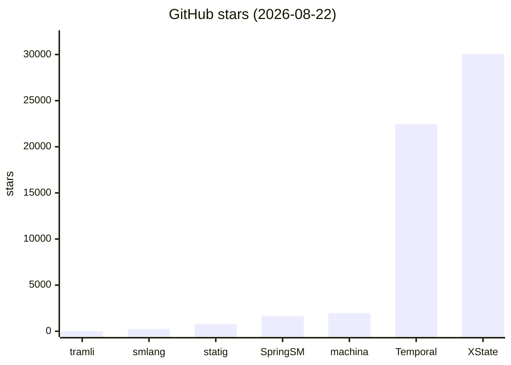

# tramli 市場調査 — 2026-08-22

## 0. 要約

- **立ち位置**: フラットenum × ビルド時8項目検証 × 3言語同時実装の状態機械ライブラリ。「状態遷移の不正がコンパイル時に存在しえない」ことを約束する点で、全比較対象中唯一。
- **最大の弱点**: 採用がほぼゼロ（GitHub star 1、npm 3 downloads/week）。Maven Central・crates.io 未公開。技術的差別化があっても、使われていないとフィードバックが回らない。
- **次の一手**: Maven Central と crates.io への公開を完了し、3言語すべてが `import → build()` で動くまでを最短経路にする。npm だけで比較対象の体積に1000倍差があり、配布経路が揃わないと機能比較は意味をなさない。

## 1. このrepoは何か

tramli は**制約付きフローエンジン**（constrained flow engine）— 状態機械ライブラリである。3言語（Java / TypeScript / Rust）で同じ設計を共有し、フラットな enum で状態を定義し、`build()` 時に8項目の構造検証を行う。

- **一言**: 状態遷移の不正がビルド時に存在しえない状態機械ライブラリ。`requires()/produces()` でプロセッサ間のデータフロー契約を宣言し、`build()` が全パスで検証する。
- **提供価値**: 手続き型ハンドラ（1000行超）を、50行の FlowDefinition に置き換える。LLM と人間の両方のコンテキスト予算を節約する — 「読まなくて良いもの」が「読むもの」より重要という設計思想（README より）。
- **想定利用者**: 認証フロー（OIDC, MFA）、決済・注文処理、承認ワークフロー、CI/CD パイプラインなど「状態・遷移・外部イベント」を持つシステムの開発者。とくに LLM コード生成を前提とする設計（README "Why LLMs Love This" 節）。
- **到達点の客観指標**:
  - GitHub star: **1** / fork: 0（2026-08-22時点、GitHub API）
  - npm: `@unlaxer/tramli` v3.7.1 公開済み、週間ダウンロード **3**（npmjs.org API、2026-08-15〜21）
  - Maven Central: **未公開**（search.maven.org で "tramli" 検索 → 0件、2026-08-22）
  - crates.io: **確認不能**（crates.io API がレート制限で応答拒否、2026-08-22）。SPEC §1.3 には "crates.io" と記載あり
  - テスト: TS 78件全パス（`vitest run` 実行、2026-08-22）。Java 8テストクラス（mvn 未導入で未実行）。Rust 4テストファイル
  - コード規模: Java 5,328 LOC / TS 4,283 LOC / Rust 8,367 LOC（`find ... -exec cat + | wc -l`、2026-08-22）
  - 依存: **ゼロ**（全言語、README "Requirements" 節・package.json で確認）
  - 最終コミット: 2026-08-22（HEAD: 1965438）
  - パフォーマンス: 5遷移フローで ~1.69μs（SPEC §10、JMH計測）

### 比較の単位について

tramli は**単体で価値を出すライブラリ**である。前段・後段に何が居るかと言えば、利用者が自分で FlowStore（RDB/Redis）を実装し、HTTPハンドラから `resumeAndExecute()` を呼ぶ。tramli そのものは状態の永続化を持たず、FlowStore を注入する。つまり「代わりに何を使うか」と聞かれれば、**状態機械ライブラリ全体を置き換える**ことになる。比較対象は同じ層の状態機械ライブラリである。

ただし、README と SPEC は Temporal/Airflow との対比を意識的に書いている（SPEC §1.2 "Conventional imperative flow code collapses..."、README Pipeline 節 "When to use what" 表で Temporal/Airflow を挙げている）。これは tramli が「ワークフローエンジンの静的検証版」という側面もあるため、Temporal を**別層の比較対象**として参考的に含める。

## 1.5 調査の型

**`library`** — コードが読める。比較の主軸は**機能＋実装**（API面・依存の重さ・実装方針・テスト量・配布サイズ）。

tramli は3言語実装だが、同じ SPEC と shared-tests で縛られており、意味的に同一。TS実装（`@unlaxer/tramli`、npm公開済み）を主軸にコードを読み、Java/Rust は SPEC §1.3 の対応表で確認した。

confidence は**高** — 自repo のコードを読み、テストを走らせ（TS 78件）、npm の公開状況・ダウンロード数を直接確認した。比較対象についても GitHub API で star/更新日/ライセンスを確認し、README を読んだ。ただし比較対象の**コード本体は README レベルの確認**であり、各repo を clone して実行はしていない（これは「中」ではなく「高」の根拠としては弱い点 — 自repo側のコード読みと実行で「高」を名乗る。比較対象の実装詳細は「中」相当の精度）。

## 2. 比較対象と選定理由

| 製品 | 何ができるか | 採用状況 | ライセンス | うちとの決定的な違い | なぜ選んだか |
|---|---|---|---|---|---|
| **XState** | JS/TS 向け状態機械＋Statecharts（階層状態・直交領域）＋Actor model。SCXML 準拠。視覚的エディタ（Stately Studio） | ★30,045 / 最終更新 2026-08-22 / npm 529万DL/週 | MIT | 階層状態・直交領域を持ち、表現力で勝る。静的検証は実行時のみ。JS/TS 単言語 | JS/TS 状態機械の事実上の標準。tramli が意識的に「フラットenum」を選んだ対極 |
| **statig** | Rust 向け階層状態機械。`no_std` 対応、状態局所ストレージ、async サポート | ★796 / 最終更新 2026-08-17 / crates.io 455万DL | MIT | 階層状態を持つ。ビルド時検証なし。Rust 単言語 | Rust 状態機械ライブラリで最も採用されている。tramli Rust 実装の直接競合 |
| **smlang** | Rust 向け状態機械 DSL（proc macro）。`no_std`、Boost-SML 構文ベース、guard/action 宣言 | ★243 / 最終更新 2026-07-28 / crates.io 88万DL | Apache-2.0 | DSL マクロで遷移を宣言。ビルド時データフロー検証なし。Rust 単言語 | Rust で宣言的 DSL を提供するアプローチの代表。tramli の Builder DSL と比較対象 |
| **Spring StateMachine** | Spring Framework 向け状態機械。階層状態・ガード・アクション・イベント。Spring Boot 統合 | ★1,662 / 最終更新 2026-08-17 / fork 637 | Apache-2.0 | Spring エコシステムに深く統合。階層状態あり。ビルド時検証なし。Java 単言語 | Java 状態機械の定番。tramli Java 実装の比較対象 |
| **Temporal** | 分散durable実行プラットフォーム。ワークフローを耐障害性付きで実行。Go/Java/TS/Python SDK | ★22,455 / 最終更新 2026-08-22 / fork 1,830 | MIT | 別層 — サーバプロセスが状態を保持し再実行する。tramli はライブラリでサーバを持たない | tramli README/SPEC が明示的に対比。「いつ tramli を使い、いつ Temporal を使うか」の境界を描くため |
| **machina.js** | JS/TS 向け FSM。v7 で TypeScript-first、階層状態、状態ごとのハンドラ | ★1,969 / 最終更新 2026-08-22 / npm 5.3万DL/週 | ISC | 階層状態を持つ。ビルド時検証なし。JS/TS 単言語 | XState に次ぐ JS/TS FSM。tramli と同じ「ハンドラで状態遷移を書く」アプローチ |

**どういう地図なのか**: 状態機械ライブラリは**階層状態（Statecharts）が主流**であり、XState・statig・Spring SM・machina.js すべてが階層をサポートする。tramli は DGE（DD-021）で「階層状態はデータフロー検証を劣化させる」と結論し、意図的にフラットenum に制限した。これは**選択の非対称**である — 比較対象は「表現力」で勝り、tramli は「検証の完全性」で勝る。両立しない（SPEC §1.2, README "Why flat states?"）。市場は階層状態に傾いており、tramli の立場は意識的な少数派。

Temporal は別層だが、README が Pipeline 節で「Distributed / long-running / scheduled → Airflow / Temporal」と明示的に境界を引いている。 tramli が「ライブラリで足りる範囲」を主張する以上、Temporal は「比較対象ではなく、使い分けの境界」として置く。

## 4. 機能比較

| 機能 | 重み | tramli | XState | statig | smlang | Spring SM | machina.js |
|---|---|---|---|---|---|---|---|
| ビルド時構造検証（到達性・DAG・データフロー） | ◎必須 | ○ 8項目 | × 実行時のみ | × | × | × | × |
| requires/produces データフロー契約 | ◎必須 | ○ 宣言→build検証 | × | × | × | × | × |
| フラットenum状態（コンパイラ網羅性） | ○効く | ○ 意図的選択 | △ enum風だが動的 | × 構造体 | ○ enum | △ 文字列 | △ 文字列 |
| 階層状態（スーパー状態） | △あれば | × 意図的除外(D-021) | ○ | ○ | × | ○ | ○ |
| 直交領域（並行状態） | △あれば | × 意図的除外(D-021) | ○ | × | × | ○ | × |
| 外部イベント待ち（External遷移） | ◎必須 | ○ guard+resumeAndExecute | ○ イベント駆動 | ○ イベント | ○ イベント | ○ イベント | ○ イベント |
| 分岐遷移（条件ルーティング） | ○効く | ○ BranchProcessor | ○ guard | △ match | ○ guard | ○ guard | ○ ハンドラ戻り値 |
| 自動チェーン（1リクエスト複数遷移） | ○効く | ○ Auto-Chain(max10) | △ | × | △ | △ | × |
| Mermaid 図自動生成 | ○効く | ○ コードから生成 | ○ Stately Editor | × | × | × | × |
| データフロー図 | ○効く | ○ DataFlowGraph | × | × | × | × | × |
| 3言語同時実装（同一SPEC） | ○効く | ○ Java/TS/Rust+shared-tests | × JS/TSのみ | × Rustのみ | × Rustのみ | × Javaのみ | × JS/TSのみ |
| プラグインシステム | △あれば | ○ 6 SPI/14プラグイン | △ actions/guards | × | × | △ | × |
| TTL・有効期限 | ○効く | ○ build時設定 | × | × | × | × | × |
| エラー遷移ルーティング | ○効く | ○ onAnyError/onError/onStepError | △ | △ | △ | ○ | △ |
| 永続化インターフェース | ◎必須 | ○ FlowStore(pluggable) | × | × | × | △ リポジトリ | × |
| サーバ不要（ライブラリのみ） | ○効く | ○ | ○ | ○ | ○ | ○ | ○ |
| ゼロ依存 | ○効く | ○ 全言語 | ○ xstate本体 | ○ no_std | ○ no_std | × Spring依存 | ○ |
| LLMコード生成前提設計 | △あれば | ○ README明示 | × | × | × | × | × |
| Actor model | — | × 意図的除外 | ○ | × | × | × | × |

**×のうち痛いもの**: 階層状態（×）は意図的除外（DD-021）であり、ユーザが階層状態を必要とする場合は tramli を選べない。これは「痛い」というより「選択の前提」だが、市場の主流が階層を求める以上、対象領域を自ら狭めている。直交領域（×）も同様。

**○のうち実は差別化になっていないもの**: Mermaid 図自動生成は XState も Stately Editor で視覚化できる。プラグインシステムは、まだ3rd-party プラグインが存在しない（volta-index 内でのみ使用）。外部イベント待ちは全比較対象が持つ — これ自体は差別化でなく、tramli の差別化は「待っている間も build 時検証が効いている」点。

**真正の差別化は1行**: ビルド時構造検証（◎）と requires/produces データフロー契約（◎）。比較対象6つすべてが「実行時のみ」であり、ここだけ tramli が唯一○。

## 4.5 コード・実装の比較

| 観点 | tramli (TS) | XState | @xstate/fsm | machina.js | 出典 |
|---|---|---|---|---|---|
| 公開API数（export） | 21 | 多数（core/src で30+ファイル） | 少 | 中 | `src/index.ts` / GitHub API contents |
| 依存パッケージ数 | 0 | 0 | 0 | 0 | npm view / package.json |
| テスト | 78 pass (TS) / 8 class (Java) / 4 file (Rust) | 大規模（推測、未計測） | — | — | `vitest run` 実行 / GitHub |
| 配布サイズ（unpack） | 68K | 2.29MB | 57K | 472K | `du -sh dist/` / npm dist.unpackedSize |
| ライセンス | MIT | MIT | MIT | ISC | package.json / npm |
| 言語 | Java/TS/Rust (3) | JS/TS (1) | JS/TS (1) | JS/TS (1) | README / SPEC §1.3 |
| 週間DL (npm) | 3 | 5,290,455 | — | 52,946 | npmjs.org API (2026-08-15〜21) |

**実装方針の違い**: XState は「表現力を最大化する」方向（階層・直交・Actor）で、コア `stateUtils.ts` が50KBに達する。tramli は「検証を最大化する」方向で、エンジンは~120行（README記載）・配布68K。両者はゼロ依存だが、XState は機能の厚み、tramli は薄さと検証の深さで対極。machina.js は tramli に近い「ハンドラで状態遷移」アプローチだが、階層状態を持ち、ビルド時検証を持たない。

smlang は proc macro で遷移を宣言する点で tramli の Builder DSL と似ているが、guard/action は関数参照であり、requires/produces の型レベル契約はない。smlang は `no_std` で組み込み向き、tramli は WebAPI向きと、前提が違う。

## 5. 採用状況

tramli の star 1 は他と比較にならない。機能比較で差別化があっても、可視性の差は圧倒的。XState（30k）と Temporal（22k）が市場の二大勢力で、tramli は「技術的に興味深いが誰も使っていない」状態。

npm DL/週 でも xstate 529万 vs tramli 3 で100万倍超。これは「品質」ではなく「認知」の差であり、README・SPEC・論文（35KB）の充実度に対して、配布経路（Maven Central 未公開・crates.io 未確認）とマーケティングが追いついていない。

## 5.5 調査者の見立て

**何が本当の勝負所か**: ビルド時検証（8項目）と requires/produces 契約は技術的に唯一無二だが、これが**市場に刺さるかは別問題**。XState は「実行時に間違いが出る」ことを受け入れた上で、視覚的エディタと Actor model で複雑さを管理している。つまり tramli の「ビルド時に弾く」は、開発者が**本当に困っている問題か**が問われる。手続き型ハンドラが1000行になる問題は実在するが、多くのチームは XState または何も使わない（素のif/switch）で凌いでいる。tramli が勝つには、「build() で弾かれたエラーが本番障害を防いだ」という**事例**が必要だ。

**数字に出ていないが気になること**: SPEC が極めて厚い（3,367行）。論文（`paper-tramli-constrained-flow-engine.md` 35KB）まである。設計決定（DD-001〜041）が記録されている。これは「研究としての完成度」が極めて高いが、「製品としての採用」と乖離している。設計の美しさが採用に直結しない典型例に見える。README は1,825行で丁寧だが、**Quick Start が3言語のコードを折りたたみで並べる**構成は、初見の開発者にとって「どれから始めればよいか」が分かりにくい（比較対象は単言語なので迷わない）。

**自分ならどうするか**: 3言語のうち1つ（Java か Rust）を**捨ててTSに集中**するのは論外 — 3言語同時実装が差別化だから。ただし、配布経路を最優先で揃える。Maven Central と crates.io が未公開のまま npm だけで出ているのは、Java/Rust ユーザが「試そうとして見つからない」状態。次に、XState ユーザの**移行先**としての位置づけを明確にする。「XState で状態が増えすぎて静的検証が欲しくなったら tramli」が一番自然な導入経路だが、今の README は XState を比較対象として前面に出していない。

**この見立てが外れるとしたらどこか**: (1) XState が静的検証を追加した場合、tramli の最大の差別化が消える。XState は SCXML 準拠で静的解析の土俳があるので、不可能ではない。(2) LLM コード生成前提設計が市場に刺さらない場合 — README が「Why LLMs Love This」を強調するが、2026年時点で「LLM が状態機械を生成する」ワークフローが一般化しているか不明。もし人間が書くのが主流なら、この差別化は効かない。(3) 階層状態を必要とする用途が多く、tramli の「フラットenum」が市場の要件を満たさない場合 — この場合、tramli は「正しいが使われない」状態になる。

## 6. 提案

| 順 | 提案 | 分類 | 根拠 | 最小の一手 | 効きそうな指標 |
|---|---|---|---|---|---|
| 1 | Maven Central / crates.io 公開を完了する | 伸ばす | SPEC §1.3 に「crates.io / Maven Central」と書いてあるが未公開/未確認。3言語同時実装が差別化なのに配布経路が揃わない | pom.xml の sonatype 設定を確認し `mvn deploy` / `cargo publish` | Java/Rust ユーザの流入（DL数） |
| 2 | XState からの移行ガイドを書く | 埋める | XState 529万DL/週の一部でも取り込めれば絶対量が違う。tramli の「フラットenum×検証」は XState の「階層×動的」の対極で、移行先になりうる | `docs/migration-from-xstate.md` — 階層状態をどう tramli で表現するか（SubFlow）を具体例で | XState ユーザからの issue / star |
| 3 | 「build() が本番障害を防いだ」事例を1つ作る | 伸ばす | 5.5節 — 技術的差別化が事例なしに刺さらない。自分のプロジェクト（volta-gateway で使用中、SPEC §1.3 DD-008）でよい | volta-gateway の OIDC フローで build() が弾いたケースを1つ記事化 | 外部開発者の「試してみよう」率 |
| 4 | README の Quick Start を単一言語（TS）に絞る | 埋める | 初見開発者が3言語コードを並べられたら迷う。比較対象は全部単言語で迷わない。Java/Rust は折りたたみのさらに奥へ | README Quick Start を TS のみにし、Java/Rust を `
` の第2層へ | README の離脱率（GitHub referrer） |
| 5 | shared-tests の結果を CI badge で可視化する | 伸ばす | 3言語同一挙動が差別化だが、外部から見えない。badge なら README の1行目で目に入る | 3言語の CI を回して badge URL を README に貼る | README 閲覧時の信頼感 |
| 6 | 階層状態プラグイン（HierarchyGenerationPlugin）の README を目立たせる | 伸ばす | 階層状態が必要なユーザが tramli を諦めるのを防ぐ。HierarchyGenerationPlugin が「階層spec → flat enum skeleton」を生成する（SPEC E.5） | plugin-guide で HierarchyPlugin を冒頭に移動し、具体例を追加 | 階層状態ユーザの issue |
| 7 | Temporal との使い分けを README に明示する | 埋める | README Pipeline 節に1行あるが不十分。Temporal 22k star のユーザが「tramli で足りるか」を判断できるように | 「いつ tramli、いつ Temporal」の決定木を docs/ に追加 | Temporal ユーザからの流入 |
| 8 | Actor model を追加しない | やらない | XState の Actor model は表現力を高めるが、ビルド時検証と両立しない（DD-021 と同じ理由）。差別化を薄める | — | — |
| 9 | 階層状態を core に追加しない | やらない | DD-021 で意図的に除外。追加するとデータフロー検証の完全性が失れ、tramli の存在意義が消える。HierarchyGenerationPlugin で緩和済み | — | — |

## 8. 出典

| URL | 参照日 | 何の根拠に使ったか |
|---|---|---|
| `https://github.com/opaopa6969/tramli` (GitHub API) | 2026-08-22 | star=1, fork=0, pushed=2026-08-22, 作成=2026-04-06 |
| `README.md` (1,825行) | 2026-08-22 | tramli の機能・設計思想・Quick Start・Pipeline・Plugin・Performance |
| `spec/SPEC.md` (3,367行) | 2026-08-22 | 3言語対応表・非機能(§10)・プラグイン仕様(Appendix E)・DD一覧 |
| `volta.service.json` | 2026-08-22 | type=library, skill-only, mcp.enabled=false |
| `lang/ts/package.json` | 2026-08-22 | @unlaxer/tramli v3.7.1, MIT, 依存0 |
| `lang/ts/src/index.ts` | 2026-08-22 | 公開API数=21 (export行数) |
| `lang/ts/dist/` (du -sh) | 2026-08-22 | 配布サイズ 68K |
| `vitest run` 実行結果 | 2026-08-22 | TS テスト 78件全パス |
| `find lang/{java,ts,rust} -exec cat + \| wc -l` | 2026-08-22 | Java 5,328 LOC / TS 4,283 LOC / Rust 8,367 LOC |
| `npm view @unlaxer/tramli` | 2026-08-22 | v3.7.1, license MIT, dependencies {} |
| `https://api.npmjs.org/downloads/point/last-week/@unlaxer/tramli` | 2026-08-22 | 週間DL=3 (2026-08-15〜21) |
| `https://search.maven.org/solrsearch/select?q=tramli` | 2026-08-22 | Maven Central 検索結果 0件（未公開） |
| `https://crates.io/api/v1/crates/tramli` | 2026-08-22 | API がレート制限で応答拒否。公開状況不明。SPEC §1.3 は crates.io と記載 |
| `git log --oneline -15` (HEAD=1965438) | 2026-08-22 | 最終コミット 2026-08-22, "mcpify: Phase 2 skill-only MCP化" |
| `https://api.github.com/repos/statelyai/xstate` | 2026-08-22 | star=30,045, MIT, updated=2026-08-22 |
| `https://api.npmjs.org/downloads/point/last-week/xstate` | 2026-08-22 | 週間DL=5,290,455 |
| `npm view xstate dist.unpackedSize` | 2026-08-22 | 2,291,165 bytes (2.29MB) |
| XState README (GitHub raw) | 2026-08-22 | Actor model, SCXML, Stately Studio, ゼロ依存 |
| `https://api.github.com/repos/mdeloof/statig` | 2026-08-22 | star=796, MIT, updated=2026-08-17 |
| `https://crates.io/api/v1/crates/statig` | 2026-08-22 | downloads=4,550,415 |
| statig README (GitHub raw) | 2026-08-22 | 階層状態, no_std, async, state-local storage |
| `https://api.github.com/repos/korken89/smlang-rs` | 2026-08-22 | star=243, Apache-2.0, updated=2026-07-28 |
| `https://crates.io/api/v1/crates/smlang` | 2026-08-22 | downloads=884,704, desc="no-std state machine DSL" |
| smlang README (GitHub raw, master) | 2026-08-22 | proc macro DSL, Boost-SML 構文, guard/action, no_std |
| `https://api.github.com/repos/spring-projects/spring-statemachine` | 2026-08-22 | star=1,662, Apache-2.0, updated=2026-08-17, fork=637 |
| `https://api.github.com/repos/temporalio/temporal` | 2026-08-22 | star=22,455, MIT, updated=2026-08-22 |
| Temporal README (GitHub raw) | 2026-08-22 | durable execution platform, Uber Cadence fork |
| `https://api.github.com/repos/ifandelse/machina.js` | 2026-08-22 | star=1,969, ISC, updated=2026-08-22 |
| `https://api.npmjs.org/downloads/point/last-week/machina` | 2026-08-22 | 週間DL=52,946 |
| `npm view machina dist.unpackedSize` | 2026-08-22 | 472,341 bytes |
| machina.js README (GitHub raw, master) | 2026-08-22 | v7, TypeScript-first, 階層状態, createFsm API |
| `docs/plugin-guide.md` | 2026-08-22 | 6 SPI / 14 プラグイン, frozen core 設計原則 |
