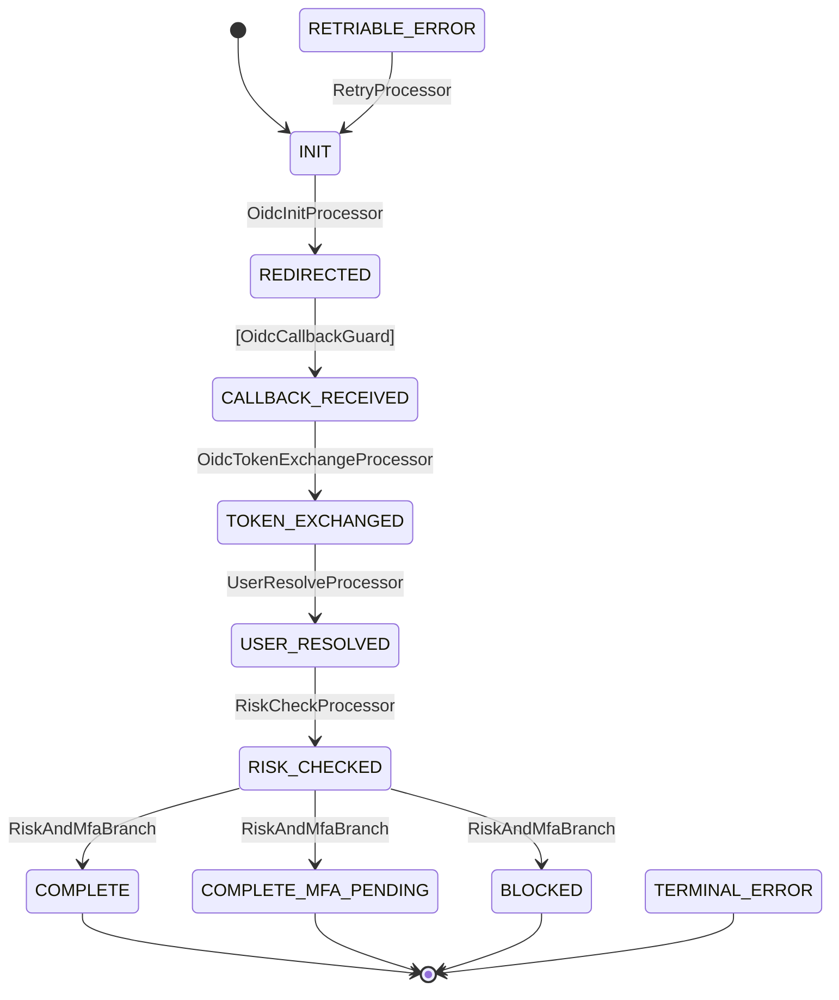

# tramli: Definition-Time Validated Constrained Flow Engine with Data-Flow Contracts

> v3 — DGE 査読 Round 1 (G1-G12) + Round 2 (G13, G15-G21) 反映。全 Gap 解消。

**Target audience**: Engineers selecting state machine libraries, library authors, and researchers interested in the intersection of data-flow analysis and state machine design. This is a positioning paper, not a formal academic submission.

## Abstract

State machine libraries are widely used for managing complex application workflows, yet most defer validation to runtime, leaving structural errors — unreachable states, data dependency mismatches, infinite transition loops — to be discovered in production. We present **tramli**, an embeddable flow engine that enforces structural well-formedness checks at **definition time** (when `build()` is called on a flow definition), introduces **requires/produces contracts** on state processors for static data-flow verification, and provides **DataFlowGraph** analysis for dependency visualization, dead data detection, and migration planning. tramli is implemented as a zero-dependency library in Java, TypeScript, and Rust with a shared test suite across all three languages. We compare tramli against 3 primary competitors (XState, Spring Statemachine, statig) and position it within the state machine theory landscape from Harel Statecharts to modern typestate approaches.

---

## 1. Introduction

### 1.1 The Problem

Modern applications increasingly rely on multi-step workflows: authentication flows, payment processing, deployment orchestration, approval chains. These workflows are naturally modeled as state machines, where each state represents a point in the process and transitions represent the progression between states.

However, most state machine implementations suffer from a fundamental gap: **structural correctness is only discoverable at runtime.** A developer can define a state that is unreachable from any initial state, create a circular chain of automatic transitions that loops infinitely, or reference data that was never produced by a prior step — and none of these errors surface until the code executes in production.

This gap is particularly dangerous when:
- **LLMs generate state machine code** — they hallucinate valid-looking but structurally broken definitions
- **Teams modify flows incrementally** — each change is locally correct but globally breaks invariants
- **Flows span multiple services or languages** — consistency across implementations is hard to verify

### 1.2 Our Contribution

tramli addresses these problems through three mechanisms:

1. **Definition-time well-formedness checks**: When a flow definition is constructed, `build()` verifies 8 structural invariants before the flow can execute. This is not formal verification (model checking) — it is a focused set of structural checks that catch the most common and dangerous errors without requiring external tools. Broken definitions fail fast with actionable error messages.

2. **requires/produces contracts**: Each processor (the unit of business logic) declares what data it needs and what data it provides. These declarations are verified across all paths in the flow graph at definition time, eliminating "data not found" runtime errors. This is a specialization of definition-use analysis from classical data-flow theory, applied at the type level rather than the variable level.

3. **DataFlowGraph analysis**: A derived graph that answers questions about data lifecycle — where is a type first produced? Where is it last consumed? What data is dead (produced but never consumed)? — enabling both optimization and migration planning.

### 1.3 Scope and Non-Goals

tramli is **not** a Statechart implementation (Harel, 1987). It does not support orthogonal regions, history states, or SCXML compliance. It is **not** a formal verification tool — it cannot prove arbitrary temporal logic properties. It is **not** a workflow engine — it has no built-in durability, distribution, or retry infrastructure (cf. Temporal.io).

tramli is a **focused, embeddable library** for applications where the dominant concern is: "is my flow definition structurally sound and data-flow consistent?"

---

## 2. Background and Related Work

### 2.1 Theoretical Foundations

**Harel Statecharts (1987)** introduced hierarchical states, orthogonal regions, and history states as extensions to flat finite state machines. UML State Machines and SCXML formalized these concepts into standards. tramli intentionally omits these features — it models flows as flat state graphs with three transition types (Auto, External, Branch), gaining simplicity at the cost of expressiveness. Specifically, orthogonal regions (concurrent state) and history states (state memory) are outside tramli's model. This restricts tramli to sequential, non-concurrent workflows, which covers the majority of business process flows (authentication, payment, approval) but not concurrent protocol modeling.

**Extended Finite State Machines (EFSMs)** augment FSMs with variables and guards on transitions. Data-flow analysis of EFSMs (cf. Cheng & Krishnakumar, 1993) applies classical definition-use analysis to track variable assignments and references across state transitions. tramli's requires/produces contracts are a **specialization of EFSM data-flow analysis**: instead of tracking individual variables, tramli tracks data types (Class keys). This coarser granularity trades precision for simplicity — a processor that declares `requires(OrderRequest.class)` does not specify which fields of OrderRequest it uses. The benefit is that contracts are trivially declared and verified without complex pointer analysis.

**Typestate analysis** (Strom & Yemini, 1986) tracks object state through program analysis, ensuring operations are only invoked when the object is in a valid state. Aldrich et al. (2009, 2014) extended this to Typestate-Oriented Programming. In Rust, the **typestate pattern** (Cliffle 2020, Hoverbear 2016) encodes states as types, making invalid transitions compile errors. This provides a strictly stronger guarantee than tramli's definition-time checks — a Rust typestate FSM cannot represent an invalid transition in any program, while tramli can represent one that fails at `build()`. However, typestate approaches do not address data-flow contracts between processing steps, and they cannot model flows where state is dynamically loaded from persistence (the type must be known at compile time).

### 2.2 State Machine Libraries

**XState v5** (~29,400 GitHub stars) is the dominant TypeScript state machine library, implementing full SCXML-compliant statecharts with an actor model. XState takes a design philosophy of **maximum expressiveness**: developers have full statechart power, including parallel states, history, and invocable actors. XState's "always" (eventless) transitions are conceptually similar to tramli's auto-chain. XState v5 provides TypeScript generic typing for context, offering compile-time type safety for data access. The key philosophical difference: **XState trusts the developer to use statechart power correctly; tramli constrains the developer to prevent structural errors.** Neither approach is inherently superior — they reflect different trade-offs between expressiveness and safety.

**Spring Statemachine** (~1,660 stars) provides deep Spring ecosystem integration with hierarchical states, orthogonal regions, and distributed coordination via Zookeeper. It is a rich framework with runtime-only validation.

**statig** (~769 stars) leverages Rust's type system for compile-time transition validation with no_std/no_alloc support. It provides superstate hierarchy but no data-flow contracts.

### 2.3 Workflow Engines

Temporal.io (~19,400 stars) and AWS Step Functions solve a fundamentally different problem: **durable, distributed execution** over long time spans (minutes to years). They are infrastructure services, not embeddable libraries. tramli and Temporal occupy different architectural layers — tramli defines flow structure within an application process, while Temporal orchestrates across processes and machines. Comparing them on a single axis would be misleading.

---

## 3. Design

### Design Intuition: Compiler Techniques for State Machines

tramli applies well-known compiler techniques to state machine definitions. Readers familiar with compiler theory will recognize:

| tramli concept | Compiler analogy |
|---|---|
| requires/produces contracts | Function signature type checking |
| DataFlowGraph | Reaching definitions + liveness analysis |
| DAG check (auto transitions) | Loop detection in control flow graph |
| deadData() | Dead code elimination |
| lifetime() | Variable liveness range |
| build() | Semantic analysis pass (after parsing, before codegen) |

This analogy is deliberate. tramli treats a FlowDefinition as a "program" and `build()` as a "compiler pass" that rejects structurally invalid programs before execution.

### 3.1 Core Concepts

tramli has 8 composable building blocks:

| Concept | Role |
|---|---|
| **FlowState** | Enum of all possible states. Each state declares whether it is initial or terminal. |
| **StateProcessor** | Business logic for one transition. Declares `requires()` and `produces()`. |
| **TransitionGuard** | Pure validation function for external events. Returns Accepted/Rejected/Expired. |
| **BranchProcessor** | Conditional routing — returns a label that maps to a target state. |
| **FlowContext** | Type-safe data accumulator keyed by `Class<?>` (Java), `TypeId` (Rust), or string key (TS). |
| **FlowDefinition** | Immutable, validated description of all states, transitions, and processors. |
| **FlowEngine** | ~120-line orchestrator. Zero business logic. Drives auto-chain, guard validation, branching. |
| **FlowStore** | Pluggable persistence interface (4 methods). |

### 3.2 Three Transition Types

| Type | Trigger | Use Case |
|---|---|---|
| **Auto** | Previous transition completed | Internal processing steps |
| **External** | Outside event (HTTP request, webhook) | User action, callback |
| **Branch** | BranchProcessor returns label | Conditional routing |

Auto and Branch transitions form a DAG — enforced at definition time. External transitions pause the flow until an event arrives.

### 3.3 Auto-Chain

When an External transition's guard passes, the engine continues firing Auto and Branch transitions until it reaches another External transition or a terminal state:

```
HTTP callback arrives
  → External: REDIRECTED → CALLBACK_RECEIVED     (guard validates)
  → Auto:     CALLBACK_RECEIVED → TOKEN_EXCHANGED (processor executes)
  → Auto:     TOKEN_EXCHANGED → USER_RESOLVED     (processor executes)
  → Branch:   USER_RESOLVED → COMPLETE            (branch decides)
  (terminal — flow complete)
```

Fig. 1: OIDC Authentication Flow (generated by `MermaidGenerator.generate(definition)`)



Safety: maximum chain depth is 10. The DAG invariant (§3.5, check #3) prevents infinite auto-chain loops.

### 3.4 requires/produces Contracts

Each StateProcessor and TransitionGuard declares:
- `requires()`: the set of data types it needs from FlowContext
- `produces()`: the set of data types it adds to FlowContext

```java
public interface StateProcessor {
    String name();
    Set<Class<?>> requires();
    Set<Class<?>> produces();
    void process(FlowContext ctx) throws FlowException;
}
```

At definition time, tramli walks all paths from the initial state and verifies that every processor's `requires()` is satisfied by the `produces()` of prior processors (or `initiallyAvailable` data). This is a forward data-flow analysis over the state graph.

**Important limitation**: requires/produces contracts verify *declarations*, not *implementations*. If a processor declares `produces(Foo.class)` but its `process()` method does not call `ctx.put(Foo.class, ...)`, the error will surface at runtime when a downstream processor calls `ctx.get(Foo.class)`. This is a well-formedness check, not formal verification.

> **Property (Soundness of requires/produces verification)**: If `build()` succeeds, then for every reachable state S and every processor P reachable from S, the `requires()` set of P is a subset of the accumulated `produces()` of all prior processors along **every** path from the initial state to S, unioned with `initiallyAvailable` types. Formally: the verification is **sound** (no false negatives — if a data dependency is unsatisfied on any path, `build()` will report it) but **not complete** (false positives are possible — an infeasible path may trigger a spurious requires violation).

### 3.5 Definition-Time Validation

**For users**: call `build()` on your FlowDefinition. If it succeeds, your flow is structurally sound. If it fails, the error message tells you exactly what's wrong. You don't need to know the checks below.

**For library authors and researchers**: `build()` executes the following structural well-formedness checks, selected based on the most common structural bugs encountered in production state machine code (§5.2). The selection criterion for inclusion: a bug pattern must have been independently observed in ≥2 real-world projects.

`build()` executes 8 structural well-formedness checks. Any failure produces an actionable error message. These checks run in **O(|V| + |E|)** time (where |V| = number of states, |E| = number of transitions), as each check is a DFS or BFS traversal of the state graph. For the requires/produces check, path merging via set intersection prevents exponential blowup — at each state, the available-type set is the intersection of all incoming paths, ensuring conservative (sound) but not complete verification. False positives are possible (reporting a missing requirement on an infeasible path); false negatives (missing a real deficiency) are not.

| # | Check | Prevents | Algorithm |
|---|---|---|---|
| 1 | All non-terminal states reachable from initial | Dead states | BFS from initial |
| 2 | Path from initial to at least one terminal | Flows that can never complete | DFS |
| 3 | Auto/Branch transitions form a DAG | Infinite auto-chain loops | DFS cycle detection |
| 4 | At most one External transition per state | Ambiguous event waiting | Linear scan |
| 5 | All Branch targets are defined states | Undefined branch destinations | Linear scan |
| 6 | requires/produces chain integrity | Runtime "data not found" | DFS with set intersection |
| 7 | No transitions from terminal states | Non-terminal terminals | Linear scan |
| 8 | Exactly one initial state exists | Missing/ambiguous start | Linear scan |

Additionally: Auto/External conflict detection and SubFlow exit completeness.

### 3.6 DataFlowGraph

Built as a byproduct of `build()`, the DataFlowGraph provides:

- `availableAt(state)`: types available in context at a given state
- `producersOf(type)` / `consumersOf(type)`: which processors produce/consume a given type
- `deadData()`: types that are produced but never consumed
- `lifetime(type)`: first produced state → last consumed state
- `pruningHints()`: per-state suggestions for removing data no longer needed
- `toMermaid()`: data-flow diagram generation

Fig. 2: Data-Flow Graph (conceptual)


### 3.7 Sub-Flow Composition

Flows can be composed hierarchically. A parent flow can embed a child FlowDefinition at a state. The parent's FlowContext is **shared** with the child — the child inherits all data available at the embedding state, and data produced by child processors is available to the parent after the sub-flow completes. Maximum nesting depth is 3.

Definition-time validation ensures all terminal states of the child flow are mapped to parent states via `onExit()`.

---

## 4. Implementation

### 4.1 Three-Language Monorepo

tramli is implemented in Java (21+), TypeScript (Node 18+), and Rust (1.75+) within a single repository. The architecture follows a **specification-implementation separation** pattern (analogous to JDBC's single API with multiple vendor implementations): FlowDefinition is the specification, and each language's FlowEngine is an implementation that must conform to the same behavioral contract.

All three implementations:

- Share the same FlowDefinition DSL structure
- Implement the same validation checks
- Generate identical Mermaid diagrams
- Pass a shared test suite (125 tests across 3 languages + 4 YAML scenarios in `shared-tests/`)

Zero external dependencies in all three languages. Jackson (Java) is optional, for JSONB serialization only.

The shared test suite (125 tests + 4 YAML scenarios) provides **empirical** (not formal) evidence of cross-language semantic equivalence. A formal specification of tramli's semantics is future work.

### 4.2 Performance

The state machine overhead is negligible in I/O-bound applications:

```
Per transition:     ~300-500ns (enum comparison + HashMap lookup)
5-transition flow:  ~2μs total

build() validation (OIDC flow, 9 states, 11 transitions):
  Java:   ~0.3ms
  TS:     ~0.5ms
  Rust:   ~0.1ms

Context:
  DB INSERT:        1-5ms
  HTTP roundtrip:   50-500ms
  OAuth exchange:   200-500ms
```

build() is called once per flow definition (typically at application startup), so its cost is amortized across all flow executions.

---

## 5. Evaluation

### 5.1 Production Deployment: volta-auth-proxy

volta-auth-proxy is a multi-tenant identity gateway managing 4 authentication flows:

| Flow | States | Processors | Guards | Branches |
|---|---|---|---|---|
| OIDC Login | 9 | 5 | 1 | 1 |
| Passkey Login | 6 | 3 | 1 | 0 |
| MFA Verification | 4 | 1 | 1 | 0 |
| Invitation | 6 | 2 | 1 | 1 |

Migration from a custom fork to the tramli library:
- **13 core engine files deleted** (replaced by tramli dependency)
- **~40 volta-specific files updated** (import changes only)
- **2 API adaptations** (FlowInstance.restore() for persistence, FlowException factory)
- **All existing tests passed** without logic changes

### 5.2 Errors Caught by Definition-Time Validation

During volta-auth-proxy development, `build()` caught the following classes of errors:

1. **Unreachable state**: A RETRY_PENDING state was added but no transition led to it. build() check #1 reported it immediately.
2. **Missing requires**: A new processor was added that required `FraudScore.class`, but the processor that produces it was on a different branch path. build() check #6 identified the gap.
3. **Auto/External conflict**: A state was given both an auto transition and an external transition. The auto would shadow the external, making it unreachable.

### 5.3 Competitive Comparison

We compare against 3 primary competitors. Each represents a different design philosophy:

| Aspect | XState v5 | Spring SM | statig (Rust) | **tramli** |
|---|---|---|---|---|
| **Philosophy** | Maximum expressiveness (full statecharts) | Framework integration | Compile-time type safety | Definition-time structural safety |
| **Validation timing** | Runtime | Runtime | Compile-time (type system) | Definition-time (build()) |
| **Data contracts** | TS generics for context type | None | None | requires/produces |
| **Data-flow analysis** | None | None | None | DataFlowGraph |
| **Transition safety** | Developer responsibility | Developer responsibility | Type system enforced | DAG check + 8-item suite |
| **Expressiveness** | Statecharts (parallel, history) | Statecharts + regions | Superstates | Flat states + Sub-flow |
| **Languages** | TypeScript | Java | Rust | Java, TS, Rust |
| **Dependencies** | ~17KB gzipped | Spring ecosystem | Zero (no_std) | Zero |

**Trade-off acknowledgment**: XState's expressiveness allows modeling concurrent protocols that tramli cannot represent. statig's compile-time guarantees are strictly stronger than tramli's definition-time checks for transition validity (an invalid transition in statig is a compile error; in tramli it is a build() runtime exception). Spring SM's ecosystem integration provides persistence, monitoring, and distributed coordination out of the box. tramli trades expressiveness and ecosystem richness for focused structural and data-flow safety in a lightweight, cross-language package.

### 5.4 Deep Dive: XState v5 Type Safety vs tramli requires/produces

XState v5's type safety deserves detailed examination, as it is the closest competitor in the "type-safe state machine" space.

**XState v5's type architecture**: Context is a single type parameter `TContext` threaded through the entire machine hierarchy (`MachineConfig<TContext, ...>`, `StateNodeConfig<TContext, ...>`, `ActionFunction<TContext, ...>`). There is no mechanism to parameterize context per state. Every action, guard, and service in every state sees the same `TContext`.

**What XState v5 verifies at compile time**:
- Unknown events sent to actors (TS error)
- Missing required event properties (TS error)
- Action/guard name typos in state config (TS error)
- Wrong context property types (standard TS type checking)

**What XState v5 cannot verify**:
- Transition targets to non-existent states (`target: 'nonExistentState'` compiles without error)
- Per-state data availability ("is `context.email` defined when we reach state `CONFIRMED`?")
- Data dependency chains ("does processor A produce the data that processor B requires?")

The fundamental limitation: TypeScript does not have dependent types. There is no way to express "context at state A is `{name: string}` but context at state B is `{name: string, email: string}`" within XState's type architecture. Developers must use optional fields (`email?: string`) and manual null-checks or non-null assertions based on their mental model of the flow graph.

XState v4's **typegen** feature used code generation to produce per-state type narrowing for events, but it was **removed in v5** ("Typegen is not supported in XState version 5") and never supported per-state context narrowing.

**Comparison**:

| Capability | XState v5 | tramli |
|---|---|---|
| "Data X missing at state Y" | Not detected (all context fields are always optional) | Detected at definition-time by path scanning |
| Transition target validation | Not checked at compile time | Enum-based states — caught by compiler |
| Data availability guarantee | Developer uses `?.` or `!` assertions | `ctx.get(X.class)` guaranteed non-null if build() passes |
| Verification timing | Compile-time (partial, machine-boundary only) | Definition-time (comprehensive, flow-graph-internal) |

This is the core of tramli's differentiation from XState: **XState provides type safety at the machine boundary (events in/out, action names); tramli provides structural safety inside the flow graph (data dependencies between processors, transition validity, reachability).** They are complementary, not competing, concerns — an ideal system would have both.

### 5.5 Threats to Validity

**External validity**: Production deployment evidence comes from a single project (volta-auth-proxy). The 4 flows are all authentication-related, which may not represent the full diversity of state machine use cases (e.g., game logic, protocol implementations).

**Internal validity**: Cross-language equivalence is verified empirically via 125 tests + 4 YAML scenarios, not by formal proof. Edge cases in language-specific behavior (e.g., floating-point handling, Unicode in state names) could differ without being caught by current tests.

**Construct validity**: The competitive comparison selects 3 primary competitors based on GitHub stars and ecosystem representation. Other libraries (squirrel-foundation, Robot3, rust-fsm, etc.) exist but were excluded from the main comparison to avoid diluting the analysis. Full data is available in supplementary materials.

---

## 6. Discussion

### 6.1 Definition-Time vs. Compile-Time vs. Runtime

It is important to distinguish three levels of validation:

| Level | When | What | Examples |
|---|---|---|---|
| **Compile-time** | Compiler runs | Type errors, invalid transitions (typestate) | Rust statig, statum |
| **Definition-time** | `build()` called | Structural well-formedness, data-flow contracts | tramli |
| **Runtime** | Flow executes | Semantic errors, I/O failures, guard rejections | XState, Spring SM |

tramli's definition-time checks are weaker than compile-time guarantees (a program can construct an invalid FlowDefinition and only discover the error when build() is called) but stronger than runtime-only validation (errors surface before any flow instance executes). This middle ground is deliberate: compile-time approaches (typestate) cannot model dynamically-loaded state (from database), while runtime-only approaches discover errors too late.

### 6.2 Why LLMs Need Definition-Time Validation

LLMs can generate state machine definitions, but they hallucinate. A generated flow might reference a nonexistent state, create an auto-chain cycle, or forget to produce data that a downstream processor requires.

With runtime-only validation, these errors surface in production. With tramli's `build()`, they fail immediately with a clear error message, enabling a tight feedback loop: generate → build → fix → iterate.

The requires/produces contract is particularly valuable: it gives the LLM a type-safe "API" for each processor, making it harder to generate inconsistent data flows.

### 6.3 Cross-Language Migration

tramli's 3-language implementation enables a migration path: prototype in TypeScript, harden in Java, optimize in Rust — with the same flow definitions and shared tests verifying behavioral equivalence.

The requires/produces contracts serve as a **migration spec**: when porting a processor from Java to Rust, the contract tells you exactly what data types to accept and produce, and the shared test suite verifies the result.

### 6.4 Constraints as Commitment Device

tramli's design philosophy can be understood through the lens of **commitment devices** (behavioral economics): mechanisms that restrict future choices to prevent suboptimal decisions. `build()` is a commitment device — it makes it impossible for future developers (or LLMs) to introduce structurally broken transitions, unreachable states, or unsatisfied data dependencies. The constraint is the point: by giving up the ability to define arbitrary state machines, the developer gains the guarantee that whatever they define is structurally sound.

This parallels other successful constraint-based designs: Rust's borrow checker (constrains memory access to guarantee safety), SQL's foreign key constraints (constrains data to guarantee referential integrity), and Git's DAG structure (constrains history to guarantee consistency).

### 6.5 Limitations

- **Not formal verification**: build-time checks are structural well-formedness checks, not model checking. tramli cannot verify arbitrary temporal logic properties (cf. SPIN, TLA+, Alloy). It catches 8 specific categories of structural errors.
- **No runtime enforcement of produces**: if a processor declares `produces(Foo.class)` but doesn't actually produce it, the error occurs downstream at runtime.
- **Enum-based states**: states must be known at definition time. Dynamic state creation is not supported.
- **No concurrent states**: orthogonal regions (Harel Statecharts) are not modeled. Flows are sequential.
- **Single-writer assumption**: FlowEngine assumes single-threaded access per flow instance. Concurrent access requires external coordination (e.g., SELECT FOR UPDATE in FlowStore).

---

## 7. Future Work

Listed by priority (highest first):

1. **Formal semantics specification** [High]: A formal definition of tramli's execution semantics, including a sketch proof of requires/produces soundness. Strengthens academic positioning and cross-language equivalence beyond empirical testing.
2. **Runtime produces enforcement** [Medium]: The `strictMode` option (v1.7.0) verifies produces declarations at runtime. Future work could make this opt-in per-processor or integrate with testing frameworks.
3. **FlowStore wire protocol** [Medium]: A recommended serialization format (JSON schema) for FlowContext and FlowInstance, enabling cross-language FlowStore interoperability without a centralized service (DD-018 rejected the service approach; the wire protocol remains viable).
4. **DataFlowGraph extensions** [Low]: Migration order planning (implemented in v1.5.0), skeleton code generation (v1.5.0), and external dependency annotation. Largely complete.

---

## 8. Conclusion

tramli demonstrates that state machine libraries can provide significantly stronger structural guarantees without sacrificing simplicity. The definition-time 8-item validation catches structural errors before any flow executes. The requires/produces contract system brings data-flow safety to state machines — a combination not found in any surveyed competitor. The DataFlowGraph bridges static analysis with practical tooling.

These mechanisms are not formal verification. They do not replace model checkers or theorem provers. What they provide is a **practical middle ground**: stronger than runtime-only validation, lighter than formal methods, and consistent across three programming languages.

In an era where LLMs generate code and teams work across language boundaries, this middle ground addresses a real engineering need: catching the structural errors that are most common and most dangerous, at the earliest possible moment, with zero additional tooling.

---

## References

1. Strom, R. E., & Yemini, S. (1986). Typestate: A programming language concept for enhancing software reliability. IEEE TSE, 12(1).
2. Harel, D. (1987). Statecharts: A visual formalism for complex systems. Science of Computer Programming.
3. Cheng, K. T., & Krishnakumar, A. S. (1993). Automatic functional test generation using the extended finite state machine model. DAC.
4. Aldrich, J., Sunshine, J., & Saini, D. (2009). Typestate-Oriented Programming. OOPSLA.
5. Aldrich, J., et al. (2014). Foundations of Typestate-Oriented Programming. ACM TOPLAS.
6. Cliffle, C. (2020). The Typestate Pattern in Rust. https://cliffle.com/blog/rust-typestate/
7. Hoverbear, A. (2016). Pretty State Machine Patterns in Rust. https://hoverbear.org/blog/rust-state-machine-pattern/
8. XState v5 Documentation. https://stately.ai/docs
9. Spring Statemachine Reference. https://docs.spring.io/spring-statemachine/
10. Incremental Dead State Detection in Logarithmic Time. (2023). arXiv:2301.05308.
