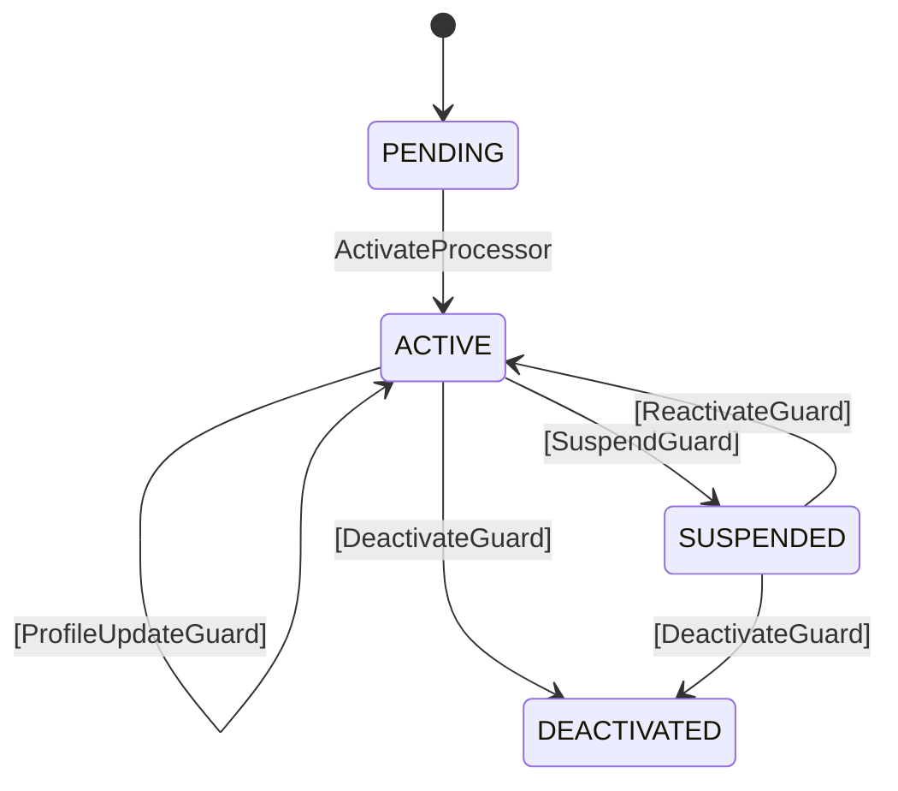

[English version](long-lived-flows.md)

# 長寿命フローのパターン

認証や決済のように秒〜分で終わるフローではなく、ユーザーアカウントやサブスクリプションのように月〜年単位で生きるフローの設計パターン。

## パターン 1: Perpetual + Multi-External

1つの状態に複数の External 遷移を持たせて、異なるライフサイクルイベントを処理する:

<details open><summary><b>Java</b></summary>

```java
var userLifecycle = Tramli.define("user-lifecycle", UserState.class)
    .ttl(Duration.ofDays(365 * 100))  // 事実上永続
    .initiallyAvailable(SignupRequest.class)
    .from(PENDING).auto(ACTIVE, activateProcessor)
    .from(ACTIVE)
        .external(ACTIVE, profileUpdateGuard)       // 自己遷移: プロフィール更新
        .external(SUSPENDED, suspendGuard)           // アカウント停止
        .external(DEACTIVATED, deactivateGuard)      // アカウント閉鎖
    .from(SUSPENDED)
        .external(ACTIVE, reactivateGuard)           // 再有効化
        .external(DEACTIVATED, deactivateGuard)      // 停止中に閉鎖
    .onStateEnter(ACTIVE, ctx -> ctx.put(ActivatedAt.class, Instant.now()))
    .onStateEnter(SUSPENDED, ctx -> ctx.put(SuspendedAt.class, Instant.now()))
    .build();
```

</details>
<details><summary><b>TypeScript</b></summary>

```typescript
const userLifecycle = Tramli.define<UserState>('user-lifecycle', userStateConfig)
    .setTtl(365 * 100 * 24 * 60 * 60 * 1000)  // 事実上永続
    .initiallyAvailable(SignupRequest)
    .from('PENDING').auto('ACTIVE', activateProcessor)
    .from('ACTIVE')
        .external('ACTIVE', profileUpdateGuard)
        .external('SUSPENDED', suspendGuard)
        .external('DEACTIVATED', deactivateGuard)
    .from('SUSPENDED')
        .external('ACTIVE', reactivateGuard)
        .external('DEACTIVATED', deactivateGuard)
    .build();
```

</details>
<details><summary><b>Rust</b></summary>

```rust
let user_lifecycle = Builder::new("user-lifecycle")
    .ttl(Duration::from_secs(365 * 100 * 86400))  // 事実上永続
    .initially_available(requires![SignupRequest])
    .from(UserState::Pending).auto(UserState::Active, ActivateProcessor)
    .from(UserState::Active)
        .external(UserState::Active, ProfileUpdateGuard)
        .external(UserState::Suspended, SuspendGuard)
        .external(UserState::Deactivated, DeactivateGuard)
    .from(UserState::Suspended)
        .external(UserState::Active, ReactivateGuard)
        .external(UserState::Deactivated, DeactivateGuard)
    .build()
    .unwrap();
```

</details>



### Guard の選択

エンジンは、外部データの型と Guard の `requires()` 型をマッチングして Guard を選択する:

<details open><summary><b>Java</b></summary>

```java
// プロフィール更新 — ProfileUpdate 型を送る
engine.resumeAndExecute(flowId, def, Map.of(ProfileUpdate.class, new ProfileUpdate(...)));
// → ProfileUpdateGuard が選択される（requires: ProfileUpdate）

// 停止 — SuspendRequest 型を送る
engine.resumeAndExecute(flowId, def, Map.of(SuspendRequest.class, new SuspendRequest(...)));
// → SuspendGuard が選択される（requires: SuspendRequest）
```

</details>
<details><summary><b>TypeScript</b></summary>

```typescript
// プロフィール更新
await engine.resumeAndExecute(flowId, def,
    new Map([[ProfileUpdate as string, { ... }]]));

// 停止
await engine.resumeAndExecute(flowId, def,
    new Map([[SuspendRequest as string, { ... }]]));
```

</details>
<details><summary><b>Rust</b></summary>

```rust
// プロフィール更新
engine.resume_and_execute(&flow_id,
    vec![(TypeId::of::<ProfileUpdate>(), Box::new(ProfileUpdate { .. }) as Box<dyn CloneAny>)])?;

// 停止
engine.resume_and_execute(&flow_id,
    vec![(TypeId::of::<SuspendRequest>(), Box::new(SuspendRequest { .. }) as Box<dyn CloneAny>)])?;
```

</details>

## パターン 2: 定義のアップグレード

フロー定義を変更するとき、デプロイ前に互換性を確認する:

<details open><summary><b>Java</b></summary>

```java
var v1 = Tramli.define("user", UserState.class)
    .from(ACTIVE).external(SUSPENDED, suspendGuard)
    .build();

var v2 = Tramli.define("user", UserState.class)
    .from(ACTIVE).external(SUSPENDED, suspendGuard)
    .from(ACTIVE).external(DEACTIVATED, deactivateGuard)  // v2 で追加
    .build();

// チェック: v1 のインスタンスは v2 で resume できるか？
var issues = DataFlowGraph.versionCompatibility(
    v1.dataFlowGraph(), v2.dataFlowGraph());
// → [] (v2 は上位集合、v1 インスタンスは全て安全)
```

</details>
<details><summary><b>TypeScript</b></summary>

```typescript
const issues = DataFlowGraph.versionCompatibility(
    v1.dataFlowGraph!, v2.dataFlowGraph!);
```

</details>
<details><summary><b>Rust</b></summary>

```rust
let (added, removed) = DataFlowGraph::diff(
    v1.data_flow_graph(), v2.data_flow_graph());
```

</details>

### 最新の定義で復元する

FlowInstance は常に**最新の** FlowDefinition で復元する:

<details open><summary><b>Java</b></summary>

```java
// DB からロード
var flow = FlowInstance.restore(id, session, v2, ctx, state, ...);
// v1 ではなく — 常に現在の定義を使う
```

</details>
<details><summary><b>TypeScript</b></summary>

```typescript
const flow = FlowInstance.restore(id, session, v2, ctx, state, ...);
```

</details>
<details><summary><b>Rust</b></summary>

```rust
let flow = FlowInstance::restore(id, session, Arc::new(v2), ctx, state, ...);
```

</details>

## パターン 3: ステートごとのタイムアウト

状態ごとに異なるデッドラインを設定できる:

<details open><summary><b>Java</b></summary>

```java
.from(PENDING).external(ACTIVE, verifyGuard, Duration.ofHours(24))  // メール確認に24時間
.from(SUSPENDED).external(ACTIVE, reactivateGuard, Duration.ofDays(90))  // 再有効化に90日
```

</details>
<details><summary><b>TypeScript</b></summary>

```typescript
.from('PENDING').external('ACTIVE', verifyGuard, 24 * 60 * 60 * 1000)  // 24時間
.from('SUSPENDED').external('ACTIVE', reactivateGuard, 90 * 24 * 60 * 60 * 1000)  // 90日
```

</details>
<details><summary><b>Rust</b></summary>

```rust
.from(UserState::Pending).external(UserState::Active, VerifyGuard)  // timeout は Builder API 経由
.from(UserState::Suspended).external(UserState::Active, ReactivateGuard)
```

</details>

## パターン 4: フロー間のデータ依存

課金と認証が別フローの場合:

<details open><summary><b>Java</b></summary>

```java
var authFlow = Tramli.define("auth", AuthState.class).build();
var billingFlow = Tramli.define("billing", BillingState.class).build();

// フロー間のデータ依存を確認
var deps = DataFlowGraph.crossFlowMap(
    authFlow.dataFlowGraph(), billingFlow.dataFlowGraph());
// → ["UserId: flow 0 produces → flow 1 consumes"]
```

</details>
<details><summary><b>TypeScript</b></summary>

```typescript
const deps = DataFlowGraph.crossFlowMap(
    authFlow.dataFlowGraph!, billingFlow.dataFlowGraph!);
```

</details>
<details><summary><b>Rust</b></summary>

```rust
let (added, removed) = DataFlowGraph::diff(
    auth_flow.data_flow_graph(), billing_flow.data_flow_graph());
```

</details>

## アンチパターン

### NG: 長寿命フローに短い TTL を使う

```
// NG: 5分でフロー期限切れ — ユーザーアカウントが消える
.ttl(Duration.ofMinutes(5))

// OK: 事実上永続
.ttl(Duration.ofDays(365 * 100))
```

### NG: 1つのライフサイクル内でフロー定義を混在させる

```
// NG: /api/profile は v2、/api/suspend は v1 — フロー ID の不整合
// OK: 全エンドポイントが同じ FlowDefinition インスタンスを使う
```

### NG: 直交する関心事に SubFlow を使う

```
// NG: 課金を認証の SubFlow にする — ライフサイクルが独立している
// OK: 別フローにして共有データ型でリンク（crossFlowMap）
```
