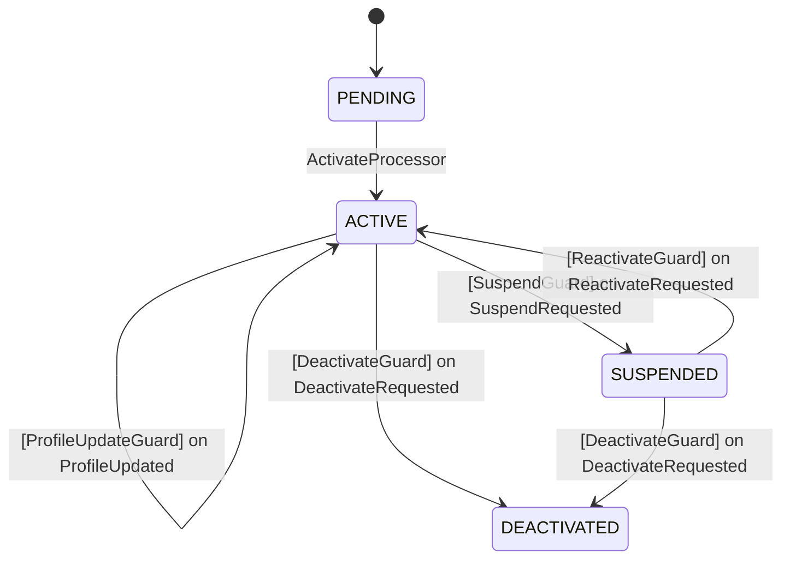

[English version](long-lived-flows.md)

# 長寿命フローのパターン

ユーザーアカウントやサブスクリプションのように、月〜年単位で状態を管理する人向けのガイドです。
複数のイベントの受け付け方、稼働中のフロー定義の更新、状態ごとの期限、別フローとのデータ依存を説明します。

## 問題: 待っている間にもアプリケーションは変わる

アカウントは有効化された後も、プロフィール更新、停止、再有効化、退会を受け付けます。その間にアプリケーションをデプロイしてフロー定義が変わることもあります。以前の定義で保存した状態とデータを、新しい処理がそのまま使えるとは限りません。

また、アカウント全体の寿命と「メール確認は24時間以内」という期限は別です。課金と認証も、同じユーザーに属していても別々に開始・終了します。

## 素朴に実装するとどうなるか

各 API ハンドラが独自に状態とイベントを判定すると、停止中にもプロフィールを更新できるか、といった規則を複数箇所で揃える必要があります。短い認証フローの TTL（フロー全体の有効期間）を流用すると、まだ必要なアカウントのフローが期限切れになります。

定義を無条件に最新版へ置き換えると、古いインスタンスが持たないデータを新しい Processor が要求することもあります。課金を認証の SubFlow（親フローの一部として実行する子フロー）にすると、独立している寿命まで結び付けてしまいます。

## このパターン: 寿命・イベント・定義を分けて設計する

tramli では、次の4つを組み合わせます。

1. **長い TTL と複数の External 遷移**: フロー全体の寿命を設定し、同じ状態で受け付けるイベントを `externalOn()` で区別します。
2. **定義の互換性確認と復元**: 保存済みデータへの影響を確認してから、新しい定義でインスタンスを復元します。
3. **状態ごとのタイムアウト**: 全体の TTL とは別に、特定の状態で待てる時間を設定します。
4. **別フローのデータ依存の確認**: 課金と認証を別々に定義し、どのデータを受け渡すかを確認します。

長い TTL は永続化の代わりにはなりません。再起動後も再開するには、保存と復元を行う `FlowStore` が必要です。[DB スキーマのガイド](flowstore-schema.md)も参照してください。

## コード例

以下は既存のフローに組み込むための抜粋です。状態 enum、Processor、Guard（イベントを受け入れるか検証する処理）、イベント型の定義は省略しています。
Java の `ActivatedAt` と `SuspendedAt` は、`Instant` を1つ保持するアプリケーション側の record を想定しています。

### パターン 1: Perpetual + Multi-External

アカウントが `ACTIVE` にある間、プロフィール更新・停止・退会を別のイベントとして受け付けます。プロフィール更新では `ACTIVE` に戻り、次のイベントを待ちます。
100年の TTL は実用上長い有効期間を設定する例で、無期限を表す値ではありません。

<details open><summary><b>Java</b></summary>

```java
var userLifecycle = Tramli.define("user-lifecycle", UserState.class)
    .ttl(Duration.ofDays(365 * 100))  // 事実上永続
    .initiallyAvailable(SignupRequest.class)
    .from(PENDING).auto(ACTIVE, activateProcessor)
    .from(ACTIVE).externalOn(ProfileUpdated.class, ACTIVE, profileUpdateGuard)
    .from(ACTIVE).externalOn(SuspendRequested.class, SUSPENDED, suspendGuard)
    .from(ACTIVE).externalOn(DeactivateRequested.class, DEACTIVATED, deactivateGuard)
    .from(SUSPENDED).externalOn(ReactivateRequested.class, ACTIVE, reactivateGuard)
    .from(SUSPENDED).externalOn(DeactivateRequested.class, DEACTIVATED, deactivateGuard)
    .onStateEnter(ACTIVE, ctx -> ctx.put(ActivatedAt.class, new ActivatedAt(Instant.now())))
    .onStateEnter(SUSPENDED, ctx -> ctx.put(SuspendedAt.class, new SuspendedAt(Instant.now())))
    .build();
```

</details>
<details><summary><b>TypeScript</b></summary>

```typescript
const userLifecycle = Tramli.define<UserState>('user-lifecycle', userStateConfig)
    .setTtl(365 * 100 * 24 * 60 * 60 * 1000)  // 事実上永続
    .initiallyAvailable(SignupRequest)
    .from('PENDING').auto('ACTIVE', activateProcessor)
    .from('ACTIVE').externalOn(ProfileUpdated, 'ACTIVE', profileUpdateGuard)
    .from('ACTIVE').externalOn(SuspendRequested, 'SUSPENDED', suspendGuard)
    .from('ACTIVE').externalOn(DeactivateRequested, 'DEACTIVATED', deactivateGuard)
    .from('SUSPENDED').externalOn(ReactivateRequested, 'ACTIVE', reactivateGuard)
    .from('SUSPENDED').externalOn(DeactivateRequested, 'DEACTIVATED', deactivateGuard)
    .build();
```

</details>
<details><summary><b>Rust</b></summary>

```rust
let user_lifecycle = Builder::new("user-lifecycle")
    .ttl(Duration::from_secs(365 * 100 * 86400))  // 事実上永続
    .initially_available(requires![SignupRequest])
    .from(UserState::Pending).auto(UserState::Active, ActivateProcessor)
    .from(UserState::Active).external_on::<ProfileUpdated>(UserState::Active, ProfileUpdateGuard)
    .from(UserState::Active).external_on::<SuspendRequested>(UserState::Suspended, SuspendGuard)
    .from(UserState::Active).external_on::<DeactivateRequested>(UserState::Deactivated, DeactivateGuard)
    .from(UserState::Suspended).external_on::<ReactivateRequested>(UserState::Active, ReactivateGuard)
    .from(UserState::Suspended).external_on::<DeactivateRequested>(UserState::Deactivated, DeactivateGuard)
    .build()
    .unwrap();
```

</details>


```mermaid
stateDiagram-v2
    [*] --> PENDING
    PENDING --> ACTIVE : ActivateProcessor
    ACTIVE --> ACTIVE : [ProfileUpdateGuard] on ProfileUpdated
    ACTIVE --> SUSPENDED : [SuspendGuard] on SuspendRequested
    ACTIVE --> DEACTIVATED : [DeactivateGuard] on DeactivateRequested
    SUSPENDED --> ACTIVE : [ReactivateGuard] on ReactivateRequested
    SUSPENDED --> DEACTIVATED : [DeactivateGuard] on DeactivateRequested
```

#### Guard の選択

`externalOn()` を使った定義では、今回渡された外部データの型またはキーと、明示したイベントの型またはキーを照合して遷移を選びます。`requires()` は Guard が読むデータの宣言であり、明示的なイベント指定とは別です。
以下は、上の定義に対応するイベントを送る例です。

<details open><summary><b>Java</b></summary>

```java
// プロフィール更新 — ProfileUpdated 型を送る
engine.resumeAndExecute(flowId, def, Map.of(ProfileUpdated.class, new ProfileUpdated(...)));
// → ProfileUpdateGuard が選択される（イベント: ProfileUpdated）

// 停止 — SuspendRequested 型を送る
engine.resumeAndExecute(flowId, def, Map.of(SuspendRequested.class, new SuspendRequested(...)));
// → SuspendGuard が選択される（イベント: SuspendRequested）
```

</details>
<details><summary><b>TypeScript</b></summary>

```typescript
// プロフィール更新
await engine.resumeAndExecute(flowId, def,
    new Map([[ProfileUpdated as string, { ... }]]));

// 停止
await engine.resumeAndExecute(flowId, def,
    new Map([[SuspendRequested as string, { ... }]]));
```

</details>
<details><summary><b>Rust</b></summary>

```rust
// プロフィール更新
engine.resume_and_execute(&flow_id,
    vec![(TypeId::of::<ProfileUpdated>(), Box::new(ProfileUpdated { .. }) as Box<dyn CloneAny>)])?;

// 停止
engine.resume_and_execute(&flow_id,
    vec![(TypeId::of::<SuspendRequested>(), Box::new(SuspendRequested { .. }) as Box<dyn CloneAny>)])?;
```

</details>

### パターン 2: 定義のアップグレード

デプロイ前に、以前の定義と新しい定義のデータ依存を比較します。Java と TypeScript の `versionCompatibility()` は、以前の状態で持てたデータと、新しい定義でその状態にあると見込むデータを比較します。
空の結果はこのチェックで差が見つからなかったことを示します。保存データの形式変更や業務ルールまで含めた移行の安全性を保証するものではありません。Rust の例の `diff()` は型名の追加・削除を返す比較で、同じ互換性判定ではありません。

<details open><summary><b>Java</b></summary>

```java
var v1 = Tramli.define("user", UserState.class)
    .from(ACTIVE).external(SUSPENDED, suspendGuard)
    .build();

var v2 = Tramli.define("user", UserState.class)
    .from(ACTIVE).external(SUSPENDED, suspendGuard)
    .from(ACTIVE).external(DEACTIVATED, deactivateGuard)  // v2 で追加
    .build();

// チェック: v1 のインスタンスは v2 で resume できるか？
var issues = DataFlowGraph.versionCompatibility(
    v1.dataFlowGraph(), v2.dataFlowGraph());
// → [] (このデータ依存チェックでは非互換を検出しない)
```

</details>
<details><summary><b>TypeScript</b></summary>

```typescript
const issues = DataFlowGraph.versionCompatibility(
    v1.dataFlowGraph!, v2.dataFlowGraph!);
```

</details>
<details><summary><b>Rust</b></summary>

```rust
let (added, removed) = DataFlowGraph::diff(
    v1.data_flow_graph(), v2.data_flow_graph());
```

</details>

#### 最新の定義で復元する

互換性を確認し、必要なデータ移行を済ませた後、採用した最新の `FlowDefinition` で復元します。同じライフサイクルを再開するエンドポイントは、その定義に揃えます。
`...` は保存済みの日時・version などの引数の省略です。復元はデータ移行を自動実行しません。

<details open><summary><b>Java</b></summary>

```java
// DB からロード
var flow = FlowInstance.restore(id, session, v2, ctx, state, ...);
// 互換性を確認し、採用した現在の定義を使う
```

</details>
<details><summary><b>TypeScript</b></summary>

```typescript
const flow = FlowInstance.restore(id, session, v2, ctx, state, ...);
```

</details>
<details><summary><b>Rust</b></summary>

```rust
let flow = FlowInstance::restore(id, session, Arc::new(v2), ctx, state, ...);
```

</details>

### パターン 3: ステートごとのタイムアウト

メール確認は24時間、停止後の再有効化は90日というように、状態へ入ってからの待機時間を設定します。フロー全体の TTL とは別の制限です。
Java と TypeScript の例は期限も指定しています。Rust の抜粋は遷移だけを示しており、タイムアウトを設定していません。Rust で期限を指定する場合は `external_with_timeout()` を使います。

<details open><summary><b>Java</b></summary>

```java
.from(PENDING).external(ACTIVE, verifyGuard, Duration.ofHours(24))  // メール確認に24時間
.from(SUSPENDED).external(ACTIVE, reactivateGuard, Duration.ofDays(90))  // 再有効化に90日
```

</details>
<details><summary><b>TypeScript</b></summary>

```typescript
.from('PENDING').external('ACTIVE', verifyGuard, { timeout: 24 * 60 * 60 * 1000 })  // 24時間
.from('SUSPENDED').external('ACTIVE', reactivateGuard, { timeout: 90 * 24 * 60 * 60 * 1000 })  // 90日
```

</details>
<details><summary><b>Rust</b></summary>

```rust
.from(UserState::Pending).external(UserState::Active, VerifyGuard)  // この抜粋では timeout 未指定
.from(UserState::Suspended).external(UserState::Active, ReactivateGuard)
```

</details>

### パターン 4: フロー間のデータ依存

課金と認証を別々のフローとして定義したうえで、一方が作り、もう一方が読む型を調べます。`crossFlowMap()` はその依存を一覧にします。データの転送やフローの起動を自動で行う API ではありません。
以下の Java 例は遷移定義を省略しています。コメントの結果は、認証が `UserId` を生成し、課金がそれを要求する定義の場合です。Rust の既存例は `diff()` による型集合の比較で、生成元・利用先の対応表ではありません。この Rust の呼び出しでは、両グラフの状態型 `S` を揃える必要があります。

<details open><summary><b>Java</b></summary>

```java
var authFlow = Tramli.define("auth", AuthState.class).build();
var billingFlow = Tramli.define("billing", BillingState.class).build();

// フロー間のデータ依存を確認
var deps = DataFlowGraph.crossFlowMap(
    authFlow.dataFlowGraph(), billingFlow.dataFlowGraph());
// → ["UserId: flow 0 produces → flow 1 consumes"]
```

</details>
<details><summary><b>TypeScript</b></summary>

```typescript
const deps = DataFlowGraph.crossFlowMap(
    authFlow.dataFlowGraph!, billingFlow.dataFlowGraph!);
```

</details>
<details><summary><b>Rust</b></summary>

```rust
let (added, removed) = DataFlowGraph::diff(
    auth_flow.data_flow_graph(), billing_flow.data_flow_graph());
```

</details>

## 使わない方がよい場合

秒〜分で終わる認証や決済に、例の100年 TTL をそのまま使わないでください。フローが必要な期間に合わせて設定します。
業務上の状態遷移がない単純なデータ保存なら、長寿命フローを導入する前に通常の CRUD で足りるかを確認してください。
独立した関心事を分けるこの方法は、分散実行の調整や自動復旧まで提供するものではありません。

### アンチパターン

#### NG: 長寿命フローに短い TTL を使う

```
// NG: 5分で期限切れ — アカウントのフローを再開できなくなる
.ttl(Duration.ofMinutes(5))

// OK: 事実上永続
.ttl(Duration.ofDays(365 * 100))
```

#### NG: 1つのライフサイクル内でフロー定義を混在させる

```
// NG: /api/profile は v2、/api/suspend は v1 — 再開時の定義が不一致
// OK: 全エンドポイントが同じ FlowDefinition インスタンスを使う
```

#### NG: 直交する関心事に SubFlow を使う

```
// NG: 課金を認証の SubFlow にする — ライフサイクルが独立している
// OK: 別フローにして共有データ型の依存を確認（crossFlowMap）
```
