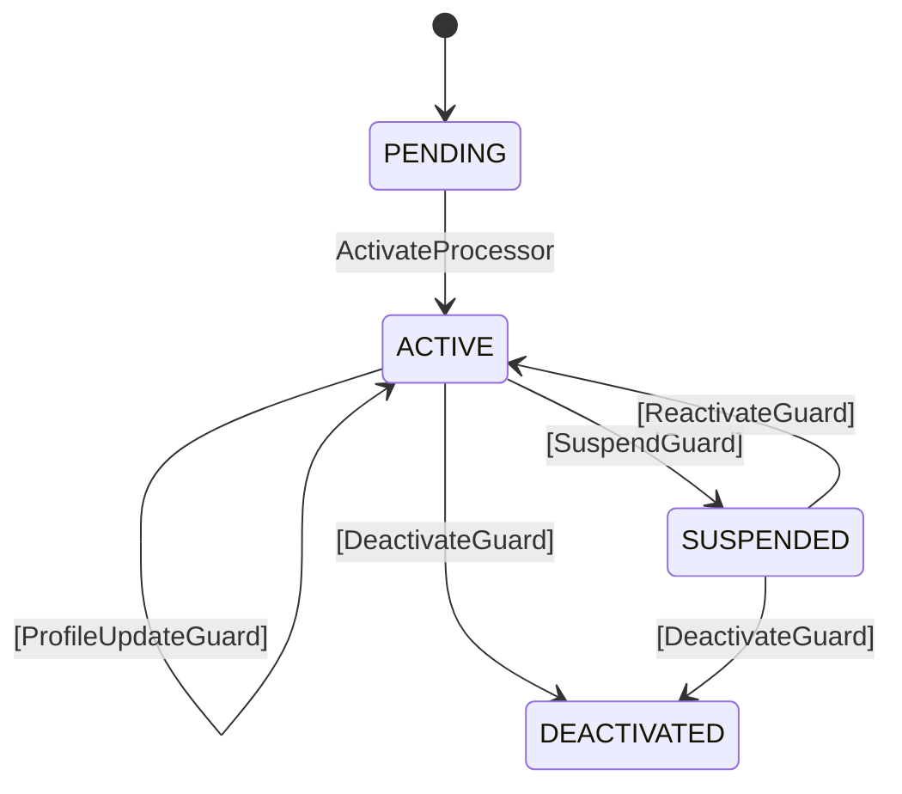

# Long-Lived Flow Patterns

Design patterns for flows that live months or years (user accounts, subscriptions)
rather than seconds or minutes (authentication, payment).

## Pattern 1: Perpetual + Multi-External

A single state with multiple external transitions handles different lifecycle events:

```java
var userLifecycle = Tramli.define("user-lifecycle", UserState.class)
    .ttl(Duration.ofDays(365 * 100))  // effectively perpetual
    .initiallyAvailable(SignupRequest.class)
    .from(PENDING).auto(ACTIVE, activateProcessor)
    .from(ACTIVE)
        .external(ACTIVE, profileUpdateGuard)       // self-transition: update profile
        .external(SUSPENDED, suspendGuard)           // suspend account
        .external(DEACTIVATED, deactivateGuard)      // close account
    .from(SUSPENDED)
        .external(ACTIVE, reactivateGuard)           // reactivate
        .external(DEACTIVATED, deactivateGuard)      // close while suspended
    .onStateEnter(ACTIVE, ctx -> ctx.put(ActivatedAt.class, Instant.now()))
    .onStateEnter(SUSPENDED, ctx -> ctx.put(SuspendedAt.class, Instant.now()))
    .build();
```



### Guard selection

The engine selects the guard by matching `requires()` types against external data:

```java
// Profile update — sends ProfileUpdate type
engine.resumeAndExecute(flowId, def, Map.of(ProfileUpdate.class, new ProfileUpdate(...)));
// → ProfileUpdateGuard selected (requires ProfileUpdate)

// Suspend — sends SuspendRequest type
engine.resumeAndExecute(flowId, def, Map.of(SuspendRequest.class, new SuspendRequest(...)));
// → SuspendGuard selected (requires SuspendRequest)
```

## Pattern 2: Definition Upgrade

When you change the flow definition, check compatibility before deploying:

```java
var v1 = Tramli.define("user", UserState.class)
    .from(ACTIVE).external(SUSPENDED, suspendGuard)
    .build();

var v2 = Tramli.define("user", UserState.class)
    .from(ACTIVE).external(SUSPENDED, suspendGuard)
    .from(ACTIVE).external(DEACTIVATED, deactivateGuard)  // new in v2
    .build();

// Check: can v1 instances resume on v2?
var issues = DataFlowGraph.versionCompatibility(
    v1.dataFlowGraph(), v2.dataFlowGraph());
// → [] (v2 is superset, all v1 instances are safe)
```

### Restore with latest definition

Always restore FlowInstance with the **latest** FlowDefinition:

```java
// Load from DB
var flow = FlowInstance.restore(id, session, v2, ctx, state, ...);
// NOT v1 — always use the current definition
```

## Pattern 3: Per-State Timeout

Different states can have different deadlines:

```java
.from(PENDING).external(ACTIVE, verifyGuard, Duration.ofHours(24))  // 24h to verify email
.from(SUSPENDED).external(ACTIVE, reactivateGuard, Duration.ofDays(90))  // 90 days to reactivate
```

## Pattern 4: Cross-Flow Dependencies

If billing and authentication are separate flows:

```java
var authFlow = Tramli.define("auth", AuthState.class).build();
var billingFlow = Tramli.define("billing", BillingState.class).build();

// Check data dependencies between flows
var deps = DataFlowGraph.crossFlowMap(
    authFlow.dataFlowGraph(), billingFlow.dataFlowGraph());
// → ["UserId: flow 0 produces → flow 1 consumes"]
```

## Anti-Patterns

### Don't: Use short TTL for long-lived flows

```java
// ❌ Flow expires in 5 minutes — user account is gone
.ttl(Duration.ofMinutes(5))

// ✅ Effectively perpetual
.ttl(Duration.ofDays(365 * 100))
```

### Don't: Mix flow definitions within one lifecycle

```java
// ❌ /api/profile uses v2, /api/suspend uses v1 — flow ID mismatch
// ✅ All endpoints use the same FlowDefinition instance
```

### Don't: Use SubFlow for orthogonal concerns

```java
// ❌ Billing as SubFlow inside auth — they have independent lifecycles
// ✅ Separate flows, linked by shared data types (crossFlowMap)
```
