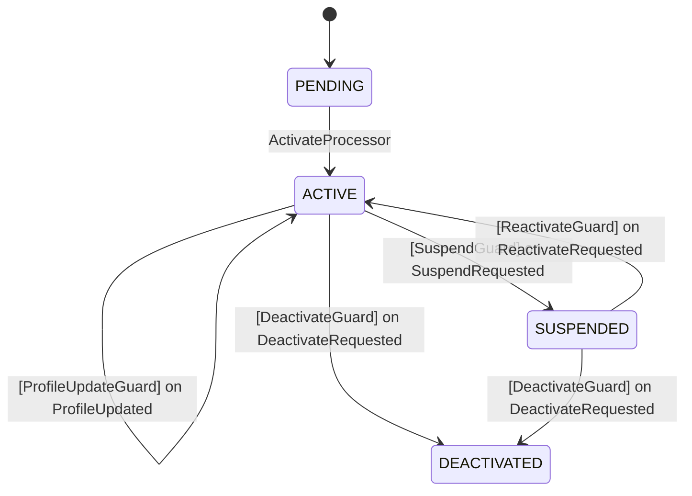

[日本語版](long-lived-flows-ja.md)

# Long-Lived Flow Patterns

Design patterns for flows that live months or years (user accounts, subscriptions)
rather than seconds or minutes (authentication, payment).

## Pattern 1: Perpetual + Multi-External

A single state with multiple external transitions handles different lifecycle events:

<details open><summary><b>Java</b></summary>

```java
var userLifecycle = Tramli.define("user-lifecycle", UserState.class)
    .ttl(Duration.ofDays(365 * 100))  // effectively perpetual
    .initiallyAvailable(SignupRequest.class)
    .from(PENDING).auto(ACTIVE, activateProcessor)
    .from(ACTIVE)
        .externalOn(ProfileUpdated.class, ACTIVE, profileUpdateGuard)
        .externalOn(SuspendRequested.class, SUSPENDED, suspendGuard)
        .externalOn(DeactivateRequested.class, DEACTIVATED, deactivateGuard)
    .from(SUSPENDED)
        .externalOn(ReactivateRequested.class, ACTIVE, reactivateGuard)
        .externalOn(DeactivateRequested.class, DEACTIVATED, deactivateGuard)
    .onStateEnter(ACTIVE, ctx -> ctx.put(ActivatedAt.class, Instant.now()))
    .onStateEnter(SUSPENDED, ctx -> ctx.put(SuspendedAt.class, Instant.now()))
    .build();
```

</details>
<details><summary><b>TypeScript</b></summary>

```typescript
const userLifecycle = Tramli.define<UserState>('user-lifecycle', userStateConfig)
    .setTtl(365 * 100 * 24 * 60 * 60 * 1000)
    .initiallyAvailable(SignupRequest)
    .from('PENDING').auto('ACTIVE', activateProcessor)
    .from('ACTIVE')
        .externalOn(ProfileUpdated, 'ACTIVE', profileUpdateGuard)
        .externalOn(SuspendRequested, 'SUSPENDED', suspendGuard)
        .externalOn(DeactivateRequested, 'DEACTIVATED', deactivateGuard)
    .from('SUSPENDED')
        .externalOn(ReactivateRequested, 'ACTIVE', reactivateGuard)
        .externalOn(DeactivateRequested, 'DEACTIVATED', deactivateGuard)
    .build();
```

</details>
<details><summary><b>Rust</b></summary>

```rust
let user_lifecycle = Builder::new("user-lifecycle")
    .ttl(Duration::from_secs(365 * 100 * 86400))
    .initially_available(requires![SignupRequest])
    .from(UserState::Pending).auto(UserState::Active, ActivateProcessor)
    .from(UserState::Active)
        .external_on::<ProfileUpdated>(UserState::Active, ProfileUpdateGuard)
        .external_on::<SuspendRequested>(UserState::Suspended, SuspendGuard)
        .external_on::<DeactivateRequested>(UserState::Deactivated, DeactivateGuard)
    .from(UserState::Suspended)
        .external_on::<ReactivateRequested>(UserState::Active, ReactivateGuard)
        .external_on::<DeactivateRequested>(UserState::Deactivated, DeactivateGuard)
    .build()
    .unwrap();
```

</details>


```mermaid
stateDiagram-v2
    [*] --> PENDING
    PENDING --> ACTIVE : ActivateProcessor
    ACTIVE --> ACTIVE : [ProfileUpdateGuard] on ProfileUpdated
    ACTIVE --> SUSPENDED : [SuspendGuard] on SuspendRequested
    ACTIVE --> DEACTIVATED : [DeactivateGuard] on DeactivateRequested
    SUSPENDED --> ACTIVE : [ReactivateGuard] on ReactivateRequested
    SUSPENDED --> DEACTIVATED : [DeactivateGuard] on DeactivateRequested
```

### Guard selection

The engine selects the guard by matching `requires()` types against external data:

<details open><summary><b>Java</b></summary>

```java
// Profile update — sends ProfileUpdate type
engine.resumeAndExecute(flowId, def, Map.of(ProfileUpdate.class, new ProfileUpdate(...)));
// → ProfileUpdateGuard selected (requires ProfileUpdate)

// Suspend — sends SuspendRequest type
engine.resumeAndExecute(flowId, def, Map.of(SuspendRequest.class, new SuspendRequest(...)));
// → SuspendGuard selected (requires SuspendRequest)
```

</details>
<details><summary><b>TypeScript</b></summary>

```typescript
// Profile update
await engine.resumeAndExecute(flowId, def,
    new Map([[ProfileUpdate as string, { ... }]]));

// Suspend
await engine.resumeAndExecute(flowId, def,
    new Map([[SuspendRequest as string, { ... }]]));
```

</details>
<details><summary><b>Rust</b></summary>

```rust
// Profile update
engine.resume_and_execute(&flow_id,
    vec![(TypeId::of::<ProfileUpdate>(), Box::new(ProfileUpdate { .. }) as Box<dyn CloneAny>)])?;

// Suspend
engine.resume_and_execute(&flow_id,
    vec![(TypeId::of::<SuspendRequest>(), Box::new(SuspendRequest { .. }) as Box<dyn CloneAny>)])?;
```

</details>

## Pattern 2: Definition Upgrade

When you change the flow definition, check compatibility before deploying:

<details open><summary><b>Java</b></summary>

```java
var v1 = Tramli.define("user", UserState.class)
    .from(ACTIVE).external(SUSPENDED, suspendGuard)
    .build();

var v2 = Tramli.define("user", UserState.class)
    .from(ACTIVE).external(SUSPENDED, suspendGuard)
    .from(ACTIVE).external(DEACTIVATED, deactivateGuard)  // new in v2
    .build();

// Check: can v1 instances resume on v2?
var issues = DataFlowGraph.versionCompatibility(
    v1.dataFlowGraph(), v2.dataFlowGraph());
// → [] (v2 is superset, all v1 instances are safe)
```

</details>
<details><summary><b>TypeScript</b></summary>

```typescript
const issues = DataFlowGraph.versionCompatibility(
    v1.dataFlowGraph!, v2.dataFlowGraph!);
```

</details>
<details><summary><b>Rust</b></summary>

```rust
let (added, removed) = DataFlowGraph::diff(
    v1.data_flow_graph(), v2.data_flow_graph());
```

</details>

### Restore with latest definition

Always restore FlowInstance with the **latest** FlowDefinition:

<details open><summary><b>Java</b></summary>

```java
// Load from DB
var flow = FlowInstance.restore(id, session, v2, ctx, state, ...);
// NOT v1 — always use the current definition
```

</details>
<details><summary><b>TypeScript</b></summary>

```typescript
const flow = FlowInstance.restore(id, session, v2, ctx, state, ...);
```

</details>
<details><summary><b>Rust</b></summary>

```rust
let flow = FlowInstance::restore(id, session, Arc::new(v2), ctx, state, ...);
```

</details>

## Pattern 3: Per-State Timeout

Different states can have different deadlines:

<details open><summary><b>Java</b></summary>

```java
.from(PENDING).external(ACTIVE, verifyGuard, Duration.ofHours(24))  // 24h to verify email
.from(SUSPENDED).external(ACTIVE, reactivateGuard, Duration.ofDays(90))  // 90 days to reactivate
```

</details>
<details><summary><b>TypeScript</b></summary>

```typescript
.from('PENDING').external('ACTIVE', verifyGuard, 24 * 60 * 60 * 1000)  // 24h
.from('SUSPENDED').external('ACTIVE', reactivateGuard, 90 * 24 * 60 * 60 * 1000)  // 90 days
```

</details>
<details><summary><b>Rust</b></summary>

```rust
.from(UserState::Pending).external(UserState::Active, VerifyGuard)
.from(UserState::Suspended).external(UserState::Active, ReactivateGuard)
```

</details>

## Pattern 4: Cross-Flow Dependencies

If billing and authentication are separate flows:

<details open><summary><b>Java</b></summary>

```java
var authFlow = Tramli.define("auth", AuthState.class).build();
var billingFlow = Tramli.define("billing", BillingState.class).build();

// Check data dependencies between flows
var deps = DataFlowGraph.crossFlowMap(
    authFlow.dataFlowGraph(), billingFlow.dataFlowGraph());
// → ["UserId: flow 0 produces → flow 1 consumes"]
```

</details>
<details><summary><b>TypeScript</b></summary>

```typescript
const deps = DataFlowGraph.crossFlowMap(
    authFlow.dataFlowGraph!, billingFlow.dataFlowGraph!);
```

</details>
<details><summary><b>Rust</b></summary>

```rust
let (added, removed) = DataFlowGraph::diff(
    auth_flow.data_flow_graph(), billing_flow.data_flow_graph());
```

</details>

## Anti-Patterns

### Don't: Use short TTL for long-lived flows

```
// Bad: Flow expires in 5 minutes — user account is gone
.ttl(Duration.ofMinutes(5))

// Good: Effectively perpetual
.ttl(Duration.ofDays(365 * 100))
```

### Don't: Mix flow definitions within one lifecycle

```
// Bad: /api/profile uses v2, /api/suspend uses v1 — flow ID mismatch
// Good: All endpoints use the same FlowDefinition instance
```

### Don't: Use SubFlow for orthogonal concerns

```
// Bad: Billing as SubFlow inside auth — they have independent lifecycles
// Good: Separate flows, linked by shared data types (crossFlowMap)
```
