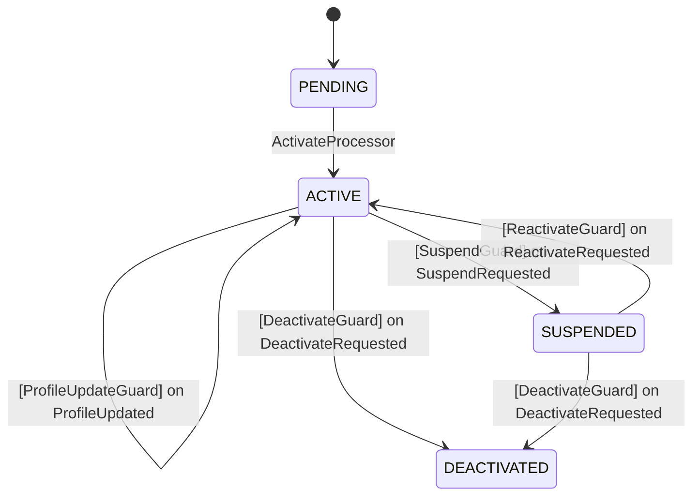

[日本語版](long-lived-flows-ja.md)

# Long-Lived Flow Patterns

This guide is for developers managing user accounts or subscriptions over months or years.
It explains how to accept several lifecycle events, upgrade a running flow's definition, set state deadlines, and inspect dependencies between separate flows.

## Problem: the application changes while a flow is waiting

An active account may receive profile updates, suspension requests, reactivation requests, and deactivation requests. The application may also be deployed with a new flow definition during that account's lifetime. State and data saved under the old definition may not satisfy the new processors.

The account's overall lifetime is also different from a deadline such as “verify email within 24 hours.” Billing and authentication can start and finish independently even when they belong to the same user.

## What happens with the straightforward approach?

If each API handler checks states and events independently, rules such as whether a suspended user can update a profile must be kept consistent across handlers. Reusing the short TTL (time to live) of a login flow can expire an account flow that is still needed.

Replacing a definition unconditionally can make a new processor require data that older instances never received. Making billing a SubFlow, a child executed as part of its parent flow, can tie its lifetime to authentication even though the two are independent.

## The pattern: separate lifetime, events, and definition changes

Combine four techniques in tramli:

1. **A long TTL and multiple External transitions**: set the flow's overall lifetime, then distinguish the events accepted in one state with `externalOn()`.
2. **Compatibility checks and restoration**: inspect the effect on saved data before restoring instances with the new definition.
3. **Per-state timeouts**: limit how long a flow can wait in a particular state, independently of the overall TTL.
4. **Dependencies between separate flows**: define billing and authentication separately, then inspect the data they need to exchange.

A long TTL does not provide persistence. Resuming after a restart requires a `FlowStore` that saves and restores instances. See the [database schema guide](flowstore-schema.md).

## Code examples

These excerpts are intended to fit into existing flow definitions. State enums, processors, guards (the checks that accept or reject events), and event types are omitted.
In Java, `ActivatedAt` and `SuspendedAt` are assumed to be application records that each wrap one `Instant`.

### Pattern 1: Perpetual + Multi-External

While an account is `ACTIVE`, accept profile updates, suspension, and deactivation as distinct events. A profile update returns to `ACTIVE` to wait for the next event.
The 100-year TTL is an example of a very long lifetime, not an infinite expiry setting.

<details open><summary><b>Java</b></summary>

```java
var userLifecycle = Tramli.define("user-lifecycle", UserState.class)
    .ttl(Duration.ofDays(365 * 100))  // effectively perpetual
    .initiallyAvailable(SignupRequest.class)
    .from(PENDING).auto(ACTIVE, activateProcessor)
    .from(ACTIVE).externalOn(ProfileUpdated.class, ACTIVE, profileUpdateGuard)
    .from(ACTIVE).externalOn(SuspendRequested.class, SUSPENDED, suspendGuard)
    .from(ACTIVE).externalOn(DeactivateRequested.class, DEACTIVATED, deactivateGuard)
    .from(SUSPENDED).externalOn(ReactivateRequested.class, ACTIVE, reactivateGuard)
    .from(SUSPENDED).externalOn(DeactivateRequested.class, DEACTIVATED, deactivateGuard)
    .onStateEnter(ACTIVE, ctx -> ctx.put(ActivatedAt.class, new ActivatedAt(Instant.now())))
    .onStateEnter(SUSPENDED, ctx -> ctx.put(SuspendedAt.class, new SuspendedAt(Instant.now())))
    .build();
```

</details>
<details><summary><b>TypeScript</b></summary>

```typescript
const userLifecycle = Tramli.define<UserState>('user-lifecycle', userStateConfig)
    .setTtl(365 * 100 * 24 * 60 * 60 * 1000)
    .initiallyAvailable(SignupRequest)
    .from('PENDING').auto('ACTIVE', activateProcessor)
    .from('ACTIVE').externalOn(ProfileUpdated, 'ACTIVE', profileUpdateGuard)
    .from('ACTIVE').externalOn(SuspendRequested, 'SUSPENDED', suspendGuard)
    .from('ACTIVE').externalOn(DeactivateRequested, 'DEACTIVATED', deactivateGuard)
    .from('SUSPENDED').externalOn(ReactivateRequested, 'ACTIVE', reactivateGuard)
    .from('SUSPENDED').externalOn(DeactivateRequested, 'DEACTIVATED', deactivateGuard)
    .build();
```

</details>
<details><summary><b>Rust</b></summary>

```rust
let user_lifecycle = Builder::new("user-lifecycle")
    .ttl(Duration::from_secs(365 * 100 * 86400))
    .initially_available(requires![SignupRequest])
    .from(UserState::Pending).auto(UserState::Active, ActivateProcessor)
    .from(UserState::Active).external_on::<ProfileUpdated>(UserState::Active, ProfileUpdateGuard)
    .from(UserState::Active).external_on::<SuspendRequested>(UserState::Suspended, SuspendGuard)
    .from(UserState::Active).external_on::<DeactivateRequested>(UserState::Deactivated, DeactivateGuard)
    .from(UserState::Suspended).external_on::<ReactivateRequested>(UserState::Active, ReactivateGuard)
    .from(UserState::Suspended).external_on::<DeactivateRequested>(UserState::Deactivated, DeactivateGuard)
    .build()
    .unwrap();
```

</details>


```mermaid
stateDiagram-v2
    [*] --> PENDING
    PENDING --> ACTIVE : ActivateProcessor
    ACTIVE --> ACTIVE : [ProfileUpdateGuard] on ProfileUpdated
    ACTIVE --> SUSPENDED : [SuspendGuard] on SuspendRequested
    ACTIVE --> DEACTIVATED : [DeactivateGuard] on DeactivateRequested
    SUSPENDED --> ACTIVE : [ReactivateGuard] on ReactivateRequested
    SUSPENDED --> DEACTIVATED : [DeactivateGuard] on DeactivateRequested
```

#### Guard selection

With `externalOn()`, the engine selects a transition by matching the types or keys in the current external input against the declared event trigger. A guard’s `requires()` declares the data it reads; it is separate from an explicit trigger.
The following calls send events matching the definition above:

<details open><summary><b>Java</b></summary>

```java
// Profile update — sends ProfileUpdated type
engine.resumeAndExecute(flowId, def, Map.of(ProfileUpdated.class, new ProfileUpdated(...)));
// → ProfileUpdateGuard selected (trigger ProfileUpdated)

// Suspend — sends SuspendRequested type
engine.resumeAndExecute(flowId, def, Map.of(SuspendRequested.class, new SuspendRequested(...)));
// → SuspendGuard selected (trigger SuspendRequested)
```

</details>
<details><summary><b>TypeScript</b></summary>

```typescript
// Profile update
await engine.resumeAndExecute(flowId, def,
    new Map([[ProfileUpdated as string, { ... }]]));

// Suspend
await engine.resumeAndExecute(flowId, def,
    new Map([[SuspendRequested as string, { ... }]]));
```

</details>
<details><summary><b>Rust</b></summary>

```rust
// Profile update
engine.resume_and_execute(&flow_id,
    vec![(TypeId::of::<ProfileUpdated>(), Box::new(ProfileUpdated { .. }) as Box<dyn CloneAny>)])?;

// Suspend
engine.resume_and_execute(&flow_id,
    vec![(TypeId::of::<SuspendRequested>(), Box::new(SuspendRequested { .. }) as Box<dyn CloneAny>)])?;
```

</details>

### Pattern 2: Definition Upgrade

Compare the old and new definitions before deploying. Java and TypeScript’s `versionCompatibility()` compares the data available at old states with the data the new definition expects to be available there.
An empty result means this check found no difference to report. It does not guarantee migration safety for changed stored formats or business rules. The Rust `diff()` example reports added and removed type names; it is not the same compatibility check.

<details open><summary><b>Java</b></summary>

```java
var v1 = Tramli.define("user", UserState.class)
    .from(ACTIVE).external(SUSPENDED, suspendGuard)
    .build();

var v2 = Tramli.define("user", UserState.class)
    .from(ACTIVE).external(SUSPENDED, suspendGuard)
    .from(ACTIVE).external(DEACTIVATED, deactivateGuard)  // new in v2
    .build();

// Check: can v1 instances resume on v2?
var issues = DataFlowGraph.versionCompatibility(
    v1.dataFlowGraph(), v2.dataFlowGraph());
// → [] (no incompatibility found by this data-availability check)
```

</details>
<details><summary><b>TypeScript</b></summary>

```typescript
const issues = DataFlowGraph.versionCompatibility(
    v1.dataFlowGraph!, v2.dataFlowGraph!);
```

</details>
<details><summary><b>Rust</b></summary>

```rust
let (added, removed) = DataFlowGraph::diff(
    v1.data_flow_graph(), v2.data_flow_graph());
```

</details>

#### Restore with latest definition

After checking compatibility and performing any required data migration, restore the instance with the latest definition you have chosen to adopt. Use that definition consistently in every endpoint that resumes the lifecycle.
The `...` abbreviates saved timestamps, version, and other arguments. Restoration does not perform a data migration for you.

<details open><summary><b>Java</b></summary>

```java
// Load from DB
var flow = FlowInstance.restore(id, session, v2, ctx, state, ...);
// Use the adopted current definition after checking compatibility
```

</details>
<details><summary><b>TypeScript</b></summary>

```typescript
const flow = FlowInstance.restore(id, session, v2, ctx, state, ...);
```

</details>
<details><summary><b>Rust</b></summary>

```rust
let flow = FlowInstance::restore(id, session, Arc::new(v2), ctx, state, ...);
```

</details>

### Pattern 3: Per-State Timeout

Allow 24 hours for email verification and 90 days for reactivation after suspension, measured from entry into the state. These deadlines are separate from the overall flow TTL.
The Java and TypeScript examples specify those deadlines. The Rust excerpt only declares transitions and does not configure a timeout; use `external_with_timeout()` when specifying a Rust timeout.

<details open><summary><b>Java</b></summary>

```java
.from(PENDING).external(ACTIVE, verifyGuard, Duration.ofHours(24))  // 24h to verify email
.from(SUSPENDED).external(ACTIVE, reactivateGuard, Duration.ofDays(90))  // 90 days to reactivate
```

</details>
<details><summary><b>TypeScript</b></summary>

```typescript
.from('PENDING').external('ACTIVE', verifyGuard, { timeout: 24 * 60 * 60 * 1000 })  // 24h
.from('SUSPENDED').external('ACTIVE', reactivateGuard, { timeout: 90 * 24 * 60 * 60 * 1000 })  // 90 days
```

</details>
<details><summary><b>Rust</b></summary>

```rust
.from(UserState::Pending).external(UserState::Active, VerifyGuard)
.from(UserState::Suspended).external(UserState::Active, ReactivateGuard)
```

</details>

### Pattern 4: Cross-Flow Dependencies

Define billing and authentication as separate flows, then inspect the types that one produces and the other consumes. `crossFlowMap()` lists those dependencies. It does not transfer data or start another flow.
The Java excerpt omits the transition definitions. Its example output assumes authentication produces `UserId` and billing requires it. The existing Rust `diff()` example compares type sets; it does not map producers to consumers. Both Rust graphs must use the same state type `S` for this call.

<details open><summary><b>Java</b></summary>

```java
var authFlow = Tramli.define("auth", AuthState.class).build();
var billingFlow = Tramli.define("billing", BillingState.class).build();

// Check data dependencies between flows
var deps = DataFlowGraph.crossFlowMap(
    authFlow.dataFlowGraph(), billingFlow.dataFlowGraph());
// → ["UserId: flow 0 produces → flow 1 consumes"]
```

</details>
<details><summary><b>TypeScript</b></summary>

```typescript
const deps = DataFlowGraph.crossFlowMap(
    authFlow.dataFlowGraph!, billingFlow.dataFlowGraph!);
```

</details>
<details><summary><b>Rust</b></summary>

```rust
let (added, removed) = DataFlowGraph::diff(
    auth_flow.data_flow_graph(), billing_flow.data_flow_graph());
```

</details>

## When not to use this pattern

Do not copy the 100-year TTL into an authentication or payment flow that should finish in seconds or minutes. Set the lifetime to the period for which the flow is needed.
If the application only saves data without meaningful lifecycle transitions, consider whether ordinary CRUD is enough before introducing a long-lived flow.
Separating independent concerns this way does not provide distributed execution coordination or automatic recovery.

### Anti-Patterns

#### Don't: Use short TTL for long-lived flows

```
// Bad: Flow expires in 5 minutes — the account flow can no longer resume
.ttl(Duration.ofMinutes(5))

// Good: Effectively perpetual
.ttl(Duration.ofDays(365 * 100))
```

#### Don't: Mix flow definitions within one lifecycle

```
// Bad: /api/profile uses v2, /api/suspend uses v1 — inconsistent resume definitions
// Good: All endpoints use the same FlowDefinition instance
```

#### Don't: Use SubFlow for orthogonal concerns

```
// Bad: Billing as SubFlow inside auth — they have independent lifecycles
// Good: Separate flows, inspect shared data dependencies (crossFlowMap)
```
