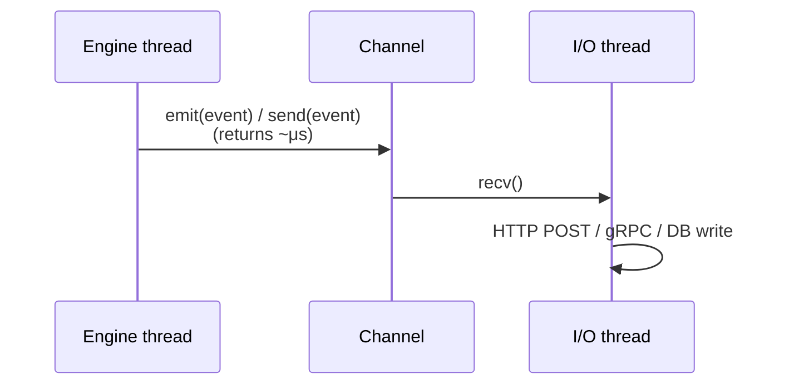

# Non-Blocking Sink Pattern

tramli's `TelemetrySink.emit()` and `AuditingStore.store()` are intentionally synchronous
(DD-012, DD-013). When the sink performs I/O (HTTP, gRPC, database), use a channel to
decouple the engine from the I/O path.

## Pattern



`emit()` stays sync. The channel send is non-blocking. The I/O thread drains the channel
and handles retries, batching, and backpressure independently.

## Backpressure Policy

Use a **bounded channel**. When the buffer is full:

- **Drop oldest** (recommended for telemetry) — lose old events, never block the engine
- **Drop newest** — lose new events, never block the engine
- **Block** — only if you can tolerate engine stalls (not recommended)

## Rust Example

```rust
use std::sync::mpsc;
use tramli_plugins::observability::{TelemetrySink, TelemetryEvent};

struct ChannelSink {
    tx: mpsc::SyncSender<TelemetryEvent>,
}

impl ChannelSink {
    fn new(buffer: usize) -> (Self, mpsc::Receiver<TelemetryEvent>) {
        let (tx, rx) = mpsc::sync_channel(buffer);
        (Self { tx }, rx)
    }
}

impl TelemetrySink for ChannelSink {
    fn emit(&self, event: TelemetryEvent) {
        let _ = self.tx.try_send(event); // drop on full (non-blocking)
    }
    fn events(&self) -> Vec<TelemetryEvent> { vec![] }
}

// Usage:
// let (sink, rx) = ChannelSink::new(1024);
// std::thread::spawn(move || { for event in rx { http_post(event); } });
// let obs = ObservabilityPlugin::new(Arc::new(sink));
```

## TypeScript Example

```typescript
import { TelemetrySink, TelemetryEvent } from '@unlaxer/tramli-plugins';

class ChannelSink implements TelemetrySink {
  private queue: TelemetryEvent[] = [];
  private readonly maxSize: number;

  constructor(maxSize = 1024) { this.maxSize = maxSize; }

  emit(event: TelemetryEvent): void {
    if (this.queue.length >= this.maxSize) this.queue.shift(); // drop oldest
    this.queue.push(event);
  }

  events(): readonly TelemetryEvent[] { return this.queue; }

  drain(): TelemetryEvent[] {
    const batch = this.queue.splice(0);
    return batch;
  }
}

// Usage:
// const sink = new ChannelSink(1024);
// setInterval(() => { const batch = sink.drain(); if (batch.length) httpPost(batch); }, 1000);
```

## Java Example

```java
import java.util.concurrent.*;
import org.unlaxer.tramli.plugins.observability.*;

public class ChannelSink implements TelemetrySink {
    private final BlockingQueue<TelemetryEvent> queue;

    public ChannelSink(int capacity) {
        this.queue = new ArrayBlockingQueue<>(capacity);
    }

    @Override
    public void emit(TelemetryEvent event) {
        if (!queue.offer(event)) {
            queue.poll();        // drop oldest
            queue.offer(event);
        }
    }

    public BlockingQueue<TelemetryEvent> queue() { return queue; }
}

// Usage:
// var sink = new ChannelSink(1024);
// executor.submit(() -> { while (true) { var e = sink.queue().take(); httpPost(e); } });
```

## Same Pattern for AuditingStore

Replace `TelemetryEvent` with your audit record type. The pattern is identical:
sync `store()` sends to a channel, I/O thread writes to database.

## Why Not Provide ChannelTelemetrySink in tramli-plugins?

Channel implementations vary by runtime:
- Rust: `std::sync::mpsc`, `crossbeam`, `tokio::sync::mpsc`, `flume`
- Java: `ArrayBlockingQueue`, `LinkedBlockingQueue`, `Disruptor`
- TypeScript: `EventEmitter`, `RxJS Subject`, queue + `setInterval`

tramli follows a zero-dependency policy. Providing one implementation would serve only
a subset of users. The 5-line examples above are easy to adapt to your runtime.
