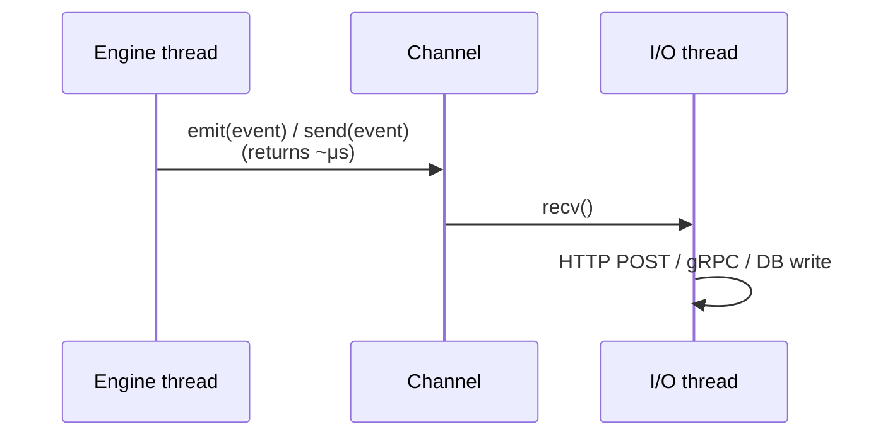

# Non-Blocking Sink Pattern

This guide is for developers sending tramli telemetry or audit records to an external service.
It shows how to keep slow HTTP, gRPC, or database writes out of the engine's execution path, and explains the event loss that an in-memory queue can introduce.

## Problem: recording an event delays the flow

A telemetry sink receives events about flow execution. Its `TelemetrySink.emit()` method is synchronous. If it writes to a remote service before returning, a slow service delays the engine that called it. The same issue arises when audit recording performs I/O during a transition.

## What happens with the straightforward approach?

Writing directly inside `emit()` couples flow latency to the destination's response time. Retrying there extends the wait. Moving writes to an unbounded queue avoids that immediate wait, but lets memory usage grow if events arrive faster than they can be sent.

## Pattern

Enqueue the event without waiting for buffer space. A separate worker drains the queue and performs I/O. `emit()` remains synchronous, but its work is limited to the queue operation.


```mermaid
sequenceDiagram
    participant Engine as Engine thread
    participant Channel
    participant IO as I/O thread

    Engine->>Channel: emit(event) / send(event)<br/>(returns ~μs)
    Channel->>IO: recv()
    IO->>IO: HTTP POST / gRPC / DB write
```

The diagram shows the separation for a worker thread. The TypeScript example below instead drains on a timer; it does not create a separate thread. Its HTTP helper must perform asynchronous I/O to avoid blocking the event loop. The timing annotation is illustrative, not a latency guarantee.

Retries, batching, and handling a slow destination belong in the worker. The examples below show queueing only; they do not implement those policies.

### Backpressure Policy

Backpressure means deciding what to do when events arrive faster than the worker can send them. Use a bounded queue and choose its full-buffer behavior explicitly:

- **Drop oldest**: discard old events to make room for current ones. This is the recommended policy for telemetry when keeping recent observations matters more than keeping every event.
- **Drop newest**: preserve the queued events and discard the incoming one.
- **Block**: wait for space. Use this only if engine stalls are acceptable; it does not satisfy the non-blocking goal.

The Rust example drops the incoming event when full. The TypeScript and Java examples discard an old event to make room. Choose a policy based on which data you can afford to lose.

## Code examples

The HTTP helpers and worker setup are application code. Each example uses a buffer of 1024 in its usage snippet.

### Rust Example

`try_send()` returns immediately when the channel is full or disconnected. This example ignores that result, so those events are lost. `events()` returns an empty list; delivery happens through the receiver.

```rust
use std::sync::mpsc;
use tramli_plugins::observability::{TelemetrySink, TelemetryEvent};

struct ChannelSink {
    tx: mpsc::SyncSender<TelemetryEvent>,
}

impl ChannelSink {
    fn new(buffer: usize) -> (Self, mpsc::Receiver<TelemetryEvent>) {
        let (tx, rx) = mpsc::sync_channel(buffer);
        (Self { tx }, rx)
    }
}

impl TelemetrySink for ChannelSink {
    fn emit(&self, event: TelemetryEvent) {
        let _ = self.tx.try_send(event); // drop on full (non-blocking)
    }
    fn events(&self) -> Vec<TelemetryEvent> { vec![] }
}

// Usage:
// let (sink, rx) = ChannelSink::new(1024);
// std::thread::spawn(move || { for event in rx { http_post(event); } });
// let obs = ObservabilityPlugin::new(Arc::new(sink));
```

### TypeScript Example

`emit()` only modifies the in-memory array. The timer drains it every 1000 milliseconds and passes the batch to the application's HTTP helper.

```typescript
import { TelemetrySink, TelemetryEvent } from '@unlaxer/tramli-plugins';

class ChannelSink implements TelemetrySink {
  private queue: TelemetryEvent[] = [];
  private readonly maxSize: number;

  constructor(maxSize = 1024) { this.maxSize = maxSize; }

  emit(event: TelemetryEvent): void {
    if (this.queue.length >= this.maxSize) this.queue.shift(); // drop oldest
    this.queue.push(event);
  }

  events(): readonly TelemetryEvent[] { return this.queue; }

  drain(): TelemetryEvent[] {
    const batch = this.queue.splice(0);
    return batch;
  }
}

// Usage:
// const sink = new ChannelSink(1024);
// setInterval(() => { const batch = sink.drain(); if (batch.length) httpPost(batch); }, 1000);
```

### Java Example

`offer()` avoids waiting for capacity. If it fails, the sink removes an old entry and tries again. This is best-effort delivery: another producer may fill the slot before the second offer.

```java
import java.util.concurrent.*;
import org.unlaxer.tramli.plugins.observability.*;

public class ChannelSink implements TelemetrySink {
    private final BlockingQueue<TelemetryEvent> queue;

    public ChannelSink(int capacity) {
        this.queue = new ArrayBlockingQueue<>(capacity);
    }

    @Override
    public void emit(TelemetryEvent event) {
        if (!queue.offer(event)) {
            queue.poll();        // drop oldest
            queue.offer(event);
        }
    }

    public BlockingQueue<TelemetryEvent> queue() { return queue; }
}

// Usage:
// var sink = new ChannelSink(1024);
// executor.submit(() -> { while (true) { var e = sink.queue().take(); httpPost(e); } });
```

### Same Pattern for AuditingStore

Replace `TelemetryEvent` with the application's audit record type and enqueue from the audit-recording path. For Rust's `AuditingStore`, that path is `record_transition()`. A worker can then write records to the database.

Queue acceptance is not confirmation that the database has stored a record. Apply a dropping policy only when losing those records is acceptable.

### Why Not Provide ChannelTelemetrySink in tramli-plugins?

Applications use different queue and scheduling facilities:

- Rust: `std::sync::mpsc`, `crossbeam`, `tokio::sync::mpsc`, `flume`
- Java: `ArrayBlockingQueue`, `LinkedBlockingQueue`, `Disruptor`
- TypeScript: `EventEmitter`, `RxJS Subject`, or a queue with `setInterval`

These facilities have different capacity and delivery behavior. tramli follows a zero-dependency policy and leaves the choice to the application. Adapt the examples to the runtime and full-buffer policy you need.

## When not to use this pattern

A sink that only records events in memory may not need another queue or worker. Keep it simple if there is no slow I/O to separate.

Do not use these in-memory, best-effort examples as the only delivery mechanism for records that must survive process failure or must never be dropped. That requirement needs a persistence and delivery design beyond the queue shown here.
