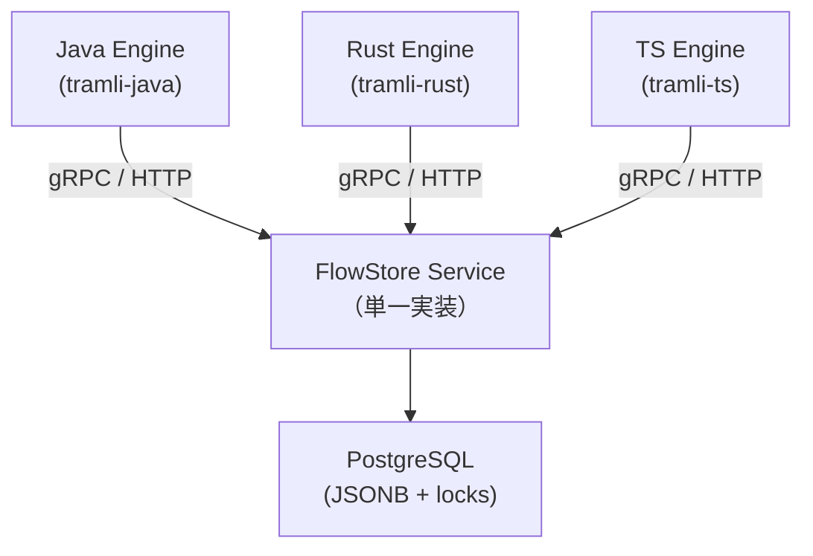

# Proposal: Cross-Language Portability Support

## 背景

volta-auth-proxy を tramli 化した結果、FlowDefinition（フロー構造）は Java/Rust/TS 間でそのまま移植できることが確認できた。しかし **Processor の中身（I/O を含むビジネスロジック）** は言語ごとに書き直しが必要で、移植コストの大部分を占める。

tramli が解決すべきは「Processor の I/O を抽象化する」ことではなく、**「移植の正しさを検証しやすくする」** こと。Processor の中身はビジネスロジックだから言語ごとに書くのは避けられない。だが「何を書くべきか」と「正しく書けたか」を tramli が教えられる。

## 現状の壁（volta-auth-proxy 移植時に判明）

| 壁 | 詳細 |
|----|------|
| Processor の I/O | HTTP 呼び出し、DB 操作が Processor 内にある。言語固有の SDK に依存 |
| FlowStore 実装 | JDBC → sqlx / pg 等、言語ごとに再実装が必要 |
| フレームワーク層 | Javalin + JTE → Actix/Axum 等、ルーティング・テンプレート全書き直し |

このうち FlowStore とフレームワーク層は tramli のスコープ外。**tramli が攻めるべきは Processor の移植支援**。

## 提案の方向性

2つの軸がある:

- **軸 A**: Processor の I/O を構造的に分離して、移植時に書き直す量を減らす
- **軸 B**: 移植の正しさを検証しやすくする（書き直しは受け入れ、正しさを保証する）

どちらか一方ではなく、組み合わせて効果を出す。

## 提案 5: Processor の I/O 分離パターン

### 問題

Processor の `process()` メソッド内に HTTP 呼び出しや DB 操作が含まれる。これが言語移植時の最大コスト。

```java
// 現状: I/O が Processor の中にある
class OidcTokenExchangeProcessor implements StateProcessor {
    private final OidcService oidcService;  // HTTP client を内包
    public void process(FlowContext ctx) {
        var tokens = oidcService.exchangeCode(ctx.get(OidcCallback.class));  // I/O
        ctx.put(OidcTokens.class, tokens);  // 変換
    }
}
```

### 案 A: External transition に I/O を寄せる

I/O の結果を External transition の外部データとして渡し、Processor は純粋変換だけにする。

```java
// Engine 外で I/O を実行し、resumeAndExecute() の externalData で渡す
var tokens = oidcService.exchangeCode(callback);
engine.resumeAndExecute(flowId, def, Map.of(OidcTokens.class, tokens));

// Processor は変換だけ
class TokenValidationProcessor implements StateProcessor {
    public void process(FlowContext ctx) {
        var tokens = ctx.get(OidcTokens.class);  // I/O 済みデータ
        ctx.put(ValidatedTokens.class, validate(tokens));  // 純粋変換
    }
}
```

**利点**: Processor が純粋関数になり、言語間で移植しやすい。テストも容易。
**欠点**: FlowDefinition の External transition が増え、auto-chain の良さ（1リクエストで複数遷移）が弱まる。フロー図が肥大化。

### 案 B: I/O adapter インターフェース

Processor が I/O を直接呼ばず、言語非依存の adapter インターフェースを通す。

```java
// 言語非依存の I/O 契約
interface TokenExchangePort {
    OidcTokens exchange(String code, String redirectUri);
}

// Processor は Port に依存
class OidcTokenExchangeProcessor implements StateProcessor {
    private final TokenExchangePort port;
    public void process(FlowContext ctx) {
        var callback = ctx.get(OidcCallback.class);
        var tokens = port.exchange(callback.code(), callback.redirectUri());
        ctx.put(OidcTokens.class, tokens);
    }
}
```

**利点**: I/O の契約が明示的。Rust では trait、TS では interface に直訳できる。
**欠点**: 今のコンストラクタ注入と本質的に同じ。Port を定義する手間が追加される。

### 案 C: Processor を DataProcessor + ServiceBinding に分離

Processor を「データ変換ロジック」と「I/O 配線」の2層に分ける。

```java
// DataProcessor: 純粋変換（言語間で移植可能）
interface DataProcessor<In, Out> {
    Out transform(In input);
}

// ServiceBinding: I/O の配線（言語固有）
class OidcTokenExchangeBinding implements StateProcessor {
    private final OidcService service;
    private final DataProcessor<OidcCallback, OidcTokens> transformer;

    public void process(FlowContext ctx) {
        var callback = ctx.get(OidcCallback.class);
        var rawTokens = service.exchangeCode(callback);  // I/O（言語固有）
        var tokens = transformer.transform(rawTokens);    // 変換（移植可能）
        ctx.put(OidcTokens.class, tokens);
    }
}
```

**利点**: 変換ロジックだけ移植し、I/O 配線は言語ごとに書ける。テスト時は DataProcessor だけテスト。
**欠点**: 2層に分ける分だけコードが増える。Processor が十分薄い場合はオーバーエンジニアリング。

### 考察

3案とも「I/O と変換を分離する」アプローチ。tramli 本体としては:

- **案 A のパターンは tramli の Guard が既に実現している**（Guard は純粋関数、I/O データは Engine 外から渡す）。Processor にも同じパターンを「推奨プラクティス」として文書化する価値はある
- **案 B は Hexagonal Architecture の Port/Adapter パターン**。tramli が強制する必要はないが、ガイドとして示せる
- **案 C は tramli の requires/produces 契約と相性が良い**。DataProcessor の入出力が requires/produces に対応する

いずれも tramli の API を変える必要はなく、**設計ガイド + サンプルコード**として提供するのが適切。強制するとフレームワークが重くなる。

## 提案 1: Shared Test Scenarios（シナリオ YAML）

### 概要

フローのテストシナリオを言語非依存の YAML で記述。同じシナリオが Java/Rust/TS で通れば移植が正しいと検証できる。

### 形式案

```yaml
# oidc-happy-path.yaml
flow: oidc
initial_data:
  OidcRequest:
    provider: "GOOGLE"
    returnTo: "/"
steps:
  - expect_state: REDIRECTED
  - resume_with:
      OidcCallback:
        code: "test-auth-code"
        state: "test-state"
    expect_state: CALLBACK_RECEIVED
  - auto_chain_to: USER_RESOLVED
  - expect_state: COMPLETE
    exit_state: "COMPLETE"
```

### tramli に必要な追加

- `shared-tests/` に YAML シナリオ形式の仕様を定義
- 各言語のテストランナーが YAML を読んで FlowDefinition + stub Processor で実行
- tramli monorepo の `shared-tests/` には既に3言語共通テストがある — これを YAML 化して拡張

### 効果

- 移植時に「何をテストすべきか」が明確
- 新しいフローを追加したとき、シナリオを書けば全言語で検証できる
- Guard の Accepted/Rejected/Expired パターンもシナリオで網羅

## 提案 2: DataFlowGraph を移植計画に活用

### 概要

tramli v1.2.0 で追加された `DataFlowGraph` を拡張して、移植時の依存関係と作業順序を可視化する。

### 具体的な機能追加案

```java
// 既存: データフロー可視化
DataFlowGraph<S> graph = definition.dataFlowGraph();
graph.availableAt(state);      // ある状態で利用可能な型
graph.producersOf(type);       // ある型を生産する Processor
graph.consumersOf(type);       // ある型を消費する Processor

// 新規: 移植計画支援
graph.migrationOrder();        // Processor の移植推奨順序（依存が少ない順）
graph.externalDependencies();  // I/O を含む Processor の一覧（要注釈）
graph.toMarkdown();            // 移植チェックリスト生成
```

### migrationOrder() の出力イメージ

```
Migration order for flow 'oidc':
  1. OidcInitProcessor        requires: [OidcRequest]  produces: [OidcRedirect]
  2. OidcCallbackGuard        requires: [OidcRedirect]  produces: [OidcCallback]
  3. OidcTokenExchangeProcessor requires: [OidcCallback, OidcRedirect]  produces: [OidcTokens]
  4. UserResolveProcessor     requires: [OidcTokens]  produces: [ResolvedUser]
  5. RiskCheckProcessor       requires: [ResolvedUser, OidcRequest]  produces: [RiskCheckResult]
  6. RiskAndMfaBranch         requires: [ResolvedUser, RiskCheckResult]
  7. SessionIssueProcessor    requires: [ResolvedUser, OidcRequest]  produces: [IssuedSession]
```

### 効果

- 移植者が「どの Processor から移植すべきか」を機械的に判断できる
- requires/produces からスケルトンコードを自動生成できる（将来）
- データの生存期間（lifetime）から不要なコンテキストの pruning も提案可能

## 提案 3: Processor スケルトン生成

### 概要

FlowDefinition の requires/produces 契約から、移植先言語の Processor スケルトンを自動生成する。

### 出力イメージ（Rust）

```rust
// Generated from OidcTokenExchangeProcessor
// requires: [OidcCallback, OidcRedirect]
// produces: [OidcTokens]

pub struct OidcTokenExchangeProcessor {
    // TODO: inject dependencies
}

impl StateProcessor for OidcTokenExchangeProcessor {
    fn name(&self) -> &str { "OidcTokenExchangeProcessor" }

    fn requires(&self) -> HashSet<TypeId> {
        hashset![TypeId::of::<OidcCallback>(), TypeId::of::<OidcRedirect>()]
    }

    fn produces(&self) -> HashSet<TypeId> {
        hashset![TypeId::of::<OidcTokens>()]
    }

    fn process(&self, ctx: &mut FlowContext) -> Result<(), FlowError> {
        let callback = ctx.get::<OidcCallback>()?;
        let redirect = ctx.get::<OidcRedirect>()?;

        // TODO: implement business logic
        // ctx.put(OidcTokens { ... });

        todo!("implement OidcTokenExchangeProcessor")
    }
}
```

### 実装方針

- `MermaidGenerator` と同様に FlowDefinition を入力とするコード生成器
- 各言語ライブラリに `SkeletonGenerator.generate(definition, Language.RUST)` のようなAPI
- あるいは CLI ツール: `tramli skeleton --lang rust --flow oidc`

## 提案 4: FlowStore サービス化

### 概要

FlowStore を HTTP/gRPC サービスとして独立させ、どの言語の FlowEngine からも同じ Store を叩けるようにする。現状は言語ごとに FlowStore を再実装する必要がある（Java: JDBC、Rust: sqlx、TS: pg）が、PostgreSQL の JSONB + SELECT FOR UPDATE + optimistic locking のロジックは本質的に同じ。

### アーキテクチャ



### API 案

```protobuf
service FlowStoreService {
  rpc Create(CreateRequest) returns (CreateResponse);
  rpc LoadForUpdate(LoadRequest) returns (LoadResponse);
  rpc Save(SaveRequest) returns (SaveResponse);
  rpc RecordTransition(TransitionRequest) returns (TransitionResponse);
}

message LoadRequest {
  string flow_id = 1;
  string flow_name = 2;  // FlowDefinition.name() で照合
}

message LoadResponse {
  string id = 1;
  string session_id = 2;
  string current_state = 3;
  map<string, bytes> context = 4;  // alias → serialized data
  int32 guard_failure_count = 5;
  int32 version = 6;
  int64 created_at_epoch_ms = 7;
  int64 expires_at_epoch_ms = 8;
  optional string exit_state = 9;
}
```

### FlowContext のシリアライズ問題

最大の課題は FlowContext の中身（`Class<?>` キーの Map）をネットワーク越しに渡すこと。

**解決策**: volta-auth-proxy の `@FlowData` + `FlowDataRegistry` パターンを tramli 本体に取り込む。
- 各データ型に安定エイリアス（文字列キー）を付与
- JSON でシリアライズ/デシリアライズ
- volta は既にこのパターンで SqlFlowStore を実装済み — 実績あり

これにより `Class<?>` キーを言語非依存の文字列エイリアスに変換でき、gRPC/HTTP で転送可能になる。

### 実装選択肢

| 選択肢 | 利点 | 欠点 |
|--------|------|------|
| **A. tramli 公式の FlowStore サーバー** | 3言語で共用、メンテ1箇所 | tramli のスコープが広がる |
| **B. FlowStore wire protocol だけ定義** | 実装は利用者に委ねる、軽量 | 互換性の保証が弱い |
| **C. RemoteFlowStore クライアントを各言語に提供** | サーバーは利用者が作る、クライアントは tramli が提供 | 中間的 |

推奨は **B + C** — wire protocol（protobuf or JSON schema）を tramli が定義し、各言語に `RemoteFlowStore implements FlowStore` を同梱。サーバー実装はリファレンスを1つ提供。

### 効果

- 言語移植時に FlowStore を書き直す必要がなくなる
- DB スキーマ・マイグレーションが1箇所に集約
- 複数言語のサービスが同じフローインスタンスを共有できる（マイクロサービス構成）

## 優先度

| 提案 | 効果 | 実装コスト | 優先度 |
|------|------|-----------|--------|
| 1. Shared Test Scenarios | 移植の正しさを検証 | 中（YAML 仕様 + 3言語ランナー） | **高** |
| 4. FlowStore サービス化 | 永続化層の再実装を不要に | 中〜高（wire protocol + リファレンス実装） | **高** |
| 5. Processor I/O 分離パターン | 移植時の書き直し量を減らす | 低（設計ガイド + サンプル） | **中** |
| 2. DataFlowGraph 拡張 | 移植計画の可視化 | 低（既存 API の拡張） | **中** |
| 3. スケルトン生成 | 移植の初速を上げる | 中（テンプレートエンジン） | **低**（1, 2 があれば手動でも困らない） |

## 報告元

volta-auth-proxy tramli 化作業（Java → tramli v1.2.2 移行完了後の考察）
