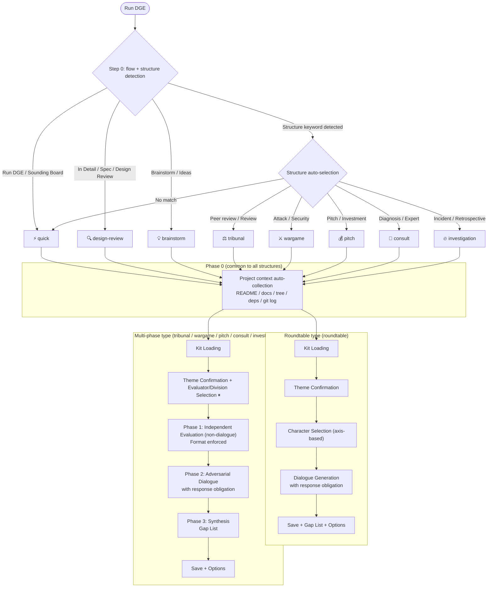
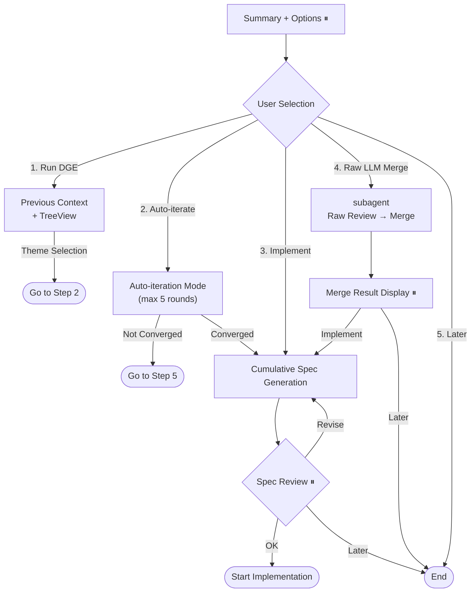
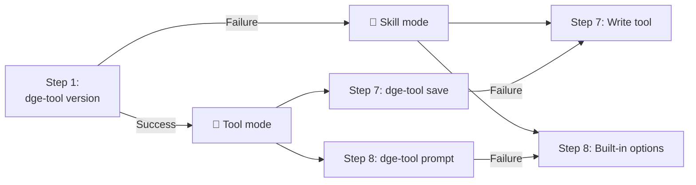
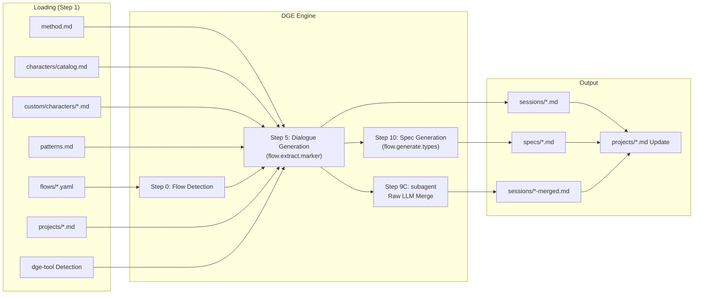
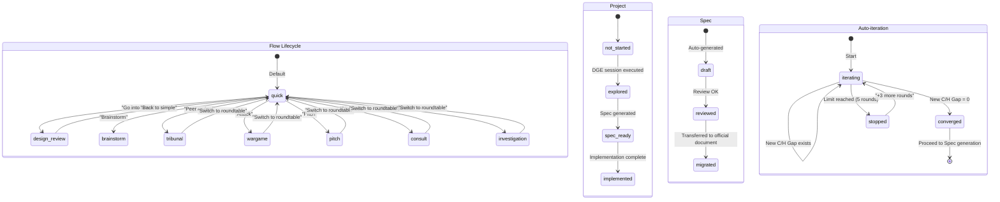

# DGE Internals — Internal Structure

Internal structure of the DGE toolkit. Use as a reference when customizing.

## Flow Diagrams

### Overall Flow (flow + structure detection → branching)

### Branching After Options

⏸ = Points where the system waits for user response

## dge-tool Mode

## Data Flow Diagram

## State Diagram

## flow + structure Comparison

### flow (mode)

| | ⚡ quick | 🔍 design-review | 💡 brainstorm |
|---|---------|------------------|---------------|
| Steps | 5 | 10 | 6 |
| Shared MUSTs | 3 | 3 | 3 |
| Flow-specific MUSTs | 0 | 4 | 1 |
| Template | Skipped | Selection | Skipped |
| Pattern | Auto | Selection | Auto |
| Character Confirmation | Display only | Wait for confirmation | Wait for confirmation |
| Extraction | Gap | Gap | Idea |
| Spec Generation | None | Yes | None |
| Speech Style | Standard | Standard | Yes-and |

### structure

| | 🗣 roundtable | ⚖ tribunal | ⚔ wargame | 💰 pitch | 🏥 consult | 🔥 investigation |
|---|--------------|-----------|----------|---------|-----------|----------------|
| Phases | 1 | 3 | 3 | 3 | 3 | 3 |
| Phase 0 | ✅ | ✅ | ✅ | ✅ | ✅ | ✅ |
| Independent Eval | None | 3 Reviewers | Red Team | Entrepreneur Pitch | Each Specialty | Each Division Testimony |
| Response Obligation | Between characters | Rebuttal required | Defense required | All questions answered | Conference synthesis | Five Whys |
| Format | Free | S/S/W/Q/V | Attack Plan | P/S/M/T/A | Findings/Risk/Recommendation | Timeline+Testimony |
| Best Theme | General | Papers/Design | Security | Business Decisions | Multi-domain Design | Incident Analysis |

## Hook Points List

| Step | Name | Hook | Level | dge-tool |
|------|------|------|-------|----------|
| 0 | Flow Detection | trigger_keywords | 1 (YAML) | — |
| 1 | Kit Loading | File list to load | 2 | version detection |
| 2 | Theme Confirmation | Deep-dive logic | 2 | — |
| 3 | Template Selection | Add templates | 1 (templates/) | — |
| 3.5 | Pattern Selection | Add presets | 1 (patterns.md) | — |
| 4 | Character Selection | Add/recommend characters | 1 (custom/) / 2 | — |
| 5 | Dialogue Generation | Narration / Scene | 2 | — |
| 6 | Extraction | Markers / Categories | 1 (YAML extract) | — |
| 7 | Save | Save destination / filename | 1 (YAML output_dir) | **save** |
| 8 | Options | Options configuration | 1 (YAML post_actions) | **prompt** |
| 9A | Auto-iteration | Convergence check / limit | 2 | — |
| 9B | Context | TreeView / theme | 2 | — |
| 9C | LLM Merge | subagent execution | 2 | — |
| 10 | Spec Generation | Artifact types | 1 (YAML generate) | — |

## File Map

| File | Role | Read by | Written by |
|---------|------|---------|---------|
| method.md | Method body | Step 1 | toolkit-provided |
| characters/catalog.md | 19 built-in characters | Step 1, 4 | toolkit-provided |
| custom/characters/*.md | Custom characters | Step 1, 4 | dge-character-create |
| patterns.md | 20 patterns + 9 presets | Step 1, 3.5 | toolkit-provided |
| dialogue-techniques.md | 8 dialogue techniques | Step 5 | toolkit-provided |
| flows/*.yaml | Flow definitions | Step 0, 6, 7, 8, 10 | toolkit-provided or user |
| sessions/*.md | DGE session output | Step 9B, 10 | Step 7 (auto) |
| specs/*.md | Spec files | At implementation | Step 10 (auto) |
| projects/*.md | Project management | Step 9B | Step 7 (auto-update) |
| bin/dge-tool.js | MUST enforcement CLI | Step 1, 7, 8 | toolkit-provided |
| AGENTS.md | Codex/general DGE instructions | Codex, Cursor | install.sh |
| GEMINI.md | Gemini CLI DGE instructions | Gemini CLI | install.sh |
| .cursorrules | Cursor DGE instructions | Cursor | install.sh |
| agents-dge-section.md | DGE instruction template (ja) | install.sh | toolkit-provided |
| agents-dge-section.en.md | DGE instruction template (en) | install.sh | toolkit-provided |
