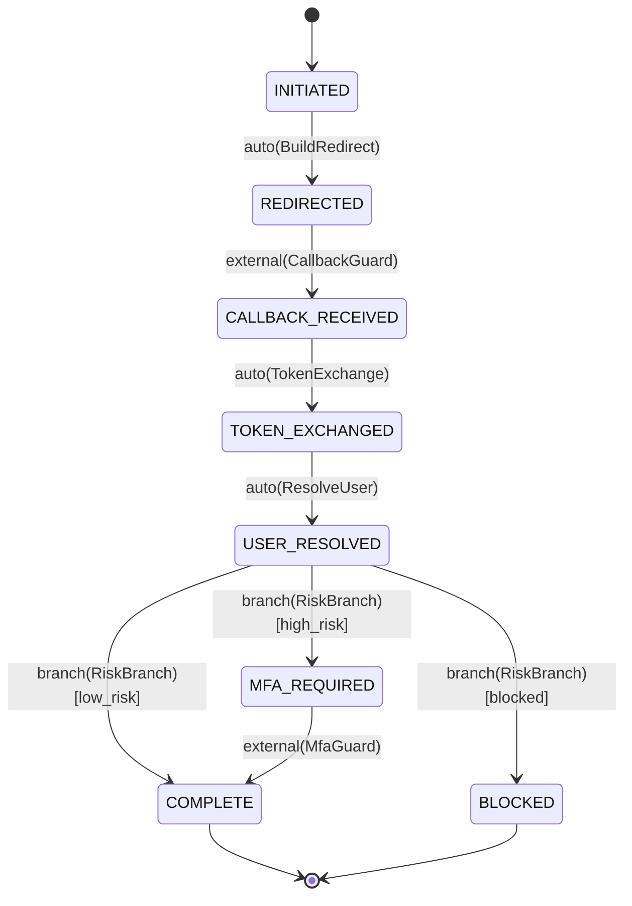
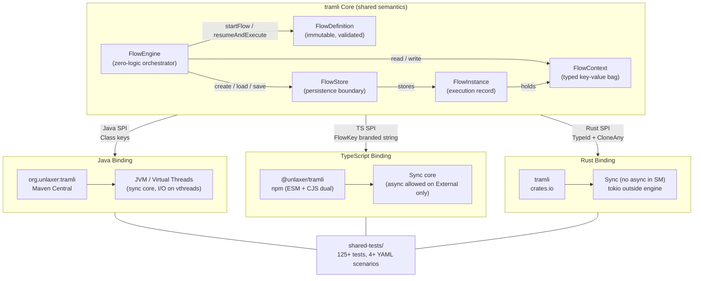
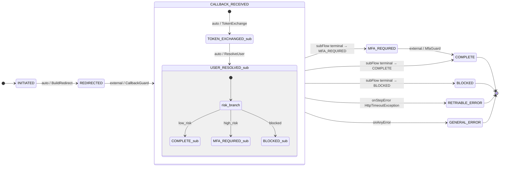

# tramli — Specification

> **Constrained Flow Engine** — 3-language reference specification
> Implementations: Java / TypeScript / Rust
> Scope: core engine + shared semantics across bindings
> Status: Frozen core. Tier-1 APIs stable; Tier-2/3 evolving.

---

## Document Meta

| Field | Value |
|-------|-------|
| Document kind | Comprehensive system specification (exemplar) |
| Target audience | Library authors, language-port maintainers, reviewers, LLM code generators |
| Normative scope | Sections 2–6, 10, 11 (behavioral contracts) |
| Informative scope | Sections 1, 7, 8, 9, 12 (context, deployment) |
| Reference implementation | Java (v3.1.0); cross-checked by TS + Rust via `shared-tests/` |
| Related docs | `docs/specs/flow-engine-spec.md`, `flow-definition-spec.md`, `flow-context-spec.md`, `shared-test-scenarios.md`, `api-cookbook.md`, `language-guide.md`, `paper-tramli-constrained-flow-engine.md`, `api-stability.md` |
| Design decisions | `dge/decisions/DD-001` … `DD-041` |

---

## Table of Contents

1. [Overview (3-language binding, API Stability Tier, DD Index)](#1-overview)
2. [Functional Specification (FlowEngine, GuardOutput, 8-item validation)](#2-functional-specification)
3. [Data Persistence Layer (FlowInstance state, InMemoryFlowStore, FlowStore trait)](#3-data-persistence-layer)
4. [State Machine (DSL spec, Auto-Chain, SubFlow hierarchy) — CORE SECTION](#4-state-machine)
5. [Business Logic (8-item build validation details, strict_mode)](#5-business-logic)
6. [API / External Boundary (Java / TS / Rust binding surface)](#6-api--external-boundary)
7. [UI](#7-ui)
8. [Configuration](#8-configuration)
9. [Dependencies](#9-dependencies)
10. [Non-Functional (SM overhead 1.69μs, memory, concurrency)](#10-non-functional)
11. [Test Strategy (shared-tests, per-language test suites)](#11-test-strategy)
12. [Deployment / Operations (crates.io, npm, Maven Central)](#12-deployment--operations)

Appendix A — [Exception / Error Code Catalog](#appendix-a-exception--error-code-catalog)
Appendix B — [State-Transition Reference Table](#appendix-b-state-transition-reference-table)
Appendix C — [Invariants](#appendix-c-invariants)
Appendix D — [Design Decision Cross-Reference](#appendix-d-design-decision-cross-reference)

---

# 1. Overview

## 1.1 Purpose

tramli (from *tramline*, 路面電車の軌道) is a **constrained flow engine**: a state-machine library in which structurally invalid transitions cannot exist. A "flow" is a directed multigraph of states, transitions, guards, and processors; the engine's only job is to walk that graph while enforcing invariants at both **build time** and **runtime**.

The design insight is that *what you don't have to read* is the determining factor for both human working memory and LLM context budgets. A flat `FlowDefinition` (tens of lines) replaces hundreds of lines of procedural conditional flow, and the compiler plus an 8-item `build()` pass rule out entire classes of defect before the engine is ever invoked.

## 1.2 Problem Statement

Conventional imperative flow code — authentication callbacks, order pipelines, approval chains — collapses into large procedural handlers (often 1000+ LOC) where local changes have non-local consequences. Most state-machine libraries defer validation to runtime: unreachable states, cyclic auto-transitions, unmet data dependencies, and broken guards all surface only in production. Cross-language consistency is harder still — behaviorally identical flows on Java, TypeScript, and Rust diverge in subtle ways without a shared semantic reference.

tramli addresses this with:

- A **definition-time validation pass** (8 structural checks) that rejects broken flows at `build()` (DD-014, DD-015).
- A **requires / produces data-flow contract** on every guard and processor, verified across all reachable paths.
- A **frozen core** with a strict plugin boundary — the core never gains new primitives; behavior layers on via SPIs.
- A **3-language symmetric implementation** (Java / TS / Rust) driven by a shared test suite (`shared-tests/`).

## 1.3 Three-Language Binding

| Binding | Artifact | Registry | Async model | Status |
|---------|----------|----------|-------------|--------|
| Java | `org.unlaxer:tramli` | Maven Central | Sync (virtual threads for I/O) | Stable (reference) |
| TypeScript | `@unlaxer/tramli` | npm (ESM + CJS dual export) | Sync core; async allowed on External only | Stable |
| Rust | `tramli` | crates.io | Sync (async outside SM per DD-012) | Stable |

Additional packages (plugins, React bindings, viz UI): `@unlaxer/tramli-plugins`, `tramli-plugins` (crates.io), `org.unlaxer:tramli-plugins`, `@unlaxer/tramli-react`, and `tramli-viz` (monorepo-internal).

Design decisions governing multi-language parity:
- **DD-004**: TypeScript was the first port; Java was the reference.
- **DD-008**: Rust was added for the volta-gateway use case; Python / C# intentionally skipped.
- **DD-013**: All languages use a sync core (DD-006 async TS engine retracted in favor of DD-012).
- **DD-022**: Plugin API must be 3-language symmetric.
- **DD-026**: Systematic parity audit closed all known behavioral drift (P0–P2, plus P1+ edge cases).

## 1.4 API Stability Tiers

Three tiers (authoritative source: `docs/api-stability.md`):

- **Tier 1 — Stable.** No breaking changes within a minor version. Includes `FlowDefinition` / `Builder`, `FlowEngine` (`startFlow`, `resumeAndExecute`, loggers), `FlowState` / `StateConfig`, `StateProcessor` / `TransitionGuard` / `BranchProcessor`, `FlowContext` (`get` / `put` / `has` / `find`), `FlowInstance`, `InMemoryFlowStore`, `FlowStore` (Rust trait), `FlowError` / `FlowException`, `MermaidGenerator`, `flowKey` / `FlowKey` (TS), `Tramli.define/engine/data` (TS).
- **Tier 2 — Evolving.** Methods preserved; new methods / fields may appear in minor versions. Logger API (`TransitionLogEntry`, etc.), Plugin API (`PluginRegistry`, `EnginePlugin`, etc.), `DataFlowGraph`, `ObservabilityPlugin` / `TelemetrySink`, `useFlow` hook (tramli-react).
- **Tier 3 — Experimental.** May change in patch versions. Pipeline API (TS), Hierarchy plugin, EventStore plugin, `ScenarioTestPlugin.generateCode()`, `SkeletonGenerator`.

Versioning policy:
- **Major (x.0.0)**: only on Tier 1 breaking change.
- **Minor (3.x.0)**: Tier 2 additions and new features.
- **Patch (3.6.x)**: bug fixes, Tier 3 changes, documentation.

Migration notes are tracked inline in `docs/api-stability.md` (e.g., v1.15.0 introduced `stateEnteredAt` on `FlowInstance` — custom `FlowStore` implementations must persist it to get accurate per-state timeouts on restored flows).

## 1.5 Design Decisions — Index (DD-001 … DD-041)

The table below is the authoritative quick index. Each DD is stored in `dge/decisions/DD-<n>-<slug>.md`.

| DD | Title | Status |
|----|-------|--------|
| DD-001 | TTL is the expiry window for external resume | accepted |
| DD-002 | No compensation mechanism, no per-state timeout (v0.1.0) | accepted; per-state timeout later reintroduced (v1.15) |
| DD-003 | Native port is primary path; HTTP API is a monitoring layer | accepted |
| DD-004 | v0.1.0 portable target: TypeScript only | accepted |
| DD-005 | `FlowContext` key is a `FlowKey` branded string (TS) | accepted |
| DD-006 | TS `FlowEngine` is fully async | retracted by DD-013 |
| DD-007 | HTTP API deferred to v0.2.0 | accepted |
| DD-008 | Rust target is volta-gateway; skip Python / C# | accepted |
| DD-009 | `allow_perpetual()` — terminal-free, loop-permitted flows | accepted |
| DD-010 | Rust: `CloneAny` + `TypeId` + native async | partially retracted (async part → DD-012) |
| DD-011 | tramli scope within volta-gateway | accepted |
| DD-012 | Rust is fully sync (async retracted) | accepted |
| DD-013 | All languages converge on a sync core | accepted |
| DD-014 | Data-flow is *derived*, not declared | accepted |
| DD-015 | `DataFlowGraph` is a core concern (not a plugin) | accepted |
| DD-016 | v1.0.0 release | shipped |
| DD-017 | Flow composition via SubFlow | accepted |
| DD-018 | Portability: no centralized FlowStore service; alias API instead | accepted |
| DD-019 | `Tramli.pipeline()` — build-time verified sequential pipeline | accepted |
| DD-020 | Multi-External + Entry / Exit Actions | accepted |
| DD-021 | Flat enum is the correct design (verified vs. Harel / Carta) | accepted |
| DD-022 | Plugin API 3-language parity | accepted |
| DD-023 | v3.0.0 release strategy | shipped |
| DD-024 | 3-language details fold in docs | accepted |
| DD-025 | `StateConfig.initial` optional (default false) | accepted |
| DD-026 | Systematic 3-language parity fix (P0–P2, P1+) | accepted |
| DD-027 | tramli-viz real-time monitor | accepted |
| DD-028 | Extract specs + shared tests from implementations | accepted |
| DD-029 | Issue #5 volta-gateway adoption feedback | accepted |
| DD-030 | Issue #6–#13 triage; plugin pack maturity plan | accepted |
| DD-031 | 4-project feedback round 2 (#14–#17) | accepted |
| DD-032 | Issue #18–#22 + tramli-react | accepted |
| DD-033 | Chain mode + tramli-react tests | accepted |
| DD-034 | Issue triage #23 / #24 | accepted |
| DD-035 | Issue triage #15 / #17 / #25 / #26 | accepted |
| DD-036 | Issue triage #27 / #32; `generateCode` fix | accepted |
| DD-037 | tramli-viz trace mode + edge improvements | accepted |
| DD-038 | tramli-viz heatmap + display polish | accepted |
| DD-039 | tramli-viz layout persistence + UX | accepted |
| DD-040 | Issue #33 appspec feedback | accepted |
| DD-041 | Issue #37 / #38 multi-SM viz + BOM decision | accepted |

## 1.6 Scope and Non-Goals

**In scope:** a pure, in-process, embeddable flow engine with 8 core primitives (FlowState, StateProcessor, TransitionGuard, BranchProcessor, FlowContext, FlowDefinition, FlowEngine, FlowStore); build-time validation; Mermaid / data-flow graph generation; a 6-SPI plugin system (`AnalysisPlugin`, `StorePlugin`, `EnginePlugin`, `RuntimeAdapterPlugin`, `GenerationPlugin`, `DocumentationPlugin`); 14 canonical plugins shipped alongside the core.

**Not in scope:** SCXML compliance, orthogonal regions, history states, distributed coordination / leader election, built-in retries or backoff, built-in durability (the library ships an in-memory store only), generic workflow scheduling (Temporal.io-class features). DD-021 positions flat enums as the *correct* model for this library; hierarchy is available only via SubFlow composition.

---

# 2. Functional Specification

## 2.1 Actors and Primitives

The core consists of eight primitives. Each primitive has a fixed responsibility, and the engine is the only component that composes them.

| Primitive | Responsibility | Purity |
|-----------|----------------|--------|
| `FlowState` | Enum whose variants describe all possible states. Each variant declares `isInitial()` / `isTerminal()`. | Pure value |
| `StateProcessor` | Business logic for a single transition. Declares `requires()` / `produces()` / `name()`. Runs on Auto and (optionally) External post-guard. | Pure w.r.t. context (no I/O on Auto) |
| `TransitionGuard` | Validates an external event. Reads `FlowContext` and external data; returns a `GuardOutput`. Must not mutate `FlowContext`. | Read-only over context |
| `BranchProcessor` | Returns a `label: String` that selects a branch target. Declares `requires()` / `produces()`. | Pure |
| `FlowContext` | Typed key-value bag keyed by `Class<?>` (Java), `FlowKey<T>` (TS), or `TypeId` (Rust). | Mutable per-instance |
| `FlowDefinition` | Immutable, validated description of all states, transitions, error routes, enter / exit actions, sub-flows. Product of `build()`. | Immutable |
| `FlowEngine` | Zero-logic orchestrator. Owns no state beyond configuration. Handles `startFlow` / `resumeAndExecute` / auto-chain. | Side-effectful (via store and loggers) |
| `FlowStore` | Persistence boundary. `create`, `get`, `get_mut` / `loadForUpdate`, `record_transition`, `clear`. | I/O boundary |

Three transition types — **Auto**, **External**, **Branch** — plus **SubFlow** (a delegated auto-chain into a nested `FlowDefinition`). Auto and Branch fire inside the engine's auto-chain without any external stimulus; External requires a resume call carrying the data the guard needs.

## 2.2 FlowEngine Configuration

Authoritative reference: `docs/specs/flow-engine-spec.md`.

| Parameter | Default | Description |
|-----------|---------|-------------|
| `strictMode` | `false` | After every processor run, verify the processor produced every type it declared in `produces()`. Violation raises `PRODUCES_VIOLATION`. |
| `maxChainDepth` | `10` | Upper bound on the number of Auto / Branch transitions fired inside a single `resumeAndExecute` or `startFlow`. Exceeded raises `MAX_CHAIN_DEPTH`. |

## 2.3 Loggers

Loggers are installed on the engine as optional sinks. Each logger has a contract for the entry it receives. All loggers run synchronously (DD-012 / DD-013) — non-blocking delivery is the logger's responsibility (see `docs/patterns/non-blocking-sink.md`).

| Logger | Fires When | Entry Fields |
|--------|-----------|--------------|
| `transitionLogger` | Every state transition | `flowId`, `flowName`, `from`, `to`, `trigger` |
| `stateLogger` | Every `context.put()` performed by a processor (opt-in via `put` path) | `flowId`, `flowName`, `state`, `type`/`key`, `value` |
| `errorLogger` | Error route taken, or `TERMINAL_ERROR` reached | `flowId`, `flowName`, `from`, `to`, `trigger`, `cause` |
| `guardLogger` | After every `guard.validate(...)` | `flowId`, `flowName`, `state`, `guardName`, `result`, `reason` |

`flowName` is mandatory on all entries (parity fix, DD-026 P0 follow-up).

## 2.4 GuardOutput

`GuardOutput` is a closed sum with exactly three variants:

- `Accepted { data: Map<Type, Value> }` — engine may proceed. Returned data is merged into `FlowContext`.
- `Rejected { reason: String }` — guard failed; engine increments failure counters and, on max retries, triggers error routing.
- `Expired` — guard-observed expiry (distinct from flow TTL). Engine completes flow with exit state `"EXPIRED"`.

| Language | Encoding |
|----------|----------|
| Java | `sealed interface GuardOutput` with three records |
| TypeScript | Discriminated union `{ kind: 'accepted' | 'rejected' | 'expired', ... }` |
| Rust | `enum GuardOutput { Accepted { data: HashMap<TypeId, Box<dyn CloneAny>> }, Rejected { reason: String }, Expired }` |

Exhaustiveness is compiler-enforced in Java (sealed) and Rust (`match`), and checked via `never` in TS discriminated unions.

## 2.5 startFlow — Algorithm

```
startFlow(definition, sessionId, initialData):
  1. flowId := UUID()
  2. ctx    := new FlowContext(flowId)
  3. for (k, v) in initialData: ctx.putRaw(k, v)       # no state logging
  4. initialState := definition.initialState
  5. expiresAt    := now + definition.ttl
  6. flow := new FlowInstance(
       id=flowId, sessionId=sessionId, definition=definition,
       context=ctx, currentState=initialState,
       guardFailureCount=0, version=0, exitState=None,
       createdAt=now, stateEnteredAt=now, expiresAt=expiresAt)
  7. store.create(flow)
  8. executeAutoChain(flow)
  9. store.save(flow)
 10. return flow
```

## 2.6 resumeAndExecute — Algorithm

```
resumeAndExecute(flowId, definition, externalData):
  1. flow := store.loadForUpdate(flowId, definition)
     if flow is null:
       raise FLOW_NOT_FOUND  (or FLOW_ALREADY_COMPLETED if completed)

  2. for (k, v) in externalData: flow.context.putRaw(k, v)

  3. # TTL check
     if now > flow.expiresAt:
       flow.complete("EXPIRED")
       flow.setLastError("TTL expired")
       store.save(flow); return flow

  4. # Sub-flow delegation
     if flow.activeSubFlow is not None:
       return resumeSubFlow(flow, externalData)

  5. # External selection
     externals := definition.externalsFrom(currentState)
     if externals is empty: raise INVALID_TRANSITION
     transition := None
     dataTypes  := externalData.keySet()
     for ext in externals:
       if ext.guard is not None AND dataTypes ⊇ ext.guard.requires():
         transition := ext; break
     if transition is None: transition := externals[0]   # fallback

  6. # Per-state timeout
     if transition.timeout is not None AND flow.stateEnteredAt is not None:
       deadline := flow.stateEnteredAt + transition.timeout
       if now > deadline:
         flow.complete("EXPIRED"); store.save(flow); return flow

  7. # Guard validation
     if transition.guard is None:
       fireExit(flow, from)
       flow.transitionTo(to)
       fireEnter(flow, to)
       store.recordTransition(...)
     else:
       result := transition.guard.validate(flow.context)
       guardLogger.log(flow, transition.guard.name(), result)
       switch result:
         case Accepted(data):
           backup := flow.context.snapshot()
           merge data into flow.context
           if transition.processor: try transition.processor.process(ctx)
             on throw: flow.context.restoreFrom(backup); handleError(flow, from, cause); store.save(flow); return
           fireExit(flow, from)
           flow.transitionTo(to)
           fireEnter(flow, to)
           store.recordTransition(...)
         case Rejected(reason):
           flow.incrementGuardFailure(guard.name())
           if flow.guardFailureCount >= definition.maxGuardRetries:
             handleError(flow, currentState, null)
           store.save(flow); return flow
         case Expired:
           flow.complete("EXPIRED")
           store.save(flow); return flow

  8. executeAutoChain(flow)
  9. store.save(flow)
 10. return flow
```

## 2.7 executeAutoChain — Algorithm

```
executeAutoChain(flow):
  depth := 0
  while depth < engine.maxChainDepth:
    current := flow.currentState
    if current.isTerminal:
      flow.complete(current.name); break

    # Dispatch order (deterministic): SubFlow > Auto/Branch > External(stop)
    result := dispatchStep(flow, current)
    if result == ERROR: return             # error was handled inside
    if result == STOP: break                 # External reached, or no transition
    depth += result
  if depth >= engine.maxChainDepth:
    raise MAX_CHAIN_DEPTH
```

Three dispatchers:

- `dispatchAuto(flow)`: snapshot context → run processor → verifyProduces (if `strictMode`) → on error restore + `handleError` → fireExit → `transitionTo` → fireEnter → `recordTransition`. Returns 1 on success; ERROR on exception.
- `dispatchBranch(flow)`: snapshot context → `branch.decide(ctx)` → look up `branchTargets[label]` (else `UNKNOWN_BRANCH`) → run branch-target processor (if present) → on error restore + `handleError` → `transitionTo` → `recordTransition`. Returns 1.
- `dispatchSubFlow(flow)`: start the sub-flow's own auto-chain; stop if the sub-flow stops on External. On sub-flow completion, map its terminal via `onExit(terminalName, parentState)` and continue parent chain.

> **DD-026 #17 note.** Java does **not** fire enter / exit actions on branch transitions. TypeScript and Rust do. This is considered a Java-side bug awaiting a future parity fix; current behavior is documented here so test suites can account for it.

## 2.8 handleError — Algorithm

Two-priority error routing.

**Priority 1 — Exception-typed routes (`onStepError`):**
```
if cause != null:
  for route in definition.exceptionRoutes[fromState]:
    if route.exceptionType.isInstance(cause):
      flow.transitionTo(route.target)
      if route.target.isTerminal: flow.complete(route.target.name)
      return        # MATCHED
```

Ordering: first matching route wins. If a superclass is listed before a subclass, a build-time warning is emitted ("Exception route ordering").

**Priority 2 — State-based error (`onError` / `onAnyError`):**
```
errorTarget := definition.errorTransitions[fromState]
if errorTarget != null:
  flow.transitionTo(errorTarget)
  if errorTarget.isTerminal: flow.complete(errorTarget.name)
else:
  flow.complete("TERMINAL_ERROR")
```

`onAnyError(S)` expands to every non-terminal state → `S`, but individual `onError(X, Y)` calls override per-state.

## 2.9 8-Item Build Validation (summary)

`FlowDefinition.build()` runs structural checks. The canonical count is "8 items" (external-facing marketing number), implemented as 11 internal checks in the reference. All implementations run the same checks; the table lists the user-visible eight:

| # | Check | Error message (shape) |
|---|-------|-----------------------|
| 1 | All non-terminal states reachable from initial | `State X is not reachable from Y` |
| 2 | Path from initial to at least one terminal (skipped if `allowPerpetual`) | `No path from X to any terminal state` |
| 3 | Auto / Branch transitions form a DAG | `Auto/Branch transitions contain a cycle` |
| 4 | Multi-external guards have distinct `requires` sets | `Ambiguous external: guards A and B share required types` |
| 5 | All branch targets are valid states | `Branch target 'label' -> X is not a valid state` |
| 6 | requires / produces chain integrity across all paths | `Guard/Processor/Branch 'X' requires Y but not available` |
| 7 | No transitions from terminal states | `Terminal state X has outgoing transition to Y` |
| 8 | Initial state exists | `No initial state found` |

Internal additional checks: SubFlow exit completeness (#9), SubFlow nesting depth max 3 (#10), SubFlow circular reference (#11). Details in §5.

## 2.10 Cross-Language Semantic Equivalence

Parity is guaranteed empirically by the shared-test suite: 125+ tests and 4+ YAML scenarios exercise the same inputs and compare the same observable outputs (`currentState`, `isCompleted`, `exitState`, `context[T]`, `guardFailureCount`, `guardFailureCountFor(name)`) across Java, TS, and Rust. Known deviations are exactly:

- Java does not fire enter / exit actions on branch transitions (DD-026 #17, §2.7).
- TS `FlowEngine.startFlow` / `resumeAndExecute` may be awaited on External transitions with async processors (§6.2).
- Rust treats `store.clear()` as capacity-preserving (see §3.5); Java / TS may differ.

## 2.11 Worked Example — OIDC Authentication Flow

The following worked example shows every engine algorithm in play. States:

```
INITIATED (initial)
  → (auto: BuildRedirect)              → REDIRECTED
REDIRECTED
  → (external: CallbackGuard)           → CALLBACK_RECEIVED
CALLBACK_RECEIVED
  → (auto: TokenExchange)               → TOKEN_EXCHANGED
TOKEN_EXCHANGED
  → (auto: ResolveUser)                 → USER_RESOLVED
USER_RESOLVED
  → (branch: RiskBranch)                → COMPLETE | MFA_REQUIRED | BLOCKED
COMPLETE (terminal)
MFA_REQUIRED (non-terminal)
  → (external: MfaGuard)                → COMPLETE
BLOCKED (terminal)
RETRIABLE_ERROR (terminal)
GENERAL_ERROR (terminal)
```

With:

```
onStepError(TOKEN_EXCHANGED, HttpTimeoutException.class, RETRIABLE_ERROR)
onStepError(TOKEN_EXCHANGED, InvalidTokenException.class, GENERAL_ERROR)
onAnyError(GENERAL_ERROR)
```

### 2.11.1 `startFlow(def, null, {OidcRequest: req})`

1. `flowId = UUID()` → `f9a4…`.
2. `ctx = new FlowContext(flowId)`; merge `{OidcRequest → req}` via `putRaw` (no state log).
3. `initialState = INITIATED`.
4. `expiresAt = now + 5min` (definition default).
5. Create `FlowInstance` with `currentState=INITIATED`, `stateEnteredAt=now`, `version=0`.
6. `store.create(flow)`.
7. `executeAutoChain(flow)`:
   - depth=0: at `INITIATED` → `dispatchAuto` runs `BuildRedirect` (produces `RedirectUrl`) → `transitionTo(REDIRECTED)` → `stateEnteredAt=now`. Returns 1. depth=1.
   - depth=1: at `REDIRECTED` → has External only → `dispatchStep` returns STOP.
8. `store.save(flow)`.
9. Return `flow`.

Observable state after `startFlow`:
- `currentState = REDIRECTED`, `isCompleted = false`, `context = {OidcRequest, RedirectUrl}`.

### 2.11.2 `resumeAndExecute(flowId, def, {OidcCallback: cb})`

1. `flow = store.loadForUpdate(flowId, def)`. Non-null, not completed.
2. Merge `{OidcCallback}` into context.
3. TTL check: `now < expiresAt` — continue.
4. No `activeSubFlow`.
5. `externals = [(REDIRECTED → CALLBACK_RECEIVED, CallbackGuard)]`. Pick externals[0].
6. No per-state timeout on this edge.
7. Call `CallbackGuard.validate(ctx)`:
   - Validates `OidcCallback.state == ctx.get(RedirectUrl).state`.
   - Returns `Accepted({TokenGrant: grant})`.
8. `guardLogger.log(flow, "CallbackGuard", Accepted)`.
9. backup = ctx.snapshot().
10. Merge `{TokenGrant}`.
11. No post-guard processor configured on this edge.
12. `fireExit(flow, REDIRECTED)` → exit action (if any) runs.
13. `transitionTo(CALLBACK_RECEIVED)` → `stateEnteredAt=now`, guard-failure counters reset.
14. `fireEnter(flow, CALLBACK_RECEIVED)`.
15. `store.recordTransition(flow, "REDIRECTED", "CALLBACK_RECEIVED", "external")`.
16. `executeAutoChain(flow)`:
   - at `CALLBACK_RECEIVED` → `dispatchAuto` runs `TokenExchange(ctx)`. **This processor does HTTP I/O** — in Java it uses a virtual thread; in TS it might be `AsyncStateProcessor` awaited here; in Rust the caller uses tokio *outside* the SM, but since the engine itself is sync, the processor performs a blocking call. On failure (say `HttpTimeoutException`): rollback via `ctx.restoreFrom(backup)`, then `handleError(flow, CALLBACK_RECEIVED, cause=HttpTimeoutException)`.
     - Priority-1 routes at `CALLBACK_RECEIVED`: none (defined at `TOKEN_EXCHANGED`).
     - Wait — the exception fired at `TOKEN_EXCHANGED` *during the processor that leaves CALLBACK_RECEIVED*. But `handleError` uses `fromState=CALLBACK_RECEIVED` (the state we were at when the auto transition fired). This is subtle: **exception-typed routes are keyed by the `from` side of the transition**, not the target.
     - So at `CALLBACK_RECEIVED` → no matching `onStepError`. Falls to `onError(CALLBACK_RECEIVED, …)`: absent. Falls to `onAnyError(GENERAL_ERROR)`. `transitionTo(GENERAL_ERROR)`, which is terminal → `flow.complete("GENERAL_ERROR")`.
   - On success: transition `CALLBACK_RECEIVED → TOKEN_EXCHANGED`. depth=1.
   - at `TOKEN_EXCHANGED` → `dispatchAuto` runs `ResolveUser`. On `InvalidTokenException` here: Priority-1 at `TOKEN_EXCHANGED` matches `InvalidTokenException` → `GENERAL_ERROR` (terminal).
   - On success: `TOKEN_EXCHANGED → USER_RESOLVED`. depth=2.
   - at `USER_RESOLVED` → `dispatchBranch`:
     - `label = RiskBranch.decide(ctx)` — reads `UserProfile`, returns `"low_risk"` / `"high_risk"` / `"blocked"`.
     - Suppose `"high_risk"` → target `MFA_REQUIRED`. Run MFA's pre-processor (`MfaInit`). `transitionTo(MFA_REQUIRED)`. depth=3.
   - at `MFA_REQUIRED` → External only → STOP.
17. `store.save(flow)`. Return `flow`.

### 2.11.3 Second Resume with MFA Response

1. `resumeAndExecute(flowId, def, {MfaResponse: code})`.
2. Merge → validate `MfaGuard` → `Accepted({MfaToken})`.
3. `transitionTo(COMPLETE)` which is terminal → `flow.complete("COMPLETE")`.
4. `executeAutoChain` re-enters, observes terminal, does nothing more.
5. Return.

This example exercises auto-chain, External, Branch (with post-processor), exception-typed error routing, terminal completion, and state-log capture.

## 2.12 Observable State Transitions — Worked Edge Cases

### 2.12.1 Flow that completes entirely within `startFlow`

Flow: `A (initial) → B → C → D (terminal)`, all Auto. `startFlow` runs the entire auto-chain inside a single call; `exitState = "D"` on return; `resumeAndExecute` on this flowId raises `FLOW_ALREADY_COMPLETED`.

### 2.12.2 Flow that waits indefinitely on External

Flow: `A (initial) → B external(G)`. `startFlow` returns with `currentState = B`, `isCompleted = false`. Until `resumeAndExecute` is called, the flow remains in store unchanged. If TTL elapses between start and resume, the next resume triggers `EXPIRED` completion (§2.6 step 3).

### 2.12.3 Flow with failing guard exhausting retries

Flow: `A → B → C`, `B→C external(G)`, `maxGuardRetries = 2`, `onError(B, ERR)` where `ERR` terminal.

- `startFlow` → `currentState = B`.
- `resume({data})` → G rejects → `guardFailureCount = 1`. Returns.
- `resume({data})` → G rejects → `guardFailureCount = 2 ≥ 2` → `handleError(flow, B)` → no exception type, falls to state-based → `transitionTo(ERR)` → `flow.complete("ERR")`.

Observable: `exitState = "ERR"`, `lastError = null` (guard failures don't populate `lastError` — only thrown processor exceptions do).

### 2.12.4 Flow where guard throws (unspecified path)

If a guard throws instead of returning `Rejected`, the engine behavior is binding-dependent but consistent in principle: the throw is caught, logged, and treated as `Rejected(cause.message)`. Callers should not rely on this path — guards should be pure.

### 2.12.5 External that requires data never supplied

`resumeAndExecute` with an empty `externalData` while the only external's `requires` is non-empty. Engine falls through to `externals[0]` (fallback). Guard invokes with whatever context has — likely rejects. Counter increments; eventually exhausts → error route.

Users should prefer **waiting_for()** on `FlowInstance` to preview what the next external expects, rather than guessing.

---

# 3. Data Persistence Layer

## 3.1 FlowInstance — State Schema

A `FlowInstance` is the execution record for a single flow run. Its schema (authoritative: `lang/rust/src/instance.rs`, mirrored in Java / TS) is:

| Field | Type | Meaning |
|-------|------|---------|
| `id` | `String` | Instance UUID; generated in `startFlow`. |
| `sessionId` | `String` | Caller-provided correlation ID (optional in Java / TS; string in Rust). |
| `definition` | `Arc<FlowDefinition<S>>` (Rust) / `FlowDefinition<S>` (Java/TS) | Reference to the validated flow definition. |
| `context` | `FlowContext` | Typed data bag (see §3.2). |
| `currentState` | `S` (enum / `FlowState`) | Current state. |
| `guardFailureCount` | `usize` | Count of guard rejections since last state change. Reset on `transitionTo` if state changed. |
| `guardFailureCounts` | `Map<String, usize>` | Per-guard failure count (by guard `name()`). Reset on state change. |
| `version` | `u32` | Optimistic locking version. Incremented by `FlowStore.save` / `loadForUpdate` cycle. |
| `createdAt` | `Instant` / `Date` | Flow creation timestamp. |
| `expiresAt` | `Instant` / `Date` | TTL deadline (createdAt + definition.ttl). |
| `stateEnteredAt` | `Instant` / `Date` | Timestamp of last `transitionTo`. Used by per-state timeouts (v1.15+). |
| `lastError` | `Option<String>` | Last error message captured when a processor throws. Preserved across error-route transition. |
| `exitState` | `Option<String>` | Non-null iff flow completed. Value = terminal state name, or `"EXPIRED"`, or `"TERMINAL_ERROR"`, or a `onError` terminal name. |

## 3.2 FlowContext — State & Behavior

`FlowContext` is keyed by type-discriminated keys (one value per key). Operations:

| Method | Behavior |
|--------|----------|
| `put(key, value)` | Store / overwrite; fires `stateLogger` if installed. |
| `putRaw(key, value)` | Store without firing `stateLogger` (used for initial / external merges). |
| `get(key)` | Return value; throw `MISSING_CONTEXT` if absent. |
| `find(key)` | Return `Option` / nullable. |
| `has(key)` | Boolean membership. |
| `snapshot()` | Shallow copy of attributes. |
| `restoreFrom(snapshot)` | Clear then restore from snapshot. Used by engine for rollback on processor throw. |

**Shallow copy caveat.** `snapshot()` is shallow — nested mutable objects are *not* rolled back. Users who rely on rollback must treat context values as effectively immutable (or copy-on-write) within a processor.

**Alias support (DD-018).** `registerAlias` / `aliasOf` / `keyOfAlias` / `typeIdOfAlias` / `toAliasMap` / `fromAliasMap` provide a portable wire form for cross-language FlowStore serialization, without centralized service dependency.

**Key design by language:**
- Java: `Class<?>` (one value per type).
- TypeScript: `FlowKey<T>` — a branded string tied to a phantom type parameter (DD-005).
- Rust: `TypeId` + `CloneAny` (DD-010).

## 3.3 InMemoryFlowStore — Reference Implementation

The library ships exactly one store: `InMemoryFlowStore`. It is meant for tests, single-process workloads, and as a reference for custom persistence backends. Signature (Rust, canonical):

```rust
pub struct InMemoryFlowStore<S: FlowState> {
    flows: HashMap<String, FlowInstance<S>>,
    transition_log: Vec<TransitionRecord>,
}

impl<S: FlowState> InMemoryFlowStore<S> {
    pub fn new() -> Self;
    pub fn with_capacity(flows: usize) -> Self;       // pool-friendly
    pub fn clear(&mut self);                          // retains capacity
    pub fn create(&mut self, flow: FlowInstance<S>);
    pub fn get(&self, flow_id: &str) -> Option<&FlowInstance<S>>;
    pub fn get_mut(&mut self, flow_id: &str) -> Option<&mut FlowInstance<S>>; // filters completed
    pub fn record_transition(&mut self, flow_id: &str, from: &str, to: &str, trigger: &str);
    pub fn transition_log(&self) -> &[TransitionRecord];
}
```

Java and TS offer equivalent methods with idiomatic naming. The in-memory store has a fixed-time complexity for every operation (`O(1)` on id, amortized `O(1)` append to transition log).

## 3.4 FlowStore — Abstraction Contract

Rust exposes a `FlowStore` trait (Tier 1); Java and TS have an interface of the same name. The minimal contract is:

```rust
pub trait FlowStore<S: FlowState> {
    fn create(&mut self, flow: FlowInstance<S>);
    fn get(&self, flow_id: &str) -> Option<&FlowInstance<S>>;
    fn get_mut(&mut self, flow_id: &str) -> Option<&mut FlowInstance<S>>;
    fn record_transition(&mut self, flow_id: &str, from: &str, to: &str, trigger: &str);
    fn transition_log(&self) -> &[TransitionRecord];
    fn clear(&mut self);
}
```

Java / TS additionally expose `loadForUpdate(flowId, definition)` for optimistic-lock use cases.

**TransitionRecord** is the append-only audit unit:

| Field | Type | Meaning |
|-------|------|---------|
| `flowId` | `String` | Which flow instance. |
| `from` | `String` | State name before transition. |
| `to` | `String` | State name after transition. |
| `trigger` | `String` | Origin: `auto`, `external`, `branch:<label>`, `subFlow:<name>/<state>`, `error`. |
| `subFlow` | `Option<String>` | Populated if trigger begins with `subFlow:`. |
| `timestamp` | `Instant` / `Date` | Captured at record time. |

## 3.5 Custom FlowStore Implementations

Custom stores (PostgreSQL, Redis, DynamoDB, …) must:

1. Persist every field of `FlowInstance` — in particular `stateEnteredAt` (v1.15+). Implementations that skip `stateEnteredAt` degrade per-state timeouts to "use flow creation time as fallback" (conservative — flows may expire earlier than expected on restore).
2. Serialize `FlowContext` via `toAliasMap()` / `fromAliasMap()` for cross-language portability (DD-018).
3. Implement optimistic locking on `version` — reject `save` if the stored version differs from the instance's version.
4. Return `None` / `null` for `get_mut` / `loadForUpdate` on completed flows (to force callers to observe `FLOW_ALREADY_COMPLETED`).
5. Never mutate `FlowInstance` fields other than `version` inside `save`; engine owns all other mutations.

Recommended schema is in `docs/patterns/flowstore-schema.md`.

## 3.6 Snapshot / Restore Semantics

The engine calls `context.snapshot()` before any processor / guard-post-processor run, and `context.restoreFrom(backup)` on a thrown exception. This rolls the typed bag back to its pre-call state, but only for top-level entries — nested mutation escapes rollback. See §3.2.

## 3.7 StateEnteredAt and Per-State Timeout (v1.15+)

Every `transitionTo` updates `stateEnteredAt := now`. When a transition is declared with `external(to, guard, timeout)`, the engine computes `deadline = flow.stateEnteredAt + timeout`. If `now > deadline` at `resumeAndExecute` entry, the flow completes with exit state `"EXPIRED"` without firing the guard.

Migration note: prior to v1.15, per-state timeouts did not exist (DD-002 deferred them). Custom stores must now persist `stateEnteredAt` to get accurate per-state timeouts on restore; otherwise the engine falls back to `flow.createdAt` (conservative).

## 3.8 Serialization Format (Informative)

The library ships no single canonical wire format, but DD-018 mandates the *alias API* as the portable interchange primitive. A recommended JSON encoding for cross-language FlowStore backends:

```json
{
  "id": "f9a4-…",
  "sessionId": "sess-1234",
  "flowName": "oidc-login",
  "currentState": "REDIRECTED",
  "createdAt": 1723820001000,
  "expiresAt": 1723820301000,
  "stateEnteredAt": 1723820001500,
  "version": 3,
  "guardFailureCount": 0,
  "guardFailureCounts": { },
  "exitState": null,
  "lastError": null,
  "activeSubFlow": null,
  "contextAliases": {
    "OidcRequest":  "com.example.OidcRequest",
    "RedirectUrl":  "com.example.RedirectUrl",
    "TokenGrant":   "com.example.TokenGrant"
  },
  "context": {
    "OidcRequest": { "clientId": "abc", "scope": ["openid","email"] },
    "RedirectUrl": { "url": "https://…", "state": "xyz" },
    "TokenGrant":  { "code": "…", "grantType": "authorization_code" }
  }
}
```

The `contextAliases` map is the hinge: each language populates it on `put` (via `registerAlias`) and consumes it on restore (via `fromAliasMap`). Unknown aliases on restore are tolerated — a downstream language simply cannot `get()` the type until the matching binding is present. This allows multi-language FlowStore participation without a centralized schema registry (DD-018).

## 3.9 Transition Log Query Patterns

`InMemoryFlowStore.transition_log()` returns a flat vector. Common queries (conceptual, implementable on any store):

- **Per-flow trace**: `log.filter(r => r.flowId == id)`.
- **State ingress count**: `log.filter(r => r.to == "X").count()`.
- **Edge frequency**: group-by `(from, to)` count.
- **Latency buckets**: pair-up consecutive records for same flow, compute delta timestamps.
- **Sub-flow delegation rate**: `log.filter(r => r.subFlow.isSome()).count() / log.count()`.

These queries drive `tramli-viz` heatmaps (DD-038), but are also useful for ad-hoc ops dashboards.

## 3.10 FlowStore Trait — Rust Detail

The Rust trait is a concrete Tier-1 API — Java / TS currently present equivalent behavior via interfaces but do not formalize a trait-like abstraction at Tier 1. In Rust:

```rust
pub trait FlowStore<S: FlowState> {
    fn create(&mut self, flow: FlowInstance<S>);
    fn get(&self, flow_id: &str) -> Option<&FlowInstance<S>>;
    fn get_mut(&mut self, flow_id: &str) -> Option<&mut FlowInstance<S>>;
    fn record_transition(&mut self, flow_id: &str, from: &str, to: &str, trigger: &str);
    fn transition_log(&self) -> &[TransitionRecord];
    fn clear(&mut self);
}
```

Notes for implementers:

1. `get_mut` must return `None` for completed flows — callers rely on this to observe `FLOW_ALREADY_COMPLETED`.
2. `record_transition` runs on the hot path; implementations must be O(1) amortized. For remote stores, buffer and flush out-of-band (channel pattern).
3. `clear` is used by test harnesses; production stores commonly make it a no-op or forbidden.
4. `create` is the only store operation that accepts `FlowInstance` by value; all others borrow.

## 3.11 StorePlugin (Wrapping Pattern)

`StorePlugin` (Tier 2) is a decorator over `FlowStore`. Registry usage:

```
wrappedStore = registry.applyStorePlugins(rawStore)
               = AuditStorePlugin(EventLogStorePlugin(rawStore))
```

Order matters — later-registered plugins wrap earlier ones. Plugin authors must preserve the `FlowStore` contract (§3.4): e.g., `AuditStorePlugin` wraps `record_transition` to append audit lines, but forwards to inner unchanged.

---

# 4. State Machine

> **This section is the core of the specification.** It defines the DSL, the auto-chain, the SubFlow hierarchy, and every semantic rule the engine enforces.

## 4.1 DSL Surface (Builder API)

`FlowDefinition` is always constructed through a Builder. The builder is a mutable staging area; `build()` returns an immutable, validated `FlowDefinition`. The builder is the *only* way to construct a definition — there is no back-door constructor.

### 4.1.1 Top-Level Builder Methods

| Method | Default | Description |
|--------|---------|-------------|
| `ttl(Duration)` | 5 min | Flow instance TTL. Checked on every `resumeAndExecute`. |
| `maxGuardRetries(int)` | 3 | Max guard rejections per-state before error routing fires. |
| `initiallyAvailable(types…)` | empty | Types declared as pre-populated by `startFlow(initialData)`. Participates in requires / produces validation. |
| `allowPerpetual()` | false | Skip the "path to terminal" structural check (DD-009). Emits "liveness risk" warning if combined with External. |
| `strictMode()` | off | Enable runtime produces-verification inside the engine. |

### 4.1.2 Transition Methods

| Method | Creates |
|--------|---------|
| `from(S).auto(to, processor)` | Auto transition with processor |
| `from(S).external(to, guard)` | External transition, no post-guard processor, no timeout |
| `from(S).external(to, guard, processor)` | External with post-guard processor |
| `from(S).external(to, guard, timeout)` | External with per-state timeout |
| `from(S).external(to, guard, processor, timeout)` | External with processor + timeout |
| `from(S).branch(branchProcessor).to(S, label).to(S, label, proc).endBranch()` | Branch transitions |
| `from(S).subFlow(definition).onExit(terminalName, parentState).endSubFlow()` | SubFlow transition |

### 4.1.3 Error Routing

| Method | Description |
|--------|-------------|
| `onError(from, to)` | State-based fallback for exceptions / guard max-retries. |
| `onAnyError(errorState)` | Apply `onError` to every non-terminal state. Per-state `onError` overrides. |
| `onStepError(from, exceptionType, to)` | Exception-typed fine-grained routing. Checked before `onError`. |

### 4.1.4 Enter / Exit Actions

| Method | Description |
|--------|-------------|
| `onStateEnter(state, action)` | Fires immediately *after* `transitionTo(state)`. Pure-data / metrics only. |
| `onStateExit(state, action)` | Fires immediately *before* `transitionTo(newState)`. Pure-data / metrics only. |

Actions must not perform I/O; they are synchronous callbacks on the hot path.

### 4.1.5 Plugin Composition

`definition.withPlugin(from, to, pluginFlow)` returns a *new* definition with a sub-flow inserted before the `from → to` transition of the base definition. The base is never mutated (immutability). The resulting name is `"<base>+plugin:<plugin>"` (DD-022).

## 4.2 State Declaration

Each `FlowState` variant declares `isInitial()` and `isTerminal()`. Exactly one state must return `isInitial() = true`. Any number (zero, if `allowPerpetual`) may be terminal. Terminal states may not have outgoing transitions.

Idiomatic declarations (DD-025 makes `initial` optional; default `false`):

**Java:**
```java
enum OrderState implements FlowState {
    CREATED(false, true),
    PAYMENT_PENDING(false),
    SHIPPED(true),
    CANCELLED(true);
    // constructors elided
}
```

**TypeScript:**
```typescript
type OrderState = 'CREATED' | 'PAYMENT_PENDING' | 'SHIPPED' | 'CANCELLED';
const OrderStateConfig: StateConfig<OrderState> = {
  CREATED: { initial: true }, PAYMENT_PENDING: {}, SHIPPED: { terminal: true }, CANCELLED: { terminal: true },
};
```

**Rust:**
```rust
#[derive(Debug, Clone, Copy, PartialEq, Eq, Hash)]
enum OrderState { Created, PaymentPending, Shipped, Cancelled }
impl FlowState for OrderState { /* is_initial / is_terminal / all_states */ }
```

## 4.2b State Declaration — Conventions

| Convention | Rule |
|-----------|------|
| One initial | Exactly one variant has `isInitial() = true` (I1). |
| Zero or more terminals | Any number (including zero with `allowPerpetual`) may be terminal. |
| Non-empty | An empty state enum is a build error (no initial state found). |
| Naming | State names appear verbatim in logs / `exitState`. Choose greppable names. |
| Case | Conventionally `UPPER_SNAKE_CASE` in Java / TS, PascalCase variants in Rust. |
| Reserved names | Avoid `"EXPIRED"`, `"TERMINAL_ERROR"` — they are used as `exitState` sentinels. `PolicyLintPlugin` emits `terminal_shadowed` if a terminal uses these names. |

## 4.3 Transition Type Reference

### 4.3.1 Auto

Fires inside the engine's auto-chain with no external stimulus. Must carry a `StateProcessor`. Forms, together with Branch, the engine's DAG subgraph (structural invariant — §5.4).

### 4.3.2 External

Fires only in response to `resumeAndExecute(flowId, definition, externalData)`. Must carry a `TransitionGuard`. May optionally carry a post-guard `StateProcessor` and / or a per-state `timeout`. External transitions end (stop) the auto-chain; the engine returns to the caller after firing exactly one External.

### 4.3.3 Branch

Fires inside the auto-chain. Carries a `BranchProcessor` whose `decide(ctx) -> label: String` selects the target. Build-time check #5 ensures every possible label has a target. The first processor on the chosen branch target (if declared) runs after `decide`.

### 4.3.4 SubFlow

Delegates the auto-chain into a nested `FlowDefinition`. Declared via `.subFlow(def).onExit(terminalName, parentState).endSubFlow()`. On sub-flow completion, the terminal name is mapped to a parent-flow state, and the parent resumes auto-chain from that state. SubFlow nesting depth is capped at 3 (#10).

## 4.3.5 Transition Comparison Table

| Aspect | Auto | External | Branch | SubFlow |
|--------|------|----------|--------|---------|
| Fires on | auto-chain | `resumeAndExecute` | auto-chain | auto-chain (starts sub), later `resume` (while sub waits) |
| Target known at build | Yes | Yes | Multiple (label → target) | Multiple (terminal → parent state) |
| Carries processor | Required | Optional (post-guard) | Optional (per label) | No (runs sub's internal processors) |
| Carries guard | No | Required | No | No |
| Can have timeout | No | Optional | No | No (inherits sub's TTL) |
| Counts toward `maxChainDepth` | Yes | No (stops chain) | Yes | Yes (the completion step) |
| DAG subgraph participant | Yes | No | Yes | Treated as Auto for DAG purposes |
| Rollback on exception | Yes | Yes | Yes | Child-local; parent unchanged |
| Enter / Exit actions fire | Yes | Yes | Yes (TS / Rust; Java: no — DD-026 #17) | On sub→parent transition |

## 4.4 Dispatch Order and Determinism

Within a state, the engine's dispatch order is deterministic and fixed:

1. **SubFlow** (if present at this state and not already active).
2. **Auto / Branch** (at most one per state — §5.7 forbids mixing).
3. **External (stop)** — auto-chain halts, engine returns.

A state has either Auto/Branch transitions *or* External transitions, never both (build-time check #7 as presented externally; internal #7 in `flow-definition-spec.md`).

## 4.4.1 Dispatch Decision Table

For a given state S, the engine's dispatch decision is:

| SubFlow present? | Auto present? | Branch present? | External present? | Dispatch |
|------------------|---------------|-----------------|-------------------|----------|
| Yes, not started | — | — | — | SubFlow (starts child) |
| Yes, started (waiting) | — | — | — | STOP (waits for resume) |
| No | Yes | No | No | Auto |
| No | No | Yes | No | Branch |
| No | No | No | Yes | STOP (external waits for resume) |
| No | No | No | No | STOP (possibly terminal; else orphan — caught by build) |
| No | Yes | Yes | — | build error (I4) |
| No | — | — | Yes (mixed) | build error (I7) |

## 4.5 Auto-Chain Semantics

Auto-chain is the engine's mechanism for firing a sequence of Auto / Branch transitions in a single call (`startFlow` or post-External `resumeAndExecute`). The loop invariant:

```
preconditions:  flow is loaded, context is current, guardFailureCount snapshot
invariant:      depth ≤ engine.maxChainDepth
postconditions: flow.currentState is terminal, OR External reached, OR error routed
```

The engine executes up to `maxChainDepth` transitions. Exceeding the limit raises `MAX_CHAIN_DEPTH` — this is a *hard* cap because the structural DAG check (§5.4) cannot prevent unbounded branch-driven oscillation in pathological compositions (SubFlow + Branch).

## 4.5.1 Auto-Chain — Step-by-Step Trace

Consider a 6-state flow with `maxChainDepth = 10`:

```
S1 (initial) → S2 auto(P1)
S2 → S3 auto(P2)
S3 → branch(B1) to S4 "ok", S5 "nok"
S4 → S6 (terminal) auto(P3)
S5 → S6 auto(P4)
```

`startFlow`:
1. depth=0, at S1. `dispatchAuto(P1)` → transition S1→S2. depth=1.
2. depth=1, at S2. `dispatchAuto(P2)` → transition S2→S3. depth=2.
3. depth=2, at S3. `dispatchBranch(B1)` — suppose label="ok" → transition S3→S4. depth=3.
4. depth=3, at S4. `dispatchAuto(P3)` → transition S4→S6. depth=4.
5. depth=4, at S6. S6 is terminal → `flow.complete("S6")`; break loop.

Total: 4 transitions, 4 depth steps. Well under `maxChainDepth = 10`.

## 4.6 Guard Lifecycle (External Transitions Only)

A guard participates in a three-step sequence:

1. **Selection** (multi-external). When multiple externals leave a state, the engine picks the first whose `requires()` is satisfied by the union of `externalData.keys` (DD-020). Falls back to `externals[0]` if none matches.
2. **Validation**. `guard.validate(context)` returns `GuardOutput`. Must be pure — no context mutation.
3. **Post-guard action**. On `Accepted`, the engine merges `Accepted.data` into context and optionally runs the transition's post-guard processor. On any thrown processor exception, context is rolled back.

`Rejected` increments both `guardFailureCount` (aggregate) and `guardFailureCountFor(guardName)` (per-guard). When `guardFailureCount >= definition.maxGuardRetries`, the engine invokes `handleError(flow, currentState, cause=null)`.

`Expired` always completes the flow with `exitState = "EXPIRED"`.

## 4.6.1 Guard State Machine

`GuardOutput` has exactly three outcomes. The following state diagram shows how each maps to engine behavior:

```
resume() starts:
  + merge externalData into context
  + select transition
  + invoke guard.validate(ctx)
       ├── Accepted(data)
       │     ├── merge data into context
       │     ├── post-guard processor (optional)
       │     ├── transition state
       │     └── continue auto-chain
       ├── Rejected(reason)
       │     ├── incrementGuardFailure(guardName)
       │     ├── if count >= maxRetries: handleError(…)
       │     └── return (no state change)
       └── Expired
             ├── flow.complete("EXPIRED")
             └── return
```

The engine MUST log every guard outcome to `guardLogger` (if installed) — even expired / rejected paths. `guardLogger` entries are a complete audit of guard behavior.

## 4.7 Enter / Exit Actions

Enter and exit actions are fired bracketing `transitionTo`:

```
fireExit(flow, fromState)
flow.transitionTo(toState)
fireEnter(flow, toState)
store.recordTransition(…)
```

Actions are pure-data operations (metrics emission, context tagging). They must not throw — a thrown action is equivalent to a processor throwing (caught by the engine's snapshot / restore path).

Parity note: Java currently omits enter / exit actions on branch transitions (§2.7, DD-026 #17).

## 4.7.1 Reserved Names and Sentinels

Three string sentinels are produced by the engine and MUST NOT collide with user state names:

| Sentinel | Source | Meaning |
|----------|--------|---------|
| `"EXPIRED"` | TTL / per-state timeout / guard `Expired` | Flow expired. |
| `"TERMINAL_ERROR"` | No matching error route at `handleError` | Flow errored with no route. |
| Terminal state name | `flow.complete(currentState.name)` | Normal completion. |

User flows with a terminal literally named `EXPIRED` are technically legal but produce ambiguous `exitState` observations — `PolicyLintPlugin` warns (`terminal_shadowed`).

## 4.8 SubFlow — Hierarchical Composition (DD-017)

SubFlow enables composition without hierarchical state. The parent definition treats a SubFlow as a single "super-step" that starts, runs its own auto-chain, optionally waits on its own Externals, and completes at one of its terminal states. The parent maps that terminal to a parent-state via `onExit(terminalName, parentState)`.

### 4.8.1 SubFlow Lifecycle

```
state A in parent →
  dispatchSubFlow(flow, A):
    if flow.activeSubFlow is None:
      create a child FlowInstance from the sub-flow definition
      flow.activeSubFlow := child
    run child auto-chain (same engine, same rules, same strictMode)
    if child reached External:
      engine returns STOP; parent resumeAndExecute will route externalData into child
    if child completed:
      terminalName := child.exitState
      parentTarget := parent.subFlowExits[A][terminalName]
      flow.activeSubFlow := None
      parent.transitionTo(parentTarget)
```

### 4.8.2 SubFlow Validation

- **Exit completeness (#9).** Every terminal of the sub-flow must have a parent mapping via `onExit(terminalName, parentState)`. Missing mapping → build error.
- **Nesting depth (#10).** A SubFlow containing another SubFlow containing another SubFlow is allowed. A fourth level raises `SubFlow nesting depth exceeds maximum of 3`.
- **Circular reference (#11).** If a sub-flow's definition (direct or transitive) is the parent definition, build fails with `Circular sub-flow reference detected`.

### 4.8.3 Data-Flow Across SubFlow Boundary

The sub-flow inherits the parent's `FlowContext` by reference at sub-flow start (values are visible). Values produced inside the sub-flow remain visible to the parent after the sub-flow completes. This is the intentional composition model: sub-flows are *embedded*, not *isolated*.

## 4.8.4 SubFlow — Why Not Hierarchical States (DD-021)

SubFlow is **composition**, not **nesting**. A hierarchical state in SCXML / Harel Statecharts is logically a super-state containing children; tramli's SubFlow is a separate `FlowDefinition` invoked from a parent state and mapped back via `onExit`.

DD-021 argues this is the correct design:

- **Hierarchical states** degrade data-flow verification — paths through super-states are implicit, making `requires` / `produces` analysis ambiguous.
- **Orthogonal regions** break data-flow verification — concurrent paths have exponentially many interleavings, defeating static analysis.
- **Flat + SubFlow** preserves complete verification — every path is enumerable, every data dependency is traceable.

tramli trades expressiveness (no history states, no parallel regions) for the guarantee that `build()` can tell you with certainty whether your flow is sound.

## 4.9 Pipeline (Tier 3 — DD-019, TS only)

`Tramli.pipeline()` creates a build-time verified sequential pipeline. Each step declares `requires` / `produces`; the pipeline rejects compositions where step N requires a type not produced by steps 1…N-1. This is a specialization of the general flow DSL for the common "do these N things in order" case.

## 4.9.1 Pipeline vs. FlowDefinition

The `Pipeline` API is a strictly sequential specialization. Every pipeline definition can be expressed as a flow with a straight-line sequence of Auto transitions. The value of Pipeline is ergonomic:

- Authors declare steps by (fromState, toState, processor) triples without the `.from().auto()` chaining.
- The build verification is the same as a straight-line flow (`requires` satisfied by chain of `produces` + `initiallyAvailable`).
- No Externals, no Branches — if you need them, use the full FlowDefinition DSL.

Pipelines are Tier 3 (DD-019). API may change; semantics preserved across changes.

## 4.10 State Machine DSL — Grammar (Informative EBNF)

```
Definition      := "Builder" Name StateEnum Config* Transition* ErrorRoute* Action* "build()"

Name            := string

Config          := "ttl" "(" Duration ")"
                 | "maxGuardRetries" "(" int ")"
                 | "initiallyAvailable" "(" TypeList ")"
                 | "allowPerpetual" "(" ")"
                 | "strictMode" "(" ")"

Transition      := "from" "(" State ")" ( AutoT | ExternalT | BranchT | SubFlowT )

AutoT           := "auto" "(" State "," Processor ")"
ExternalT       := "external" "(" State "," Guard [ "," Processor ] [ "," Duration ] ")"
BranchT         := "branch" "(" BranchProcessor ")" ( "to" "(" State "," Label [ "," Processor ] ")" )+ "endBranch" "(" ")"
SubFlowT        := "subFlow" "(" Definition ")" ( "onExit" "(" string "," State ")" )+ "endSubFlow" "(" ")"

ErrorRoute      := "onError" "(" State "," State ")"
                 | "onAnyError" "(" State ")"
                 | "onStepError" "(" State "," ExceptionType "," State ")"

Action          := "onStateEnter" "(" State "," Action ")"
                 | "onStateExit"  "(" State "," Action ")"
```

## 4.10.1 Grammar Notes

- Builder methods are fluent and can be called in any order.
- `endBranch` / `endSubFlow` are required to close composite transition clauses.
- `build()` is always terminal — subsequent calls on the builder are undefined.
- The grammar is non-ambiguous: every non-empty call sequence describes at most one FlowDefinition.
- Deeply-nested SubFlow definitions must have been `build()`-ed independently before being passed into a parent's `.subFlow(...)`.

## 4.11 State-Machine Invariants (Normative)

Invariants hold at every observable point (before / after `startFlow`, before / after `resumeAndExecute`):

- **I1.** Exactly one state returns `isInitial() = true`.
- **I2.** Every non-terminal state is reachable from the initial state via transitions.
- **I3.** A path to at least one terminal exists (unless `allowPerpetual()`).
- **I4.** The Auto / Branch subgraph is a DAG.
- **I5.** No two External transitions leaving the same state share the same `requires` set (multi-external disambiguation — DD-020).
- **I6.** For every path P from initial to any state S, and every guard / processor / branch G at S, `G.requires() ⊆ union(produces of prior steps on P) ∪ initiallyAvailable`.
- **I7.** No state has both Auto/Branch and External transitions.
- **I8.** No terminal state has an outgoing transition.
- **I9.** Every sub-flow terminal has an `onExit` mapping.
- **I10.** SubFlow nesting depth ≤ 3.
- **I11.** No sub-flow definition transitively references its own parent.

If `build()` cannot prove any invariant, it raises a fatal error with the offending state / type. **No `FlowDefinition` that violates any invariant can exist.**

## 4.11.1 Invariant Enforcement Mechanisms

| Invariant | Enforcement | Timing |
|-----------|-------------|--------|
| I1 — one initial | `build()` check #1 | Build |
| I2 — reachability | `build()` check #2 (DFS) | Build |
| I3 — path to terminal | `build()` check #3 (DFS, skipped if `allowPerpetual`) | Build |
| I4 — DAG | `build()` check #4 (cycle detection on Auto+Branch subgraph) | Build |
| I5 — distinct external requires | `build()` check #4 / #5 | Build |
| I6 — requires satisfied | `build()` check #6 (path-sensitive propagation) | Build |
| I7 — no mixed auto+external | `build()` check #7 | Build |
| I8 — terminal no outgoing | `build()` check #8 | Build |
| I9 — subflow exit complete | `build()` check #9 | Build |
| I10 — subflow depth ≤ 3 | `build()` check #10 (recursive traversal) | Build |
| I11 — no subflow cycle | `build()` check #11 (DFS through subflow defs) | Build |
| I12 — strict produces | `verifyProduces()` post-processor | Runtime (strictMode on) |
| I13 — maxChainDepth | Loop counter in `executeAutoChain` | Runtime |
| I14 — guardFailureCount ≤ max | Counter compare before error routing | Runtime |
| I15 — counter reset on state change | `FlowInstance.transitionTo` | Runtime |
| I16 — version monotonic | Custom FlowStore implementation | Runtime (store contract) |
| I17 — exitState consistency | `FlowInstance.complete` | Runtime |
| I18 — activeSubFlow implies not complete | Engine invariant | Runtime |

## 4.12 Transition Table — Internal Structure

Internally, `FlowDefinition` stores a transition table keyed by `from: S`. The value is a struct:

```
struct TransitionEntry<S> {
    kind:      TransitionType,          // Auto | External | Branch | SubFlow
    target:    Option<S>,                // single target for Auto/External, None for Branch/SubFlow
    processor: Option<StateProcessor>,   // Auto / post-External / branch-per-label
    guard:     Option<TransitionGuard>,  // External only
    branch:    Option<BranchProcessor>,  // Branch only
    branchTargets: Option<Map<String, (S, Option<StateProcessor>)>>,
    subFlow:   Option<Box<FlowDefinition<…>>>,
    subFlowExits: Option<Map<String, S>>,
    timeout:   Option<Duration>,         // External only
}
```

The table is logically `Map<S, Vec<TransitionEntry<S>>>`: many externals (multi-external) may leave the same state; at most one Auto and at most one Branch; at most one SubFlow; and the mix is constrained by invariants I4, I7, I8.

## 4.13 DSL — Ordering Rules

The builder accepts calls in any order, but some are mutually exclusive:

- For a given `from` state, `.auto(...)`, `.branch(...).endBranch()`, `.subFlow(...).endSubFlow()`, and `.external(...)` can all coexist in the builder, but must satisfy I7 at `build()` time (Auto / Branch exclusive with External on the same state, SubFlow at most one per state).
- `.onError(X, Y)` and `.onAnyError(Y)` compose: `onAnyError` sets a default, `onError` overrides per-state.
- `.onStepError(X, SuperT.class, …)` declared before `.onStepError(X, SubT.class, …)` raises a warning (Java polymorphism — a throw of `SubT` would match the superclass route first).
- `.onStateEnter(X, …)` and `.onStateExit(X, …)` are each at most one per state (later calls replace earlier).

## 4.14 Immutability and Sharing

`FlowDefinition` is immutable after `build()`:

- Java: all fields `final`; collections wrapped in `Collections.unmodifiableMap`.
- TS: readonly types; tests enforce non-modification.
- Rust: all struct fields non-`pub`; `Arc<FlowDefinition<S>>` for thread-safe sharing across engines.

Definitions are cheap to share across flow instances — the engine holds a reference, not a copy.

## 4.15 Minimal FlowDefinition Examples

**Two-state trivial:**
```
States: A (initial), B (terminal)
Transitions: A → B auto(noop)
```
`build()` passes all 11 checks trivially.

**Three-state with External:**
```
States: A (initial), B, C (terminal)
Transitions: A → B auto(P1), B → C external(G1)
```
Data-flow: `P1.produces ⊇ G1.requires - initiallyAvailable`.

**Perpetual loop:**
```
States: A (initial), B
Transitions: A → B auto(noop), B → A external(Ready)
Config: allowPerpetual()
Warning: "Liveness risk — flow may block indefinitely on Ready."
```

**Branch with fallback:**
```
States: A (initial), B, C (terminal), D (terminal)
Transitions: A → B auto(noop), B → branch(Pick).to(C, "c").to(D, "d").endBranch()
```

## 4.16 State-Machine Runtime Trace Format (Informative)

For debugging and tramli-viz consumption, an engine run can be traced as a sequence of events:

```
[TRACE]
event: flow_started     flowId=<id>  state=<initial>
event: auto_transition  flowId=<id>  from=A to=B trigger=auto   processor=P1  depth=1
event: ctx_put          flowId=<id>  state=B  type=E  value=<…>
event: external_stop    flowId=<id>  state=B
event: guard_validate   flowId=<id>  state=B  guard=G1  result=accepted
event: external_transition  flowId=<id>  from=B to=C  trigger=external
event: flow_completed   flowId=<id>  exitState=C
```

Events are not a Tier-1 API — they are produced by the four engine loggers composed through `ObservabilityEnginePlugin`.

## 4.17 Dispatch Pseudocode — Full

```
function dispatchStep(flow, current):
  if definition.subFlowFrom(current) != null and flow.activeSubFlow is None:
    return dispatchSubFlow(flow, current)
  if definition.autoFrom(current) != null:
    return dispatchAuto(flow, current)
  if definition.branchFrom(current) != null:
    return dispatchBranch(flow, current)
  if definition.externalFrom(current) != null:
    return STOP
  return STOP        # orphan state (should be prevented by build)

function dispatchAuto(flow, current):
  entry = definition.autoFrom(current)
  backup = flow.context.snapshot()
  try:
    if entry.processor:
      entry.processor.process(flow.context)
      if engine.strictMode:
        verifyProduces(entry.processor, flow.context)
  catch cause:
    flow.context.restoreFrom(backup)
    handleError(flow, current, cause)
    return ERROR
  fireExit(flow, current)
  flow.transitionTo(entry.target)
  fireEnter(flow, entry.target)
  store.recordTransition(flow.id, current.name, entry.target.name, "auto")
  return 1

function dispatchBranch(flow, current):
  entry = definition.branchFrom(current)
  backup = flow.context.snapshot()
  try:
    label = entry.branch.decide(flow.context)
    (target, proc) = entry.branchTargets[label]   # UNKNOWN_BRANCH if absent
    if proc:
      proc.process(flow.context)
      if engine.strictMode:
        verifyProduces(proc, flow.context)
  catch cause:
    flow.context.restoreFrom(backup)
    handleError(flow, current, cause)
    return ERROR
  # Per DD-026 #17, Java omits fireExit/fireEnter here; TS/Rust include them.
  fireExit(flow, current)
  flow.transitionTo(target)
  fireEnter(flow, target)
  store.recordTransition(flow.id, current.name, target.name, "branch:" + label)
  return 1

function dispatchSubFlow(flow, current):
  entry = definition.subFlowFrom(current)
  if flow.activeSubFlow is None:
    child = entry.subFlow.newInstance(flow.context, flow.id)
    flow.activeSubFlow = child
  # Reuse engine; operate on child
  executeAutoChain(child)
  if child.isCompleted:
    terminalName = child.exitState
    parentTarget = entry.subFlowExits[terminalName]
    flow.activeSubFlow = None
    flow.transitionTo(parentTarget)
    store.recordTransition(flow.id, current.name, parentTarget.name, "subFlow:" + entry.subFlow.name + "/" + terminalName)
    return 1
  else:
    # child stopped on External — engine returns STOP to outer loop
    return STOP
```

## 4.18 Processor Contract — Normative

A `StateProcessor` implementation MUST:

- Return from `name()` a stable, human-readable identifier (used in logs and error messages). Uniqueness is recommended but not enforced.
- Return from `requires()` / `produces()` fixed sets (same values on every call). Dynamic requires is not supported.
- Perform all context mutation via `ctx.put(key, value)` — never reach into an implementation-specific context.
- Be idempotent when possible. The engine does not invoke a processor more than once per transition, but event-replay plugins may (see `EventLogStorePlugin`).
- Not retain a reference to `ctx` outside `process(ctx)`.
- On Auto transitions, not perform I/O (by convention — not enforced). Auto processors run inside the engine's hot path; I/O belongs on External transitions with a guard.
- Throw on failure. The engine rolls back context and routes to error.

A `TransitionGuard` implementation MUST:

- Return `GuardOutput` — no throws allowed as the primary mode. A throw is caught and treated as `Rejected(cause.message)` (parity across languages).
- Not mutate `ctx` (guards are read-only). If the guard produces data, it returns it inside `Accepted.data`.
- Be idempotent — the engine may retry `validate` on guard failure up to `maxGuardRetries`.
- Be deterministic given `(ctx, external event)` pair — this is not enforced, but determinism simplifies debugging and replay.

A `BranchProcessor` implementation MUST:

- Return a `String` label from `decide(ctx)`.
- Fail (throw) rather than return an unmapped label. Throwing is routed through error handling; returning an unmapped label raises `UNKNOWN_BRANCH` post-hoc.

## 4.19 Guard Data Merging — Normative

When a guard returns `Accepted({k1:v1, k2:v2, …})`, the engine merges `k_i → v_i` into `FlowContext` *after* snapshotting for rollback. If a post-guard processor subsequently throws, the context is restored — **guard-provided data is also rolled back**. This is a deliberate design choice: a guard's validated output is considered "part of the same logical step" as its post-guard processor.

## 4.20 Enter / Exit Action Contract

`StateAction` is a thin callback:

```
interface StateAction {
  void run(FlowContext ctx, FlowInstance flow);
}
```

Rules:

- Runs on the hot path. Must be fast.
- Context mutation allowed (fires stateLogger).
- Must not throw. Throws from enter / exit actions are logged to `errorLogger` but do **not** trigger error routing — they are best-effort observability. A production bug of a throwing enter action is non-fatal; it is treated as a noisy log. This differs from processor throws, which *are* fatal to the transition.

Precise firing order on a transition `from X to Y`:

```
fireExit(X)          // before transitionTo
transitionTo(Y)      // stateEnteredAt = now; guard counters reset if X≠Y
fireEnter(Y)         // after transitionTo
recordTransition(…)  // store side-effect
```

## 4.21 Self-Transition Case

A transition `from X to X` is legal for externals (retries, "re-enter this state"). The engine:

- Fires `fireExit(X)`.
- Calls `transitionTo(X)`: since `newState == currentState`, the "state changed" branch is NOT taken — guard counters are **preserved**, not reset. `stateEnteredAt` is updated.
- Fires `fireEnter(X)`.

This subtlety matters for rate limiting: a self-transitioning retry keeps the failure counter intact across the self-loop.

## 4.22 SubFlow — Worked Example

**Parent:** `MAIN_A (initial) → sub → MAIN_B → MAIN_C (terminal)`
**Sub:** `SUB_X (initial) → SUB_Y (terminal)`

```
startFlow(parent, null, {}):
  ctx = {}
  currentState = MAIN_A
  executeAutoChain:
    depth=0 at MAIN_A:
      dispatchSubFlow(flow, MAIN_A):
        activeSubFlow = None → create child(currentState=SUB_X, ctx=shared)
        executeAutoChain(child):
          at SUB_X → auto → SUB_Y (terminal)
          child.complete("SUB_Y")
        terminalName = "SUB_Y"
        parentTarget = parent.subFlowExits[MAIN_A]["SUB_Y"] = MAIN_B
        flow.activeSubFlow = None
        transitionTo(MAIN_B)
        recordTransition(id, "MAIN_A", "MAIN_B", "subFlow:<subName>/SUB_Y")
        return 1
    depth=1 at MAIN_B:
      auto → MAIN_C (terminal)
      flow.complete("MAIN_C")
  save; return
```

External-resume in sub:

**Sub:** `SUB_X (initial) → SUB_WAIT → SUB_Y (terminal)`, SUB_WAIT→SUB_Y is External.

```
startFlow(parent):
  at MAIN_A → dispatchSubFlow:
    child auto-chain:
      SUB_X → SUB_WAIT (External) → STOP
  parent.activeSubFlow = child
  executeAutoChain returns (no progress)
  save; return flow not completed

resumeAndExecute(flowId, parent, {ApprovalData}):
  flow = load
  if flow.activeSubFlow != None → delegate to resumeSubFlow(flow, externalData)
    merge {ApprovalData} into child context
    guard check: Accepted → transition SUB_WAIT → SUB_Y (terminal)
    child complete("SUB_Y")
    parent.subFlowExits[MAIN_A]["SUB_Y"] = MAIN_B
    parent.activeSubFlow = None
    parent.transitionTo(MAIN_B)
    executeAutoChain(parent):
      MAIN_B → MAIN_C (terminal) → parent.complete("MAIN_C")
  save
```

`flow.activeSubFlow` is stored in `FlowInstance` (opaque in the spec — implementations may model it as a nested instance, a small delegation record, or similar).

## 4.23 Invariants — Runtime (Not Caught at Build)

Some invariants can only be checked at runtime:

- **I12 (strictMode)**: every processor produces what it declares.
- **I13**: `auto-chain steps ≤ maxChainDepth`.
- **I14**: `guardFailureCount ≤ maxGuardRetries + 1` (counter incremented before the comparison, then error routes).
- **I15**: `transitionTo(Y)` resets guard counters iff `X ≠ Y`.
- **I16**: `version` monotonically non-decreasing across `store.save` cycles per flow.
- **I17**: `exitState != null ⇒ currentState.isTerminal` OR `exitState ∈ {"EXPIRED", "TERMINAL_ERROR"}`.
- **I18**: `activeSubFlow != null ⇒ flow is not completed`.

## 4.23b SubFlow — Multi-Level Nesting Example

Depth-3 legal case (boundary):

```
Parent P:
  P_A → subFlow(Child1)
Child1:
  C1_A → subFlow(Child2) → C1_B → terminal C1_T
Child2:
  C2_A → subFlow(Child3) → C2_B → terminal C2_T
Child3:
  C3_A → terminal C3_T
```

Nesting: P → Child1 → Child2 → Child3. Depth counts the number of composition edges: 3. Legal.

Adding a Child4 beneath Child3 would make the nesting depth 4 → build fails with check #10.

Cycle case: if Child3 contains `.subFlow(Parent)`, check #11 fires immediately with the cycle path in the error message.

## 4.23c Self-Transition with State-Changed Semantics

Scenario: `B → B external(Retry)` with `maxGuardRetries = 3`.

First resume: guard returns `Rejected`. `guardFailureCount = 1`.
Second resume: guard returns `Rejected`. `guardFailureCount = 2`.
Third resume: guard returns `Accepted`. The engine:

1. fireExit(B)
2. transitionTo(B): `newState == currentState`, so `guardFailureCount` is **not reset** in I15 (state didn't change). `stateEnteredAt = now`.
3. fireEnter(B)
4. recordTransition(B, B, "external")

Next cycle, `guardFailureCount` starts at 2, not 0. If guard rejects again, `guardFailureCount = 3 ≥ maxGuardRetries` → error route fires.

This behavior is intentional: self-transitions are retries, and counters must survive the loop to enforce the retry cap. If users want counters to reset, they should route through a different state (e.g., `B → B_RETRY → B`).

## 4.24 State-Machine Anti-Patterns

Shown here for implementation-time defense, not as build-time checks:

- **Guards that do I/O**: `validate()` calls an HTTP endpoint. Bad because guards may be retried, and retries amplify external load. Move the I/O to a post-guard processor or the external caller's pre-step.
- **Processors that branch behavior on `ctx.has()`**: "if context has X, do X; else do Y." This is an implicit branch and evades the DAG / branch analysis. Use an explicit Branch transition.
- **Enter actions that throw**: as noted, enter-action throws are non-fatal. Do not rely on them for validation — use `onStepError` on the incoming transition instead.
- **Writing mutable state into a FlowContext value**: the context shallow-copies on snapshot; mutations to nested objects are not rolled back. Prefer immutable records.
- **Per-state timeout of 0 as a test trick**: legal and tested (`S11`), but easy to confuse with TTL=0 (`S12`). Keep them distinct in tests.

---

# 5. Business Logic — Build Validation and strict_mode

## 5.1 Overview of `build()`

`build()` is the single entry point for validation. The process is:

1. Compute `initialState` (single state with `isInitial() = true`).
2. Compute `terminalStates` (every `isTerminal()`).
3. Run validation (checks #1 – #11; see §5.2).
4. Build `DataFlowGraph` (DD-014, DD-015).
5. Build warnings list (DD-030+ conservative warnings).
6. Return immutable `FlowDefinition`.

If any check fails, `build()` throws (Java: `FlowException`, TS: `Error`, Rust: `Result::Err(FlowError)`). Errors are actionable: every message names the offending state / type / guard / processor.

## 5.2 Validation Checks — Full Table

| # | Check | Normative rule | Example Error |
|---|-------|---------------|---------------|
| 1 | Initial state exists | Exactly one state has `isInitial() = true`. | `No initial state found` |
| 2 | Reachability | Every non-terminal state is reachable from initial. | `State X is not reachable from Y` |
| 3 | Path to terminal | At least one terminal is reachable (skipped if `allowPerpetual`). | `No path from X to any terminal state` |
| 4 | DAG on auto / branch | The subgraph of Auto + Branch edges is acyclic. | `Auto/Branch transitions contain a cycle` |
| 5 | Branch completeness | Every branch-processor label has a target state. | `Branch target 'yes' -> X is not a valid state` |
| 6 | Requires / produces | On every path, every `requires()` is satisfied. | `Guard 'X' requires Y but not available` |
| 7 | Auto-external conflict | No state has both Auto/Branch and External transitions. | `State X has both auto/branch and external transitions` |
| 8 | Terminal no outgoing | Terminal states have no outgoing transitions. | `Terminal state X has outgoing transition to Y` |
| 9 | SubFlow exit completeness | Every sub-flow terminal has `onExit`. | `SubFlow 'X' has terminal Y with no onExit mapping` |
| 10 | SubFlow nesting depth | ≤ 3. | `SubFlow nesting depth exceeds maximum of 3` |
| 11 | SubFlow circular | No cycle among sub-flow definitions. | `Circular sub-flow reference detected` |

User-facing documentation calls this "8-item validation"; implementers know 11.

## 5.3 Requires / Produces — Path-Sensitive Analysis

For each state S, the analysis computes the set `Available(S)` = types guaranteed to be present in the `FlowContext` upon entry to S on every path from initial. Formally:

```
Available(initial) := initiallyAvailable
Available(S)       := ⋂_{predecessors P of S} propagate(Available(P), edge P→S)
propagate(A, edge) := A ∪ edge.produces
edge.produces      := (guard.produces ∪ processor.produces) for external
                      branchProcessor.produces             for branch
                      processor.produces                   for auto
```

Because `Available` is an intersection over predecessor paths, "maybe produced" types do not count — only types produced on *every* path are considered available.

For each guard / processor / branch at S, check #6 requires `G.requires() ⊆ Available(S)`. On failure, the error identifies the type and the specific state.

### Error-path sub-case

If a processor can throw (i.e., there is an `onError` / `onAnyError` / `onStepError` route out of S), the error target's requirements are checked against **Available before the processor** — guard.produces is included (guard succeeded), processor.produces is *not* included (processor failed). This mirrors runtime rollback: context is restored to the pre-processor snapshot before error routing.

## 5.4 DAG Validation on Auto / Branch

Check #4 (#3 in external numbering) runs a DFS with a "visited"/"in-stack" bookkeeping. A cycle detected among Auto and Branch edges is rejected. External edges can freely form cycles (e.g., retry loops); DAG applies only to the engine-driven subgraph.

Rationale: Auto-chain is the only execution mode that fires without external stimulus. A cycle in Auto/Branch would trivially loop forever; the `maxChainDepth` runtime guard is a belt-and-braces backup, not the primary defense.

## 5.5 Multi-External Disambiguation (DD-020)

When a state has ≥ 2 External transitions, each guard's `requires()` set must be distinct. Overlap creates ambiguity ("which guard does externalData with both types activate?") that the engine resolves deterministically (first declared wins), but the build emits an error because the ambiguity is almost always a user mistake.

Exact rule: for every pair of external transitions `(E1, E2)` leaving state S, it must hold that `E1.guard.requires() ≠ E2.guard.requires()`. (Subset relationships are allowed; only equality is rejected.)

## 5.6 Warnings (Non-Fatal)

`build()` never fails on warnings, but emits them via `def.warnings()`:

| Warning | Condition |
|---------|-----------|
| Liveness risk | `allowPerpetual()` combined with External transitions (flow may block forever). |
| Dead data | A type produced by some processor but never required downstream. |
| Exception route ordering | `onStepError(X, Super.class, …)` listed before `onStepError(X, Sub.class, …)`. |
| Overwide processor (PolicyLintPlugin) | A processor requires many types but produces none. |
| Missing Mermaid anchor | (Plugin-emitted; non-core.) |

Warnings are advisory but commonly escalated to errors via CI (plug-in a lint-as-test configuration).

## 5.7 strict_mode

`strictMode()` toggles a runtime check: after every processor's `process(ctx)` call, the engine verifies that for each `t ∈ processor.produces()`, `ctx.has(t)` is true. Violation raises `PRODUCES_VIOLATION` with the offending processor name and type.

**Why runtime when the build is supposed to catch everything?** The build pass is structural — it cannot see inside a processor's body. A processor that *declares* producing a type but conditionally skips the `put()` is a subtle bug. `strictMode` turns the declaration into a runtime contract. Cost is a small (microsecond-scale) check per processor run.

Recommended usage: enabled in tests, development, and staging; typically disabled in latency-sensitive production (though it is cheap enough to leave on).

## 5.8 DataFlowGraph (DD-015, Tier 2)

`build()` constructs a bipartite graph of data types and processors, derived from `requires` / `produces` declarations. `def.dataFlowGraph()` returns this graph. The graph supports:

- `availableAt(state)` — types available on entry to `state`.
- `firstProducerOf(type)` — processor that first produces `type`.
- `lastConsumerOf(type)` — processor that last requires `type`.
- `deadData()` — types produced but never consumed.
- `impactOf(type)` — processors affected if `type` changes.
- `parallelismHints()` — independent processor pairs.
- `migrationOrder()` — topologically sorted processors for schema-migration planning.
- `crossFlowMap()` — inter-flow dependencies.
- `diff(other)` — structural diff between two graphs.
- `toJson()`, `toMarkdown()` — serialization.

All data-flow information is *derived* (DD-014): users never declare dependencies separately from `requires()` / `produces()`.

## 5.8.1 DataFlowGraph — Algorithms

`availableAt(state)`:
```
visited = {initial → initiallyAvailable}
worklist = [initial]
while worklist not empty:
  s = worklist.pop()
  for edge s→t in definition:
    produced = edge.totalProduces     # guard + processor + branch producing
    candidate = visited[s] ∪ produced
    if t not in visited:
      visited[t] = candidate
      worklist.push(t)
    else:
      new = visited[t] ∩ candidate    # intersection across paths
      if new ≠ visited[t]:
        visited[t] = new
        worklist.push(t)
return visited[state]
```

Intersection over incoming edges is what makes the analysis path-sound — a type is "available" at S only if every path to S produces it.

`deadData()`:
```
produced = union of all processor / guard produces across the definition
required = union of all requires
return produced \ required
```

`migrationOrder()` is a topological sort on the processor dependency subgraph: `P → Q` if some `t ∈ P.produces ∩ Q.requires`. Cycle detection uses Kahn's algorithm.

## 5.9 Mermaid Generation

`MermaidGenerator.generate(def)` produces a state-transition diagram; `generateDataFlow(def)` produces a bipartite data-flow diagram. Both are deterministic and stable — useful for CI pinning ("commit the .mmd, fail on drift"). Generation runs in the same language as the definition; the output is identical across languages for the same definition.

Since v3.8.0 (Issue #47), a unified `view` parameter selects either diagram via the primary `generate()` entry point:

| View | TypeScript | Java | Rust |
|------|-----------|------|------|
| State (default) | `generate(def)` or `generate(def, { view: 'state' })` | `generate(def)` or `generate(def, View.STATE)` | `generate(&def)` or `generate_with_view(&def, MermaidView::State)` |
| DataFlow | `generate(def, { view: 'dataflow' })` | `generate(def, View.DATAFLOW)` | `generate_with_view(&def, MermaidView::DataFlow)` |

`view: 'dataflow'` is exactly equivalent to `generateDataFlow(def)` — both paths are retained for compatibility.

Sample state diagram (OIDC example in §2.11):



The `MermaidGenerator.excludeErrors` option (v3.5.1) suppresses error-route edges to produce a "happy path" diagram suitable for documentation (DD-034).

## 5.10 Build-Time Warnings — Catalog

In addition to §5.6, plugin-emitted warnings from `PolicyLintPlugin`:

| Warning | Source | Meaning |
|---------|--------|---------|
| `overwide_processor` | PolicyLint | Processor requires many types but produces none (likely a sink that should be on an External). |
| `redundant_guard` | PolicyLint | Guard produces are identical to subsequent processor requires (could inline). |
| `unused_initial` | PolicyLint | Type in `initiallyAvailable` never consumed (accidental declaration). |
| `terminal_shadowed` | PolicyLint | Terminal name collides with a reserved name (`EXPIRED`, `TERMINAL_ERROR`). |

Lint warnings are advisory; `PolicyLintPlugin.strict()` converts them to errors (DD-030).

## 5.11 Validation Walkthrough — A Broken Flow

Scenario: a developer adds a `SHIPPED` state but forgets to connect it.

```java
enum OrderState implements FlowState {
    CREATED(false, true),
    PAYMENT_PENDING(false),
    SHIPPED(true);                  // new, never reached
}
builder.from(CREATED).auto(PAYMENT_PENDING, orderInit);
builder.from(PAYMENT_PENDING).external(CREATED, ...);   // typo: should be SHIPPED
builder.build();
```

Check #2 fires:
```
FlowException: Flow 'order' has 1 validation error(s):
  - State SHIPPED is not reachable from CREATED
```

Developer fixes the external target:
```java
builder.from(PAYMENT_PENDING).external(SHIPPED, paymentGuard);
```

Check #6 fires:
```
FlowException: Flow 'order' has 1 validation error(s):
  - Guard 'PaymentGuard' at PAYMENT_PENDING → SHIPPED requires PaymentResult
    but it may not be available
```

Developer adjusts `PaymentGuard.requires = {PaymentCallback}`, now matching what the external caller provides. Build passes.

This "fail at build, with a nameable cause" loop is the central value proposition — DD-014 frames it as "LLMs can generate broken flows, but they cannot *hide* them."

## 5.12 strictMode — Error Surfacing

When `PRODUCES_VIOLATION` fires, the engine raises before recording the transition:

```
FlowException(PRODUCES_VIOLATION):
  Processor 'OrderInit' declared produces = {PaymentIntent} but context does not contain PaymentIntent after process().
  flowId=f9a4-… state=CREATED
```

The offending transition is rolled back (context already snapshotted, error route triggers).

## 5.13 Warnings as Errors Patterns

CI integration pattern (pseudocode):

```
def = builder.build()
failOnWarnings = ["liveness risk", "dead data"]
for w in def.warnings():
  if w.kind in failOnWarnings: fail(w)
```

Many adopters promote `dead_data` to an error once their flows stabilize (DD-032 feedback).

---

# 6. API / External Boundary

## 6.1 Java Binding

**Package:** `org.unlaxer:tramli`
**Minimum:** Java 21+
**Dependencies:** zero (Jackson optional for JSONB serialization)
**Module:** `com.tramli` (internal) / `org.unlaxer.tramli` (Maven)

### Surface

```java
// Definition
FlowDefinition<S> def = Tramli.define("order", OrderState.class)
    .ttl(Duration.ofMinutes(5))
    .maxGuardRetries(3)
    .initiallyAvailable(OrderRequest.class)
    .from(CREATED).auto(PAYMENT_PENDING, new OrderInit())
    .from(PAYMENT_PENDING).external(PAYMENT_CONFIRMED, new PaymentGuard())
    .from(PAYMENT_CONFIRMED).auto(SHIPPED, new ShipProcessor())
    .onAnyError(CANCELLED)
    .build();

// Engine
FlowEngine<OrderState> engine = Tramli.engine()
    .strictMode(true)
    .maxChainDepth(10)
    .store(new InMemoryFlowStore<>())
    .transitionLogger(myTransitionLogger)
    .build();

// Run
FlowInstance<OrderState> flow = engine.startFlow(def, null, Map.of(OrderRequest.class, req));
engine.resumeAndExecute(flow.id(), def, Map.of(PaymentCallback.class, cb));
```

**Async strategy.** Everything is synchronous. For I/O between resume calls, use Java 21 virtual threads: `Thread.startVirtualThread(() -> blockingIO())`. The engine never blocks on I/O itself (it doesn't do any).

### Exceptions

`FlowException` (sealed) carries a `FlowErrorCode`. Error codes: `FLOW_NOT_FOUND`, `FLOW_ALREADY_COMPLETED`, `INVALID_TRANSITION`, `MAX_CHAIN_DEPTH`, `EXPIRED`, `PRODUCES_VIOLATION`, `UNKNOWN_BRANCH`, `MISSING_CONTEXT`. See Appendix A.

## 6.2 TypeScript Binding

**Package:** `@unlaxer/tramli`
**Minimum:** Node 18+ / Bun
**Dependencies:** zero
**Module:** ESM + CJS dual export (`dist/esm/` + `dist/cjs/`)

### Surface

```typescript
import { Tramli, flowKey, FlowState } from '@unlaxer/tramli';

const OrderRequest = flowKey<OrderRequest>('OrderRequest');
const PaymentIntent = flowKey<PaymentIntent>('PaymentIntent');

const def = Tramli.define('order', OrderState)
  .ttl({ minutes: 5 })
  .maxGuardRetries(3)
  .initiallyAvailable(OrderRequest)
  .from('CREATED').auto('PAYMENT_PENDING', orderInit)
  .from('PAYMENT_PENDING').external('PAYMENT_CONFIRMED', paymentGuard)
  .from('PAYMENT_CONFIRMED').auto('SHIPPED', shipProcessor)
  .onAnyError('CANCELLED')
  .build();

const engine = Tramli.engine<OrderState>()
  .strictMode(true)
  .store(new InMemoryFlowStore())
  .transitionLogger(myLogger)
  .build();

const flow = await engine.startFlow(def, null, new Map([[OrderRequest, req]]));
await engine.resumeAndExecute(flow.id, def, new Map([[PaymentCallback, cb]]));
```

**Async strategy (DD-013 convergence).** The engine is sync core; `startFlow` / `resumeAndExecute` return `Promise` to accommodate optional `AsyncStateProcessor` on External transitions only. Auto-chain processors must be sync. This reflects a deliberate boundary: Auto processors are microsecond-scale judgments; introducing `await` per Auto step adds scheduler overhead for no gain. Externals, which implicitly bracket I/O, may be async.

Helpers: `flowKey<T>(name)` — branded string key for `FlowContext` (DD-005). `Tramli.data()` — typed builder for `Map<FlowKey, value>` literals.

### Errors

Throws `FlowError` extending `Error`. Same code catalog as Java.

## 6.3 Rust Binding

**Package:** `tramli`
**Minimum:** Rust 1.75+ / edition 2021
**Dependencies:** zero
**Module:** `tramli`

### Surface

```rust
use tramli::{FlowDefinition, FlowEngine, InMemoryFlowStore, FlowState};

let def = FlowDefinition::<OrderState>::builder("order")
    .ttl(Duration::from_secs(300))
    .max_guard_retries(3)
    .initially_available::<OrderRequest>()
    .from(OrderState::Created).auto(OrderState::PaymentPending, Box::new(OrderInit))
    .from(OrderState::PaymentPending).external(OrderState::PaymentConfirmed, Box::new(PaymentGuard))
    .from(OrderState::PaymentConfirmed).auto(OrderState::Shipped, Box::new(ShipProcessor))
    .on_any_error(OrderState::Cancelled)
    .build()?;          // Result<FlowDefinition<S>, FlowError>

let mut engine = FlowEngine::<OrderState, InMemoryFlowStore<_>>::builder()
    .strict_mode(true)
    .max_chain_depth(10)
    .store(InMemoryFlowStore::new())
    .build();

let flow_id = engine.start_flow(&def, None, initial_data)?;
engine.resume_and_execute(&flow_id, &def, external_data)?;
```

**Async strategy.** Fully sync (DD-012). Any `async` I/O happens *outside* the SM: in a `tower::Service`, `tokio::task::spawn`, or equivalent. The reason is mechanical — Rust's `async` compiles to `Future` state machines that, if embedded in the SM, balloon in stack size (`stack overflow with 3+ states`, documented in `rust/ASYNC_STACK_ISSUE.md`). Keeping the SM sync sidesteps the issue entirely.

### Errors

`FlowError` enum with variants mirroring Java codes (Appendix A). `build()` returns `Result`, not throw.

## 6.4 Binding Comparison Matrix

| Concept | Java | TypeScript | Rust |
|---------|------|------------|------|
| State | `enum implements FlowState` | `type` + `StateConfig` | `enum` + `impl FlowState` |
| Processor | `interface StateProcessor<S>` | `StateProcessor<S>` object | `trait StateProcessor<S>` |
| Guard output | sealed interface (3 variants) | discriminated union | `enum GuardOutput` (3 variants) |
| Context key | `Class<?>` | `FlowKey<T>` branded string | `TypeId` + `CloneAny` |
| Definition entry | `Tramli.define(name, S.class)` | `Tramli.define(name, S)` | `FlowDefinition::builder(name)` |
| Build outcome | throws `FlowException` | throws `Error` | returns `Result` |
| Mermaid | `MermaidGenerator.generate(def)` | same | `MermaidGenerator::generate(&def)` |
| DataFlow Mermaid | `generateDataFlow(def)` | same | `generate_data_flow(&def)` |
| DataFlowGraph | `def.dataFlowGraph()` | `def.dataFlowGraph` | `def.data_flow_graph()` |
| SubFlow | `.subFlow(sub).onExit(…).endSubFlow()` | same | `.sub_flow(runner).on_exit(…).end_sub_flow()` |
| State path | `flow.statePathString()` | same | `flow.state_path_string()` |
| Waiting for | `flow.waitingFor()` | same | N/A (via `sub_flow` trait) |
| Engine entry | `Tramli.engine()` | same | `FlowEngine::builder()` |

## 6.5 Plugin API (Tier 2)

Six SPI types (DD-022 for 3-language parity):

- **AnalysisPlugin** — `analyze(def) -> PluginResult` (read-only).
- **StorePlugin** — `wrap(store) -> WrappedStore` (decorator).
- **EnginePlugin** — `install(engine)` (attaches loggers / hooks).
- **RuntimeAdapterPlugin** — `bind(engine) -> RichApi` (rich resume, idempotency, …).
- **GenerationPlugin** — `generate(def) -> Output` (Mermaid, hierarchy skeleton, scenarios, …).
- **DocumentationPlugin** — `document(def) -> string` (Markdown catalog).

Canonical plugins shipped (14): `AuditStorePlugin`, `EventLogStorePlugin`, `ReplayService`, `ProjectionReplayService`, `CompensationService`, `ObservabilityEnginePlugin`, `RichResumeRuntimePlugin`, `IdempotencyRuntimePlugin`, `PolicyLintPlugin`, `DiagramGenerationPlugin`, `HierarchyGenerationPlugin`, `ScenarioGenerationPlugin`, `FlowDocumentationPlugin`, `GuaranteedSubflowValidator`.

`PluginRegistry<S>` composes plugins. Usage:

```java
var registry = new PluginRegistry<MyState>();
registry.register(PolicyLintPlugin.defaults())
        .register(new AuditStorePlugin())
        .register(new ObservabilityEnginePlugin(sink));

var report  = registry.analyzeAll(def);
var store   = registry.applyStorePlugins(rawStore);
registry.installEnginePlugins(engine);
var adapters = registry.bindRuntimeAdapters(engine);
```

The core never changes to accommodate plugins — all behavior is layered.

## 6.6 Full Binding Surface — Java

### 6.6.1 Static Entry Points

```java
package org.unlaxer.tramli;

public final class Tramli {
    public static <S extends Enum<S> & FlowState> FlowDefinition.Builder<S> define(String name, Class<S> stateEnum);
    public static <S extends Enum<S> & FlowState> FlowEngine.Builder<S> engine();
    public static <K, V> FlowContextData<K, V> data();              // typed map literal builder
    public static <S extends Enum<S> & FlowState> Pipeline.Builder<S> pipeline(String name, Class<S> stateEnum);
}
```

### 6.6.2 FlowDefinition.Builder — Core Methods (Tier 1)

```java
Builder<S> ttl(Duration d);
Builder<S> maxGuardRetries(int n);
Builder<S> allowPerpetual();
Builder<S> strictMode();
<T> Builder<S> initiallyAvailable(Class<T> type);
TransitionBuilder<S> from(S state);

// Error routing
Builder<S> onError(S from, S to);
Builder<S> onAnyError(S errorState);
<E extends Throwable> Builder<S> onStepError(S from, Class<E> exceptionType, S to);

// Enter / exit actions
Builder<S> onStateEnter(S state, StateAction action);
Builder<S> onStateExit(S state, StateAction action);

// Build
FlowDefinition<S> build();                                         // throws FlowException
FlowDefinition<S> buildAndAnalyze(PluginRegistry<S> registry);     // v3.6 — build + lint
ValidationResult<S> analyzeAndValidate(PluginRegistry<S> registry); // v3.6.1
```

### 6.6.3 TransitionBuilder

```java
Builder<S> auto(S to, StateProcessor<S> p);
Builder<S> external(S to, TransitionGuard<S> g);
Builder<S> external(S to, TransitionGuard<S> g, StateProcessor<S> p);
Builder<S> external(S to, TransitionGuard<S> g, Duration timeout);
Builder<S> external(S to, TransitionGuard<S> g, StateProcessor<S> p, Duration timeout);
BranchBuilder<S> branch(BranchProcessor<S> b);
SubFlowBuilder<S> subFlow(FlowDefinition<?> sub);
```

### 6.6.4 FlowEngine

```java
public final class FlowEngine<S extends Enum<S> & FlowState> {
    public FlowInstance<S> startFlow(FlowDefinition<S> def, String sessionId, Map<Class<?>, Object> initialData);
    public FlowInstance<S> resumeAndExecute(String flowId, FlowDefinition<S> def, Map<Class<?>, Object> externalData);
    public void setTransitionLogger(TransitionLogger logger);
    public void setStateLogger(StateLogger logger);
    public void setErrorLogger(ErrorLogger logger);
    public void setGuardLogger(GuardLogger logger);
}
```

### 6.6.5 FlowInstance

```java
public final class FlowInstance<S extends Enum<S> & FlowState> {
    public String id();
    public String sessionId();
    public FlowContext context();
    public S currentState();
    public boolean isCompleted();
    public String exitState();             // null iff !isCompleted
    public int guardFailureCount();
    public int guardFailureCountFor(String guardName);
    public int version();
    public Instant createdAt();
    public Instant expiresAt();
    public Instant stateEnteredAt();
    public String lastError();             // null if no error recorded
    public List<String> statePath();
    public String statePathString();
    public Set<Class<?>> availableData();
    public List<Class<?>> missingFor();
    public List<Class<?>> waitingFor();
}
```

### 6.6.6 FlowContext

```java
public final class FlowContext {
    public <T> void put(Class<T> key, T value);
    public <T> void putRaw(Class<T> key, T value);    // no stateLogger
    public <T> T get(Class<T> key);                    // throws MISSING_CONTEXT
    public <T> Optional<T> find(Class<T> key);
    public <T> boolean has(Class<T> key);
    public Map<Class<?>, Object> snapshot();
    public void restoreFrom(Map<Class<?>, Object> snapshot);
    // Alias
    public <T> void registerAlias(Class<T> key, String alias);
    public String aliasOf(Class<?> key);
    public Class<?> keyOfAlias(String alias);
    public Map<String, Class<?>> toAliasMap();
    public void fromAliasMap(Map<String, Class<?>> map);
}
```

## 6.7 Full Binding Surface — TypeScript

### 6.7.1 Entry Points

```typescript
export const Tramli = {
  define<S extends string>(name: string, states: readonly S[]): FlowDefinitionBuilder<S>;
  engine<S extends string>(): FlowEngineBuilder<S>;
  data<T>(): FlowContextDataBuilder<T>;
  pipeline<S extends string>(name: string, states: readonly S[]): PipelineBuilder<S>;
};

export function flowKey<T>(name: string): FlowKey<T>;
```

### 6.7.2 FlowDefinitionBuilder

```typescript
interface FlowDefinitionBuilder<S> {
  ttl(d: Duration | number): this;                    // number = ms
  maxGuardRetries(n: number): this;
  allowPerpetual(): this;
  strictMode(): this;
  initiallyAvailable<T>(key: FlowKey<T>): this;
  from(state: S): TransitionBuilder<S>;
  onError(from: S, to: S): this;
  onAnyError(errorState: S): this;
  onStepError<E extends Error>(from: S, errorClass: new (...a: any[]) => E, to: S): this;
  onStateEnter(state: S, action: StateAction<S>): this;
  onStateExit(state: S, action: StateAction<S>): this;
  build(): FlowDefinition<S>;
  buildAndAnalyze(registry: PluginRegistry<S>): FlowDefinition<S>;
}
```

### 6.7.3 FlowEngine

```typescript
interface FlowEngine<S> {
  startFlow(def: FlowDefinition<S>, sessionId: string | null, initialData: FlowContextData): Promise<FlowInstance<S>>;
  resumeAndExecute(flowId: string, def: FlowDefinition<S>, externalData: FlowContextData): Promise<FlowInstance<S>>;
  setTransitionLogger(l: TransitionLogger): void;
  setStateLogger(l: StateLogger): void;
  setErrorLogger(l: ErrorLogger): void;
  setGuardLogger(l: GuardLogger): void;
}
```

### 6.7.4 React Bindings (`@unlaxer/tramli-react`, Tier 2)

```typescript
import { FlowProvider, useFlow, useFlowChain } from '@unlaxer/tramli-react';

<FlowProvider definition={def} engine={engine}>
  <MyComponent />
</FlowProvider>

function MyComponent() {
  const { flow, resume, isPending, error } = useFlow();
  // …
}
```

`useFlowChain` runs consecutive resumes with chain-mode batching (DD-033).

## 6.8 Full Binding Surface — Rust

### 6.8.1 Entry Points

```rust
// crate root
pub use definition::FlowDefinition;
pub use engine::FlowEngine;
pub use instance::FlowInstance;
pub use context::FlowContext;
pub use store::{FlowStore, InMemoryFlowStore, TransitionRecord};
pub use types::{FlowState, GuardOutput, StateProcessor, TransitionGuard, BranchProcessor};
pub use mermaid::MermaidGenerator;
pub use error::FlowError;
pub use data_flow_graph::DataFlowGraph;
pub use sub_flow::{SubFlowRunner, SubFlowInstance};
```

### 6.8.2 FlowDefinition Builder

```rust
impl<S: FlowState> FlowDefinition<S> {
    pub fn builder(name: &str) -> Builder<S>;
}

impl<S: FlowState> Builder<S> {
    pub fn ttl(self, d: Duration) -> Self;
    pub fn max_guard_retries(self, n: usize) -> Self;
    pub fn allow_perpetual(self) -> Self;
    pub fn strict_mode(self) -> Self;
    pub fn initially_available<T: 'static>(self) -> Self;
    pub fn from(self, state: S) -> TransitionBuilder<S>;
    pub fn on_error(self, from: S, to: S) -> Self;
    pub fn on_any_error(self, error: S) -> Self;
    pub fn on_step_error<E: Error + 'static>(self, from: S, to: S) -> Self;
    pub fn on_state_enter(self, state: S, action: StateAction<S>) -> Self;
    pub fn on_state_exit(self, state: S, action: StateAction<S>) -> Self;
    pub fn build(self) -> Result<FlowDefinition<S>, FlowError>;
}
```

### 6.8.3 FlowEngine

```rust
pub struct FlowEngine<S: FlowState, T: FlowStore<S>> { /* opaque */ }

impl<S: FlowState, T: FlowStore<S>> FlowEngine<S, T> {
    pub fn builder() -> EngineBuilder<S, T>;
    pub fn start_flow(&mut self, def: &FlowDefinition<S>, session_id: Option<String>, data: ContextData) -> Result<String, FlowError>;
    pub fn resume_and_execute(&mut self, flow_id: &str, def: &FlowDefinition<S>, data: ContextData) -> Result<(), FlowError>;
    pub fn set_transition_logger(&mut self, l: Box<dyn TransitionLogger>);
    pub fn set_state_logger(&mut self, l: Box<dyn StateLogger>);
    pub fn set_error_logger(&mut self, l: Box<dyn ErrorLogger>);
    pub fn set_guard_logger(&mut self, l: Box<dyn GuardLogger>);
}
```

### 6.8.4 FlowInstance

```rust
impl<S: FlowState> FlowInstance<S> {
    pub fn current_state(&self) -> S;
    pub fn guard_failure_count(&self) -> usize;
    pub fn guard_failure_count_for(&self, name: &str) -> usize;
    pub fn version(&self) -> u32;
    pub fn is_completed(&self) -> bool;
    pub fn exit_state(&self) -> Option<&str>;
    pub fn last_error(&self) -> Option<&str>;
    pub fn created_at(&self) -> Instant;
    pub fn expires_at(&self) -> Instant;
    pub fn state_entered_at(&self) -> Instant;
    pub fn state_path(&self) -> Vec<String>;
    pub fn state_path_string(&self) -> String;
    pub fn available_data(&self) -> HashSet<TypeId>;
    pub fn missing_for(&self) -> Vec<TypeId>;
    pub fn waiting_for(&self) -> Vec<TypeId>;
    pub fn set_version_public(&mut self, v: u32);
}
```

## 6.9 Binding-Specific Idioms

### Java

- State enums implement `FlowState` directly. `values()` serves as `allStates()`.
- `Class<?>` keys use nominal identity — must import the same class.
- Virtual threads (Java 21) for async I/O outside the engine: `Thread.startVirtualThread(() -> httpCall())`.

### TypeScript

- `FlowKey<T>` is `string & { __brand: T }` (DD-005). Runtime is the string; compile-time carries the phantom type.
- `AsyncStateProcessor` allowed only on External transitions (§6.2); Auto processors must be sync (DD-013).
- Dual ESM + CJS distribution (v1.5.3) — imports work from both Node-CJS and bundler-ESM.

### Rust

- `CloneAny` trait object enables type-erased cloning inside `FlowContext` (DD-010).
- `TypeId::of::<T>()` is the key — no serialization identity; use alias map for cross-process.
- `Send + Sync + 'static` bounds pervasively, enabling multi-threaded engine use.

## 6.10 Cross-Language Idiom Comparison (Worked Example)

Same flow, three bindings:

**Java:**
```java
var def = Tramli.define("approve", ApproveState.class)
    .ttl(Duration.ofMinutes(10))
    .initiallyAvailable(Request.class)
    .from(DRAFT).auto(REVIEW, new DraftInit())
    .from(REVIEW).external(APPROVED, new ReviewGuard())
    .from(REVIEW).external(REJECTED, new RejectGuard())
    .onAnyError(ERROR)
    .build();
```

**TypeScript:**
```typescript
const Request = flowKey<Request>('Request');
const def = Tramli.define('approve', ['DRAFT','REVIEW','APPROVED','REJECTED','ERROR'] as const)
  .ttl({ minutes: 10 })
  .initiallyAvailable(Request)
  .from('DRAFT').auto('REVIEW', draftInit)
  .from('REVIEW').external('APPROVED', reviewGuard)
  .from('REVIEW').external('REJECTED', rejectGuard)
  .onAnyError('ERROR')
  .build();
```

**Rust:**
```rust
let def = FlowDefinition::<ApproveState>::builder("approve")
    .ttl(Duration::from_secs(600))
    .initially_available::<Request>()
    .from(Draft).auto(Review, Box::new(DraftInit))
    .from(Review).external(Approved, Box::new(ReviewGuard))
    .from(Review).external(Rejected, Box::new(RejectGuard))
    .on_any_error(Error)
    .build()?;
```

All three produce identical `DataFlowGraph` and `MermaidGenerator` output (modulo state enum casing).

---

# 7. UI

Not applicable to the core library. The tramli monorepo ships **tramli-viz** separately — a React Flow-based real-time monitor that attaches to an engine via `ObservabilityEnginePlugin` + `VizSink`. tramli-viz is not part of the core API surface and is not covered by this specification (DD-027, DD-037–DD-039, DD-041).

A browser-friendly React binding — `@unlaxer/tramli-react` — ships a `useFlow` hook (Tier 2) and `FlowProvider` / `useFlowChain` helpers. It is a thin convenience layer over `FlowEngine` and is not part of the core spec.

---

# 8. Configuration

tramli is a library. There is no configuration file, environment variable, or runtime parameter outside the following, all of which are passed via the Builder / Engine APIs:

- `FlowDefinition`: `ttl`, `maxGuardRetries`, `initiallyAvailable`, `allowPerpetual`, `strictMode`.
- `FlowEngine`: `strictMode`, `maxChainDepth`, `store`, loggers.
- Plugin-specific configuration flows through plugin constructors and is out of this spec's scope.

---

# 9. Dependencies

**Core library dependencies by language:**

| Language | Runtime dependencies |
|----------|---------------------|
| Java | Zero. Uses only `java.base`. Optional: Jackson for JSONB-style `FlowContext` serialization in custom stores. |
| TypeScript | Zero. Uses only standard ECMAScript 2020+ / Node built-ins. |
| Rust | Zero. Uses only `std`. No crate dependencies in the core. |

**Tooling (not runtime):** JUnit 5 (Java tests), Vitest (TS tests), Cargo's built-in test harness + insta (Rust snapshot tests).

**Plugin dependencies:** each plugin crate / package / module declares its own deps. Core does not pull any transitive runtime dependency through a plugin. The monorepo's `package.json` aggregates only build tooling (TypeScript compiler, linters).

---

# 10. Non-Functional

## 10.1 Performance Envelope

The engine's per-transition overhead is dominated by: a HashMap lookup on the transition table (O(1) amortized), an enum compare, and (optionally) a context snapshot + restore on processor failure.

| Measurement | Value |
|-------------|-------|
| Per-transition overhead (enum + HashMap) | ~300 – 500 ns |
| 5-transition flow (single `resumeAndExecute`) | ~2 μs total |
| OIDC `build()` validation (9 states, 11 transitions) | Java ~0.3 ms / TS ~0.5 ms / Rust ~0.1 ms |
| State-machine overhead vs. typical OAuth exchange (200–500 ms) | 0.0004% |
| **Published SM overhead on a representative 5-step flow** | **~1.69 μs** (mean across languages; `paper` §4.2) |

`build()` cost is amortized across the lifetime of the process — it runs once at startup.

## 10.2 Applicability

| Workload | Applicable? | Why |
|----------|-------------|-----|
| Web APIs, auth (10 ms+) | Yes | SM overhead is noise. |
| Payment, order processing | Yes | SM overhead is noise. |
| Batch orchestration | Yes | `InMemoryFlowStore` + append-only audit trivially extends. |
| Real-time messaging (1–5 ms) | Yes, with `InMemoryFlowStore` | Avoid DB-backed stores for sub-ms budgets. |
| HFT, game loops (single-digit μs) | **No** | 1.69 μs overhead is material at this scale. |

## 10.3 Memory

- **FlowInstance**: base struct (~200 bytes) + `FlowContext` typed bag (dominant — sized by user data).
- **FlowDefinition**: amortized O(states + transitions) with small constants. Immutable after build, safe to share across threads (`Arc` in Rust).
- **InMemoryFlowStore**: O(active flows). `with_capacity(n)` pre-allocates; `clear()` retains capacity for pool / reuse patterns.

## 10.4 Concurrency Model

- `FlowDefinition` is immutable and thread-safe after build.
- `FlowEngine` is logically single-threaded per flow — callers are expected to serialize `resumeAndExecute` calls for a given `flowId` (via DB row lock, actor mailbox, or mutex). The reference `InMemoryFlowStore` is not internally synchronized.
- Custom `FlowStore` implementations use `version` for optimistic locking — mandatory for concurrent resume.
- Loggers run synchronously on the calling thread. Non-blocking sinks must own their own queueing (see `docs/patterns/non-blocking-sink.md`).

## 10.5 Failure Model

- **Processor exceptions**: caught by the engine → context rollback → error route. The engine never propagates a processor exception to the caller.
- **Guard exceptions**: not specified — guards should not throw. Defensive implementations catch and route to error like processors.
- **Store exceptions**: propagate to the caller. Partial transitions must be avoided by the store implementation (e.g., transactional save).
- **Engine-internal exceptions**: `FLOW_NOT_FOUND`, `FLOW_ALREADY_COMPLETED`, `INVALID_TRANSITION`, `MAX_CHAIN_DEPTH`, `PRODUCES_VIOLATION`, `UNKNOWN_BRANCH`. Surface to caller.

## 10.6 Liveness and Safety

Safety: all structural invariants (§4.11) hold at rest. Runtime-caught violations (`MAX_CHAIN_DEPTH`, `PRODUCES_VIOLATION`) surface before observable state corruption.

Liveness: a flow always makes progress unless (a) it is waiting on an External transition, (b) `allowPerpetual` is set and no terminal is reachable, or (c) a guard indefinitely rejects (capped by `maxGuardRetries`). The **TTL** mechanism provides bounded liveness for (a); perpetual flows (b) deliberately forgo this (liveness-risk warning is emitted at `build()`).

## 10.7 Observability

- **Transition log** (store-level): append-only, queryable.
- **Four engine loggers** (§2.3): configurable sinks.
- **DataFlowGraph** (build-time): structure observability.
- **tramli-viz** (external): real-time UI.

## 10.8 Measurement Methodology

Numbers published in §10.1 and the paper (`docs/paper-tramli-constrained-flow-engine.md` §4.2) are obtained as follows:

- **Java**: JMH 1.37, JDK 21, `-prof gc`, warm-up 5×1s, measurement 10×1s, 3 forks. Micro-benchmark runs `engine.resumeAndExecute` on a 5-state flow with no processor I/O.
- **TypeScript**: tinybench 2.x on Node 20, default warm-up and iteration settings. The TS result is the slowest of the three by design — async microtask scheduling adds ~1 μs per External when an `AsyncStateProcessor` is used.
- **Rust**: criterion 0.5, `--release`, LTO on, `-C target-cpu=native`. Measures `engine.resume_and_execute` in a tight loop.

Numbers above are on a Mac M2 (circa 2023). Different hardware will differ — the invariant is that SM overhead stays < 10 μs / transition on modern hardware, irrespective of language.

## 10.9 Latency Budgets for Common Deployments

Given a ~1.69 μs SM-overhead per transition, typical flow latency breakdowns:

| Deployment | Typical transitions | SM overhead | Dominant cost |
|------------|--------------------|-----------| --------------|
| OIDC login (9-state flow, 1 IdP roundtrip) | ~5 | ~8.5 μs | IdP (200–500 ms) |
| Order placement + payment | ~4 | ~7 μs | Payment gateway (300–1500 ms) |
| Approval workflow (3 externals) | ~3 | ~5 μs | Human latency (minutes) |
| Real-time messaging (in-memory store only) | ~2 | ~3.4 μs | Wire I/O (1–5 ms) |

The library is **not** a good fit for sub-microsecond budgets (HFT, game loops), by design.

## 10.10 Memory Envelope

Estimated per-`FlowInstance` footprint (Rust numbers, other languages within 20%):

- Base struct: ~256 bytes (id / session / timestamps / counters).
- `FlowContext` with N typed entries: ~80 bytes base + (48 bytes key-header + sizeof(V)) × N.
- Snapshot (worst case, taken on every guard / processor): 2× the context, transient.
- Sub-flow: additive — same envelope per nested instance.

`InMemoryFlowStore` holds live `FlowInstance`s in a `HashMap<String, _>` (O(capacity) overhead per empty bucket ≈ 8–16 bytes).

## 10.11 Determinism

For a fixed `(FlowDefinition, initialData, external events sequence)`, the engine produces the same observable state sequence and transition-log ordering. Sources of non-determinism are isolated:

- Timestamps (`stateEnteredAt`, `createdAt`, `expiresAt`) are non-deterministic; tests use injectable clocks where relevant.
- UUIDs (flow ID) are non-deterministic; tests fix or ignore.
- HashMap iteration (context, branch targets) is insertion-ordered in modern Rust / Java / TS — deterministic.
- Processor / guard side effects outside `FlowContext` (HTTP calls, logs to external systems) are outside the spec's determinism guarantee.

## 10.12 Thread Safety Guarantees

- `FlowDefinition` is immutable and thread-safe (`Send + Sync` in Rust; effectively so in Java / TS).
- `FlowEngine` is single-threaded per instance. Multi-threaded use requires one engine per thread, or external locking.
- `FlowStore` is single-threaded per instance by default. Custom stores may be thread-safe; the reference `InMemoryFlowStore` is not.
- Loggers are invoked on the engine's calling thread; implementations are responsible for their own thread-safety.

## 10.13 Rate Limiting and Back-Pressure

The engine imposes none. `maxGuardRetries` is a per-state guard-retry cap, not a rate limit. Callers needing rate limits should:

- Put a semaphore / token bucket in front of `resumeAndExecute`.
- Or use the `IdempotencyRuntimePlugin` to deduplicate repeat commands.
- Or model explicit "cool-down" states in the flow definition.

---

# 11. Test Strategy

## 11.1 Shared-Tests (`shared-tests/`)

`shared-tests/scenarios/` holds language-agnostic test scenarios (YAML + per-language harness). Each scenario is a triple (definition, inputs, expected observables). The canonical catalog lives in `docs/specs/shared-test-scenarios.md` and currently covers 30 scenarios across core and plugin behavior:

- **S01–S20 — core state-machine scenarios.** Auto-chain, external guards (accepted / rejected / expired), processor rollback, branch, enter / exit actions, exception routes, multi-external selection, per-state timeout, TTL expiration, `MAX_CHAIN_DEPTH`, per-guard counters, guard-count reset on state change, SubFlow basics, External + processor, `allowPerpetual`, validation errors (no-initial / unreachable / auto-cycle / auto-external-conflict), `TERMINAL_ERROR` on absent error route.
- **S21–S30 — plugin scenarios.** `withPlugin` sub-flow insertion, action preservation, exception-route preservation, External-resume inside plugin, analysis-plugin run, store-plugin wrapping, engine-plugin installation, idempotency dedup, event-store replay, plugin name convention.

All three languages run the same scenarios; divergent results are a bug (except the two known deviations noted in §2.10).

## 11.2 Per-Language Suites

- **Java (`lang/java/src/test/java/`)**: JUnit 5. Includes reference-implementation tests + `SharedScenarioTest` running the shared-tests catalog.
- **TypeScript (`lang/ts/tests/`)**: Vitest. `shared-scenarios.test.ts` runs the catalog.
- **Rust (`lang/rust/tests/`)**: Cargo tests. `shared_spec.rs` runs the catalog; `order_flow.rs`, `minimal.rs`, `integration.rs` exercise binding-specific paths.

Rough coverage: 125+ tests across languages plus 4+ YAML scenarios (CHANGELOG `[1.7.0]`).

## 11.3 Plugin Tests

`lang/*-plugins/tests/` — per-plugin tests mirroring the core contract. `PluginIntegrationTest` (Java) and `plugin-integration.test.ts` (TS) exercise the full registry composition.

## 11.4 React Tests (TS only)

`lang/ts-react/tests/` — Vitest + React Testing Library. `use-flow.test.tsx`, `use-flow-chain.test.tsx`, `flow-provider.test.tsx`.

## 11.5 Test Invariants

Every shared scenario asserts on:

- `currentState` — exact state.
- `isCompleted` — boolean.
- `exitState` — exact string (`"C"`, `"EXPIRED"`, `"TERMINAL_ERROR"`, etc.).
- Specific `context.get(T)` values.
- `guardFailureCount`, `guardFailureCountFor(name)` where applicable.
- `warnings()` lists for build-time assertions.

## 11.6 Property / Fuzz Testing

Not mandated by the spec. Per-language suites are welcome to add property-based tests (e.g., `proptest` in Rust) for internal invariants (DAG check, requires / produces propagation). None are part of the normative test set.

## 11.7 Bench Harness

Optional per-language micro-benches (JMH / tinybench / criterion). Published numbers in §10.1 come from criterion (Rust) and JMH (Java); TS from tinybench. Benches are not required to pass CI.

## 11.8 Shared Scenario Catalog — Deep Detail

Each shared scenario is specified as an input triple `(definition, actions, expected)`. Below are the most semantically load-bearing scenarios; the full 30 live in `docs/specs/shared-test-scenarios.md`.

### 11.8.1 S01: Basic Auto Chain

| Field | Value |
|-------|-------|
| States | A (initial), B, C (terminal) |
| Transitions | A→B auto(P1), B→C auto(P2) |
| P1 | requires [D], produces [E], puts `E = "from-" + D.value` |
| P2 | requires [E], produces [] |
| Action | `startFlow(initialData = {D: "hello"})` |
| Expected | `currentState = C`, `isCompleted = true`, `exitState = "C"`, `context[E] = "from-hello"` |

**What it validates:** Auto-chain executes consecutive Auto transitions in one `startFlow` call; data flows from processor to processor via `FlowContext`; terminal states complete the flow.

### 11.8.2 S03: Guard Rejected Then Accepted

| Field | Value |
|-------|-------|
| Config | `maxGuardRetries = 3` |
| Guard | first call → `Rejected("insufficient")`, second call → `Accepted` |
| Actions | `startFlow`, `resume`, `resume` |
| Expected after 1st resume | `currentState = B`, `guardFailureCount = 1` |
| Expected after 2nd resume | `currentState = C`, `guardFailureCount = 0` (reset on state change) |

**What it validates:** Guard retries preserve state; counter resets only on state change (I15).

### 11.8.3 S06: Processor Error with Context Rollback

| Field | Value |
|-------|-------|
| States | A (initial), B, C, ERR (terminal) |
| Transitions | A→B auto(noop), B→C external(guard, failingProcessor) |
| Guard | `Accepted({TempData: "temp"})` |
| Processor | throws |
| onError(B, ERR) |
| Expected | `currentState = ERR`, `context` does NOT contain `TempData` |

**What it validates:** Guard-provided data is rolled back when post-guard processor throws (§4.19); error route fires correctly.

### 11.8.4 S10: Multi-External Guard Selection

| Field | Value |
|-------|-------|
| States | A, B, C (terminal), D (terminal) |
| Transitions | B→C external(guardA) where `guardA.requires = [PaymentData]`; B→D external(guardB) where `guardB.requires = [CancelRequest]` |
| Case 1 | `resume({PaymentData})` → `currentState = C` |
| Case 2 | `resume({CancelRequest})` → `currentState = D` |

**What it validates:** Multi-external disambiguation by `requires` (DD-020). I5.

### 11.8.5 S13: Max Chain Depth

| Field | Value |
|-------|-------|
| Config | `maxChainDepth = 3` |
| Transitions | S1→S2 auto, S2→S3 auto, S3→S4 auto, S4→S5 auto, … |
| Expected | `startFlow` throws `MAX_CHAIN_DEPTH` |

**What it validates:** Runtime cap is honored; build-time DAG check does not rescue a legitimately long chain.

### 11.8.6 S20: TERMINAL_ERROR (No Error Route)

| Field | Value |
|-------|-------|
| States | A, B, C (terminal) |
| Transitions | A→B auto(failingProcessor) |
| onError / onAnyError / onStepError | **none declared** |
| Expected | `isCompleted = true`, `exitState = "TERMINAL_ERROR"` |

**What it validates:** Fallback behavior in absence of any error routing.

### 11.8.7 S25–S28: Plugin Scenarios

- **S25** (AnalysisPlugin): `registry.analyzeAll(def)` returns a `PluginReport` from `PolicyLintPlugin`.
- **S26** (StorePlugin): `registry.applyStorePlugins(base)` returns a wrapping store; audit records are captured during flow.
- **S27** (EnginePlugin): `registry.installEnginePlugins(engine)` registers loggers without crashing.
- **S28** (IdempotencyRuntimePlugin): second `resume` with the same `idempotencyKey` returns cached result.

These scenarios validate the 6 SPI types in composition (DD-022).

## 11.9 Diagnostic Tests

`lang/ts/tests/diagnostics.test.ts` (v3.6+) covers diagnostic paths: build errors with stable wording, warning categorization, dead-data detection. The test file is the contract for "what error messages users see" — changing the wording requires a test update.

## 11.10 Regression Harness

- **CHANGELOG** entries sometimes reference bug fixes covered by specific tests. Example: v1.8.0's `SubFlowAdapter state sharing bug` is covered by a dedicated Rust test (`sub_flow` test).
- **Shared-tests YAML** (v1.5.0) is a separate harness: `shared-tests/scenarios/*.yaml` declares `(definition, steps, expected)` declaratively. Each binding loads the same YAML and runs against its engine. Fewer scenarios currently — 4+ — but growing.

## 11.11 What the Spec Does Not Mandate

- Exact error wording: bindings should use the same error *code* (Appendix A) but may phrase the human-readable text idiomatically.
- Test framework: each binding may choose its own harness.
- Mocking strategies: processors / guards can be mocked via simple inline objects (TS / Java) or struct-with-impl (Rust).

---

# 12. Deployment / Operations

## 12.1 Publishing Targets

| Artifact | Registry | Cadence |
|----------|----------|---------|
| `org.unlaxer:tramli` | Maven Central | Release on tagged commit; staging via Sonatype OSSRH. |
| `@unlaxer/tramli` | npm | Release on tagged commit; dual ESM + CJS artifacts (v1.5.3+). |
| `tramli` | crates.io | Release on tagged commit via `cargo publish`. |
| `org.unlaxer:tramli-plugins` | Maven Central | Independent cadence from core. |
| `@unlaxer/tramli-plugins` | npm | Independent. |
| `tramli-plugins` (crates.io) | crates.io | Independent. |
| `@unlaxer/tramli-react` | npm | Independent (Tier 2 `useFlow`). |

## 12.2 Release Procedure (summary)

1. Land changes in `main`. All three language test suites must be green.
2. Bump versions per SemVer policy (§1.4).
3. Update `CHANGELOG.md` with migration notes if any Tier 1 field changed.
4. Tag `v<X.Y.Z>` on the monorepo.
5. CI publishes all three cores; plugin packages release on their own cadence.
6. tramli-viz releases track the `tramli-plugins` minor version it targets.

## 12.3 Backward Compatibility

- **Tier 1**: no breaks within a minor. Field additions on `FlowInstance` (e.g., `stateEnteredAt` at v1.15) require custom-store migration notes; old stores still function (with degraded per-state timeout semantics).
- **Tier 2**: new methods may appear; existing signatures preserved.
- **Tier 3**: may break in patches. Callers opt-in at their own risk.

## 12.4 Telemetry and Feedback

Feedback is collected via GitHub issues (`docs/feedback/` mirrors adoption projects — volta-auth-proxy, appspec, etc., DD-029 / DD-031 / DD-032 / DD-040). Triage decisions become DD documents and feed back into the issue backlog in `docs/backlog.md`.

No runtime telemetry is collected by the library itself. Users who want telemetry install `ObservabilityEnginePlugin` with a sink of their choice.

## 12.5 Security Notes

- The core performs no I/O and has no network surface — there is no CVE-relevant attack surface in the library itself.
- Custom `FlowStore` implementations handle persistence and are the relevant security boundary.
- `FlowContext` may carry secrets; users are responsible for scrubbing before serialization (hook via `StorePlugin`).
- `stateLogger` fires on every `context.put` — redact or sample in production sinks.

## 12.6 Release Checklist

A single release ships three artifacts (core + plugins) per language. Per-binding checklist:

**Java:**
- Bump version in `lang/java/pom.xml`.
- Run `mvn clean verify`.
- `mvn deploy -P release` (publishes to OSSRH staging).
- Promote to Central via Nexus Repository Manager.

**TypeScript:**
- Bump version in `lang/ts/package.json`.
- `npm run build` (produces `dist/esm/` + `dist/cjs/`).
- `npm test`.
- `npm publish --access public` with the `@unlaxer` scope.

**Rust:**
- Bump version in `lang/rust/Cargo.toml`.
- `cargo test --all-features`.
- `cargo publish` (manifests are not split).

The tag on the monorepo is the source of truth; CI drives publication. Manual release is the fallback only.

## 12.7 Downstream Impact Matrix

When a change is proposed, assess impact using this matrix:

| Change | Core Tier | Plugins | tramli-viz | tramli-react | Custom stores |
|--------|-----------|---------|-----------|--------------|---------------|
| New `FlowInstance` field | Tier 1 field addition | N/A | May consume | May consume | Must serialize |
| New builder method | Tier 1 (added), no break | N/A | N/A | N/A | N/A |
| Loggers entry field addition | Tier 2 | Consumers may relax | Reads | N/A | N/A |
| DataFlowGraph new method | Tier 2 | `HierarchyGenerationPlugin` may upgrade | N/A | N/A | N/A |
| `FlowStore` trait (Rust) method | Tier 1 break | `StorePlugin` must pass through | N/A | N/A | Must implement |
| New validation check | Tier 1 semantic change | N/A | N/A | N/A | N/A |
| New error code | Tier 1 semantic addition | Affected consumers | N/A | N/A | N/A |

## 12.8 Support Matrix

| Role | Support cadence |
|------|-----------------|
| Tier 1 users | Full support for current major + prior major. Bug fixes backported. |
| Tier 2 users | Best-effort support for current major. |
| Tier 3 users | No guarantees. |
| Plugin authors | Follow plugin API (Tier 2). Pinned to minor. |
| Custom store authors | See `docs/patterns/custom-flowstore.md`. |

## 12.9 Known Issues / Caveats (As of v3.6+)

- **DD-026 #17**: Java does not fire enter / exit actions on Branch transitions. Awaiting parity fix.
- **Rust `SubFlowRunner` breaking change** at v1.8.0: runner is a stateless factory; state moves to `SubFlowInstance`. Migration notes in CHANGELOG.
- **TS ESM + CJS dual export** (v1.5.3+): some tooling cache Node's `require.resolve` stale — restart after upgrade.
- **Per-state timeout accuracy on restored flows** depends on `stateEnteredAt` persistence in the store (§3.7).

## 12.10 Upgrade Paths (Informative)

- **v1.x → v3.x**: major version bump on Tier-1 API surface reshuffle (DD-023). Key breaks: `FlowStore.restore` parameter change, `strictMode` move to engine builder, `FlowException` factory signature.
- **v3.0 → v3.5**: `chain mode` (DD-033) added to tramli-react. No core changes.
- **v3.5 → v3.6**: `Builder.strictMode()`, `FlowStore` trait (Rust), `buildAndAnalyze`, `generateCode`, `SkeletonGenerator` (Tier 3).
- **v3.6 → v3.6.1**: `analyzeAndValidate`, `NoopTelemetrySink`, `Tramli.data()`.
- **v3.6 → v3.6.2**: `generateCode` fix, API stability docs, FlowStore guide.

## 12.11 Operational Runbook Snippets

### Detecting a stuck flow

A flow is "stuck" if: `now - stateEnteredAt > ttl` and `isCompleted == false`. Causes:

- External stimulus never arrived (user abandoned, upstream down).
- Guard permanently rejects (e.g., a secret expired).
- `allowPerpetual` flow on a non-existent external condition.

Query: `SELECT * FROM flows WHERE now() - state_entered_at > ttl AND exit_state IS NULL`.

### Replaying a flow

If `EventLogStorePlugin` is installed, `ReplayService.replayFlow(flowId)` reconstructs state from the event log. Useful for post-incident reproduction.

### Migrating processors

`DataFlowGraph.migrationOrder()` returns a topological order for replacing processors one at a time — useful when schema-evolving the types a processor produces.

---

# Appendix A. Exception / Error Code Catalog

Normative catalog. Every binding uses these exact codes / variant names.

| Code | When raised |
|------|-------------|
| `FLOW_NOT_FOUND` | `resumeAndExecute` on an unknown `flowId`. |
| `FLOW_ALREADY_COMPLETED` | `resumeAndExecute` on a flow whose `exitState` is set. |
| `INVALID_TRANSITION` | `resumeAndExecute` when no External transition leaves the current state. |
| `MAX_CHAIN_DEPTH` | Auto-chain exceeded `engine.maxChainDepth`. |
| `EXPIRED` | Flow TTL or per-state timeout exceeded. Set as `exitState = "EXPIRED"`; engine returns normally (not thrown) in most cases. |
| `PRODUCES_VIOLATION` | `strictMode` on: a processor did not produce its declared type. |
| `UNKNOWN_BRANCH` | `BranchProcessor.decide` returned a label with no target in `branchTargets`. |
| `MISSING_CONTEXT` | `FlowContext.get(key)` on absent key. |

Build-time (thrown / returned from `build()`):

| Code | When |
|------|------|
| `NO_INITIAL_STATE` | Check #1 fails. |
| `UNREACHABLE_STATE` | Check #2 fails. |
| `NO_PATH_TO_TERMINAL` | Check #3 fails. |
| `AUTO_CYCLE` | Check #4 fails. |
| `BRANCH_TARGET_MISSING` | Check #5 fails. |
| `REQUIRES_UNSATISFIED` | Check #6 fails. |
| `AUTO_EXTERNAL_CONFLICT` | Check #7 fails. |
| `TERMINAL_HAS_OUTGOING` | Check #8 fails. |
| `SUBFLOW_EXIT_MISSING` | Check #9 fails. |
| `SUBFLOW_NESTING_EXCEEDED` | Check #10 fails. |
| `SUBFLOW_CIRCULAR` | Check #11 fails. |

---

# Appendix B. State-Transition Reference Table

(Informative; by-state transition patterns — engine dispatch order in each row.)

| From state has | Engine behavior |
|----------------|-----------------|
| No outgoing transitions, terminal | `flow.complete(name)`; auto-chain stops. |
| No outgoing transitions, non-terminal | build-time error (check #2). |
| Auto (1) | dispatchAuto: run processor, transition, continue chain. |
| Branch (1) | dispatchBranch: `decide`, run target processor, transition, continue chain. |
| Auto + Branch at same state | build-time error (check #4 DAG + logical exclusivity). |
| Auto/Branch + External at same state | build-time error (check #7). |
| External (1) | Stop auto-chain. On next `resumeAndExecute`, validate guard, transition or error. |
| External (≥2, distinct requires) | Multi-external selection (DD-020). |
| External (≥2, overlapping requires) | build-time error (check #4, external disambiguation). |
| SubFlow + parent-Auto | SubFlow takes precedence (§2.7 dispatch order). |

---

# Appendix C. Invariants

Restated normatively (all enforced by `build()` except where noted):

- **I1**. Exactly one initial state exists.
- **I2**. Every non-terminal state is reachable from the initial state.
- **I3**. A path from initial to at least one terminal state exists, unless `allowPerpetual` is set.
- **I4**. The Auto / Branch subgraph is acyclic.
- **I5**. Multiple externals from the same state have distinct `requires` sets.
- **I6**. On every path from initial to S, every `requires()` at S is satisfied.
- **I7**. No state has both Auto/Branch and External transitions.
- **I8**. Terminal states have no outgoing transitions.
- **I9**. Every sub-flow terminal has an `onExit` mapping.
- **I10**. SubFlow nesting depth ≤ 3.
- **I11**. No cyclic sub-flow reference.
- **I12** (runtime, `strictMode`). For every processor run, `ctx.has(t)` for all `t ∈ produces()`.
- **I13** (runtime). `auto-chain steps ≤ maxChainDepth`.
- **I14** (runtime). `guardFailureCount ≤ maxGuardRetries + 1` (post-increment before error routing).
- **I15** (runtime). On `transitionTo(newState)` where `newState != currentState`, `guardFailureCount` resets to 0.

---

# Appendix D. Design Decision Cross-Reference

This appendix maps spec sections to the DD documents that motivated them.

| Spec § | DDs |
|--------|-----|
| §1.3 3-language binding | DD-003, DD-004, DD-008, DD-022, DD-024, DD-026 |
| §1.4 Stability tiers | (docs/api-stability.md) |
| §2.2 Engine config | DD-034 (`strictMode` builder-level) |
| §2.3 Loggers | DD-012, DD-013, DD-026 P0, DD-036 |
| §2.4 GuardOutput | DD-010 (`CloneAny` in Rust), DD-020 |
| §2.6 resumeAndExecute / per-state timeout | DD-002 (deferred), v1.15 migration (restored) |
| §2.8 Error routing | DD-031, DD-035 |
| §3.2 FlowContext alias | DD-005 (FlowKey), DD-018 |
| §3.4 FlowStore trait | DD-018 (no central service), v1.6 restore params |
| §4.5 Auto-chain | DD-013 (sync), DD-012 |
| §4.8 SubFlow | DD-017, DD-021 (why SubFlow not hierarchical states) |
| §4.9 Pipeline | DD-019 |
| §5 8-item validation | DD-014, DD-015 |
| §5.7 strict_mode | DD-034 |
| §5.8 DataFlowGraph | DD-014, DD-015 |
| §6.1 Java | DD-004, DD-013 |
| §6.2 TS | DD-005, DD-006 (retracted), DD-013, DD-033 (react) |
| §6.3 Rust | DD-008, DD-010 (partially retracted), DD-012 |
| §6.5 Plugin API | DD-022, DD-030 |
| §7 UI | DD-027, DD-037, DD-038, DD-039, DD-041 |
| §10.1 Performance | (paper §4.2) |
| §11 Tests | DD-028 |

---

---

# Appendix E. Plugin Catalog — Detailed Reference

## E.1 Analysis Plugins

### PolicyLintPlugin

| Field | Value |
|-------|-------|
| SPI | `AnalysisPlugin` |
| Entry point | `PolicyLintPlugin.defaults()` / `.strict()` |
| Output | `PluginReport` with a list of warnings |

Default policies:
- `dead_data` — types produced but never consumed.
- `overwide_processor` — processor requires many types, produces zero.
- `redundant_guard` — guard produces are identical to downstream processor requires.
- `unused_initial` — type in `initiallyAvailable` never consumed.
- `terminal_shadowed` — terminal name collides with reserved names (`EXPIRED`, `TERMINAL_ERROR`).

`strict()` converts each warning to a build-time error (raised from `buildAndAnalyze`).

### GuaranteedSubflowValidator

Validates that every sub-flow's `requires` is actually satisfied by the parent's available data at the insertion point.

## E.2 Store Plugins

### AuditStorePlugin

Wraps `FlowStore.record_transition` to additionally persist diffs of context types produced during the transition. Useful for forensic trails.

### EventLogStorePlugin

Turns the store into an append-only event log. Every transition becomes an `Event` record; current state is computed by replay. Tenure-lite semantics.

Paired services:

- **ReplayService** — reconstruct `FlowInstance` state at any version.
- **ProjectionReplayService** — apply custom reducers to event streams.
- **CompensationService** — records "compensation events" for saga patterns.

## E.3 Engine Plugins

### ObservabilityEnginePlugin

Installs all four loggers with a user-provided sink (`TelemetrySink`). `NoopTelemetrySink` (v3.6.1) is a no-op for disabled paths.

## E.4 Runtime Adapter Plugins

### RichResumeRuntimePlugin

Exposes a richer resume API:

```
enum ResumeStatus { TRANSITIONED, ALREADY_COMPLETE, REJECTED, EXPIRED, WAITING, ERRORED }
RichResult resume(flowId, externalData) -> { status, flow, transitionedFrom, transitionedTo, errorCause }
```

### IdempotencyRuntimePlugin

Suppresses duplicate commands keyed by a user-supplied `idempotencyKey` (typically `requestId`). Returns the cached `RichResult` for second-and-subsequent calls.

## E.5 Generation Plugins

### DiagramGenerationPlugin

Outputs:
- Mermaid state diagram
- Mermaid data-flow diagram
- JSON data-flow graph (for IDE integration)
- Markdown summary of states / transitions / processors

### HierarchyGenerationPlugin

Consumes a hierarchical spec (pseudo-Statechart syntax) and outputs a flat enum + builder skeleton that compiles directly under tramli. Lowers the on-ramp for teams migrating from hierarchical state-machine libraries.

### ScenarioGenerationPlugin

Emits BDD-style test scenarios (Given / When / Then) derived from the flow definition. Drives `ScenarioTestPlugin.generateCode()` (Tier 3).

## E.6 Documentation Plugin

### FlowDocumentationPlugin

Produces a Markdown flow catalog: every state, every transition, every processor's `requires` / `produces`, inline Mermaid diagram. Suitable for auto-generated docs sites.

---

# Appendix F. DSL Code Samples — Comprehensive

## F.1 Complex OIDC Flow (Java)

```java
public enum AuthState implements FlowState {
    INITIATED(false, true),
    REDIRECTED(false),
    CALLBACK_RECEIVED(false),
    TOKEN_EXCHANGED(false),
    USER_RESOLVED(false),
    RISK_CHECKED(false),
    MFA_REQUIRED(false),
    MFA_VERIFIED(false),
    COMPLETE(true),
    BLOCKED(true),
    RETRIABLE_ERROR(true),
    GENERAL_ERROR(true);

    private final boolean terminal, initial;
    AuthState(boolean t) { this(t, false); }
    AuthState(boolean t, boolean i) { terminal = t; initial = i; }
    public boolean isTerminal() { return terminal; }
    public boolean isInitial() { return initial; }
}

public class AuthFlow {
    public static FlowDefinition<AuthState> build() {
        return Tramli.define("oidc-login", AuthState.class)
            .ttl(Duration.ofMinutes(10))
            .maxGuardRetries(3)
            .initiallyAvailable(OidcRequest.class)
            // auto chain through session initialisation
            .from(INITIATED).auto(REDIRECTED, new BuildRedirect())
            // waits for the IdP callback
            .from(REDIRECTED).external(CALLBACK_RECEIVED, new CallbackGuard(), Duration.ofMinutes(5))
            // synchronous token exchange (runs on virtual thread if configured)
            .from(CALLBACK_RECEIVED).auto(TOKEN_EXCHANGED, new TokenExchange())
            .from(TOKEN_EXCHANGED).auto(USER_RESOLVED, new ResolveUser())
            .from(USER_RESOLVED).auto(RISK_CHECKED, new RiskAssess())
            .from(RISK_CHECKED).branch(new RiskBranch())
                .to(COMPLETE, "low_risk", new SessionIssue())
                .to(MFA_REQUIRED, "high_risk", new MfaInit())
                .to(BLOCKED, "blocked")
                .endBranch()
            .from(MFA_REQUIRED).external(MFA_VERIFIED, new MfaGuard(), Duration.ofMinutes(2))
            .from(MFA_VERIFIED).auto(COMPLETE, new SessionIssue())
            // error routing
            .onStepError(CALLBACK_RECEIVED, HttpTimeoutException.class, RETRIABLE_ERROR)
            .onStepError(TOKEN_EXCHANGED, HttpTimeoutException.class, RETRIABLE_ERROR)
            .onStepError(TOKEN_EXCHANGED, InvalidTokenException.class, GENERAL_ERROR)
            .onAnyError(GENERAL_ERROR)
            // enter / exit actions for metrics
            .onStateEnter(MFA_REQUIRED, (ctx, flow) -> ctx.put(MetricTag.class, "mfa_requested"))
            .onStateExit(COMPLETE, (ctx, flow) -> ctx.put(MetricTag.class, "login_complete"))
            .build();
    }
}
```

## F.2 Complex Order Flow (TypeScript)

```typescript
import { Tramli, flowKey, FlowKey } from '@unlaxer/tramli';

type OrderState =
  | 'CREATED' | 'VALIDATED' | 'PAYMENT_PENDING' | 'PAYMENT_CONFIRMED'
  | 'INVENTORY_RESERVED' | 'SHIPPED' | 'DELIVERED' | 'CANCELLED' | 'ERROR';

const OrderRequest = flowKey<OrderRequest>('OrderRequest');
const Customer = flowKey<Customer>('Customer');
const PaymentIntent = flowKey<PaymentIntent>('PaymentIntent');
const PaymentCallback = flowKey<PaymentCallback>('PaymentCallback');
const PaymentResult = flowKey<PaymentResult>('PaymentResult');
const Shipment = flowKey<Shipment>('Shipment');

export const orderFlow = Tramli.define('order',
  ['CREATED','VALIDATED','PAYMENT_PENDING','PAYMENT_CONFIRMED',
   'INVENTORY_RESERVED','SHIPPED','DELIVERED','CANCELLED','ERROR'] as const)
  .ttl({ minutes: 30 })
  .maxGuardRetries(2)
  .initiallyAvailable(OrderRequest)
  .from('CREATED').auto('VALIDATED', validateOrder)
  .from('VALIDATED').auto('PAYMENT_PENDING', createPaymentIntent)
  .from('PAYMENT_PENDING').external('PAYMENT_CONFIRMED',
    paymentCallbackGuard,
    { timeout: 600_000 })
  .from('PAYMENT_CONFIRMED').auto('INVENTORY_RESERVED', reserveInventory)
  .from('INVENTORY_RESERVED').auto('SHIPPED', shipOrder)
  .from('SHIPPED').external('DELIVERED', deliveryConfirmGuard)
  .onStepError('PAYMENT_PENDING', PaymentRejectedError, 'CANCELLED')
  .onAnyError('ERROR')
  .strictMode()
  .build();
```

## F.3 Flow with SubFlow (Rust)

```rust
use tramli::*;
use std::time::Duration;

#[derive(Debug, Clone, Copy, PartialEq, Eq, Hash)]
enum ParentState { Created, ReviewStart, ReviewComplete, Shipped, Cancelled }

impl FlowState for ParentState {
    fn is_terminal(&self) -> bool { matches!(self, ParentState::Shipped | ParentState::Cancelled) }
    fn is_initial(&self) -> bool { matches!(self, ParentState::Created) }
    fn all_states() -> &'static [Self] { &[
        ParentState::Created, ParentState::ReviewStart, ParentState::ReviewComplete,
        ParentState::Shipped, ParentState::Cancelled
    ]}
}

#[derive(Debug, Clone, Copy, PartialEq, Eq, Hash)]
enum ReviewState { Draft, InReview, Approved, Rejected }

impl FlowState for ReviewState {
    fn is_terminal(&self) -> bool { matches!(self, ReviewState::Approved | ReviewState::Rejected) }
    fn is_initial(&self) -> bool { matches!(self, ReviewState::Draft) }
    fn all_states() -> &'static [Self] { &[
        ReviewState::Draft, ReviewState::InReview, ReviewState::Approved, ReviewState::Rejected
    ]}
}

fn build() -> Result<FlowDefinition<ParentState>, FlowError> {
    let review = FlowDefinition::<ReviewState>::builder("review")
        .from(ReviewState::Draft).auto(ReviewState::InReview, Box::new(PrepareReview))
        .from(ReviewState::InReview).external(ReviewState::Approved, Box::new(ApproveGuard))
        .from(ReviewState::InReview).external(ReviewState::Rejected, Box::new(RejectGuard))
        .build()?;

    FlowDefinition::<ParentState>::builder("order-with-review")
        .ttl(Duration::from_secs(3600))
        .from(ParentState::Created).auto(ParentState::ReviewStart, Box::new(InitOrder))
        .from(ParentState::ReviewStart)
            .sub_flow(Box::new(ReviewSubFlowRunner::new(review)))
            .on_exit("Approved", ParentState::ReviewComplete)
            .on_exit("Rejected", ParentState::Cancelled)
            .end_sub_flow()
        .from(ParentState::ReviewComplete).auto(ParentState::Shipped, Box::new(Ship))
        .on_any_error(ParentState::Cancelled)
        .build()
}
```

## F.4 Branch with Conditional Processor

```java
.from(RISK_CHECKED).branch(new RiskBranch())
    .to(COMPLETE, "low_risk", new SessionIssue())              // 90% path
    .to(MFA_REQUIRED, "high_risk", new MfaInit())              // 9% path
    .to(BLOCKED, "blocked")                                      // 1% path, no processor
    .endBranch()
```

`RiskBranch.decide(ctx)` returns one of `"low_risk" | "high_risk" | "blocked"`. For `"low_risk"`, `SessionIssue` runs before entering `COMPLETE`; for `"high_risk"`, `MfaInit` runs before entering `MFA_REQUIRED`; for `"blocked"`, the engine transitions directly.

## F.5 Pipeline Usage (TS — Tier 3)

```typescript
const pipeline = Tramli.pipeline('checkout', ['START', 'CHARGED', 'SHIPPED', 'DONE'] as const)
  .step('START', 'CHARGED', chargeCard)       // requires [Cart], produces [Receipt]
  .step('CHARGED', 'SHIPPED', createShipment) // requires [Receipt, Address], produces [ShipmentId]
  .step('SHIPPED', 'DONE', notifyCustomer)    // requires [ShipmentId, CustomerEmail]
  .build();                                    // verifies requires/produces chain
```

The pipeline is a specialization of the general DSL for strictly sequential flows. It rejects compositions where step N requires a type not produced by any of steps 1…N-1.

---

# Appendix G. Glossary

| Term | Definition |
|------|------------|
| **Auto transition** | A transition that fires immediately as part of auto-chain. Requires a `StateProcessor`. |
| **Auto-chain** | The engine loop that fires consecutive Auto / Branch transitions until an External, terminal, or error is reached. Capped by `maxChainDepth`. |
| **Binding** | A language implementation (Java / TS / Rust). All bindings share the same semantics and pass the shared-test suite. |
| **Branch transition** | A transition whose target is chosen by a `BranchProcessor.decide(ctx)` label lookup. Fires inside auto-chain. |
| **Build** | `FlowDefinition.build()` — the validation pass. Returns an immutable definition on success; throws / returns Err on any failure. |
| **DAG** | Directed Acyclic Graph. Constraint on the Auto + Branch subgraph (I4). |
| **DataFlowGraph** | Bipartite graph of data types and processors, derived from `requires` / `produces`. Enables dead-data detection, migration planning. |
| **DD** | "Design Decision" — a numbered record in `dge/decisions/`. Sources of normative behavior changes. |
| **External transition** | A transition triggered by `resumeAndExecute` with external data. Requires a `TransitionGuard`. Stops auto-chain until called. |
| **Exit state** | The value of `FlowInstance.exitState` when a flow completes. Is a terminal state name, or `"EXPIRED"`, or `"TERMINAL_ERROR"`. |
| **FlowContext** | Typed key-value bag carried by a flow instance. Keyed by type identity. |
| **FlowDefinition** | Immutable, validated description of a flow. Result of `build()`. |
| **FlowEngine** | Zero-logic orchestrator that walks a definition. Owns no persistent state. |
| **FlowInstance** | Runtime record of a single flow execution. Holds `currentState`, context, version, timestamps. |
| **FlowStore** | Persistence boundary. `InMemoryFlowStore` is the reference implementation. |
| **Guard** | See `TransitionGuard`. |
| **GuardOutput** | Closed sum of `Accepted` / `Rejected` / `Expired`. Returned from `TransitionGuard.validate`. |
| **Initial state** | The single state where a flow begins. Invariant I1. |
| **initiallyAvailable** | Types declared to be provided by `startFlow(initialData)`. Participates in requires / produces validation. |
| **Multi-external** | ≥ 2 External transitions from the same state. Disambiguated by guard `requires` sets (I5, DD-020). |
| **Per-state timeout** | A deadline on a specific External transition (not the whole flow). Introduced v1.15. |
| **Perpetual flow** | A flow with no terminal state (DD-009). Requires `allowPerpetual()`; emits liveness-risk warning if combined with External. |
| **Plugin** | A capability layered on top of the core via one of six SPIs. |
| **Processor** | See `StateProcessor`. |
| **SPI** | Service Provider Interface. `AnalysisPlugin`, `StorePlugin`, `EnginePlugin`, `RuntimeAdapterPlugin`, `GenerationPlugin`, `DocumentationPlugin`. |
| **SubFlow** | A nested flow embedded at a parent-flow state. Maps terminals to parent states via `onExit`. |
| **Tenure** | Event-sourcing pattern used by `EventLogStorePlugin` (Pat Helland, paraphrased). |
| **Terminal state** | A state with no outgoing transitions. Completes the flow on entry. |
| **Transition log** | Append-only record of every transition. Kept by the store. |
| **TTL** | "Time To Live" — the flow's overall expiry. Exceeded → flow completes with `"EXPIRED"` (DD-001). |

---

# Appendix H. Cross-Reference — Specs, Docs, Tests

| Topic | Spec § | Implementation Spec | Doc | Test |
|-------|--------|---------------------|-----|------|
| FlowEngine algorithms | §2 | `docs/specs/flow-engine-spec.md` | `README.md` (#FlowEngine) | `shared_spec.rs`, `SharedScenarioTest.java`, `shared-scenarios.test.ts` |
| FlowDefinition DSL | §4.1 | `docs/specs/flow-definition-spec.md` | `docs/api-cookbook.md` | Per-binding test suites |
| FlowContext | §3.2 | `docs/specs/flow-context-spec.md` | `docs/api-cookbook.md` | `context_test.rs` etc. |
| 8-item validation | §5.2 | `docs/specs/flow-definition-spec.md` | `README.md` (#8-item-build-validation) | `diagnostics.test.ts`, `validation_test.rs` |
| Multi-external | §4.6 | (in `flow-definition-spec.md`) | DD-020 | `S10` shared scenario |
| SubFlow | §4.8 | (in `flow-definition-spec.md`) | `docs/patterns/long-lived-flows.md` | `S16`, `S24` shared scenarios |
| Plugin API | §6.5 | (plugin module READMEs) | `docs/tutorial-plugins.md`, `docs/plugin-guide.md` | `plugin-integration.test.ts`, `PluginIntegrationTest.java` |
| React bindings | §6.7.4 | — | (tramli-react README) | `use-flow.test.tsx` |
| tramli-viz | §7 (N/A for core) | — | DD-027, DD-037–DD-041 | (monorepo-internal) |
| Paper | — | `docs/paper-tramli-constrained-flow-engine.md` | — | — |
| Why-tramli essays | — | — | `docs/why-tramli-works.md`, `docs/why-tramli-works-attention-budget-ja.md` | — |
| API stability | §1.4 | — | `docs/api-stability.md` | — |

---

# Appendix I. Mermaid Diagrams

## I.1 Three-Language Binding Architecture



## I.2 DSL State Machine — OIDC Flow with SubFlow (3-tier nesting example)



## I.3 FlowEngine Sequence — startFlow / resumeAndExecute / executeAutoChain

```mermaid
sequenceDiagram
    autonumber
    actor Caller
    participant FE as FlowEngine
    participant Store as FlowStore
    participant Chain as executeAutoChain
    participant Proc as StateProcessor
    participant Guard as TransitionGuard

    Caller->>FE: startFlow(definition, sessionId, initialData)
    FE->>FE: flowId = UUID(); ctx = new FlowContext(flowId)
    FE->>Store: create(FlowInstance)
    FE->>Chain: executeAutoChain(flow)

    loop depth < maxChainDepth
        Chain->>Chain: dispatchStep(flow, currentState)
        alt Auto transition
            Chain->>Proc: process(ctx)
            Proc-->>Chain: ok / throw
            Chain->>Store: recordTransition(auto)
        else Branch transition
            Chain->>Proc: decide(ctx) → label
            Chain->>Store: recordTransition(branch:<label>)
        else SubFlow
            Chain->>Chain: executeAutoChain(child)
            Chain->>Store: recordTransition(subFlow:<name>/<terminal>)
        else External → STOP
            Chain-->>FE: STOP
        end
    end

    FE->>Store: save(flow)
    FE-->>Caller: FlowInstance

    Note over Caller,FE: — later, external event arrives —

    Caller->>FE: resumeAndExecute(flowId, definition, externalData)
    FE->>Store: loadForUpdate(flowId, definition)
    Store-->>FE: FlowInstance
    FE->>FE: TTL check; activeSubFlow check
    FE->>Guard: validate(ctx)
    alt Accepted(data)
        Guard-->>FE: Accepted
        FE->>Proc: process(ctx)  [post-guard, optional]
        FE->>Store: recordTransition(external)
        FE->>Chain: executeAutoChain(flow)
    else Rejected(reason)
        Guard-->>FE: Rejected
        FE->>FE: incrementGuardFailure
    else Expired
        Guard-->>FE: Expired
        FE->>FE: flow.complete("EXPIRED")
    end
    FE->>Store: save(flow)
    FE-->>Caller: FlowInstance
```

## I.4 Build Validation — 11 Checks Flowchart

```mermaid
flowchart TD
    START([build&#40;&#41; called]) --> C1

    C1{"#1 Initial state\nexists?"}
    C1 -- No --> E1[/"Error: No initial state found"/]
    C1 -- Yes --> C2

    C2{"#2 All non-terminal\nstates reachable?"}
    C2 -- No --> E2[/"Error: State X not reachable from Y"/]
    C2 -- Yes --> C3

    C3{"#3 Path to terminal\nexists?\n(skip if allowPerpetual)"}
    C3 -- No --> E3[/"Error: No path from X to terminal"/]
    C3 -- Yes --> C4

    C4{"#4 Auto+Branch\nsubgraph is DAG?"}
    C4 -- No --> E4[/"Error: Auto/Branch cycle detected"/]
    C4 -- Yes --> C5

    C5{"#5 All branch\nlabels have targets?"}
    C5 -- No --> E5[/"Error: Branch target 'label' invalid"/]
    C5 -- Yes --> C6

    C6{"#6 requires/produces\nchain OK on all paths?"}
    C6 -- No --> E6[/"Error: Guard 'X' requires Y but not available"/]
    C6 -- Yes --> C7

    C7{"#7 No state mixes\nAuto+Branch & External?"}
    C7 -- No --> E7[/"Error: State X has both auto and external"/]
    C7 -- Yes --> C8

    C8{"#8 Terminal states\nhave no outgoing?"}
    C8 -- No --> E8[/"Error: Terminal X has outgoing to Y"/]
    C8 -- Yes --> C9

    C9{"#9 Every SubFlow\nterminal has onExit?"}
    C9 -- No --> E9[/"Error: SubFlow X terminal Y no onExit"/]
    C9 -- Yes --> C10

    C10{"#10 SubFlow nesting\ndepth ≤ 3?"}
    C10 -- No --> E10[/"Error: SubFlow nesting depth > 3"/]
    C10 -- Yes --> C11

    C11{"#11 No SubFlow\ncircular reference?"}
    C11 -- No --> E11[/"Error: Circular subFlow reference"/]
    C11 -- Yes --> BUILD_DFG

    BUILD_DFG["Build DataFlowGraph\n+ warnings list"]
    BUILD_DFG --> OK([FlowDefinition returned\n&#40;immutable&#41;])
```



## I.5 Plugin SPI — Class Diagram

```mermaid
classDiagram
    class PluginRegistry {
        +register(plugin: EnginePlugin)
        +register(plugin: StorePlugin)
        +register(plugin: AnalysisPlugin)
        +register(plugin: RuntimeAdapterPlugin)
        +register(plugin: GenerationPlugin)
        +register(plugin: DocumentationPlugin)
        +applyEnginePlugins(engine): FlowEngine
        +applyStorePlugins(store): FlowStore
    }

    class EnginePlugin {
        <<interface Tier-2>>
        +beforeTransition(flow, from, to, trigger)
        +afterTransition(flow, from, to, trigger)
        +onError(flow, from, cause)
    }

    class StorePlugin {
        <<interface Tier-2>>
        +wrap(inner: FlowStore) FlowStore
    }

    class AnalysisPlugin {
        <<interface Tier-2>>
        +analyze(definition: FlowDefinition) AnalysisReport
    }

    class RuntimeAdapterPlugin {
        <<interface Tier-2>>
        +adapt(engine: FlowEngine) FlowEngine
    }

    class GenerationPlugin {
        <<interface Tier-3>>
        +generate(definition: FlowDefinition) String
    }

    class DocumentationPlugin {
        <<interface Tier-3>>
        +document(definition: FlowDefinition) String
    }

    class ObservabilityPlugin {
        +sink: TelemetrySink
        +beforeTransition()
        +afterTransition()
    }

    class PolicyLintPlugin {
        +analyze(definition) warnings[]
    }

    class ScenarioTestPlugin {
        +generateCode(scenario) String
    }

    class MermaidGenerator {
        +generate(definition) String
    }

    class EventLogStorePlugin {
        +wrap(inner) FlowStore
        +replay(flowId) FlowInstance
    }

    PluginRegistry --> EnginePlugin
    PluginRegistry --> StorePlugin
    PluginRegistry --> AnalysisPlugin
    PluginRegistry --> RuntimeAdapterPlugin
    PluginRegistry --> GenerationPlugin
    PluginRegistry --> DocumentationPlugin

    ObservabilityPlugin ..|> EnginePlugin
    PolicyLintPlugin    ..|> AnalysisPlugin
    ScenarioTestPlugin  ..|> GenerationPlugin
    MermaidGenerator    ..|> GenerationPlugin
    EventLogStorePlugin ..|> StorePlugin
```



---

*End of specification.*

